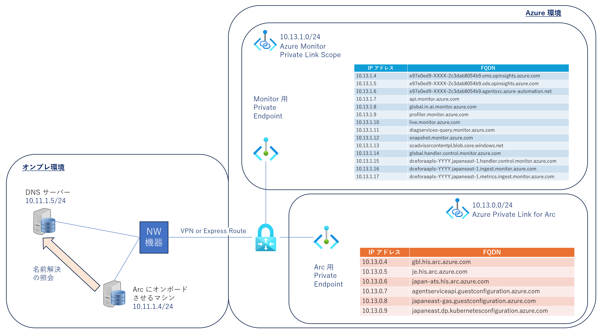
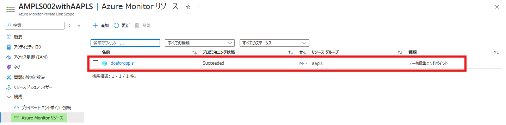
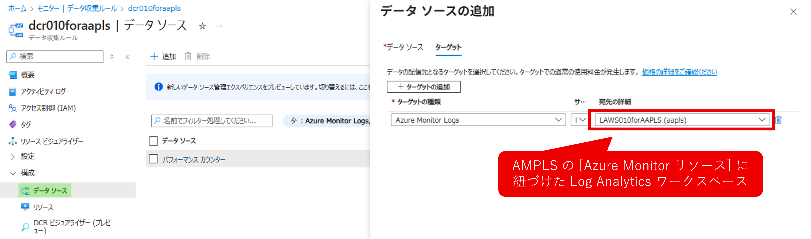
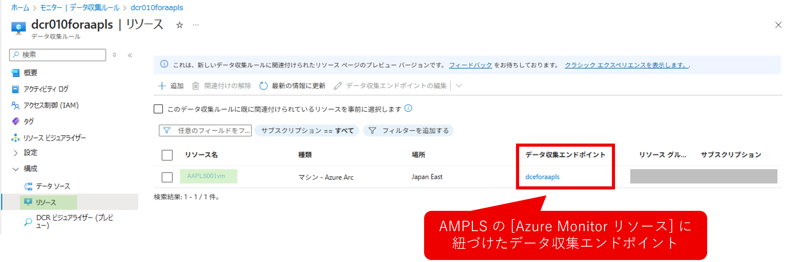

<!-- more -->
こんにちは、Azure Monitoring チームの 佐藤 です。

今回は、Azure Private Link  を使った Azure Arc および Azure Monitor を構成した際の DNS 構成や設定画面を実際に検証環境を構成してご紹介いたします。
当ページの内容は以下 2 稿 の内容を踏まえて記載しております。ご一読いただき当ページの内容を参照いただけますと幸いです。
  -  [Azure Private Link  を使った Azure Arc への接続 - NW 構成](https://jpazmon-integ.github.io/blog/Arc/Arc_AAMPLS_NW/) 
  -  [Azure Private Link  を使った Azure Arc への接続 - DNS 構成](https://jpazmon-integ.github.io/blog/Arc/Arc_AAMPLS_DNS/) 

今回説明する構成は公開情報 [Azure Private Link を使用して、サーバーを Azure Arc に安全に接続する](https://learn.microsoft.com/ja-jp/azure/azure-arc/servers/private-link-security)に記載しております構成イメージ図を踏まえると下図 1 のような構成となります。
■図1 Azure Private Link を使った Azure Arc + Azure Monitor の構成イメージ

以後、Azure Private Link  を使った Azure Monitor を AMPLS と記載いたします。
ご説明にあたって、当方の検証環境は以下の通りです。

■図 2. 検証環境の構成イメージ

## DNS 構成について

DNS 構成については上記 blog  [DNS サーバーの手動構成](https://jpazmon-integ.github.io/blog/Arc/Arc_AAMPLS_DNS/#DNS-サーバーの手動構成) の構成を踏襲して図 2 の右上の表に記載されている FQDN を Private Link がデプロイした際に同時に作成される下図 3 のプライベート エンドポイントの IP アドレス（※1）に変換して通信できる環境を構築します。
※1 今回の検証環境では 10.13.1.4 ～ 10.13.1.17 となります。尚、Arc 向けの プライベート エンドポイントの IP アドレスは引き続き 10.13.0.4 ～ 10.13.0.9 となります。

■図 3. AMPLS 向けプライベート エンドポイントの [DNS の構成] 画面

AMPLS では、後述する ”データ収集ルール”（以後、DCR ）においてリソース（今回は VM ”AAPLS001vm”）に対する ”データ収集エンドポイント” を設定する必要があります。
それを AMPLS の ”Azure Monitor リソース” に紐づける事を忘れないようご留意ください。
この設定が不足していると上図 3 における 10.13.1.15 ～ 10.13.1.17 のインターフェースのアドレスとそれに紐づく FQDN が登録されずログが採取できません。

■図 4. AMPLS の [Azure Monitor リソース] 画面

上記 blog でArc にオンボードさせたマシン（コンピューター名が ”AAPLS001vm” ）から 作成した プライベート エンドポイント向けのアドレスに疎通できるか [Test-NetConnection](https://learn.microsoft.com/en-us/powershell/module/nettcpip/test-netconnection?view=windowsserver2022-ps) で確認しました。
下図 5 の通りプライベート IP 向けに疎通が成功（TcpTestSucceeded の結果が True）となっていることが確認できます。

■図 5. コンピューター  ”AAPLS001vm” からの疎通確認

### DCR の設定確認
上記までの状態になれば NW ならびに DNS の構成は構築できているので、最後に実際にログを採取するための設定である DCR の設定ページの内容を確認します。
DCR では、”ログの送り先の Log Analytics ワークスペース” および ”AMPLS 経由でログを送付するリソース（マシン）のデータ収集エンドポイント”は下図のように 図 4 で設定した AMPLS の [Azure Monitor リソース] である必用があります。

■図 6. DCR の [データ ソース] 画面

■図 7. DCR の [リソース] 画面

### Log Analytics ワークスペースに届いているログの確認
上記まででログを採取できる構成になりました。最後に実際に Log Analytics ワークスペースに届いているログを確認します。

ハートビートログ（図 8, 対象テーブル：Heartbeat）、パフォーマンスカウンターログ（図 9, 対象テーブル：Perf）を正しく確認することが出来ました。
■図 8. Log Analytics ワークスペース - ハートビートログを確認している画面

■図 9. Log Analytics ワークスペース - パフォーマンスカウンターログを確認している画面

本日のご紹介は以上となります。上記の内容以外でご不明な点や疑問点などございましたら、弊社サポート サービスまでお問い合わせください。
最後までお読みいただきありがとうございました。

