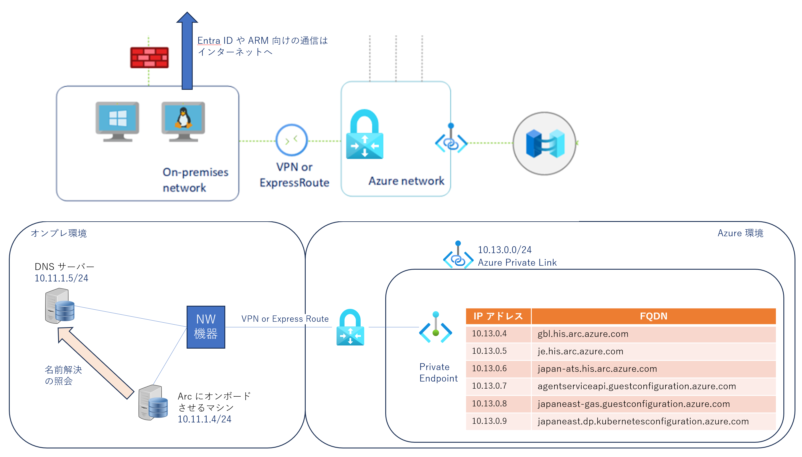
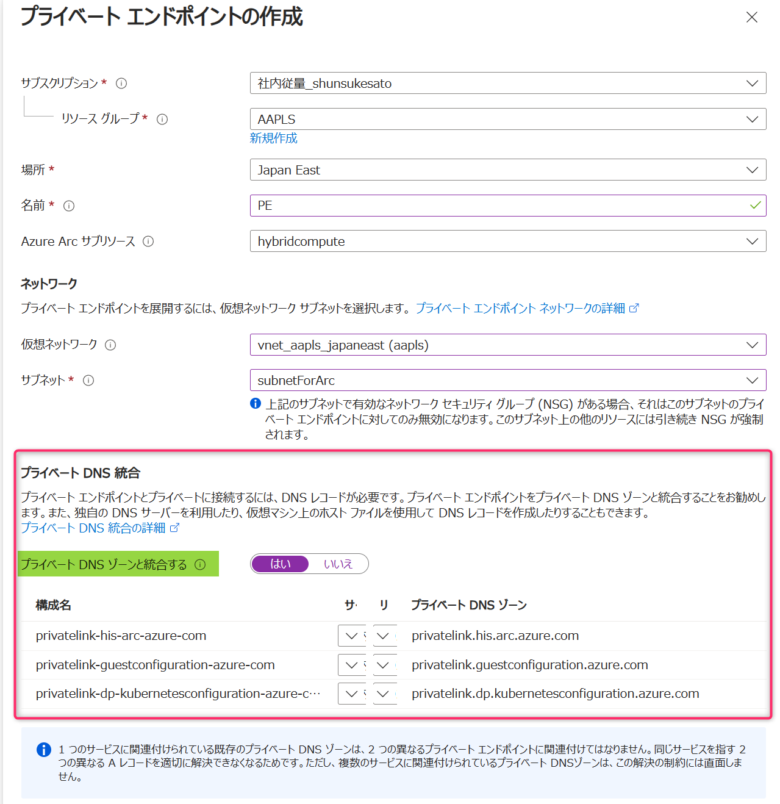
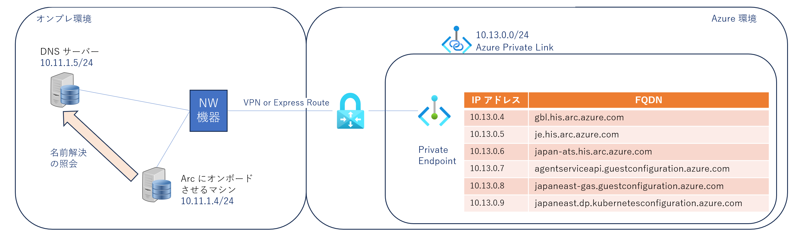
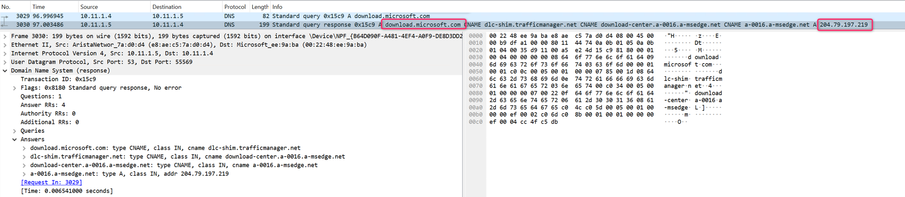
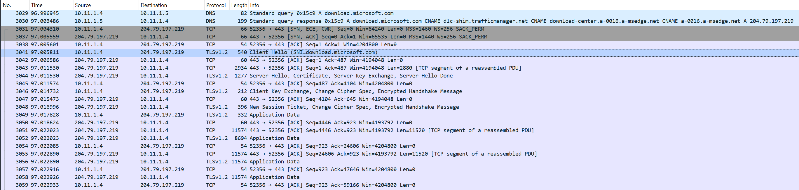
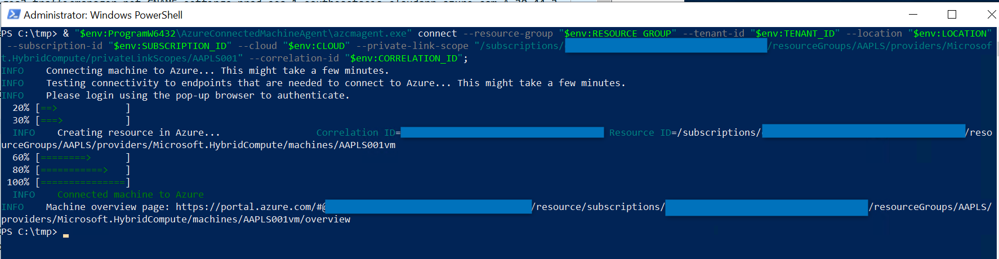
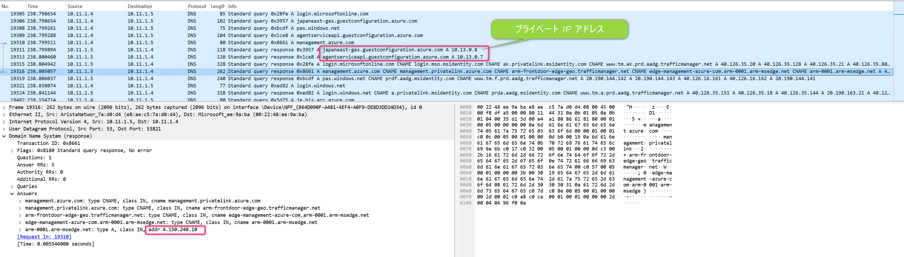
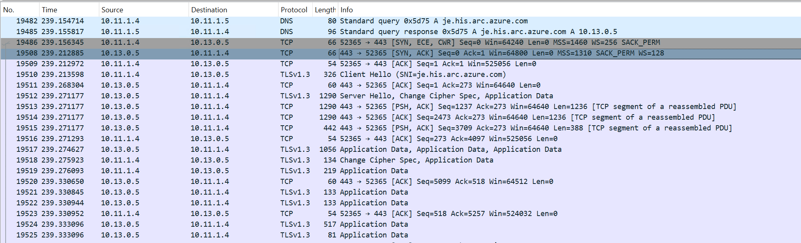
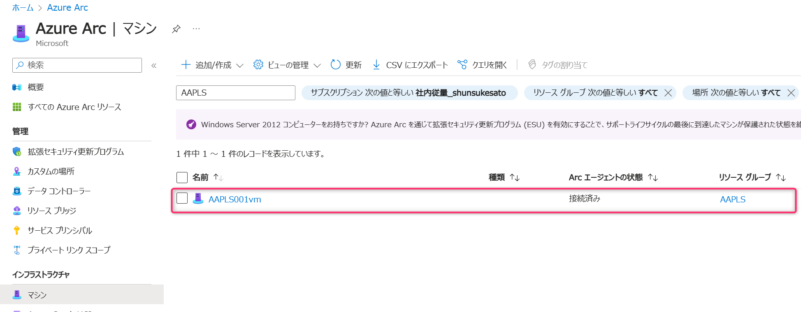

<!-- more -->
こんにちは、Azure Monitoring チームの 佐藤 です。

今回は、Azure Private Link  を使った Azure Arc への接続時におけるDNS 構成例やオンボードする際の通信シーケンスを実際に検証環境を構成してご紹介いたします。
当ページの内容は [Azure Private Link  を使った Azure Arc への接続 - NW 構成編](https://jpazmon-integ.github.io/blog/Arc/Arc_AAMPLS_NW/) の内容を踏まえて記載しております。ご一読いただき当ページの内容を参照いただけますと幸いです。

ご説明にあたって、当方の検証環境は以下の通りです。
上部は [当ページ](https://learn.microsoft.com/ja-jp/azure/azure-arc/servers/private-link-security) から抜粋した図であり、下部が検証環境のサーバーやエンドポイントの情報を添えた内容となります。

■図 1. 検証環境の構成イメージ



## DNS 構成について

[オンプレミスの DNS 転送を構成する](https://learn.microsoft.com/ja-jp/azure/azure-arc/servers/private-link-security#configure-on-premises-dns-forwarding) に記載しておりますようにオンプレミスのマシンまたはサーバーでは、プライベート リンクの DNS レコードをプライベート エンドポイントの IP アドレスに解決できる必要があります。 

具体的には図 1 の右下の表に記載されている FQDN を Private Link がデプロイした際に同時に作成される下図 2. プライベート エンドポイントの IP アドレス（※1）に変換して通信できる環境が必要となります。
※1 今回の検証環境では 10.13.0.4 ～ 10.13.0.9 となります。

■図 2. プライベート エンドポイントの [DNS の構成] 画面


これを実現する方法は[オンプレミスの DNS 転送を構成する](https://learn.microsoft.com/ja-jp/azure/azure-arc/servers/private-link-security#configure-on-premises-dns-forwarding)  に記載のとおりとなりますが、次の 3 つの方法があります。
 - Azure 統合プライベート DNS ゾーンを使用した DNS 構成
 - DNS サーバーの手動構成
 - 単一サーバーのシナリオ


### Azure 統合プライベート DNS ゾーンを使用した DNS 構成
プライベート エンドポイント作成時に [プライベート DNS ゾーンと統合する] を ”はい”と設定するとプライベート DNS ゾーンがデプロイ時に生成されます。
このプライベート DNS ゾーンに FQDN から IP アドレスに変換する情報が記載されておりますが、この情報を参照する仕組みとなります。

詳細はこちらのページ [DNS フォワーダーを使用してオンプレミスのワークロード](https://learn.microsoft.com/ja-jp/azure/private-link/private-endpoint-dns-integration#on-premises-workloads-using-a-dns-forwarder)  をご参照ください。

■図 3. プライベート エンドポイント作成時の画面



### DNS サーバーの手動構成
オンプレにあるマシンが参照する DNS サーバーの A レコードとして登録する仕組みです。
今回の検証ではこちらの仕組みを採用し、 DNS サーバー （IP アドレス 10.11.1.5） に下図 4 のようにレコードを登録します。
また Azure Arc へオンボードさせるマシンの DNS 参照先のアドレスを当サーバー（IP アドレス 10.11.1.5）に設定します。

■図 4. プライベート エンドポイントの [DNS の構成] 画面
下図は his.arc.azure.com ゾーンを示しております。


### 単一サーバーのシナリオ
hosts ファイルに図 1 に記載しているエンドポイントの FQDN と IP アドレスの変換表を設定することで、プライベート エンドポイント向けの通信を実現させます。


## オンボード処理の通信シーケンスをみてみる

### 検証構成
下図 5 は 図 1 の下部の再掲となり、今回の検証環境の構成となります。
■図 5. 検証環境構成


Arc にオンボードさせるマシンはコンピューター名が ”AAPLS001vm” となり、 IP アドレスは `10.11.1.4` となります。 DNS サーバーの IP アドレスは `10.11.1.5` となります。
■図 6. コンピューター  ”AAPLS001vm” のネットワーク構成


また [トラブルシューティング](https://learn.microsoft.com/ja-jp/azure/azure-arc/servers/private-link-security#troubleshooting) に記載されている nslookup の結果は以下の通りとなり、DNS サーバーの設定したレコードとおりプライベート IP アドレスが返ってきます。
■図 7. コンピューター名 ”AAPLS001vm” のネットワーク構成


### オンボード処理時のネットワークキャプチャ結果
最後にコンピューター  ”AAPLS001vm” を Azure Arc へオンボードさせる際にネットワークキャプチャを採取して、どのような通信シーケンスになるか確認してみます。

[Azure Arc 対応サーバーに接続する](https://learn.microsoft.com/ja-jp/azure/azure-arc/servers/private-link-security#connect-to-an-azure-arc-enabled-servers) の手順でダウンロードしたスクリプト `OnboardingScript.ps1` を実行します。

まず下図は  Azure Connected Machine エージェント （以後、Arc エージェントと呼称します）をダウンロードする際の DNS 通信と `download.microsoft.com`との通信時のキャプチャとなります。
[通信要件](https://learn.microsoft.com/ja-jp/azure/azure-arc/servers/network-requirements?tabs=azure-cloud#urls) に記載されている FQDN `aka.ms` と `download.microsoft.com` の IP アドレスが解決（図8）され、ダウンロード処理の通信（図9）が確認できます。

■図 8. Arc エージェントをダウンロードする際の DNS 通信のキャプチャ


■図 9. `download.microsoft.com`との通信時のキャプチャ


続けてインストールされた Arc エージェントにより Azure Arc へオンボードする際の通信についてです。
実際にはスクリプト `OnboardingScript.ps1` に記載している下記スクリプト（サブスクリプション ID など一部リソース情報をマスキングしております）の処理によりオンボードします。

```
PS C:\tmp> & "$env:ProgramW6432\AzureConnectedMachineAgent\azcmagent.exe" connect --resource-group "$env:RESOURCE_GROUP" --tenant-id "$env:TENANT_ID" --location "$env:LOCATION" --subscription-id "$env:SUBSCRIPTION_ID" --cloud "$env:CLOUD" --private-link-scope "/subscriptions/XXX/resourceGroups/AAPLS/providers/Microsoft.HybridCompute/privateLinkScopes/AAPLS001" --correlation-id "$env:CORRELATION_ID";
INFO    Connecting machine to Azure... This might take a few minutes.
INFO    Testing connectivity to endpoints that are needed to connect to Azure... This might take a few minutes.
INFO    Please login using the pop-up browser to authenticate.
  20% [==>            ]
  30% [===>           ]
  INFO    Creating resource in Azure...                 Correlation ID=YYY Resource ID=/subscriptions/XXXX/resourceGroups/AAPLS/providers/Microsoft.HybridCompute/machines/AAPLS001vm
  60% [========>      ]
  80% [===========>   ]
 100% [===============]
  INFO    Connected machine to Azure
INFO    Machine overview page: https://portal.azure.com/#@yyyy/resource/subscriptions/xxxx/resourceGroups/AAPLS/providers/Microsoft.HybridCompute/machines/AAPLS001vm/overview
```
■図 10. オンボード処理


上記処理の時の DNS 通信と `je.his.arc.azure.com` との通信時のキャプチャとなります。
図11 に注目いただくと DNS サーバーに登録したプライベート エンドポイントの FQDN については名前解決した結果、プライベート IP アドレスになっていることがわかります。
一方 `management.azure.com` の IP アドレスは `4.150.240.10` というグローバル IP アドレスとなっていることがわかります。
このようにプライベート エンドポイントが作成された宛先（FQDN）については、プライベート IP アドレスの応答を正しく受けれない構成の場合、正しく通信ができないこととなります。
また図 12 のとおり、プライベート IP アドレスとして応答受けた  ‘je.his.arc.azure.com‘ の宛先と通信シーケンスが進んでいることがわかります。

■図 11. オンボード処理の際の DNS 通信のキャプチャ


■図 12. `je.his.arc.azure.com` との通信時のキャプチャ


問題なく Arc へオンボードできれば下図 13. のようにオンボードしたコンピューター  ”AAPLS001vm” のステータスを確認することが可能となります。

■図 13.  Azure ポータルでオンボード状態を確認する際の画面


本日のご紹介は以上となります。上記の内容以外でご不明な点や疑問点などございましたら、弊社サポート サービスまでお問い合わせください。
最後までお読みいただきありがとうございました。
