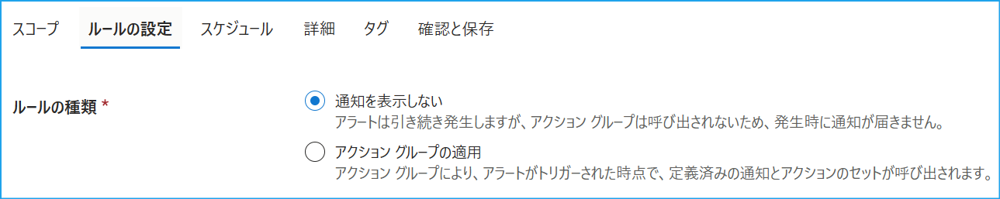
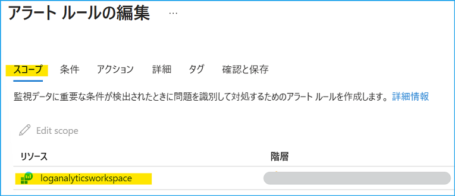
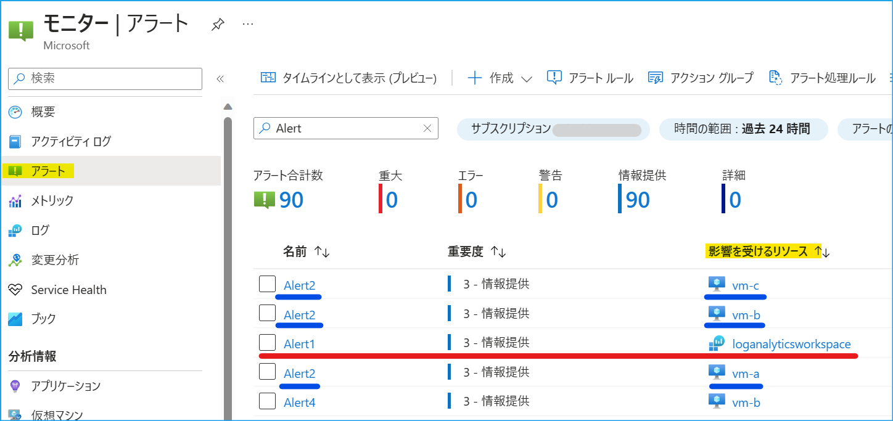
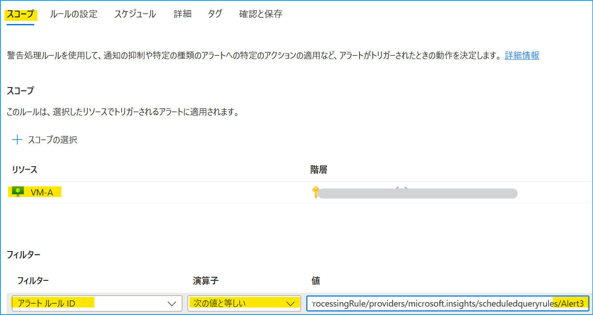
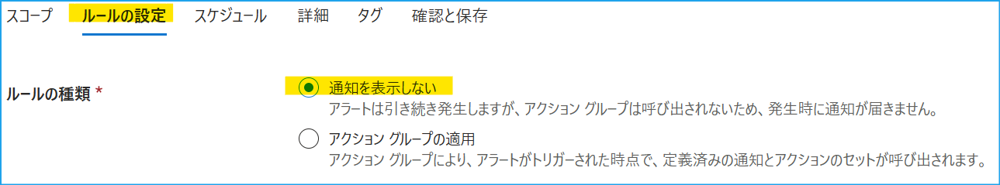
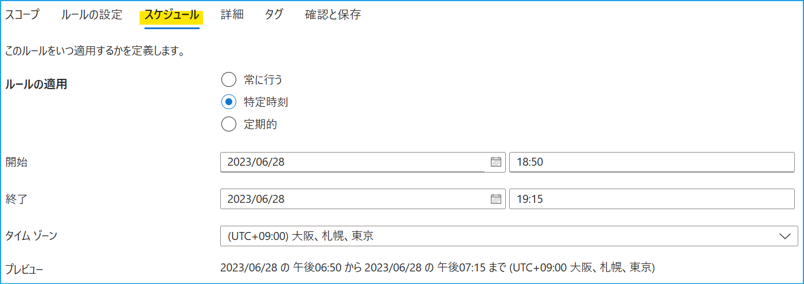
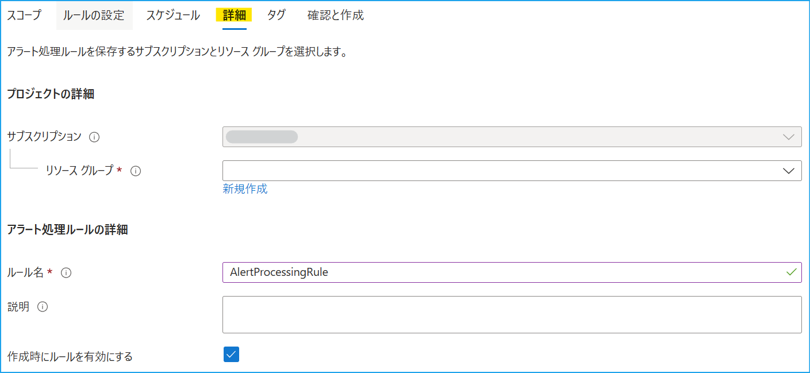

[更新履歴]  
- 2023/07/07 ブログ公開  
- 2026/01/19 最新の情報であることを確認済み 

こんにちは、Azure Monitoring サポート チームの北村です。
Azure Monitor のアラート処理ルールという機能をご存知でしょうか。
アラート処理ルールでは、特定の時間帯のみアクション グループを適用したり、抑制したりすることができます。
今回は、アラート処理ルールの概要と、よくお問い合わせをいただく設定手順をご紹介いたします。

 

<!-- more -->
## 目次
- [1. アラート処理ルールとは](#1-アラート処理ルールとは)
- [2. アラート処理ルールのポイント](#2-アラート処理ルールのポイント)
  - [2-1. アラート処理ルールで指定するスコープは、アラート ルールではない](#2-1-アラート処理ルールで指定するスコープは、アラート-ルールではない)
  - [2-2. “アラート ルールのスコープ” と “影響を受けるリソース” の違い](#2-2-“アラート-ルールのスコープ”-と-“影響を受けるリソース”-の違い)
  - [2-3. ログ アラート ルールのディメンション分割とは](#2-3-ログ-アラート-ルールのディメンション分割とは)
  - [2-4. アラート処理ルールのスコープで指定するリソース](#2-4-アラート処理ルールのスコープで指定するリソース)
- [3. アラート処理ルールの設定手順](#3-アラート処理ルールの設定手順)
- [4. アラートの通知が抑制されたことを確認する方法](#4-アラートの通知が抑制されたことを確認する方法)

 

## 1. アラート処理ルールとは
アラート処理ルールでは、"アクション グループによる通知の抑制 (通知を表示しない)" と、"アクション グループによる通知の適用" の二種類の機能がございます。例えば、定期メンテナンスなど、特定の時間帯にアラート通知を抑制したい場合に、アラート処理ルールを適用することで、一時的にアラートの通知を抑制することができます。なお、アラート処理ルールは、アクション グループの適用/抑制を行う機能であり、アラート ルールの実行自体を抑制するものではございませんので、ご注意ください。

- 通知を表示しない : 発生したアラート (解決および発報) について、アクション グループを抑制します。
- アクション グループの適用 : 発生したアラート (解決および発報)  について、アクション グループを適用します。

 

## 2. アラート処理ルールのポイント
アラート処理ルールの設定手順をご紹介する前に、準備した環境を記載します。
今回は 3 台の仮想マシン (VM-A, VM-B, VM-C) を準備しました。
このマシンの Heartbeat ログを収集している Log Analytics ワークスペース (LogAnlayticsWorkspace) と、Heartbeat ログに関するログ アラート ルールが 5 つあります。今回ご紹介する手順では、アラート ルール ***Alert 3*** の通知を抑制するアラート処理ルールを設定します。

- 仮想マシン 3 台 (VM-A, VM-B, VM-C) 
- Log Analytics ワークスペース (LogAnlayticsWorkspace)
- ログ アラート ルール 5 つ (Alert 1, Alert 2, Alert 3, Alert 4, Alert 5) 
- アラート ルールに紐づかれたアクション グループ (ActionGroup)

| アラート ルール名  | アラート ルールのスコープ (*1)  |  リソース ID の分割  |
| ------------ | ------------ | ------------ | 
| Alert 1 | LogAnalyticsWorkspace | なし |
| Alert 2 | LogAnalyticsWorkspace | あり |
| Alert 3 | VM-A | なし |
| Alert 4 | VM-B | なし |
| Alert 5 | VM-C | なし | 

(*1) 上表の "アラート ルールのスコープ" は、アラート ルールの編集画面の [スコープ] タブで指定するリソースを指します。

 

### 2-1. アラート処理ルールで指定するスコープは、アラート ルールではない
具体的な設定手順をご紹介する前に、アラート処理ルールを設定する上でのポイントをご紹介します。

アラート処理ルールの設定で肝となる部分は、「アラート処理ルールの [スコープ]で指定するリソース」です。
アラート処理ルールの [スコープ] では、基本的に ***通知を抑制するアラート ルールが対象としているリソース*** を指定します。

では、この ***通知を抑制するアラート ルールが対象としているリソース*** とは、どのように確認したらよいのでしょうか。
結論から申し上げますと、***通知を抑制するアラート ルールが対象としているリソース*** は、Azure ポータルの [アラート] に表示される ***影響を受けるリソース*** に該当します。時々、アラート処理ルールの [スコープ] で "通知を抑制したいアラート ルール" をご指定されているお客様がいらっしゃいますが、アラート処理ルールの [スコープ] で "アラート ルール" をご指定いただいても、通知を抑制することはできません。

 

### 2-2. "アラート ルールのスコープ" と "影響を受けるリソース" の違い
ここで注意していただきたい点は ***アラート ルールのスコープ*** と ***影響を受けるリソース*** の違いです。
必ずしも、***アラート ルールのスコープ*** と ***影響を受けるリソース*** が一致するとは限りません。

今回準備したアラート ルールで発報したアラートを確認してみましょう。
アラート ルールのスコープで Log Analytics ワークスペース (LogAnlayticsWorkspace) を指定しているにも関わらず、
Alert 1 と Alert 2 では、***影響を受けるリソース*** が異なります。なぜでしょうか？

 

### 2-3. ログ アラート ルールのディメンション分割とは
結論から申し上げますと、ログ アラート ルールの "ディメンション分割" という機能で、***リソース ID 列*** で分割すると、***アラート ルールのスコープ*** と ***影響を受けるリソース*** が異なります。

|  アラート ルール名  |  アラート ルールのスコープ  |  リソース ID の分割  |  影響を受けるリソース |
| ------------ | ------------ | ------------ | ------------ |
| Alert 1 | LogAnalyticsWorkspace | なし | LogAnalyticsWorkspace |
| Alert 2 | LogAnalyticsWorkspace | あり | VM-A, VM-B, VM-C |
| Alert 3 | VM-A | なし | VM-A |
| Alert 4 | VM-B | なし | VM-B |
| Alert 5 | VM-C | なし | VM-C |

 

##### <1> リソース ID 列で分割した場合
ディメンションを ***リソース ID 列*** で分割すると、***アラート ルールのスコープ*** と ***影響を受けるリソース*** が異なります (*2)。ディメンションで分割すると、数値列または文字列の組み合わせがグループ化され、複数の Azure リソースで同じ条件を監視できます。このディメンションで ***リソース ID 列*** で分割しますと、アラート ルールのスコープが ***リソース スコープ*** になります。

アラート ルール Alert 2 では、下図のとおり ***リソース ID 列*** で分割しています。
この場合は、リソース ID 毎にアラートのターゲットとして分割され、リソース ID 別にアラートの検知、通知が行われます。
つまり、Alert 2 では ***アラート ルールのスコープ*** で「Log Analytics ワークスペース」を指定していますが、ディメンション分割で ***リソース ID 列*** を指定したため、アラート ルールのスコープが ***リソース スコープ***となり、仮想マシン毎にアラートが検知され、通知が行われます。そのため、***影響を受けるリソース*** は「仮想マシン (VM-A, VM-B, VM-C) 」となります。

(*2) ログ アラート ルールの [条件] タブでディメンションを指定します。
ディメンション分割につきましては、[弊社公開情報](https://learn.microsoft.com/ja-jp/azure/azure-monitor/alerts/alerts-types#narrow-the-target-using-dimensions) もご覧ください。

 

##### <2> リソース ID 列で分割しない場合
リソース ID 列で「分割しない」に設定した場合は、"アラート ルールのスコープ" と "影響を受けるリソース" は同一リソースとなります。そのため、***Alert 1*** では、***アラート ルールのスコープ*** と ***影響を受けるリソース***ともに Log Analytics ワークスペースとなります。

 

### 2-4. アラート処理ルールのスコープで指定するリソース
下表に、今回準備したアラート ルールと、アラート処理ルールの [スコープ] に指定するリソースをまとめました。
***アラート処理ルールの [スコープ]*** と ***通知を抑制するアラート ルールが対象としているリソース*** が一致しない場合は、アラート ルールで紐づかれたアクション グループを抑制/適用できませんので、十分に注意してください。
また、アラート処理ルールの [スコープ] にサブスクリプションやリソース グループを選択することも可能です。この場合は、指定したサブスクリプション配下に存在するリソース、もしくは、リソース グループ配下に存在するリソースを対象としている、すべてのアラート ルールにアラート処理ルールが適用されます。

|  アラート ルール名  |  アラート ルールのスコープ  |  リソース ID の分割  |  影響を受けるリソース |  アラート処理ルールのスコープ  |
| ------------ | ------------ | ------------ | ------------ | ------------ |
| Alert 1 | LogAnalyticsWorkspace | なし | LogAnalyticsWorkspace | LogAnalyticsWorkspace |
| Alert 2 | LogAnalyticsWorkspace | あり | VM-A, VM-B, VM-C | VM-A, VM-B, VM-C |
| Alert 3 | VM-A | なし | VM-A | VM-A |
| Alert 4 | VM-B | なし | VM-B | VM-B |
| Alert 5 | VM-C | なし | VM-C | VM-C |

 

### 3. アラート処理ルールの設定手順
それでは、アラート処理ルールでアラートの通知を抑制してみましょう！
今回は、アラート ルール Alert 3 のみの通知を抑制するアラート処理ルールを設定します。

 1. Azure portal で [モニター] - [アラート] を開き、[アラート処理ルール] を選択し、遷移先のページ左上部の [+ 作成] をクリックします。

 2. スコープタブでは、アラート処理ルールのスコープと条件を指定します。
- [スコープ] : ***通知を抑制するアラート ルールが対象としているリソース*** を指定します。
- [フィルター] : 必要に応じて、細かい条件 (アラート ルール名、リソースの種類、重大度等) を指定します。

Alert 3 の通知を抑制するため、[スコープ] では Alert 3 の ***影響を受けるリソース*** の ***VM-A*** を指定します。
ここで注意すべき点は、アラート処理ルールのスコープで VM-A を指定すると、VM-A をスコープとする全てのアラート ルールに対して、アラート処理ルールが適用されることです。今回、Alert 2 の ***影響を受けるリソース*** に VM-A が含まれています。そのため、[スコープ] のみの設定ですと、Alert 2 で VM-A に関するアラートが発報したときにも、アラートの通知が抑制されてしまいます。

このようなときに [フィルター] で細かい条件を指定します。
今回は Alert 3 の通知を抑制したいため、フィルターの条件で [アラート ルール ID] もしくは [アラート ルール名] で通知を抑制したいアラート ルールを指定します。

 

 3. ルールの設定タブでは、アクション グループの適用、もしくは抑制を指定します。アラートの通知を抑制するため、 [通知を表示しない] を選択します。
 

 4. スケジュールタブで、アラートの通知を抑制したい時間帯を指定します。
 

 5. 詳細タブでは、アラート処理ルールのリソース グループやアラート処理ルール名をご指定ください。
 

 

### 4. アラートの通知が抑制されたことを確認する方法
Azure portal の [モニター] - [アラート] から、アラート処理ルールでアラートの通知が抑制されたことを確認することができます。
今回は Alert 3 の通知を抑制したので、アラート処理ルールの適用期間中に発生した Alert 3 のアラートを選択します。
アラートの [履歴] タブを開くと、アラート処理ルール AlertProcessingRule によって、アクション グループ ActionGroup が抑制されたことがわかります。

今回、Alert 2 の 影響を受けるリソース に VM-A が含まれていました。Alert 2 のアラートの [履歴] も見てみましょう。
Alert 3 と同様、影響を受けるリソース が VM-A ですが、アラート通知は抑制されていないことがわかります。

 

今回はアラート処理ルールの概要とその設定手順をご紹介しました。いかがでしたでしょうか。
上記内容以外でご不明な点や疑問点などございましたら、弊社サポート サービスまでお問い合わせください。
また、弊社公開情報の [アラート処理ルール](https://learn.microsoft.com/ja-jp/azure/azure-monitor/alerts/alerts-processing-rules?tabs=portal) や [Azure Monitor のアラートの問題のトラブルシューティング](https://learn.microsoft.com/ja-jp/azure/azure-monitor/alerts/alerts-troubleshoot#alert-processing-rule-is-not-working-as-expected) にも、アラート処理ルールの概要や設定手順等が掲載されておりますので、ご覧いただけますと幸いです。

最後までお読みいただきありがとうございました！
