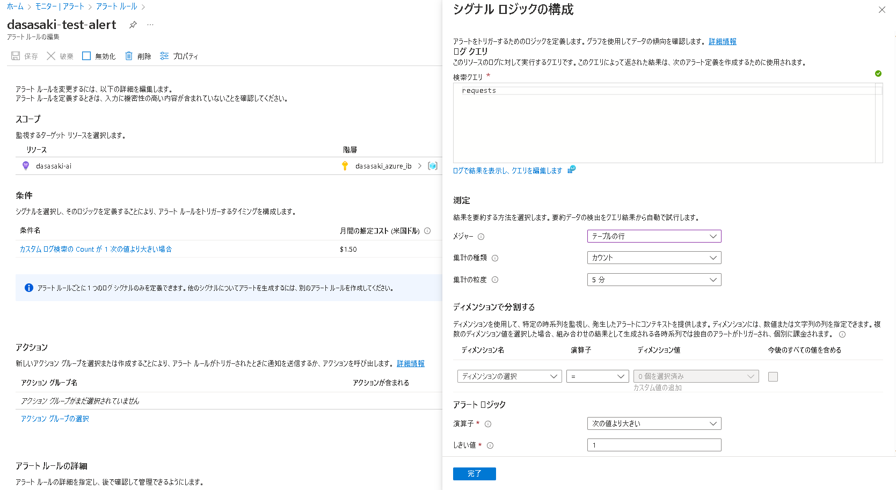
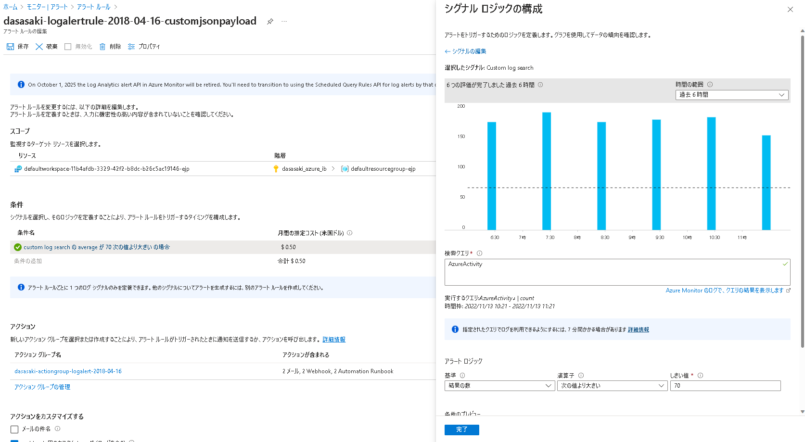
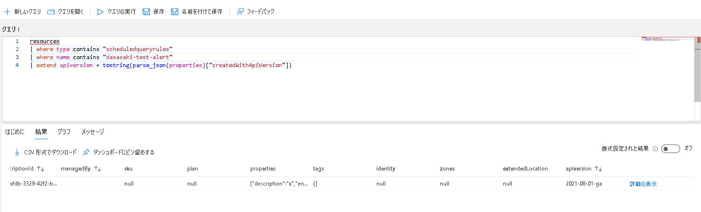
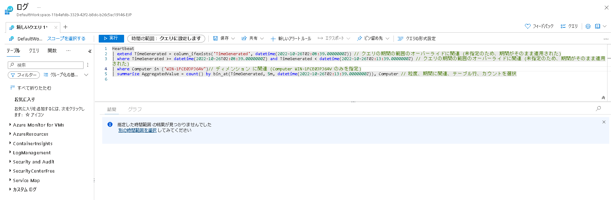
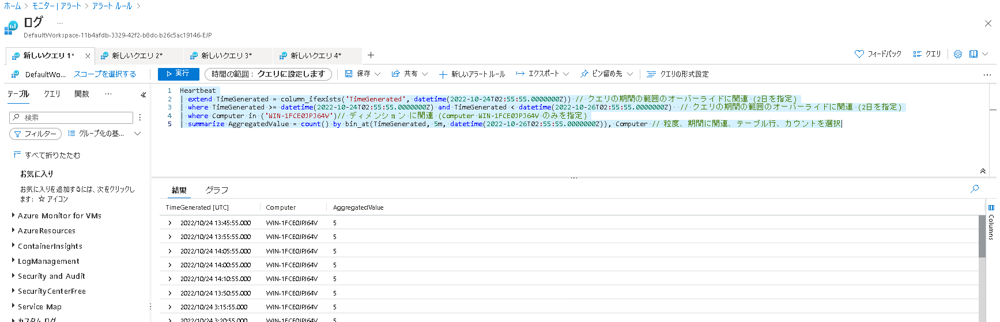

[更新履歴]
- 2022/11/13 ブログ公開
- 2026/1/29 最新情報に更新

こんにちは！ Azure Monitoring チームの佐々木 大輔(ササキ ダイスケ)です。
ログを対象としたアラート ルールのログが0件の検知を行う際の注意点および、
"クエリの時間の範囲のオーバーライド" オプションについてご紹介させていただきます。
<!-- more -->

## 目次
- [目次](#目次)
- [本記事の対象となるログ アラート ルールは 2021-08-01 以降です](#本記事の対象となるログ-アラート-ルールは-2021-08-01-以降です)
  - [Azure Portal の UI から判断する](#azure-portal-の-ui-から判断する)
    - [API バージョン 2021-08-01 以降の場合](#api-バージョン-2021-08-01-以降の場合)
    - [以前の API バージョン (2018-04-16) の場合](#以前の-api-バージョン-2018-04-16-の場合)
  - [Azure Resource Graph Explorerでリソース情報を確認する](#azure-resource-graph-explorerでリソース情報を確認する)
- [ログ アラート ルールによって実際に実行されるクエリ](#ログ-アラート-ルールによって実際に実行されるクエリ)
  - [アラート ルール上にて指定したクエリ](#アラート-ルール上にて指定したクエリ)
  - [パターン 1](#パターン-1)
  - [パターン 2](#パターン-2)
  - [パターン 1 ではログの 0 件を検知できて、パターン 2 ではログの 0 件が検知できない、その理由](#パターン-1-ではログの-0-件を検知できてパターン-2-ではログの-0-件が検知できないその理由)
  - [クエリの期間の範囲のオーバーライドについて](#クエリの期間の範囲のオーバーライドについて)
- [まとめ](#まとめ)

## 本記事の対象となるログ アラート ルールは 2021-08-01 以降です

ログアラートルールは API バージョン 2021-08-01 以降とそれよりも前のバージョンとで、UI および動作が大きく変更されております。
本記事では API バージョン 2021-08-01 以降のログ アラート ルールについて解説しています。
お使いのログ アラート ルールが 2021-08-01 以降かどうかは、以下手順で確認ください。

### Azure Portal の UI から判断する

#### API バージョン 2021-08-01 以降の場合


#### 以前の API バージョン (2018-04-16) の場合



※この確認方法は今後のログ アラート ルールの編集画面の変更によって適切ではなくなる可能性があり、基本的には 以下の通り、Azure Resource Graph Explorer より確認いただく事を推奨します。

### Azure Resource Graph Explorerでリソース情報を確認する

1. Azure Portal より Resource Graph エクスプローラー を開きます。


2. 次のクエリを実行し、apiversion 列を確認します。

```
resources
| where type contains "scheduledqueryrules"
| where name contains "アラートルール名"
| extend apiversion = tostring(parse_json(properties)["createdWithApiVersion"])
```



## ログ アラート ルールによって実際に実行されるクエリ

ログ アラート ルールでは、お客様が指定したクエリはそのまま利用されず、指定された期間やその他設定項目を適用したクエリが実行されています。
最終的に実際に実行されるクエリによって0件の検知を行うか否かが確定するためこのクエリを意識する事が重要となります。

### アラート ルール上にて指定したクエリ

```
Heartbeat
```


### パターン 1

- 設定値
  - メジャー: テーブルの行
  - 集計の種類: カウント
  - 集計の粒度: 5分
  - 演算子: 等しい
  - しきい値: 0
  - 評価の粒度: 5分
  - クエリの期間の範囲のオーバーライド:未指定(なし(5分)の表示)

- 実際に実行されるクエリ
```
Heartbeat
| extend TimeGenerated = column_ifexists('TimeGenerated', datetime(2022-10-26T02:08:39.0000000Z)) // クエリの期間の範囲のオーバーライドに関連 (未指定のため、期間がそのまま適用された)
| where TimeGenerated >= datetime(2022-10-26T02:08:39.0000000Z) and TimeGenerated < datetime(2022-10-26T02:13:39.0000000Z) // クエリの期間の範囲のオーバーライドに関連 (未指定のため、期間がそのまま適用された)
| where Computer in ('WIN-1FCE0JPJ64V')// ディメンション に関連 (Computer WIN-1FCE0JPJ64V のみを指定)
| summarize AggregatedValue = count() by bin_at(TimeGenerated, 5m, datetime(2022-10-26T02:13:39.0000000Z)), Computer // 粒度、期間に関連、テーブル行、カウントを選択
```

- ポータルでの検索結果



### パターン 2

- 設定値
  - メジャー: テーブルの行
  - 集計の種類: カウント
  - 集計の粒度: 5分
  - 演算子: 等しい
  - しきい値: 0
  - 評価の粒度: 5分
  - 評価の粒度: 5分
  - クエリの期間の範囲のオーバーライド:2日を指定

- 実際に実行されるクエリ
```
Heartbeat
| extend TimeGenerated = column_ifexists('TimeGenerated', datetime(2022-10-24T02:55:55.0000000Z)) // クエリの期間の範囲のオーバーライドに関連 (2日を指定)
| where TimeGenerated >= datetime(2022-10-24T02:55:55.0000000Z) and TimeGenerated < datetime(2022-10-26T02:55:55.0000000Z)  // クエリの期間の範囲のオーバーライドに関連 (2日を指定)
| where Computer in ('dasasaki-windows10')// ディメンション に関連 (Computer  dasasaki-windows10 のみを指定)
| summarize AggregatedValue = count() by bin_at(TimeGenerated, 5m, datetime(2022-10-26T02:55:55.0000000Z)), Computer // 粒度、期間に関連、テーブル行、カウントを選択
```

- ポータルでの検索結果



### パターン 1 ではログの 0 件を検知できて、パターン 2 ではログの 0 件が検知できない、その理由

0 件の検知を行う場合には、[パターン1](#パターン1) の様に実際に実行されたクエリの検索結果が全く無い状況になる必要があります。
そのため、クエリのオーバーライド 2日を指定しますと、検索結果に 10/24 のデータが存在しており、直近5分のログが無い場合でも 0件での検知はできません。
このほかに、ディメンション(Computer)を増やした場合にも検索結果は [パターン2](#パターン2) の様に検索結果が存在する可能性があり、その場合も  WIN-1FCE0JPJ64V の 0 件の検知はできません。

### クエリの期間の範囲のオーバーライドについて

クエリの期間の範囲のオーバーライド オプションは、クエリによって期間が指定されている場合でも、このオプションで二日を指定すると、その期間が2日に書き換えられます。
このオプションを利用する事のメリットに関するご質問をいただく事がありますが、
これは全ての期間のログを検索してしまうなどの高負荷・長時間かかるクエリ実行を避ける等、Azure 側の負荷抑制の意味合いが強く、ユーザーへのメリットをもたらす事は多くありません。

## まとめ
以下の 3 点についてご理解いただけたでしょうか。
- ログ アラート ルールで実際に実行されるクエリ
- ログ0件を検知する場合には実際に実行されるクエリの検索結果が0件になる必要がある
- クエリの期間の範囲のオーバーライドを利用するメリット

本記事がご理解の助けとして、お役立ていただければ幸いです。

以上、ログ アラート ルールの 0 件検知とクエリの時間の範囲のオーバーライドについてご紹介させていただきました。
最後までお読みいただきありがとうございました！

