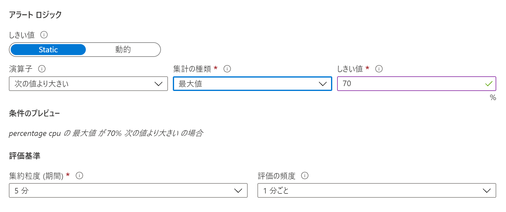
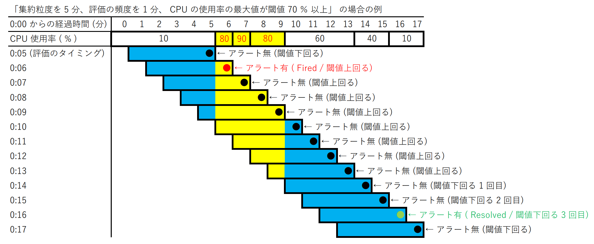

こんにちは！ Azure Monitoring & Integration チームでサマー インターンシップをしている、中条 夢佳 (チュウジョウ ユメカ) です。
「Azure Monitor で VM の監視ができるのか、よし、じゃあ実際にメトリック アラートを設定してみよう！ ・・・あれ? なんか思っていた動作と違うような?」
こんな方に読んでいただきたい記事です！
<!-- more -->

## 目次
- [メトリック アラートが発報されるタイミング](#メトリック-アラートが発報されるタイミング)
- [集約粒度と評価の頻度って何?](#集約粒度と評価の頻度って何)
- [まとめ](#まとめ)

## メトリック アラートが発報されるタイミング
メトリック アラートは既定でステートフルとなっています。ステートフルとは状態が変化した場合のみ通知するということです。  

まず、条件を満たした場合にはアラート (Fired / Triggered 等) を発報します。その後の評価で、同様に条件を満たしていても、アラートは発報しません。次に、条件を満たさなくなった場合には再びアラート (Resolved) が発報しますが、これは 1 回条件を満たさなくなった場合ではなく、3 回連続で条件を満たさなくなった場合に発報します。  

なお、 既定ではステートフルと設定されていますが、これをステートレスに変更することも可能です。こちらの設定方法については、下記の弊社公開情報をご覧ください。

> Azure Monitor のメトリック警告に関する問題のトラブルシューティング - 条件が満たされるたびにメトリック警告が発生するようにする
> https://docs.microsoft.com/ja-jp/azure/azure-monitor/alerts/alerts-troubleshoot-metric#make-metric-alerts-occur-every-time-my-condition-is-met

## 集約粒度と評価の頻度って何?
メトリック アラートのアラート ルールを設定する際に、集約粒度 (期間) と評価の頻度という評価基準の値を設定しますが、これって何が違うの? 何で 2 つも時間を設定しなきゃいけないの? と感じた方もいらっしゃるかと思います。  
言葉の定義としては "集約粒度" は「1 回の評価を行う際に評価の対象となる期間」を表し、"評価の頻度" は「何分おきに評価を行うか」を表します。  

ここで、メトリック アラートを使用した場合の動作の例を示します。  
「集約粒度を 5 分、評価の頻度を 1 分、 CPU の使用率の最大値が閾値 70% 以上」 というアラート ルールを設定した場合、直近 5 分間における CPU の使用率のデータを、1 分おきに評価します。Azure Portal でアラート ルールの条件を設定する場合は以下のような画面になります。    

アラートの動作としては、1 度でも直近 5 分間における CPU 使用率の最大値が 70% 以上になった場合に、アラート (Fired / Triggered 等) を発報します。引き続き、1 分おきに評価を続け、3 回連続で直近 5 分間における CPU 使用率の最大値が 70% を下回った場合に、アラート (Resolved) を発報します。  

下記に示すのがアラートの動作の例です。  

0:06 時点で CPU 使用率の最大値が 70% を超えたため、0:06 にアラート (Fired) が発報されます。次に 0:10 時点で CPU 使用率の最大値は 70% を下回りましたが、この時点ではアラートは発報しません。その後も評価を続け、3 回連続で直近 5 分間の CPU 使用率の最大値が 70% を下回った 0:16 時点で、アラート (Resolved) を発報します。
	
メトリック アラートの詳細につきましては、下記の弊社公開情報をご覧ください。  

> Azure Monitor でのメトリック アラートの機能 
> https://docs.microsoft.com/ja-jp/azure/azure-monitor/alerts/alerts-metric-overview

## まとめ
以下の 3 点についてご理解いただけたでしょうか。
- メトリック アラートは状態が変化した場合のみに発報すること
- 条件を満たすとアラート (Fired / Triggered等) を発報し、3 回連続で条件を満たさなくなった場合に、アラート (Resolved) を発報すること
- "集約粒度" と "評価の頻度" が表す意味

本記事がご理解の助けとして、お役立ていただければ幸いです。

以上、メトリック アラートの発報タイミングに関する詳細についてお伝えしました。
最後までお読みいただきありがとうございました！

