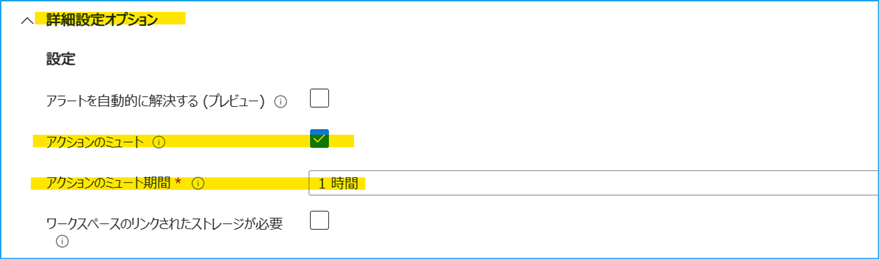
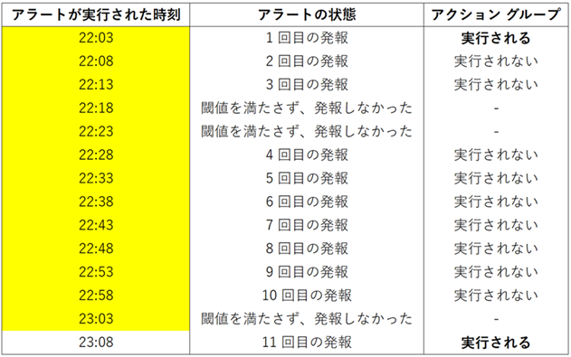
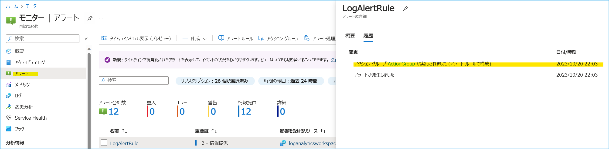

こんにちは、Azure Monitoring サポート チームの北村です。
今回は、ログ アラート ルールにおけるアクションのミュート機能をご紹介します！

<!-- more -->
## 目次
- [1. アクションのミュートとは](#1-アクションのミュートとは)
- [2. アクションがミュートされた例](#2-アクションがミュートされた例)
- [3. アラート処理ルールとの違い](#3-アラート処理ルールとの違い)

## 1. アクションのミュートとは
"アクションのミュート" とは、ステートレス ログ アラートの発報後にアクション グループを一定期間実行しない機能です。
この機能は、ログ アラート ルールの [詳細] タブの [詳細設定オプション] で設定することができます。
Azure Monitor には、アラート ルールの閾値を満たす度に発報する [***ステートレス アラート***](https://learn.microsoft.com/ja-jp/azure/azure-monitor/alerts/alerts-overview#stateless-alerts) と、アラート ルールの閾値を満たしたときに一度だけ発報し、アラートが解決したとみなされた時に解決を通知する [***ステートフル アラート***](https://learn.microsoft.com/ja-jp/azure/azure-monitor/alerts/alerts-overview#stateful-alerts) があります。ステートレス アラートでは、アラート ルールの閾値を満たす度に発報しますので、通常はアラートが発報する度にアクション グループが実行されます。しかし、この "アクションのミュート" 機能を利用しますと、アラートが発報してから一定期間はアクション グループが実行されないため、アラートが通知されません。

(*) ログ アラート ルールの編集画面の [詳細] タブ > [詳細設定オプション] です。

 

## 2. アクションがミュートされた例
実際にアクションのミュート機能を利用したときのアクション グループの実行履歴を紹介します。
ここでは、5 分毎に Heartbeat を確認するログ アラート ルールを用意しました。アクションのミュート機能を有効化し、ミュート期間を 1 時間と指定しました。この設定ですと、1 回目の発報した時刻から 1 時間以内にアラートが発報しても、アクション グループは実行されず、アラートは通知されません。

では、アラートが発報した時刻とアクション グループの実行履歴を見てみましょう！
このアラート ルールでは 22:03 に初めてアラートが発報しています。そのため 22:03 から 1 時間後の 23:03 までは、アラートが発報してもアクション グループは実行されません (黄色セル部分がミュート期間を表します)。以下の例では 22:08 や 22:13 にアラートが発報していますが、ミュート期間内のためアラートは通知されません。一方で、23:08 の発報はミュート期間外であるため、アクション グループが実行され、アラートが通知されます。

アクション グループの実行履歴は、Azure portal の [モニター] - [アラート] の [履歴] タブで確認することができます。
1 回目に発報した 22:03 と、ミュート期間内に発報した 22:08 の履歴を確認してみましょう。
以下は 22:03 の履歴です。1 回目の発報のため、アクション グループが実行されていることが分かります。

一方で、22:08 の履歴ではアラートが発報していますが、アクション グループが実行されていないことが分かります。

 

## 3. アラート処理ルールとの違い
ここまでお読みいただいて、[アラート処理ルール](https://jpazmon-integ.github.io/blog/AzureMonitorEssential/AlertProcessingRule/) と何が違うの？と思った方もいらっしゃるかもしれません。
[アラート処理ルール](https://learn.microsoft.com/ja-jp/azure/azure-monitor/alerts/alerts-processing-rules?tabs=portal) もアクション グループを抑制する機能があります。アラート処理ルールとの違いは、このミュート機能は、あくまで "特定のアラート ルールに関連付けられたアクション グループの通知を一定期間ミュートする" という点です。

アラート処理ルールは、発生したアラートに対してアクション グループを適用/抑制します。単一のリソースからサブスクリプションまでさまざまなリソースをスコープに適用し、複数のアラート ルールを対象にアクション グループを抑制することが可能です。また、アクション グループを抑制する時間帯を指定できる等、より柔軟にアクション グループを制御することができます。

一方で、アクションのミュートはミュートする期間を指定することはできますが、ミュートする時間帯を指定することはできません。また、アラート ルール単位で設定する必要があります。そのため、定期メンテナンスなど、特定の時間帯にアラート通知を抑制したい場合はアラート処理ルール、時間帯に関わらずアラートが発報してからある一定期間通知を抑制した場合はアクションのミュート機能のご利用をご検討ください。

 

今回はアクションのミュート機能をご紹介しました。いかがでしたでしょうか。
上記内容以外でご不明な点や疑問点などございましたら、弊社サポート サービスまでお問い合わせください。
最後までお読みいただきありがとうございました！
