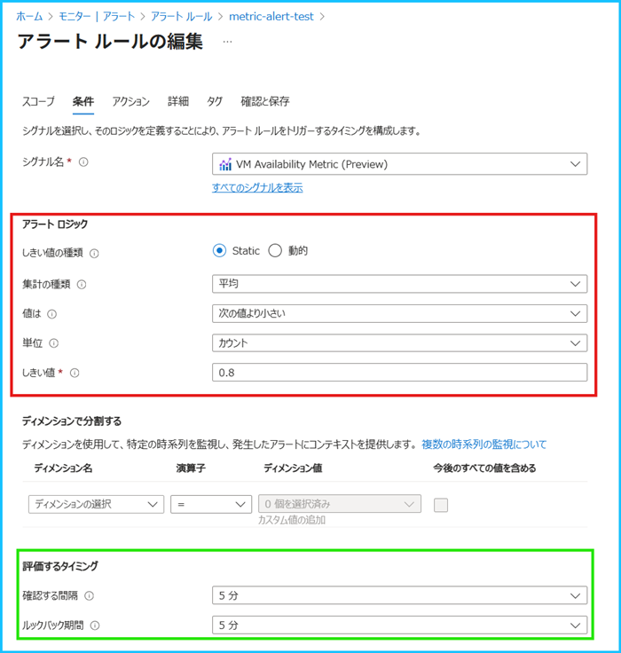
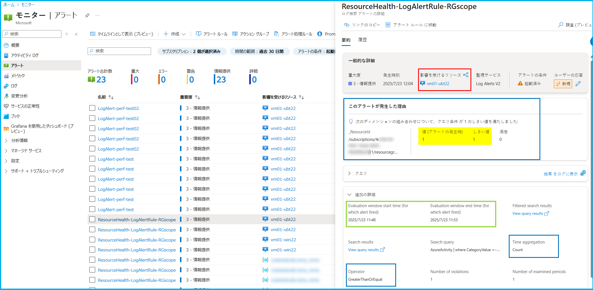
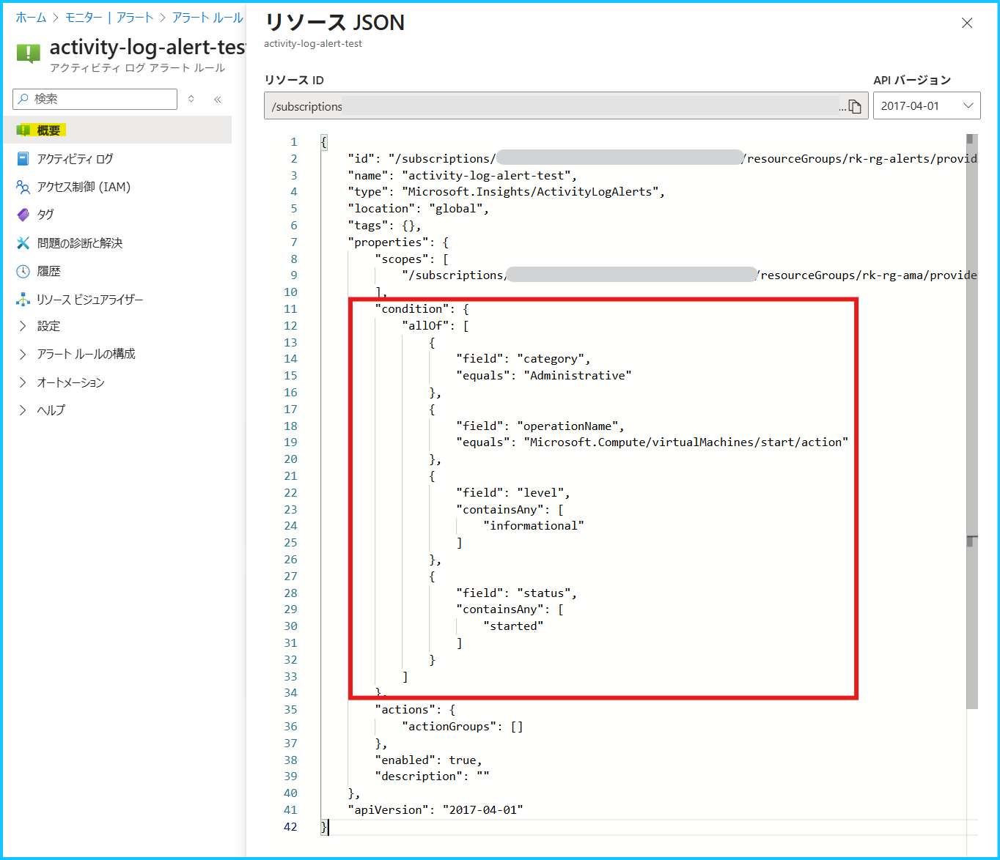
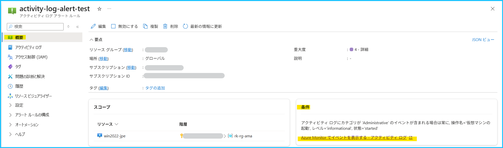
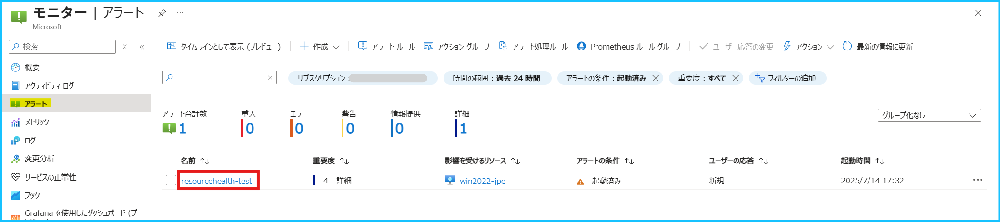
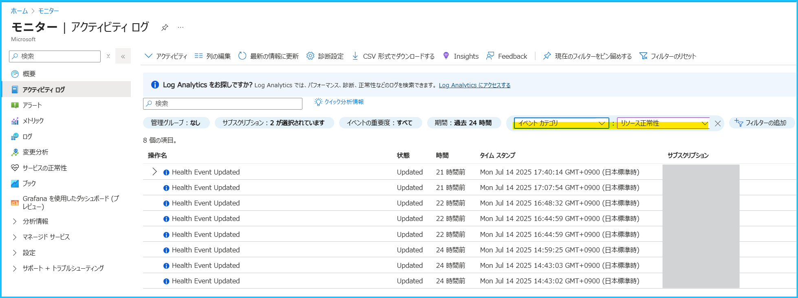

こんにちは、Azure Monitoring サポート チームの北村、徳田です。
今回は [Azure Monitor のアラート ルール](https://learn.microsoft.com/ja-jp/azure/azure-monitor/alerts/alerts-overview)が発報した原因の調査をご依頼いただく際に、事前にご確認いただきたいポイントをご紹介します。
 

<!-- more -->
## 目次
- [1. はじめに](#1-はじめに)
- [2. メトリック アラート ルール](#2-メトリック-アラート-ルール)
  - [2-1. 確認するポイント](#2-1-確認するポイント)
  - [2-2. メトリック アラート ルールの発報条件を確認する](#2-2-メトリック-アラート-ルールの発報条件を確認する)
  - [2-3. 閾値を満たしていたかどうかを確認する方法](#2-3-閾値を満たしていたかどうかを確認する方法)
  - [2-4. メトリックの値を確認するときにご留意いただきたいこと](#2-4-メトリックの値を確認するときにご留意いただきたいこと)
- [3. ログ アラート ルール](#3-ログ-アラート-ルール)
  - [3-1. 確認するポイント](#3-1-確認するポイント)
  - [3-2. ログ アラート ルールの発報条件を確認する](#3-2-ログ-アラート-ルールの発報条件を確認する)
  - [3-3. 閾値を満たしていたかどうかを確認する方法](#3-3-閾値を満たしていたかどうかを確認する方法)
  - [3-4. ログを確認するときにご留意いただきたいこと](#3-4-ログを確認するときにご留意いただきたいこと)
- [4. アクティビティ ログ アラート](#4-アクティビティ-ログ-アラート)
  - [4-1. アクティビティ ログ アラートの発報条件を確認する](#4-1-アクティビティ-ログ-アラートの発報条件を確認する)
  - [4-2. 閾値を満たして発報したかどうかを確認する](#4-2-閾値を満たして発報したかどうかを確認する)
  - [4-3. 該当のアクティビティ ログを確認する](#4-3-該当のアクティビティ-ログを確認する)
- [5. リソース正常性アラート](#5-リソース正常性アラート)
  - [5-1. リソース正常性アラートの発報条件を確認する](#5-1-リソース正常性アラートの発報条件を確認する)
  - [5-2. 閾値を満たして発報したかどうかを確認する](#5-2-閾値を満たして発報したかどうかを確認する)
  - [5-3. リソース正常性のアクティビティ ログを確認する](#5-3-リソース正常性のアクティビティ-ログを確認する)
- [6. サービス正常性アラート](#6-サービス正常性アラート)
  - [6-1. サービス正常性アラートの発報条件を確認する](#6-1-サービス正常性アラートの発報条件を確認する)
  - [6-2. 閾値を満たして発報したかどうかを確認する](#6-2-閾値を満たして発報したかどうかを確認する)
  - [6-3. サービス正常性のアクティビティ ログを確認する](#6-3-サービス正常性のアクティビティ-ログを確認する)
  - [6-4. サービス正常性の内容を確認する](#6-4-サービス正常性の内容を確認する)
- [7. その他](#7-その他)

 

## 1. はじめに
「Azure Monitor のアラート ルールが発報した原因を調査してほしい」というお問い合わせをよくいただきますが、
**アラート ルールの閾値を満たして発報したのか**、それとも**閾値を満たしていないにもかかわらず発報されたのか**によって、
調査の観点が異なります。

| アラート ルールが発報した経緯                                          | 調査観点            |
| --------------------------------------------------------------- | ------------------- |
| アラート ルールが閾値を満たして発報した場合                     | Azure リソース観点        |
| アラート ルールが閾値を満たしていないものの発報した場合 | アラート ルール観点 |

**閾値を満たして発報した場合は、監視している Azure リソースに何らかの問題が発生していた可能性があるため、Azure リソース観点での調査が必要です。一方で、閾値を満たしていないにもかかわらず発報した場合は、アラート ルールの動作に問題があった可能性があるため、アラート ルール観点（Azure Monitor 製品観点）で調査を実施する必要があります。**

つまり、アラートが発報した状況によって、[お問い合わせの起票時に選択いただく製品カテゴリ](https://learn.microsoft.com/ja-jp/azure/azure-portal/supportability/how-to-create-azure-support-request#create-a-support-request:~:text=%E5%95%8F%E9%A1%8C%E3%81%AB%E9%96%A2%E9%80%A3%E3%81%97%E3%81%A6%E3%81%84%E3%82%8B%E3%82%B5%E3%83%BC%E3%83%93%E3%82%B9%E3%82%92%E6%8C%87%E5%AE%9A%E3%81%97%E3%81%BE%E3%81%99%E3%80%82) (監視している Azure リソース or アラート ルール) が異なります。例えば、閾値を満たしている状況であったものの Azure Monitor 製品を選択してお問い合わせを起票された場合、Azure Monitor チームでは内容を確認したうえで、適切なチームを探すところから対応が始まります。逆に、閾値を満たしていないのに Azure リソースを選択された場合も同様です。そのため、**「閾値を満たして発報したかどうか」**を事前にご確認いただくことで、適切な製品・カテゴリを選択してお問い合わせを起票いただけるようになり、弊社での対応もよりスムーズに進みます。

本記事では、アラート ルールの発報条件を確認する方法や、実際に閾値を満たしていたかどうかを確認する手順についてご紹介します。

 
 

## 2. メトリック アラート ルール

### 2-1. 確認するポイント
**[メトリック アラート ルール](https://learn.microsoft.com/ja-jp/azure/azure-monitor/alerts/alerts-types#metric-alerts)の場合は、アラート ルールが実行された時にメトリックの値が閾値を満たしていたかどうかを確認します。**メトリック アラート ルールは、Azure プラットフォームから既定で収集される[プラットフォーム メトリックやカスタム メトリック](https://learn.microsoft.com/ja-jp/azure/azure-monitor/metrics/data-platform-metrics#types-of-metrics)を、一定の間隔で監視します。アラート ルールの閾値を満たして発報したかどうかを確認するためには、アラートが評価した期間と、当該期間におけるメトリックの値を確認する必要があります。

 

### 2-2. メトリック アラート ルールの発報条件を確認する
メトリック アラート ルールの発報条件は、下記の手順でご確認いただけます。

1. Azure ポータル > モニター > [アラート] を開き、画面上部の [アラート ルール] を選択します。

2. メトリック アラート ルールを選択し、[概要] ページを開きます。赤枠部分が発報条件、青枠部分がアラートのスコープです。下記の設定の場合は、Azure VM の VmAvailabilityMetric を監視し、0.8 を下回った場合に発報することが分かります。

3. [概要] ページ の [編集] を押下し、[条件] タブを選択します。
この画面では、メトリック アラート ルールの "集計の種類" や "確認する間隔"、"ルックバック期間" を確認できます。
下記例では "集計の種類" が 平均、 "確認する間隔" と "ルックバック期間" が 5 分と設定されています。従って、このアラート ルール では 5 分毎に、直近 5 分間における VmAvailabilityMetric の平均を評価し、0.8 を下回っていた場合に発報します。

> [!NOTE]
> メトリック アラート ルールの設定項目につきましては、[Azure Monitor のアラートに関するよくあるご質問](https://jpazmon-integ.github.io/blog/AzureMonitorEssential/MonitorAlertFAQ/#Q-%E3%83%A1%E3%83%88%E3%83%AA%E3%83%83%E3%82%AF-%E3%82%A2%E3%83%A9%E3%83%BC%E3%83%88-%E3%83%AB%E3%83%BC%E3%83%AB%E3%81%AE%E8%A8%AD%E5%AE%9A%E9%A0%85%E7%9B%AE%E3%82%92%E6%95%99%E3%81%88%E3%81%A6%E3%81%8F%E3%81%A0%E3%81%95%E3%81%84%E3%80%82)のブログをご覧ください。[また、アラートの \[条件\] タブでディメンションが設定されている場合には、そのディメンションで集計されたデータが監視されます](https://jpazmon-integ.github.io/blog/AzureMonitorEssential/MonitorAlertFAQ/#Q-%E3%83%A1%E3%83%88%E3%83%AA%E3%83%83%E3%82%AF-%E3%82%A2%E3%83%A9%E3%83%BC%E3%83%88-%E3%83%AB%E3%83%BC%E3%83%AB%E3%81%AE%E8%A8%AD%E5%AE%9A%E9%A0%85%E7%9B%AE%E3%82%92%E6%95%99%E3%81%88%E3%81%A6%E3%81%8F%E3%81%A0%E3%81%95%E3%81%84%E3%80%82)。ディメンションは、メトリック値に関する追加のデータ (名前と値のペア) です。 メトリックは、個々のリソースごとに記録されますが、ディメンションはメトリックの値をより詳細に説明するための追加情報とお考えください。

 

### 2-3. 閾値を満たしていたかどうかを確認する方法
まずは、アラート ルールが監視している Azure リソースとアラートの評価期間を確認します。
次に、メトリック エクスプローラーで評価期間におけるメトリックの値を確認します。

1. Azure ポータル > モニター > [アラート] を開き、発報したアラートを選択します。

2. 監視対象のリソース、評価された値、アラートの評価期間を確認します。
[メトリック アラートの詳細] 画面が開きますので、下表に表示されている内容をご確認ください。
このアラート ルールでは、Azure VM の [VmAvailabilityMetric](https://learn.microsoft.com/ja-jp/azure/virtual-machines/monitor-vm-reference#:~:text=VmAvailabilityMetric) (可用性メトリック) を監視しており、 評価期間 5 分間の平均値が 0.8 を下回った場合に発報します。

| 確認する項目                | 画面上の該当箇所                                                                                                      | 例（下図参照）                                                        |
| --------------------------- | --------------------------------------------------------------------------------------------------------- | ---------------------------------------------------------------- |
| 監視対象のリソース | 影響を受けるリソース (赤枠部分)                                                                                      | Azure VM (win2022-jpe)                                           |
| 評価された値 | このアラートが発生した理由 (青枠部分)                                                                               | 0.5  |     | 
| アラートの評価期間  | "追加の詳細" の Evaluation window start time,  Evaluation window end time (緑枠部分) | 2025/7/3 16:58 ～ 2025/7/3 17:03                                 |

 

3. [影響を受けるリソース] のリンクを押下し、左ペインの [監視] > [メトリック] から [メトリック エクスプローラー](https://learn.microsoft.com/ja-jp/azure/azure-monitor/metrics/analyze-metrics)を開きます。

4. [スコープ] に監視している Azure リソースが表示されていることを確認します（赤枠部分）。
このアラート ルールは VmAvailabilityMetric の平均を監視しているので、[メトリック] で **VmAvailabilityMetric**、[集計の粒度] は **平均** を選択します（青枠部分）。画面右上の [現地時刻] のボタンを押下し、2. で確認したアラートの評価期間 (2025/7/3 16:58 ～ 17:03 JST) を指定します（緑枠部分）。今回は、評価期間内のメトリックの推移を最小単位 (1 分) で確認したかったため、[時間の粒度] は **1 分** を指定していますが、7/3 16:59 以降はメトリックが 1 を下回っており、アラートの閾値を満たしていたことが分かります。

> [!IMPORTANT]
> 繰り返しとなりますが、**閾値を満たして発報したのか**、**閾値を満たしていないにもかかわらず発報したのか**によって、調査の観点が異なります。上記の例では閾値を満たして発報しているため、発報した原因をお知りになりたい場合は、**アラート ルール観点ではなく、監視しているリソース (Azure VM) 観点で調査が必要となります。** もし、閾値を満たしていなかった状況であった場合には、アラート ルールの動作に問題があった可能性があるため、アラート ルール観点（Azure Monitor 製品観点）で調査する必要がございます。

 

### 2-4. メトリックの値を確認するときにご留意いただきたいこと
メトリック アラート ルールの編集画面の [プレビュー] や、アラートの詳細画面で表示されるグラフは、実際のアラート ルールの評価期間に基づいた集計の粒度で表示されていない場合がございます。アラートの評価期間におけるメトリックの値を確認する際には、[メトリック エクスプローラー](https://learn.microsoft.com/ja-jp/azure/azure-monitor/metrics/analyze-metrics)からご確認いただきますようお願いいたします。

- メトリック アラート ルールの編集画面

- アラートの詳細画面

 
 

## 3. ログ アラート ルール

### 3-1. 確認するポイント
[ログ アラート ルール](https://learn.microsoft.com/ja-jp/azure/azure-monitor/alerts/alerts-types#log-alerts)の場合は、アラート ルールが実行された時に検索クエリが閾値を満たしていたかどうかを確認します。
ログ アラート ルールは、各評価時に、アラート ルールの検索クエリが指定したスコープの範囲で実行され、それにヒットしたログをもとに発報条件を満たすかどうかが評価されます。

そのため、アラート ルールのスコープ、アラートが評価した期間、検索クエリをもとに、主に以下 2 点をご確認いただく必要がございます。
- 評価時に対象のログが存在して (収集されて) いたか
- 発報条件 (閾値) を満たしていたか

 

### 3-2. ログ アラート ルールの発報条件を確認する
ログ アラート ルールの発報条件は、下記の手順でご確認いただけます。

1. Azure ポータル > モニター > [アラート] を開き、画面上部の [アラート ルール] を選択します。

2. 対象のログ アラート ルールを選択し、[概要] ページを開きます。以下画像における赤枠部分が発報条件、青枠部分がアラートのスコープです。下記の設定の場合、評価対象は "リソース グループ A" 配下のリソースから収集されたログとなります。
そして、それらのログに対し "クエリ" を実行した結果返ってきたログの行数が 1 より小さい場合に発報するという条件となっています。

**〇 ログ検索アラート ルールのスコープについて**
基本的には、アラート ルールに指定したリソースから収集されたログが評価対象となります。
リソース グループを指定した場合は、そのリソース グループ配下に存在するリソースから収集されたログが対象となります。

例外として、Log Analytics ワークスペース、および Application Insights を選択した場合は、(ログ出力元リソースに関わらず) そのワークスペースまたは Application Insights へ収集されたログが評価対象となります。

**〇 ディメンション分割について**
ログ アラート ルールではディメンション分割を行うことができます。
ディメンション分割を設定している場合、ディメンション分割で指定したカラムに含まれる一意な値に基づいて、ログが分割され、分割されたログの集まりごとにアラート ルールの発報条件が適用されます。

例えば、あるリソース グループをスコープとし、Heartbeat ログを監視しているアラート ルールがあるとします。
この場合、評価対象は、そのリソース グループ配下に含まれるマシンから収集された Heartbeat ログすべてです。
このアラート ルールで、_ResourceId カラムによるディメンション分割を設定した場合、評価時には Heartbeat ログが _ResourceId カラム内の一意な値にもとづいて分割されます。つまり、Heartbeat ログがマシンごとに分割され、分割されたログの集まりそれぞれに対して、発報条件を満たすかどうかが評価されます。

 

### 3-3. 閾値を満たしていたかどうかを確認する方法
まずは、ログ アラート ルールの検索クエリとアラートの評価期間を確認します。
次に、Log Analytics ワークスペースで評価期間における検索クエリの結果を確認します。

1. Azure ポータル > モニター > [アラート] を開き、確認対象のアラートを選択します。

2. 発報されたアラートの詳細を確認します。
右側に [ログ検索アラートの詳細] が表示されているため、下表に表示されている内容をご確認ください。

| 確認する項目 | 画面上の該当箇所 | 例（下図参照）|
| --------------------------- | --------------------------------------------------------------------------------------------------------- | ---------------------------------------------------------------- |
| 監視対象のスコープ | 影響を受けるリソース (赤枠部分) ※1 | vm01-ubt22 (仮想マシン) |
| 評価された値と評価基準 | "このアラートが発生した理由" と  "追加の詳細" の Time aggregation と Operator (青枠部分) ※2 | クエリ結果のログ レコード数 (Time aggregation: Count) が 1 で、閾値 1 以上 (GreaterThanOrEqual) であった |
| アラートの評価期間  | "追加の詳細" の  Evaluation window start time,  Evaluation window end time (緑枠部分) | 2025/7/23 11:48 ～ 2025/7/23 11:53 |

※1
アラート ルールで[ディメンション分割](https://learn.microsoft.com/ja-jp/azure/azure-monitor/alerts/alerts-types#monitor-multiple-instances-of-a-resource-using-dimensions)を行っている場合、アラート ルールのスコープと、発報したアラートの "影響を受けるリソース" が異なる場合があります。例えば、仮想マシン A を含むリソース グループをアラート ルールのスコープに設定し、_ResourceId でディメンション分割を行っている場合に、仮想マシン A から収集されたログがアラートの発報条件を満たすと、アラートの "影響を受けるリソース" は仮想マシン A となります。

※2
Time aggregation が "Count" の場合は、クエリ結果のログ レコード数が閾値を満たすかどうかが評価されます。  
Time aggregation が "Count" 以外の場合、クエリ結果のうちの特定のカラム内の値が Time aggregation で指定された集計方法で集計され、その値が閾値を満たすかどうか評価されます。こちらの場合は、同箇所に記載のある Metric measure column に評価対象のカラム名が記載されていますため、併せてご確認ください。

 

3. 同画面の "クエリ" セクションにある、[結果をログに表示] を押下します。

すると、クエリ実行画面が開き、先ほど確認した "影響を受けるリソース" のスコープ、時間範囲が選択された状態で、検索クエリが実行されます。以下の様に、画面下部に [結果] が表示されるため、こちらをご確認ください。

なお、アラート ルールに指定した発報条件 (評価基準) により見方が少々異なるため、以下をご確認ください。

- "テーブルの行" が評価基準に設定されている場合:
手順 2 で確認した Time aggregation が Count の場合を指します。
結果に表示されるログ レコードの行数が、指定した閾値を満たしているかどうかをご確認ください。  
上記の画像は手順 2 で確認した情報 ("このアラートが発報した理由") と一致しているため、実際にアラート ルールの閾値を満たして発報していたと判断できます。

- "テーブルの行" 以外が評価基準に設定されている (数値が格納されるカラムが評価基準に設定されている) 場合:
手順 2 で確認した Time aggregation が Count "以外" の場合を指します。
結果内の、数値が格納されるカラムに示される値が、指定した閾値を満たしているかどうかをご確認ください。
こちらの結果に表示されるカラム名は、手順 2 で確認した Metric measure column の名前とは異なります (以下画像の例をご参照ください)。これは、評価時には Metric measure column 内の値が、指定した集計方法で集計された値を算出するためのクエリが追加されているためです。

> [!IMPORTANT]
> **閾値を満たして発報したのか**、**閾値を満たしていないにもかかわらず発報したのか**によって、調査の観点が異なります。
> 上記の例では閾値を満たして発報していたため、発報した原因すなわち対象のログが出力された原因をお知りになりたい場合は、**アラート ルール観点ではなく、ログ出力元リソース観点で調査が必要となります。** もし、閾値を満たしていなかったにもかかわらず発報していた場合には、アラート ルールの動作に問題があった可能性があるため、アラート ルール観点（Azure Monitor 製品観点）で調査する必要がございます。 
> なお、マシンから収集される Heartbeat ログやパフォーマンス カウンターなどの、一定の間隔で収集されるログで死活監視をしている場合、ログの一時的な収集遅延によって、期待せず (マシンの動作には問題がないにもかかわらず) アラートが発報することがございます。ログ収集遅延の要因は出力元リソース側にある場合と、ログ収集経路 (Azure 基盤側) にある場合がございます。マシンの動作に問題がなくアラートの発報も一時的であった場合は基本的にご静観いただきたく存じますが、もし期待しないアラートが断続的に発報する場合など、発報要因の調査が必要だと判断された場合は、まずはアラート ルールの観点でご起票をいただけますと幸いです (調査の結果、出力元リソース側に問題があった場合は、調査の観点を出力元リソースに変えて調査を進める場合がございます)。

 

### 3-4. ログを確認するときにご留意いただきたいこと
ログ アラート ルールの評価では、指定した時刻範囲内のログ データが対象となります。
基本的に評価の時間範囲はアラート ルールの集計の粒度および評価の頻度で決まりますが、ログ アラート ルールではログの取り込み遅延を考慮して各評価の時間範囲が調整されますため、時間範囲については上記手順 2 のように、それぞれのアラート発報履歴の詳細をご確認ください。

 
 

## 4. アクティビティ ログ アラート
[アクティビティ ログ アラート](https://learn.microsoft.com/ja-jp/azure/azure-monitor/alerts/alerts-types#activity-log-alerts)は、指定した発報条件に一致するアクティビティ ログが出力されたかどうかを監視します。
[アクティビティ ログ](https://learn.microsoft.com/ja-jp/azure/azure-monitor/platform/activity-log-schema#categories)は、サブスクリプション レベルのイベントが記録されます。例えば、リソースが作成された、変更された、削除された、Azure VM が起動された、といったログが出力されます。

[アクティビティ ログは、操作が実行される Azure リソースのリソース プロバイダーによって提供され、リソース プロバイダー側でアクティビティ ログの出力条件が決定されております。](https://learn.microsoft.com/ja-jp/azure/azure-monitor/fundamentals/data-sources#azure-resources) このため、**アラートの条件を満たして発報し、アクティビティ ログが記録された原因の調査をご希望される場合は、監視対象の Azure リソース観点でお問い合わせをご起票ください。**

本記事では、アクティビティ ログ アラートの発報条件と、アクティビティ ログ アラートで検知した内容を確認する手順をご紹介します。もし、アラートの条件を満たしていないにもかかわらず発報したと疑われる場合は、アラート ルールの動作に関する調査が必要となるため、アラート ルール観点 (Azure Monitor 製品) でお問い合わせをご起票ください。

 

### 4-1. アクティビティ ログ アラートの発報条件を確認する
まずは、アクティビティ ログ アラートの発報条件を確認します。

1. Azure ポータル > モニター > [アラート] を開き、画面上部の [アラート ルール] を選択します。

2. アクティビティ ログ アラートを選択し、[概要] ページを開きます。赤枠部分が発報条件、青枠部分がアラートのスコープです。
下記の設定の場合は、該当の Azure VM で、下記のアクティビティ ログが出力された場合に発報します。アクティビティ ログ アラートの発報条件の項目につきましては、[公開情報](https://learn.microsoft.com/ja-jp/azure/azure-monitor/alerts/alerts-create-activity-log-alert-rule?tabs=activity-log#:~:text=On%20the%20Conditions,of%20these%20fields%3A)をご覧ください。

- ([カテゴリ](https://learn.microsoft.com/en-us/azure/azure-monitor/platform/activity-log-schema#categories)が Administrative) かつ ([操作名](https://learn.microsoft.com/ja-jp/azure/role-based-access-control/resource-provider-operations)が Microsoft.Compute/virtualMachines/start/action) かつ ([レベル](https://learn.microsoft.com/en-us/azure/azure-monitor/platform/activity-log-schema#severity-level)が Informational) かつ (状態= Started)

※ [概要] ページ画面上部の [JSON ビュー] を選択した画面です。

 

### 4-2. 閾値を満たして発報したかどうかを確認する
下記の手順でアクティビティ ログ アラートが検知した内容を確認します。

1. Azure ポータル > モニター > [アラート] を開き、発報したアラートを選択します。

2. 発報したリソースと検知されたアクティビティ ログの内容を確認します。
[アクティビティ ログ アラートの詳細] 画面が開きますので、下表に表示されている内容をご確認ください。
このアクティビティ ログ アラートは **(カテゴリが Administrative) かつ (操作名が Microsoft.Compute/virtualMachines/start/action) かつ (レベルが Informational) かつ (状態= Started)** のときに発報する条件のため、想定どおりアラートが発報したことが分かります。

| 確認する項目                                        | 画面上の該当箇所                        | 例（下図参照）                                                                                                  | 
| --------------------------------------------------- | --------------------------------------- | --------------------------------------------------------------------------------------------------------------- | 
| 監視対象のリソース                                  | 影響を受けるリソース (赤枠部分)         | Azure VM (win2022-jpe)                                                                                          | 
| アクティビティ ログの操作名、  カテゴリ、レベル       | このアラートが発生した理由 (青枠部分)   | 操作名 : Microsoft.Compute/virtualMachines/start/action カテゴリ : Administrative レベル :  Informational | 
| アクティビティ ログの状態と ログが出力された日時 | "追加の詳細" の  Status, Submission timestamp (緑枠部分) | 状態 : Started ログが出力された日時 : 2025/7/16 14:48                                                        | 

 

### 4-3. 該当のアクティビティ ログを確認する
アクティビティ ログ アラートの条件に一致するログは、下記の手順にてご確認いただくことが可能です。

1. Azure ポータル > モニター > [アラート] を開き、画面上部の [アラート ルール] を選択します。

2. アクティビティ ログ アラートを選択し、[概要] ページを開きます。

3. [条件] の項目に表示されている "Azure Monitor でイベントを表示する - アクティビティ ログ" のリンクを押下します。

4. アラートの条件に一致するアクティビティ ログが表示されます。
※ 同じ操作名のアクティビティ ログが 3 件ありますが、状態が「開始済み (Started)」のログが該当します。

5. [JSON] を選択すると、アクティビティ ログの内容が表示されます。

> [!NOTE]
> アクティビティ ログのカテゴリやレベルなどの値は、[こちら](https://learn.microsoft.com/ja-jp/azure/azure-monitor/platform/activity-log-schema)の公開情報でご確認ください。

 
 

## 5. リソース正常性アラート
[リソース正常性アラート](https://learn.microsoft.com/ja-jp/azure/service-health/resource-health-overview)は、Azure リソースの正常性に変化が生じた際に通知する機能です。
リソースの正常性に変化が生じると、リソース プロバイダーによってリソース正常性に関するイベントがアクティビティ ログに書き込まれます。出力されたアクティビティ ログがアラートで指定した条件を満たした場合に発報します。
そのため、**アラートの条件を満たして発報し、リソース正常性イベントが発生した原因の調査をご希望の場合は、監視対象の Azure リソース観点でお問い合わせをご起票ください。**

本記事では、リソース正常性アラートの発報条件と、リソース正常性アラートで検知した内容を確認する手順をご紹介します。
なお、アラートの条件を満たしていないにもかかわらず発報したと疑われる場合は、アラート ルールの動作に関する調査が必要となるため、アラート ルール観点 (Azure Monitor 製品) でお問い合わせをご起票ください。

 

### 5-1. リソース正常性アラートの発報条件を確認する
まずは、リソース正常性アラートの発報条件を確認します。

1. Azure ポータル > モニター > [アラート] を開き、画面上部の [アラート ルール] を選択します。

2. リソース正常性アラートを選択し、[概要] ページを開きます。赤枠部分が発報条件、青枠部分がアラートのスコープです。
下記の設定の場合は、指定したリソース グループの Azure VM (microsoft.compute/virtualmachines のリソース) で、下記の条件を満たした場合に発報します。

- (イベントの状態が Active) かつ (現在のリソースの状態が Degraded または Unavailable) かつ (以前のリソースの状態が Available) かつ (理由の種類が Platform Initiated または Unknown または User Initiated)

※ [概要] ページ画面上部の [JSON ビュー] を選択した画面です。

> [!NOTE]
> リソース正常性アラートの発報条件の項目と設定値につきましては、[リソース正常性アラートに関するよくあるご質問](https://jpazmon-integ.github.io/blog/AzureMonitorEssential/ResourceHealthAlert/)のブログをご覧ください。

 

### 5-2. 閾値を満たして発報したかどうかを確認する
下記の手順でリソース正常性アラートが検知した内容を確認します。

1. Azure ポータル > モニター > [アラート] を開き、発報したアラートを選択します。

2. 発報したリソースと検知されたアクティビティ ログの内容を確認します。
[リソースの正常性 アラートの詳細] 画面が開きますので、下表に表示されている内容をご確認ください。
このリソース正常性アラートは **(イベントの状態が Active) かつ (現在のリソースの状態が Degraded または Unavailable) かつ (以前のリソースの状態が Available) かつ (理由の種類が Platform Initiated または Unknown または User Initiated)** のときに発報する条件のため、想定どおりアラートが発報したことが分かります。

| 確認する項目                | 画面上の該当箇所                                                                                                      | 例（下図参照）                                                        |
| -------------------------------------------- | ------------------------------------- | ---------------------------------------------------------------------------------- |
| 監視対象のリソース                           | 影響を受けるリソース (赤枠部分)       | Azure VM (win2022-jpe)                                                             |
| リソース正常性の状態、  イベントが発生した理由 | このアラートが発生した理由 (青枠部分) | リソース正常性の状態 : Available から Unavailable  理由の種類 : UserInitiated |
| イベントの状態、  イベントが発生した日時       | "追加の詳細" の  Status, Event timestamp (緑枠部分)    | イベントの状態 : Active イベントが発生した日時 : 2025/7/14 17:16 JST          |

 

### 5-3. リソース正常性のアクティビティ ログを確認する
リソース正常性のアクティビティ ログは、下記の手順にてご確認いただくことが可能です。

1. Azure ポータル > モニター > [アクティビティ ログ] を開き、[フィルターの追加] を選択します。

2. フィルタ―の条件として **イベント カテゴリ** を選択し、**リソース正常性** カテゴリを指定します。

3. [リソースの正常性 アラートの詳細] 画面で確認した Event timestamp (2025/7/14 17:16) のアクティビティ ログを選択します。
※ 同じ日時に記録されたアクティビティ ログが 2 件ありますが、状態が「アクティブ (Active)」のログが該当します。

4. [JSON] を選択すると、アクティビティ ログの内容が表示されます。

> [!NOTE]
> アクティビティ ログのスキーマは、[こちら](https://learn.microsoft.com/ja-jp/azure/azure-monitor/platform/activity-log-schema#resource-health-category)の公開情報でご確認ください。

 
 

## 6. サービス正常性アラート
[サービス正常性アラート](https://learn.microsoft.com/ja-jp/azure/service-health/overview)は、お客様環境にてご利用いただいている Azure サービスおよびリージョンを監視対象とし、Azure サービス自体の正常性を監視します。例えば、以下のような情報が通知されます：

- Azure サービスの障害
- 計画メンテナンス
- Azure サービスの仕様変更や廃止
- セキュリティ関連の重要情報（可用性に影響する可能性があるもの）

サービス正常性アラートは、サブスクリプション単位で設定します。
アラートの発報条件としては Azure サービス、地域、イベントの種類を指定します。サービス正常性のイベントが発生すると、アクティビティ ログにサービス正常性に関するイベントが書き込まれ、指定した条件に一致した場合にアラートが発報します。
**そのため、アラートの条件を満たして発報し、[サービス正常性アラートで通知された内容についてご不明な点がある場合は、基本的に該当するサービス観点でお問い合わせをご起票くださいますようお願いいたします。](https://jpazmon-integ.github.io/blog/AzureMonitorEssential/MonitorAlertFAQ/#Q-%E3%82%B5%E3%83%BC%E3%83%93%E3%82%B9%E6%AD%A3%E5%B8%B8%E6%80%A7%E3%82%A2%E3%83%A9%E3%83%BC%E3%83%88%E3%81%A7%E9%80%9A%E7%9F%A5%E3%81%95%E3%82%8C%E3%81%9F%E5%86%85%E5%AE%B9%E3%81%AB%E3%81%A4%E3%81%84%E3%81%A6%E7%A2%BA%E8%AA%8D%E3%81%97%E3%81%9F%E3%81%84%E3%81%A7%E3%81%99%E3%80%82)**

サービス正常性の通知メールの下部には対象となるサービス名が記載されておりますので、記載されたサービスのカテゴリを選択いただき、お問い合わせいただきますようお願いいたします。

※ 下記例の場合は Azure Monitor 製品に関する通知であることが分かります。

また、サービス正常性のイベントには Tracking ID (追跡 ID) が付与されておりますので、Tracking ID の情報もご記載ください。
もし、アラートの条件を満たしていないにもかかわらず発報したと疑われる場合には、アラート ルールの動作に関する調査が必要となるため、アラート ルール観点 (Azure Monitor 製品) でお問い合わせをご起票ください。

 

### 6-1. サービス正常性アラートの発報条件を確認する
まずは、サービス正常性アラートの発報条件を確認します。

1. Azure ポータル > モニター > [アラート] を開き、画面上部の [アラート ルール] を選択します。

2. サービス正常性アラートを選択し、[概要] ページを開きます。赤枠部分が発報条件、青枠部分がスコープ（サブスクリプション）です。[サービス正常性アラートでは、発報条件として下記の項目を指定します。](https://learn.microsoft.com/ja-jp/azure/service-health/alerts-activity-log-service-notifications-portal#key-features-of-service-health-alerts)

- 影響を受けるサブスクリプション
- 影響を受けるサービス
- 影響を受ける地域
- イベントの種類 (サービスに関する問題、計画メンテナンス、正常性の勧告、セキュリティ アドバイザリ)

下記の設定では、いずれの項目も「すべて」を選択しているため、指定したサブスクリプションで利用しているサービスの、利用しているリージョンを対象としたサービス正常性イベントが発生すると、アラートが発報します。

例えば、下記のように設定していた場合には、指定したサブスクリプションで利用しているサービスの、下記三つのいずれかのリージョンで、当該サブスクリプションに影響を及ぼす「サービスに関する問題」と「セキュリティ アドバイザリ」が発生した場合にアラートが発報します。

- 影響を受けるサービス : すべて
- 影響を受けるリージョン : Global, Japan East, Japan West
- イベントの種類 : サービスに関する問題、セキュリティ アドバイザリ

※ [概要] ページ画面上部の [JSON ビュー] を選択した画面です。

 

> [!IMPORTANT]
> [サービス正常性アラートの "サービス" や "地域" はすべて選択いただくことを推奨しております。](https://jpazmon-integ.github.io/blog/ame/HowToSetUpServiceHealthAlertsAndRecommendedSettings/)
> **サービス正常性アラートは、ご利用いただいているサービスのご利用いただいているリージョンを対象としたイベントが発生した場合にのみ通知が行われる仕組みです。このため、サブスクリプション上のすべてのサービス、リージョンおよびイベントの種類を選択した場合にも、利用していないリソースに対してアラートは発生しません。**

 

### 6-2. 閾値を満たして発報したかどうかを確認する
下記の手順でサービス正常性アラートが検知した内容を確認します。

1. Azure ポータル > モニター > [アラート] を開き、発報したアラートを選択します。

2. 対象のサブスクリプションやサービス、イベントの種類、追跡番号 (Tracking ID) を確認します。
[サービスの正常性 アラートの詳細] 画面が開きますので、下表に表示されている内容をご確認ください。
このサービス正常性アラートは、影響を受けるサービス、影響を受ける地域、イベントの種類のいずれも「すべて」を選択しているため、アラートの条件を満たして発報したことが分かります。

| 確認する項目                 | 画面上の該当箇所                | 例（下図参照）                                                                                                                 |
| ---------------------------- | ------------------------------- | ------------------------------------------------------------------------------------------------------------------------------ |
| 監視対象のサブスクリプション | 影響を受けるリソース (赤枠部分) | サブスクリプション ※ マスキングしています                                                                                  |
| サービス正常性の内容         | このアラートが発生した理由（青枠部分）※1      | サービス : SQL Database リージョン : Australia Central など (省略) イベントの種類 : ActionRequired (正常性の勧告) |
| サービス正常性の追跡番号     | "追加の詳細" の Tracking ID (緑枠部分) ※2 | DTC7-B_0                                                                                                                       |

※ 1
イベントの種類につきましては、Incident が "サービスの問題"、Informational もしくは ActionRequired が "正常性の勧告"、Maintenance が "計画メンテナンス"、Security は "セキュリティ アドバイザリ" です。

※2
サービス正常性に関するお問い合わせをご起票いただく際には、必ず Tracking ID (追跡 ID) をご確認ください。

 

> [!NOTE]
> サービス正常性のイベントの種類の詳細につきましては、[こちら](https://learn.microsoft.com/ja-jp/azure/service-health/service-health-notifications-properties)の公開情報でご確認ください。

 

### 6-3. サービス正常性のアクティビティ ログを確認する
サービス正常性のアクティビティ ログは、下記の手順にてご確認いただくことが可能です。

1. Azure ポータル > モニター > [アクティビティ ログ] を開き、[フィルターの追加] を選択します。

2. フィルタ―の条件として **イベント カテゴリ** を選択し、**サービス正常性** カテゴリを指定します。

3. サービス正常性が発報した時間帯 (7/3 11:10 頃) のアクティビティ ログを検索し、イベントの種類が「ActionRequired」のログを選択します。

4. [JSON] を選択すると、アクティビティ ログの内容が表示されます。

 

### 6-4. サービス正常性の内容を確認する
サービス正常性の内容は、下記の手順でもご確認いただくことが可能です。

1. Azure ポータル > モニター > [サービスの正常性] を選択します。

2. 通知されたイベントの種類を選択します。今回通知されたイベントの種類は ActionRequired でしたので、「正常性の勧告」を選択します。[サービスの正常性 アラートの詳細] 画面で確認した Tracking ID と一致していることを確認し、イベントを選択します。

3. サービス正常性の詳細が表示されます。

 
 

## 7. その他
最後に、Azure Monitor 以外の監視方法をご利用されている場合の留意事項をご案内します。
稀に **Azure Monitor 製品以外の方法で** Azure リソースを監視されているお客様から、検知されたメッセージの意味や発報した原因について調査のご依頼をいただくことがございます。大変恐縮ではございますが、**サードパーティー製の監視製品をご利用されている場合、弊社サポートではその監視の仕組みや発報条件を確認することはできません。**

そのため、お問い合わせをご起票いただく前に、お客様ご自身でご利用中の監視ツールの仕組みや発報条件をご確認いただきますようお願いいたします。調査いただいた結果、Azure リソース側に問題がある可能性があると判断された場合には、調査いただいた内容をもとに、Azure リソース観点でお問い合わせをご起票ください。その際、監視ツールの仕組みや発報条件に関する情報もご共有いただけますと、弊社での調査がよりスムーズに進みますので、何卒よろしくお願いいたします。

 
