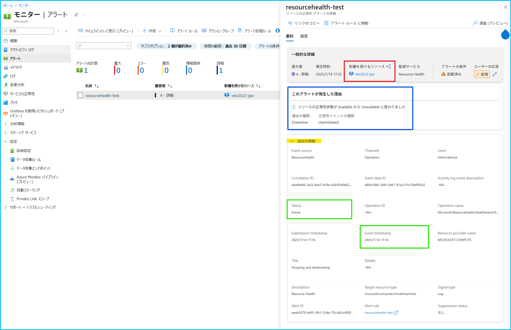
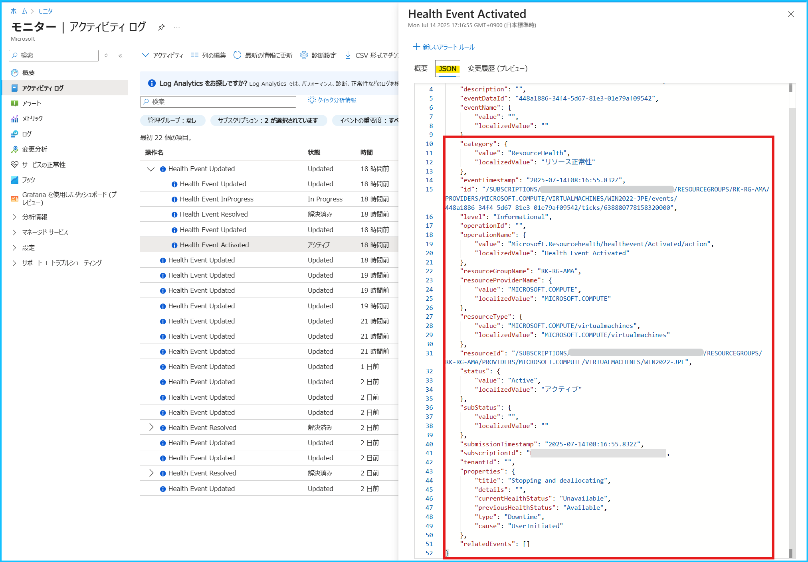

こんにちは、Azure Monitoring サポート チームの北村、徳田です。
今回は [Azure Monitor のアラート ルール](https://learn.microsoft.com/ja-jp/azure/azure-monitor/alerts/alerts-overview)が発報した原因の調査をご依頼いただく際に、お問い合わせを起票される前にご確認いただきたいポイントをご紹介します。本記事の内容をご確認いただくことで、よりスムーズに調査を実施することが可能となりますので、ご参考になれば幸いです。

 

<!-- more -->
## 目次
- 
- 
- 

 

## 1. はじめに
「Azure Monitor のアラート ルールが発報した原因を調査してほしい」というお問い合わせをよくいただきますが、
**アラート ルールの閾値を満たして発報したのか**、それとも**閾値を満たしていないにもかかわらず発報されたのか**によって、調査の観点が異なります。

| アラート ルールが発報した経緯                                          | 調査観点            |
| --------------------------------------------------------------- | ------------------- |
| アラート ルールが閾値を満たして発報した場合                     | Azure リソース観点        |
| アラート ルールが閾値を満たしていないものの発報した場合 | アラート ルール観点 |

**閾値を満たして発報した場合は、監視対象である Azure リソースに問題がある可能性があるため、Azure リソース観点での調査が必要です。一方で、閾値を満たしていないにもかかわらず発報した場合は、アラート ルールの動作に問題がある可能性があるため、アラート ルール観点（Azure Monitor 製品観点）での調査が必要です。**

つまり、アラートが発報した状況によって、[お問い合わせの起票時に選択いただく製品カテゴリ](https://learn.microsoft.com/ja-jp/azure/azure-portal/supportability/how-to-create-azure-support-request#create-a-support-request:~:text=%E5%95%8F%E9%A1%8C%E3%81%AB%E9%96%A2%E9%80%A3%E3%81%97%E3%81%A6%E3%81%84%E3%82%8B%E3%82%B5%E3%83%BC%E3%83%93%E3%82%B9%E3%82%92%E6%8C%87%E5%AE%9A%E3%81%97%E3%81%BE%E3%81%99%E3%80%82) (監視している Azure リソース or アラート ルール) が変わってきます。この切り分けのために **「閾値を満たして発報したかどうか」**を事前にご確認いただくことで、弊社での調査がよりスムーズに進みます。

本記事では、アラートが発報した原因の調査をご依頼いただく際に、事前にご確認いただきたいポイントや、実際に閾値を満たしていたかどうかを確認する方法などをご紹介します。

 
 

## 2. メトリック アラート ルール

### 2-1. 確認するポイント
**[メトリック アラート ルール](https://learn.microsoft.com/ja-jp/azure/azure-monitor/alerts/alerts-types#metric-alerts)の場合は、アラート ルールが実行された時にメトリックの値が閾値を満たしていたかどうかを確認します。**メトリック アラート ルールは、Azure プラットフォームから既定で収集される[プラットフォーム メトリックやカスタム メトリック](https://learn.microsoft.com/ja-jp/azure/azure-monitor/metrics/data-platform-metrics#types-of-metrics)を、一定の間隔で監視します。アラート ルールの閾値を満たして発報したかどうかを確認するためには、アラートが評価した期間と、当該期間におけるメトリックの値を確認する必要があります。

 

### 2-2. 閾値を満たしていたかどうかを確認する方法
まずは、アラート ルールが監視している Azure リソースとアラートの評価期間を確認します。
次に、メトリック エクスプローラーで評価期間におけるメトリックの値を確認します。

1. Azure ポータル > モニター > [アラート] を開き、発報したアラートを選択します。

2. 監視しているリソース、評価された値、アラートの評価期間を確認します。
[メトリック アラートの詳細] 画面が開きますので、下表の <該当する項目> に表示されている内容をご確認ください。
このアラート ルールでは、Azure VM の [VmAvailabilityMetric](https://learn.microsoft.com/ja-jp/azure/virtual-machines/monitor-vm-reference#:~:text=VmAvailabilityMetric) (可用性メトリック) を監視しており、 評価期間 5 分以内の平均値が 0.8 を下回った場合に発報します。

| 確認する項目                | 画面上の該当箇所                                                                                                      | 例（下図参照）                                                        |
| --------------------------- | --------------------------------------------------------------------------------------------------------- | ---------------------------------------------------------------- |
| 監視対象のリソース | 影響を受けるリソース (赤枠部分)                                                                                      | Azure VM (win2022-jpe)                                           |
| 評価された値 | このアラートが発生した理由 (青枠部分)                                                                               | 0.5  |     | 
| アラートの評価期間  | Evaluation window start time,  Evaluation window end time (緑枠部分) | 2025/7/3 16:58 ～ 2025/7/3 17:03                                 |

 

3. [影響を受けるリソース] のリンクを押下し、左ペインの [監視] > [メトリック] から [メトリック エクスプローラー](https://learn.microsoft.com/ja-jp/azure/azure-monitor/metrics/analyze-metrics)を開きます。

4. [スコープ] に監視している Azure リソースが表示されていることを確認します（赤枠部分）。
このアラート ルールは VmAvailabilityMetric の平均を監視しているので、[メトリック] で **VmAvailabilityMetric**、[集計の粒度] は **平均** を選択します（青枠部分）。画面右上の [現地時刻] のボタンを押下し、2. で確認したアラートの評価期間 (2025/7/3 16:58 ～ 17:03 JST) を指定します（緑枠部分）。今回は、評価期間内のメトリックの推移を最小単位 (1 分) で確認したかったため、[時間の粒度] は **1 分** を指定していますが、7/3 16:59 以降はメトリックが 1 を下回っていることが分かります。
このような場合は閾値を満たして発報しているため、発報した原因の調査をご希望される場合には、**アラート ルール観点ではなく、監視しているリソース (Azure VM) 観点で調査が必要となります。**

 
 

### 2-3. メトリックの値を確認するときにご留意いただきたいこと
メトリック アラート ルール編集画面の [プレビュー] や、アラートの詳細画面で表示されるグラフは、実際のアラート ルールの評価期間に基づいた集計の粒度で表示されていない場合がございます。アラートの評価期間に記録されたメトリックの値を確認する際には、[メトリック エクスプローラー](https://learn.microsoft.com/ja-jp/azure/azure-monitor/metrics/analyze-metrics)からご確認いただきますようお願いいたします。

- メトリック アラート ルール編集画面

- アラートの詳細画面

 
 

## 3. ログ アラート ルール
<!-- 3.1 閾値を満たして発報したかどうかを確認する -->
<!-- https://jpazmon-integ.github.io/blog/LogAnalytics/Unexpected_Heartbeat_logalert/ が参考になりそうか-->

 
 

## 4. アクティビティ ログ アラート ルール

 
 

## 5. リソース正常性アラート
[リソース正常性アラート](https://learn.microsoft.com/ja-jp/azure/service-health/resource-health-overview)は、リソースの正常性に変化が生じた際に通知する機能です。
リソースの正常性に変化が生じると、リソース プロバイダーによってリソース正常性に関するイベントがアクティビティ ログに書き込まれます。出力されたアクティビティ ログがアラートで指定した条件を満たした場合に発報します。
そのため、**リソース正常性イベントが発生した原因の調査をご希望の場合は、監視対象のリソース観点でお問い合わせをご起票ください。**

本記事では、リソース正常性アラートの発報条件と、リソース正常性アラートで検知した内容を確認する手順をご紹介します。
なお、**アラートの条件を満たしていないにもかかわらず発報したと疑われる場合は、アラート ルールの動作に関する調査が必要となるため、アラート ルール観点 (Azure Monitor 製品) でのお問い合わせをご検討ください。**

 

### 5-1. リソース正常性アラートの発報条件を確認する
1. Azure ポータル > モニター > [アラート] を開き、画面上部の [アラート ルール] を選択します。

2. リソース正常性アラートを選択し、[概要] ページを開きます。赤枠部分が発報条件、青枠部分がアラートのスコープです。
下記の設定の場合は、指定したリソース グループの仮想マシン (microsoft.compute/virtualmachines のリソース) で、下記の条件を満たした場合に発報します。リソース正常性アラートの条件と設定値につきましては、[リソース正常性アラートに関するよくあるご質問](https://jpazmon-integ.github.io/blog/AzureMonitorEssential/ResourceHealthAlert/)のブログをご覧ください。

- (イベントの状態が Active) かつ (現在のリソースの状態が Degraded または Unavailable) かつ (以前のリソースの状態が Available) かつ (理由の種類が Platform Initiated または Unknown または User Initiated)

※ 下図は、[概要] ページ画面上部の [JSON ビュー] を選択した画面です。

 

### 5-2. 閾値を満たして発報したかどうかを確認する
下記の手順でリソース正常性アラートが検知した内容を確認します。

1. Azure ポータル > モニター > [アラート] を開き、発報したアラートを選択します。

2. 発報したリソースと検知されたアクティビティ ログの内容を確認します。
[リソースの正常性 アラートの詳細] 画面が開きますので、下表の <該当する項目> に表示されている内容をご確認ください。
このリソース正常性アラートは **(イベントの状態が Active) かつ (現在のリソースの状態が Degraded または Unavailable) かつ (以前のリソースの状態が Available) かつ (理由の種類が Platform Initiated または Unknown または User Initiated)** のときに発報する条件のため、想定どおりアラートが発報したことが分かります。

| 確認する項目                | 画面上の該当箇所                                                                                                      | 例（下図参照）                                                        |
| -------------------------------------------- | ------------------------------------- | ---------------------------------------------------------------------------------- |
| 監視対象のリソース                           | 影響を受けるリソース (赤枠部分)       | Azure VM (win2022-jpe)                                                             |
| リソース正常性の状態と  イベントが発生した理由 | このアラートが発生した理由 (青枠部分) | リソース正常性の状態 : Available から Unavailable  理由の種類 : UserInitiated |
| イベントの状態と  イベントが発生した日時       | Status, Event timestamp (緑枠部分)    | イベントの状態が : Active イベントが発生した日時 : 2025/7/14 17:16 JST          |

 

### 5-3. リソース正常性のアクティビティ ログを確認する
リソース正常性のアクティビティ ログは、以下の手順にてご確認いただくことが可能です。

1. Azure ポータル > モニター > [アクティビティ ログ] を開き、[フィルターの追加] を選択します。

2. フィルタ―の条件として **イベントのカテゴリ** を選択し、**リソース正常性** カテゴリを指定します。

3. [リソースの正常性 アラートの詳細] 画面で確認した Event timestamp (2025/7/14 17:16) のアクティビティ ログを選択します。
※ 同じ日時に記録されたアクティビティ ログが 2 件ありますが、状態が「アクティブ (Active)」のログが該当します。

4. [JSON] を選択すると、アクティビティ ログの内容が表示されます。

> [!NOTE]
> リソース正常性アラートの条件と設定値につきましては、[リソース正常性アラートに関するよくあるご質問](https://jpazmon-integ.github.io/blog/AzureMonitorEssential/ResourceHealthAlert/)のブログをご覧ください。また、アクティビティ ログのスキーマは、[こちら](https://learn.microsoft.com/ja-jp/azure/azure-monitor/platform/activity-log-schema#resource-health-category)の公開情報でご確認ください。

 
 

## 6. サービス正常性アラート
[サービス正常性アラート](https://learn.microsoft.com/ja-jp/azure/service-health/overview)は、お客様環境にてご利用いただいている Azure サービスおよびリージョンを監視対象とし、Azure サービス自体の正常性を監視します。例えば、以下のような情報が通知されます：

- Azure サービスの障害
- 計画メンテナンス
- Azure サービスの仕様変更や廃止
- セキュリティ関連の重要情報（可用性に影響する可能性があるもの）

[サービス正常性アラートで通知された内容についてご不明な点がある場合は、基本的に該当するサービス観点でお問い合わせをご起票くださいますようお願いいたします](https://jpazmon-integ.github.io/blog/AzureMonitorEssential/MonitorAlertFAQ/#Q-%E3%82%B5%E3%83%BC%E3%83%93%E3%82%B9%E6%AD%A3%E5%B8%B8%E6%80%A7%E3%82%A2%E3%83%A9%E3%83%BC%E3%83%88%E3%81%A7%E9%80%9A%E7%9F%A5%E3%81%95%E3%82%8C%E3%81%9F%E5%86%85%E5%AE%B9%E3%81%AB%E3%81%A4%E3%81%84%E3%81%A6%E7%A2%BA%E8%AA%8D%E3%81%97%E3%81%9F%E3%81%84%E3%81%A7%E3%81%99%E3%80%82)。サービス正常性の通知メールの下部には、対象となるサービス名が記載されておりますので、該当サービスのカテゴリを選択してお問い合わせいただきますようお願いいたします。

※ 下記例の場合は Azure Monitor 観点でお問い合わせをご起票ください。

 
 

## 7. その他
稀に、Azure Monitor 製品以外の方法で Azure リソースを監視されているお客様から、検知されたメッセージの意味や発報した原因について調査のご依頼をいただくことがございます。大変恐縮ではございますが、**サードパーティー製の監視製品をご利用されている場合、弊社サポートではその監視の仕組みや発報条件などの詳細を確認することはできません。**

そのため、お問い合わせをご起票いただく前に、お客様ご自身でご利用中の監視ツールの仕組みや発報条件をご確認いただきますようお願いいたします。調査いただいた結果、Azure リソース側に問題がある可能性があると判断された場合には、調査いただいた内容をもとに、Azure リソース観点でお問い合わせをご起票ください。その際、監視ツールの仕組みや発報条件に関する情報もご共有いただけますと、弊社での調査がよりスムーズに進みますので、ご協力のほどよろしくお願いいたします。

 