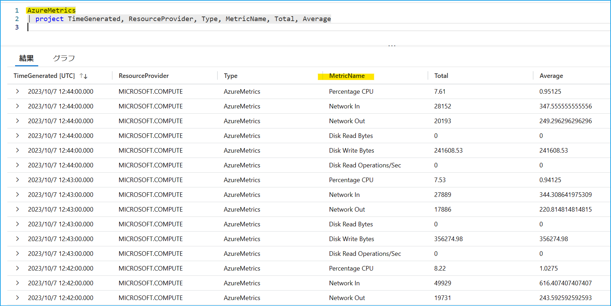

こんにちは、Azure Monitoring サポート チームの北村です。
今回のブログでは Azure VM の診断設定と、それ以外のリソースにおける診断設定の違いをご説明します。
皆さんは、Azure Monitor には "診断設定" という名前の機能が 2 つ存在することをご存知ですか？
どちらの機能もログやメトリックを収集しますが、実は全く別の機能です。しかし、同じ名前の機能のため、この 2 つの違いについてのお問い合わせが多く寄せられます。そこで、今回はこの 2 つの機能の違いに焦点をあてて機能の概要をご説明します！

<br>

<!-- more -->
## 目次
- [1. 診断設定という名前の機能は 2 つある](#1-診断設定という名前の機能は-2-つある)
- [2. Azure VM の診断設定](#2-アラート-メールの登録解除に関するよくあるご質問)
- [3. Azure Monitor の診断設定](#3-Azure-Monitor-の診断設定)
- [4. Azure VM のプラット フォーム メトリックを収集する方法](#4-Azure-VM-のプラット-フォーム-メトリックを収集する方法)

<br>


## 1. 診断設定という名前の機能は 2 つある
本記事の冒頭でも記載したとおり、"診断設定" という名前の機能は 2 つあります。
ここでは 2 つの機能を明確に区別するため、"Azure VM の診断設定" と "Azure Monitor の診断設定" と呼ぶことにします。
下表は、この 2 つの機能の主な違いです。この機能の共通点は、対象リソースのメトリックやログを収集するという点です。

| 機能名 | [Azure VM の診断設定](https://learn.microsoft.com/ja-jp/azure/azure-monitor/agents/diagnostics-extension-overview) | [Azure Monitor の診断設定](https://learn.microsoft.com/ja-jp/azure/azure-monitor/essentials/diagnostic-settings?tabs=portal)  |
| --------------- | ----------------- | ----------------- | 
| 対象リソース | Azure VM  | [公開情報](https://learn.microsoft.com/ja-JP/azure/azure-monitor/reference/supported-logs/logs-index) に記載のリソース|
| 送信するデータ | ゲスト OS のメトリックとログ | Azure プラットフォームのメトリックとログ |
| データの宛先 | ストレージ アカウント、Azure Monitor メトリック、Event Hubs | Log Analytics ワークスペース、ストレージ アカウント、 <br> イベント ハブ、サード パーティの製品 |
| 拡張機能 | あり (Azure Diagnostics 拡張機能) | なし |

<br>


## 2. Azure VM の診断設定
Azure VM に [Azure Diagnostics 拡張機能](https://learn.microsoft.com/ja-jp/azure/azure-monitor/agents/diagnostics-extension-overview)をインストールし、ゲスト OS のログやメトリックをストレージ アカウントに送信する機能です。Windows 用の Azure Diagnostics 拡張機能 は Windows Azure Diagnostics extension (WAD)、Linux 用は Linux Azure Diagnostics extension (LAD) と呼ばれています。Azure ポータル から対象の Azure VM を選択し、[監視] - [診断設定] から有効化することができます。設定手順の詳細は [こちら](https://learn.microsoft.com/ja-jp/azure/azure-monitor/agents/diagnostics-extension-overview#installation-and-configuration) をご覧ください。


Azure Monitor では、VM に拡張機能をインストールしてゲスト OS のメトリックやログを収集する機能に Log Analytics エージェントや Azure Monitor エージェントがあります。これらのエージェントとの主な違いは、ログの収集先です。
Log Analytics エージェントや Azure Monitor エージェントでは Log Analytics ワークスペースにログを収集します。
ストレージ アカウントは Log Analytics ワークスペースと比べて低コストでログを保持することが可能であり、より長い期間ログを保管することができます。そのため、低コストでログやメトリックを保管されたい場合や、より長い期間ログを保管されたいときに Azure Diagnostics 拡張機能をご利用されることが多いように思います。

> [!NOTE]
> Azure Diagnostics 拡張機能がサポートしている OS は [こちら](https://learn.microsoft.com/ja-jp/azure/azure-monitor/agents/agents-overview#compare-to-legacy-agents) をご確認ください。
> ゲスト OS やメトリックに関する説明は [こちらの記事](https://jpazmon-integ.github.io/blog/LogAnalytics/MonitorAzVM_logs/) をご覧ください。また、Log Analytics エージェントは 2024 年 8 月 31 日に廃止が予定されており、Azure Monitor エージェントへの移行をお願いしております。詳細は [公開情報](https://learn.microsoft.com/ja-jp/azure/azure-monitor/agents/azure-monitor-agent-migration) をご確認ください。

<br>


## 3. Azure Monitor の診断設定
Azure プラットフォームのメトリックやログを Log Analytics ワークスペースやストレージ アカウント等に送信する機能です。
"Azure Monitor の診断設定" は、すべてのリソースでサポートしているわけではございません。基本的に [公開情報](https://learn.microsoft.com/ja-JP/azure/azure-monitor/reference/supported-logs/logs-index) に掲載されているリソースでサポートされています。基本的には Azure ポータルから対象リソースを選択し、[監視] - [診断設定] から構築することが可能です。設定手順の詳細は [こちら](https://learn.microsoft.com/ja-jp/azure/azure-monitor/essentials/diagnostic-settings?tabs=portal#create-diagnostic-settings) をご覧ください。


プラットフォームのメトリックは既定で収集されます。メトリックは Azure 基盤側のメトリック データベースに保存され、Azure ポータルの[メトリック エクスプローラー](https://learn.microsoft.com/ja-jp/azure/azure-monitor/essentials/metrics-getting-started)等から確認できます。一方で、プラットフォームのログは "Azure Monitor の診断設定" を構築しない限り、収集することはできません。プラット フォームのメトリックを既定の保持期間 ([93 日間](https://learn.microsoft.com/ja-jp/azure/azure-monitor/essentials/data-platform-metrics#platform-and-custom-metrics))以上保管したい場合やプラットフォームのログを保管/監視したい場合にご利用いただける機能です。

> [!NOTE]
> メトリックは、Azure リソースから一定の間隔で自動で収集される数値データです。
> プラットフォーム メトリックは、Azure リソースから一定の間隔で自動で収集される数値データであり、正常性やパフォーマンスに関する情報です。
> プラットフォーム のログは Azure リソース内で実行された操作に関する情報です。ログはリソースの種類によって異なります。
> Azure プラットフォームのメトリックやログの詳細は、[Azure Monitor のサポートされるメトリック](https://learn.microsoft.com/ja-jp/azure/azure-monitor/reference/supported-metrics/metrics-index) や [Azure リソース ログ](https://learn.microsoft.com/ja-jp/azure/azure-monitor/essentials/resource-logs) の公開情報をご覧ください。

<br>


## 4. Azure VM のプラット フォーム メトリックを収集する方法
ここまでお読みいただいて「Azure VM のプラットフォーム メトリックを保管したい場合は、どうしたらいいの？」と思われた方もいるかもしれません。弊社サポートにも「Azure VM のホスト OS メトリックを Log Aanalytics ワークスペースに送信したい」というお問い合わせをよくいただきます。

Azure VM には、2 種類のメトリック (ゲスト OS メトリックとホスト OS メトリック) があります。ゲスト OS メトリックは VM 上に Azure Monitor エージェント等をインストールして収集しますが、[ホスト OS メトリック (VM のホストで管理しているメトリック データ)](https://learn.microsoft.com/ja-jp/azure/azure-monitor/reference/supported-metrics/microsoft-classiccompute-virtualmachines-metrics) は既定で収集されます。このホスト OS メトリックは、Azure PowerShell 等で "Azure Monitor の診断設定" を構築することで、Log Analytics ワークスペース等に収集することができます。

以下は Azure PowerShell で Azure VM のプラットフォーム メトリックを Log Analytics ワークスペースに送信する設定例です。
"Azure Monitor の診断設定" を構築するためのコマンドの詳細につきましては、[こちら](https://learn.microsoft.com/ja-jp/powershell/module/az.monitor/new-azdiagnosticsetting?view=azps-10.3.0) をご覧ください。

```CMD
$metric = @()
$metric += New-AzDiagnosticSettingMetricSettingsObject -Enabled $true -Category AllMetrics
New-AzDiagnosticSetting -Name '診断設定の名前' -ResourceId <仮想マシンのリソース ID> -WorkspaceId <Log Analytics ワークスペースのリソース ID> -Metric $metric
```

"Azure Monitor の診断設定" で送信したプラットフォーム メトリックは AzureMetrics テーブルに収集されます。
なお、上記コマンドを実行し、ログが出力されるまで時間がかかる場合がございます。上記コマンドを実行してから約 1 ～ 2 時間後に Log Analytics ワークスペース上でログが収集されているかどうかをご確認ください。



> [!NOTE]
> サンプル スクリプトを実行するには、Azure PowerShell をインストールいただく必要がございます。
> Azure PowerShell をインストール方法は [弊社公開情報](https://learn.microsoft.com/ja-jp/powershell/azure/install-azure-powershell?view=azps-10.2.0&viewFallbackFrom=azps-8.1.0) をご覧ください。
> なお、Azure PowerShell や Azure CLI を使用する際には Azure Cloud Shell が便利です。ポータルでログインしているユーザーの認証情報が引き継がれるため、Connect-AzAccount コマンド等の実行は不要です。
> [弊社公開情報](https://learn.microsoft.com/ja-JP/azure/cloud-shell/overview) にも利用方法を掲載しておりますので、ご覧いただけますと幸いです。

<br>

上記の内容以外でご不明な点や疑問点などございましたら、弊社サポート サービスまでお問い合わせください。
最後までお読みいただきありがとうございました！
