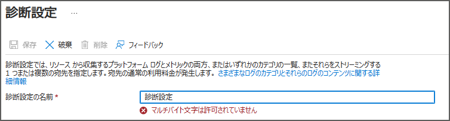
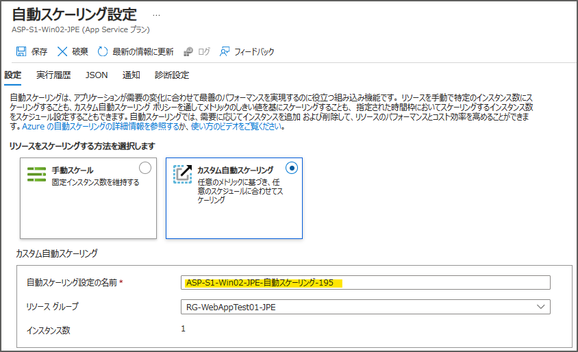
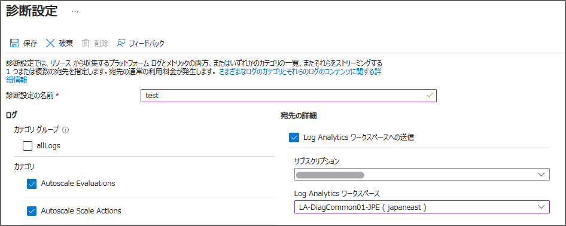
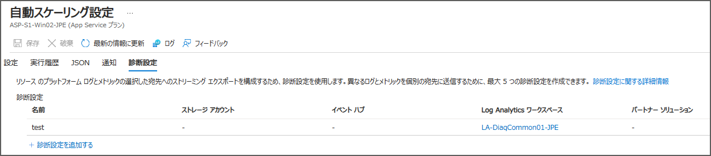
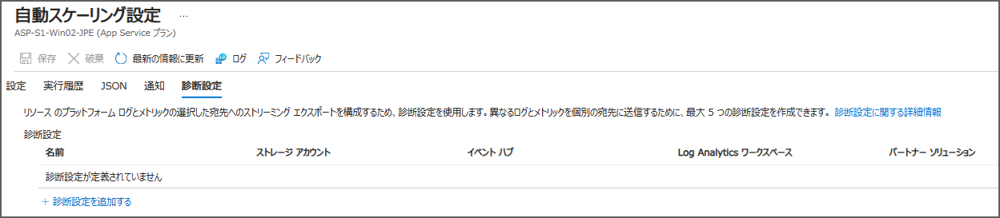

こんにちは、Azure Monitor サポートの山口です。
今回は、Azure Monitor のリソースにて、リソース名を日本語で設定することに起因し発生する事象をご案内いたします。
 
<!-- more -->
## 目次
- [1. はじめに](#1-はじめに)
- [2. 事例](#2-事例)
  - [2-1. Azure Monitor エージェントにおけるログ収集が失敗することがある](#2-1-AzureMonitorエージェントにおけるログ収集が失敗することがある)
  - [2-2. アラート ルールの発報が失敗することがある](#2-2-アラートルールの発報が失敗することがある)
  - [2-3. 診断設定が消えることがある](#2-3-診断設定が消えることがある)
- [3. まとめ](#3-まとめ)

 

## 1. はじめに
サブスクリプション名、リソース グループ名、およびリソース名の命名規則につきまして、日本語でリソースを作成すること自体は可能ですが、一方で製品の動作不具合が発生する要因となる可能性があるため、日本語にて命名することは推奨されておりません。

以下、弊社 Azure サポート チームの過去ブログもご参照ください。
[jpaztech1.z11.web.core.windows.net/リソースグループ名の制限について](https://jpaztech1.z11.web.core.windows.net/%E3%83%AA%E3%82%BD%E3%83%BC%E3%82%B9%E3%82%B0%E3%83%AB%E3%83%BC%E3%83%97%E5%90%8D%E3%81%AE%E5%88%B6%E9%99%90%E3%81%AB%E3%81%A4%E3%81%84%E3%81%A6.html)

以下、リソースの命名規則についての公開情報もございますので併せてご確認ください。
[リソースの名前付けに関する制限事項 - Azure Resource Manager](https://learn.microsoft.com/ja-jp/azure/azure-resource-manager/management/resource-name-rules)

また、過去にはトラブルシューティングが必要なケースにて設定に問題がない場合であっても、最終的に日本語のリソースが存在したことが起因で製品不具合が発生していた事例もありました。

上記より、リソース名が日本語の場合は製品が正しく動作しない可能性があるため、Azure リソースの命名には 英数字のみでの設定をご検討いただけますと幸いです。
なお、リソース名は基本的に変更することが出来ないため、既に日本語を設定している場合はリソースを再作成いただく必要がある点はご留意ください。

## 2. 事例
本記事では、現在確認できている、日本語でリソース名を設定することにより製品が正常に動作しない事例について 3 つご紹介いたします。 

### 2-1. Azure Monitor エージェントにおけるログ収集が失敗することがある
リソース ID に日本語が含まれる場合、正常にログが収集されない場合があります。 
Azure Monitor エージェントの前提条件として、マネージド ID が有効化されている必要がありますが、日本語が含まれることにより、正常に認証が行われず、その結果としてエージェントが正常に動作しない場合があります。
その結果、エージェントがインストールされ、前提条件を満たしていてもログ、メトリックが収集できないといった事例を複数確認しております。
 
### 2-2. アラート ルールの発報が失敗することがある
日本語文字の関係で、アラート ルールが正常に動作せず、しきい値を満たしたにもかかわらず発報されなかった事例を複数確認しております。
なお、本事象は必ず発生するわけではないため、現在正常に動作している場合であっても、今後発生する場合があります。
そのため、可能であれば同じ条件で日本語を含まないアラート ルールに変更することをご検討ください。

### 2-3. 診断設定が消えることがある
日本語を含む、英数字以外の文字がリソース名に含まれる場合、診断設定を作成しても設定が消えることがあります。
上記事象については以下の公開情報にも記載があるとおり、診断設定が英数字以外の文字をサポートしないために発生する事象であり、製品の不具合ではないです。
[resourceID の 非 ASCII 文字が原因で設定が消える]
(https://learn.microsoft.com/ja-jp/azure/azure-monitor/essentials/create-diagnostic-settings?tabs=portal#setting-disappears-because-of-non-ascii-characters-in-resourceid)

※ なお、現在は診断設定名を設定すると以下のようにメッセージが表示されます。

診断設定の動作につきましては事例を添えてご説明いたします。
以下に、自動スケーリングの診断設定のリソース名に日本語が含まれる場合の動作を例にしてご説明いたします。

<自動スケーリングの診断設定例>
1. Azure Portal の言語設定が日本語の場合、カスタム自動スケーリングを設定すると自動スケーリング設定の名前が日本語にて作成されます。

 

2. 上記状態で保存し、診断設定を以下のように作成します。

 

3. 診断設定の作成に成功し、表示上も正しく作成されたように見えます。

 

4. 1 時間経過後に確認してみると、診断設定が消えてしまいます。

 

事例は以上です。上記のように、日本語文字が含まれる場合には設定が消えてしまう場合があります。
なお、もしも日本語で診断設定が作成された場合の回避策としては、既定で入力されている自動スケーリング設定の名前を英数字に入力し直していただく必要がある点ご留意ください。

## 3. まとめ
今回は Azure Monitor のリソースにおける、日本語 でリソース名を設定することによる影響についてご案内しました。
日本語文字での設定自体は可能ですが、日本語を使用することにより不具合が発生する事象を複数確認しておりますので、よろしければリソース名は "英数字" での設定をご検討ください。

最後までお読みいただきありがとうございました！
