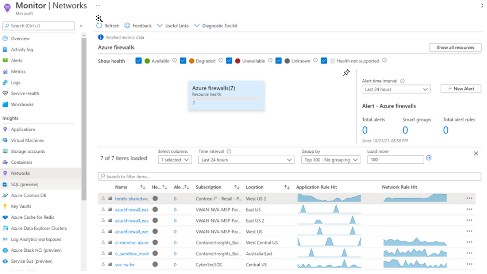

こんにちは、Azure Monitoring & Integration チームの 鄭 です。

本記事は、2021 年 11 月 2 日に米国の Azure Monitor Blog で公開された [What’s new in Azure Monitor @ Ignite 2021](https://techcommunity.microsoft.com/t5/azure-monitor-blog/what-s-new-in-azure-monitor-ignite-2021/ba-p/2912049) を翻訳したものになります。Azure Monitor に関する最新情報をお届けいたします。

============================================================================================

Azure Monitor は、ハイブリッド環境を完全に監視できるようにするエンタープライズ対応の豊富な機能を提供し、常に利用可能で、信頼性が高く、パフォーマンスを維持できるようにしています。 そして、Microsoft Ignite 2021で多数の新機能を発表しました。これにより、アプリとインフラストラクチャからより多くの洞察を得ることができ、Log Analytics workspace とアラートを簡単に管理できます。

**OpenTelemetry エクスポーターを使用して Application Insights にテレメトリを送信します。**
1. OpenTelemetry のベンダーに依存しない一貫性のある API / SDK を使用して、 [.NET、 Node.JS、 Python](https://docs.microsoft.com/en-us/azure/azure-monitor/app/opentelemetry-enable?tabs=net)アプリをインストルメント化し、 Application Insights にデータを送信できるようになりました。 これらの AzureMonitor OpenTelemetry エクスポーターはプレビュー機能で、昨年リリースされた [Java auto-instrumentation](https://docs.microsoft.com/en-us/azure/azure-monitor/app/java-in-process-agent)に追加されています。

**Container Insights を使用して Azure Arc 対応 Kubernetes クラスターを監視します。**
1. [Azure Arc 対応 Kubernetes クラスターのサポート](https://docs.microsoft.com/en-us/azure/azure-monitor/containers/container-insights-enable-arc-enabled-clusters)が一般提供され、Container Insights を通じて、すべての Kubernetes、 AKS、 または非 AKS クラスターを監視できるようになりました。 Azure ポータルからの1-click onboarding を利用して、包括的な視覚化と推奨アラートを使用してクラスターのパフォーマンスを可視化できます。

**Network Insights を使用して VPN ゲートウェイと Azure ファイアウォールのトラブルシューティングを行います。**
1. VPN ゲートウェイおよび Azure ファイアウォールリソースの [Network Insights ](https://docs.microsoft.com/en-us/azure/azure-monitor/insights/network-insights-overview) で、豊富な insights と新しいトラブルシューティング機能を利用できるようになりました。 リソースの状態と接続されたリソースを示すリソース トポロジを視覚化し、厳選された監視ワークブックを開始できます。

**新しい機能を使用し、Log Analytics workspace の管理および監視を行います。**
1. [Log Analytics Workspace Insights](https://docs.microsoft.com/en-us/azure/azure-monitor/logs/log-analytics-workspace-insights-overview)が一般提供になりました。これを使用すると、ワークスペースの使用状況、パフォーマンス、ヘルス、エージェント、クエリ、および変更ログの統合ビューを通じて、ワークスペースの包括的なビューを取得できます。

1. Azureポータル内で直接 Log Analytics [workspace からデータエクスポート ルールを簡単に管理できるようになりました](https://docs.microsoft.com/en-us/azure/azure-monitor/logs/logs-data-export?tabs=portal)（プレビュー中）。 新しい機能は、ワークスペース内の既存のルールが有効な状態か無効な状態かに関係なく、明確に表示されます。 いくつかの簡単な手順で、既存のルールを編集して新しいルールを作成することもできます。

**Azure Monitor Alerts から EventHub アクションをトリガーします。**
1. Azure Monitor Alerts の新しい [EventHub アクション](https://docs.microsoft.com/en-us/azure/azure-monitor/alerts/action-groups)を使用すると、信頼性が高くスケーラブルなキューイングテクノロジを利用してアラートを取り込むことができます。 プライベートリンクを使用して EventHub にサブスクライブすることで、ネットワークの分離を実現することもできます。

Azure Monitor とモニタリングのベストプラクティスの詳細については、[ドキュメント](https://docs.microsoft.com/ja-jp/azure/azure-monitor/)と [how-to videos](https://www.youtube.com/playlist?list=PLLasX02E8BPCCsHzNLJjcElCwF52rnh6t) をご覧ください。