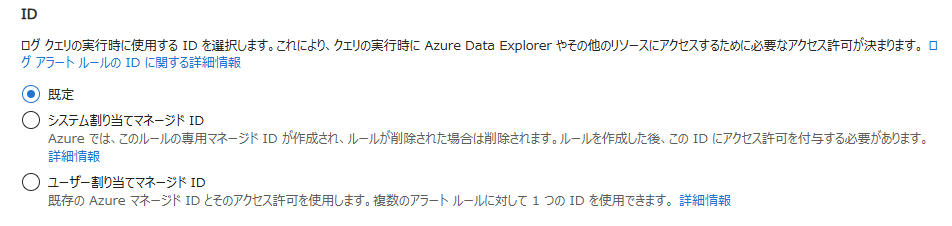
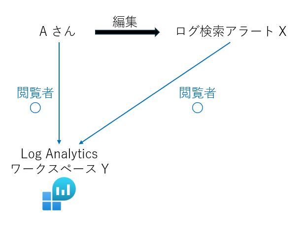

こんにちは、Azure Monitoring サポート チームの江口です。

今回はログ検索アラートのマネージド ID についてご紹介します。

「ログ検索アラートではマネージド ID の設定ができるけど、これはなんのためにあるの？」 こんな疑問を持っている方にぜひ読んでいただきたいです。

<!-- more -->

## 目次
* [マネージド ID とは](#マネージド-id-とは)
* [ログ検索アラートにマネージド ID を割り当てる](#ログ検索アラートにマネージド-id-を割り当てる)
* [[既定]、[システム割り当てマネージド ID]、[ユーザー割り当てマネージド ID] の違い](#既定システム割り当てマネージド-idユーザー割り当てマネージド-id-の違い)
* [マネージド ID を使う利点](#マネージド-id-を使う利点)
* [まとめ](#まとめ)

## マネージド ID とは 

[マネージド ID](https://learn.microsoft.com/ja-jp/entra/identity/managed-identities-azure-resources/overview) は、Azure が提供する自動管理された認証システムで、Azure リソースから他のリソースへのアクセスを管理するために使用されます。 

アラート ルールをはじめとする一部の Azure リソースにマネージド ID を割り当てることで、他のリソースへのアクセス権限をリソースごとに管理できます。  

## ログ検索アラートにマネージド ID を割り当てる

このセクションでは、アラートルールを作成/編集する際にどこでマネージド ID を設定するのかについて、Azure Portal での操作を説明します。 

クエリによる検索を必要とするログ検索アラートに対しては、他のリソースへのアクセスを管理するため、マネージド ID を割り当てることができます。

1. アラート ルールの作成の [条件] で以下のように [カスタムログ検索] を選択します。 

2.  [詳細] の [ID] の項目に、以下の画面が表示されます。ここでマネージド ID についての設定を行うことができます。 

## [既定]、[システム割り当てマネージド ID]、[ユーザー割り当てマネージド ID] の違い 

 

このセクションでは、マネージド ID の設定の際に選択する [既定]、[システム割り当てマネージド ID]、[ユーザー割り当てマネージド ID] の 3 つの項目について説明します。 

 

### 1. 既定 

アラート ルールのアクセス権限は、アラート ルールを編集した最後のユーザーのアクセス権限に基づきます。 マネージド ID は割り当てられません。

例として以下のシナリオを考えます。 

#### シナリオ

A さんと B さんがいて、ID の設定で [既定] を選択しているログ検索アラート X を編集したいと考えている。 

それぞれに割り当てられているアクセス権限のロールは以下である。 

A さん： 「ログ検索アラート X の共同作成者ロール」および、「クエリ検索を行う Log Analytics ワークスペース Y の閲覧者ロール」。 

B さん： 「ログ検索アラート X の共同作成者ロール」のみ。 

#### A さんが編集
まず初めに、A さんがログ検索アラート X を編集すると、ログ検索アラート X のアクセス権限は A さんのアクセス権限に基づきます。 

つまり、ログ検索アラート X は「ログ検索アラート X の共同作成者ロール」および、「Log Analytics ワークスペース Y の閲覧者ロール」が割り当てられます。 

そのため、ログ検索アラート X は Log Analytics ワークスペース Y に対してクエリ検索を行う権限があり、ログ検索アラートはアラート条件に従って期待通り発報します。 

#### B さんが編集
その後、B さんがログ検索アラート X を編集すると、ログ検索アラート X のアクセス権限は B さんのアクセス権限に基づくように変更されます。 

つまり、ログ検索アラート X は「ログ検索アラート X の共同作成者ロール」のみが割り当てることになり、「Log Analytics ワークスペース Y の閲覧者ロール」を失います。 

そのため、ログ検索アラート X は Log Analytics ワークスペース Y に対してクエリ検索を行う権限がなくなり、その後はログ検索アラートが期待通りに発報しなくなります。 
 

### 2. システム割り当てマネージド ID 

作成/編集しているアラート ルールに対して専用のマネージド ID が割り振られます。 

割り振られたマネージド ID のライフサイクルはアラート ルールのそれと対応するため、アラート ルールが削除されると紐づけられたマネージド ID も削除されます。 

 

アラート ルールの作成/編集後、システム割り当てマネージド ID に対して、Log Analytics ワークスペースのクエリ検索の権限を付与する必要があります。 

マネージド ID に対するロールの割り当ては、該当の Log Analytics ワークスペースの アクセス制御 > ロール割り当ての追加 から行えます。 

[メンバー] の [アクセス割り当て先] の項目で [マネージド ID] を選び、メンバーを選択することで、特定のマネージド ID に対して特定のロールを付与することができます。 

 

 

Log Analytics ワークスペースにクエリ検索を行う場合に付与するロールとしては、[Log Analytics 閲覧者] などが該当します。 

 

Azure Monitor に関するそれぞれのロールの詳細については[こちら](https://learn.microsoft.com/ja-jp/azure/role-based-access-control/built-in-roles#monitor)をご参照ください。 

 

### 3. ユーザー割り当てマネージド ID 

1 つ以上のリソースに対して同一のマネージド ID を割り振ることができます。 

アラート ルールとは独立したリソースとしてマネージド ID を事前に作成し、マネージド ID に対して Log Analytics ワークスペースのクエリ検索可能な権限を付与した後に、アラート ルールのマネージド ID の設定項目で該当のユーザー割り当てマネージド ID を選択する必要があります。 

独立したリソースであるため、アラート ルールが削除されても、ユーザー割り当てマネージド ID は削除されません。 

ユーザー割り当てマネージド ID は、ホームから マネージド ID > 作成 にて作成できます。 

ただし、ユーザー割り当てマネージド ID を作成するためには、作成者に [マネージド ID 共同作成者] のロールが付与されていることが必要です。 

 

マネージド ID に対するロールの割り当てについては、2. システム割り当てマネージド ID を参照してください。 

  
  

以上 3 つの項目については以下の弊社公開情報にも記載がございますので、ご参照ください。 

- ログ検索アラート ルールを作成または編集する # アラート ルールの詳細を構成する 

https://learn.microsoft.com/ja-jp/azure/azure-monitor/alerts/alerts-create-log-alert-rule#configure-alert-rule-details 

- Azure リソースのマネージド ID とは # マネージド ID の種類 

https://learn.microsoft.com/ja-jp/entra/identity/managed-identities-azure-resources/overview#managed-identity-types 

 

 

## マネージド ID を使うメリット

ここまでの内容を踏まえ、マネージド ID を利用することの利点を以下の 3 点に分けて説明します。 

 
### 1. アクセス権限の明確化 

マネージド ID を使用することで、他のリソースへのアクセス制御を ID 単位で一元管理できます。 

[既定] の例で紹介したように、アラート ルールのアクセス権限が最終編集者の権限に依存すると、編集するたびにアラート ルールのアクセス権限が変更される可能性があります。 

割り当てられたロールによっては Log Analytics ワークスペースのクエリ検索が行えなくなり、アラートが期待通り発報しなくなってしまうこともあります。 

マネージド ID ごとにロールを付与することで、各リソースのアクセス権限を一貫して明確なものとすることができます。 

 

### 2. 最小権限の原則の実装 

マネージド ID を使用することで、各リソースの他のリソースに対するアクセス権限を必要最低限とし、セキュリティ リスクを軽減することができます。 

各リソースに対するロールの割り当てとして、最小権限を実現するように柔軟に設定することで、「何のリソースが」「どのスコープに」「何ができるのか」を管理できます。 

 

### 3. 他のサービスとの統合 

[Azure Data Explorer](https://learn.microsoft.com/ja-jp/azure/data-explorer/data-explorer-overview) または [Resource Graph](https://learn.microsoft.com/ja-jp/azure/governance/resource-graph/overview) にクエリを送信する場合は、マネージド IDが必須です。 

各サービスからマネージド ID に対して適切なロールを割り当てることで、他のサービスとの統合によってよりシームレスな利用が可能となります。 

 
Azure Data Explorer と Resource Graph に対するマネージド ID の利用については下記の弊社公開情報をご参照ください。 

- マネージド ID の概要 

https://learn.microsoft.com/ja-jp/azure/data-explorer/managed-identities-overview 

- クイックスタート: Azure Resource Graph と Log Analytics を使用してアラートを作成する 

https://learn.microsoft.com/ja-jp/azure/governance/resource-graph/alerts-query-quickstart?tabs=azure-resource-graph

 
## まとめ
この記事では、以下の 3 点についてまとめました。

* ログ検索アラートにマネージド ID を割り当てる方法
* マネージド ID の設定による権限管理方法の違い
* マネージド ID を利用するメリット

本記事がご理解の助けとして、お役立ていただければ幸いです。

最後までお読みいただきありがとうございました。
