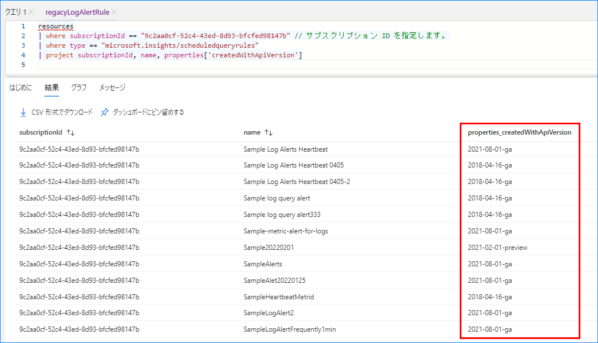
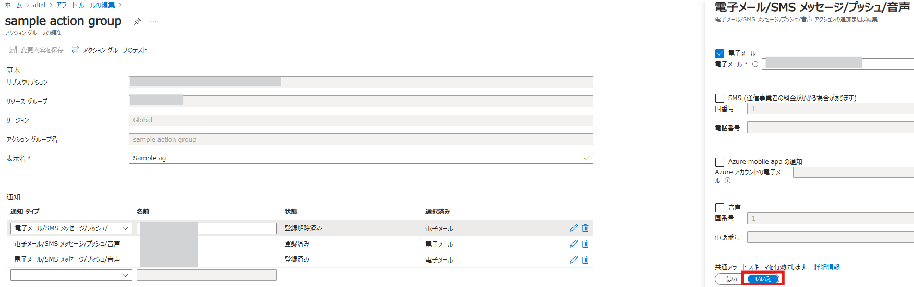

こんにちは、Azure Monitoring サポート チームの名波です。  
今回は、ログ アラート メールのフォーマット変更についてご紹介します。  
お客様からよくお問い合わせいただくご質問もご紹介しますので、ご参考になれば幸いです。

<!-- more -->


## 1. ログ アラート メールのフォーマット変更について
ログ アラートが発報した際に送付される通知メールに新しいフォーマットが導入されました。  
この変更は順次展開されていますが、変更適用後は以下の形式のメールが送付されるようになります。


メールのタイトルは、**```Alert 'アラートルール名’ was fired```** となります。

新しいフォーマットは大規模なユーザー調査の結果に基づいて作成されました。  
より情報量が多く視覚的に把握しやすくすることで、アラートの調査を容易にすることを目指しています。

この変更については、以下の Azure 更新情報ページでもご案内させていただいてます。  
[New E-mail templates for Log search alerts - API version 2021-08-01 and up | Azure updates | Microsoft Azure](https://azure.microsoft.com/ja-jp/updates/new-email-templates-for-log-search-alerts-api-version-20210801-and-up/)


## 2. 新しいフォーマットでメールが送信される条件
送られる通知メールが新しいフォーマットに変わるのは、以下 2 点の条件を満たしている場合となります。
 
### バージョン 2021-08-01 以降のAPI バージョン のログ アラート ルール (ログ アラート ルール V2) である
Azure Resource Graph エクスプローラーを利用して、既存のログ アラート ルールの API バージョンを確認することが可能です。

#### 確認手順
まずAzure ポータルにアクセスし、「Resource Graph エクスプローラー」 に遷移します。  
次に、以下のサンプル クエリで、対象サブスクリプション配下のログ アラートの API バージョンを表示します。  
その後、対象サブスクリプション配下のログ アラートの API バージョンを確認します。  

```
resources
| where subscriptionId == "xxxxxxxx-xxxx-xxxx-xxxx-xxxxxxxxxxxx" // サブスクリプション ID を指定します。
| where type == "microsoft.insights/scheduledqueryrules"
| project subscriptionId, name, properties['createdWithApiVersion']
```

実行例は以下の通りです。
 

「name」 はログ アラート ルール名、「properties_createdWithApiVersion」 は API バージョンです。  
properties_createdWithApiVersion が 2021-08-01 以降であれば、V2 のログ アラート ルールとご判断いただけます。  
なお、Resource Graph エクスプローラー以外にも、当該のアラート ルールの設定で 「アクションをカスタマイズする」 の項目がある場合には、V2 ではない古い API バージョンのログ アラート ルールとなります。  
( API バージョン 2021-08-01 以降は、この機能に対応していないため)

### 対象のアクション グループにて、「共通アラート スキーマを有効にします」 の設定を 「いいえ」 に設定している
  

引き続き従来のフォーマットでのメール通知を受け取る場合は、アクション グループで共有スキーマを有効化してください。

## 3. ログ アラート メールのフォーマット変更に関するよくあるご質問
### Q1. 従来のフォーマットで通知メールを受信する方法を教えてください。
対象のアクション グループにて「共通アラート スキーマを有効にします」 の設定を 「はい」 にすることで、従来のフォーマットで通知メールを受信することが可能となります。

もしアクション グループ内に通知先として複数のメール アドレスが登録されている場合、
通知設定時に共通アラート スキーマを有効にしたアドレスのみ、従来のフォーマットでメールが通知されるようになります。

なお本設定の影響としましては、従来のフォーマットのメールで通知されるように挙動が変わるのみです。それ以外の影響は現時点ではございません。

### Q2. 共通アラート スキーマを有効に設定しているアラート ルールは今後も従来のフォーマットでメール通知されるのでしょうか。
共通アラート スキーマを有効にした場合のフォーマットの変更は現時点で予定されていません。  
今後も従来のフォーマットが保持されてメール通知が行われます。

### Q3. メールフォーマットの変更が完了する具体的な日時をお教え下さい。
現在、ログ アラート ルールが V2 且つ共通アラート スキーマを無効に設定している場合に送られる通知メールのフォーマットの変更は順次 Azure に展開されております。  
このため、もしログ アラート ルールを複数作成していて、既に一部のアラート ルールに展開されている場合でも、その他のログ アラート ルールに対しても今後フォーマットの変更が起こる可能性があります。

### Q4. メールを自動で振り分けています。新しいフォーマットが導入されたら設定変更が必要ですか?
新しいフォーマットでは、**```Alert 'アラートルール名' was fired```** というタイトルでメールが送付されます。  
メールのタイトルに基づいた振り分けをしている場合は、設定の変更が必要です。  
共通スキーマを有効化して従来のフォーマットを継続して利用される場合は、メールの振り分け設定の変更は不要です。

### Q5. メトリック アラートでもフォーマットが変更されますか?
現時点ではログ アラート メール以外（メトリック アラート ルールおよびアクティビティ ログ アラートルール）のフォーマットを変更する予定はございません。

上記の内容以外でご不明な点や疑問点などございましたら、弊社サポート サービスまでお問い合わせください。
最後までお読みいただきありがとうございました！

※本情報の内容（添付文書、リンク先などを含む）は、作成日時点でのものであり、予告なく変更される場合があります。
