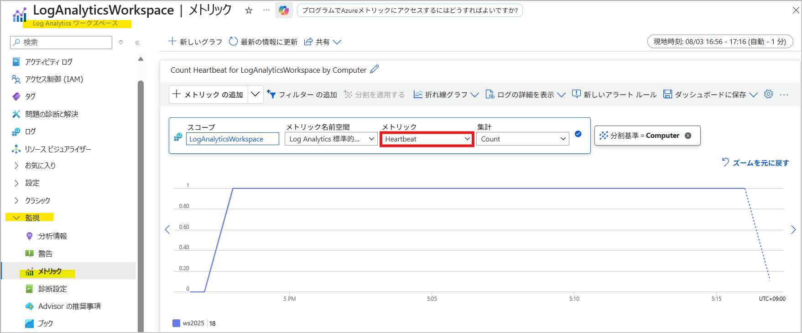
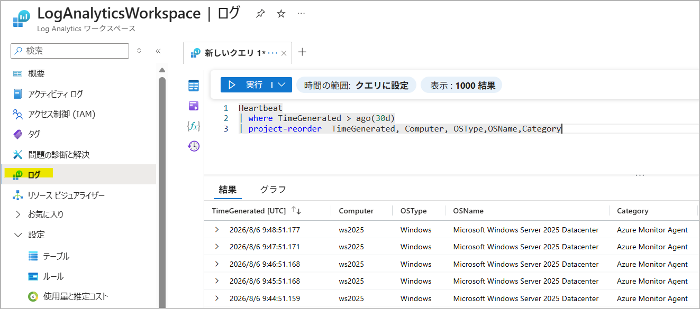
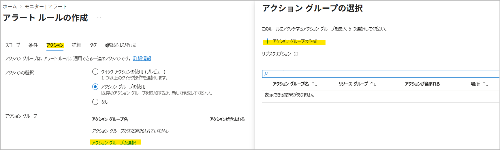
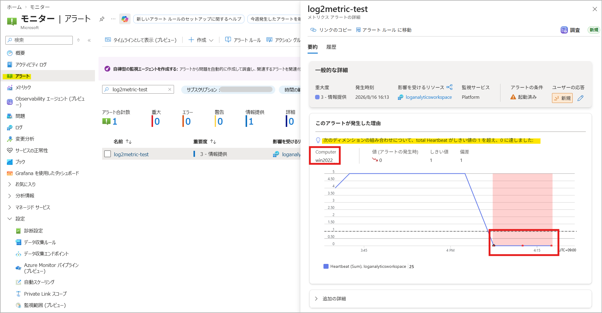
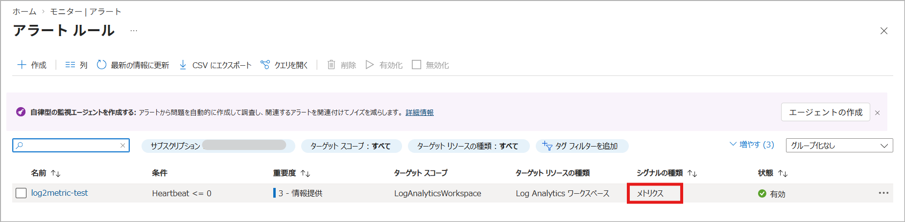
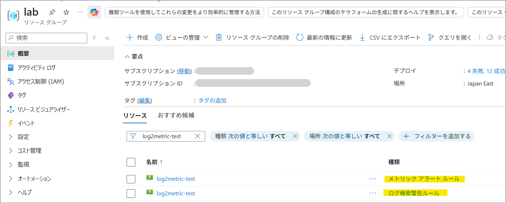
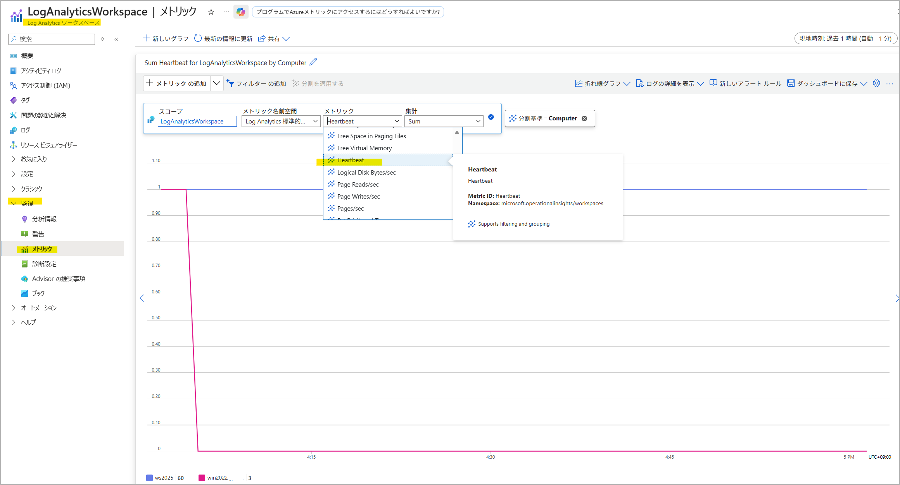

[更新履歴]
- 2026/09/06 ブログ公開

こんにちは、Azure Monitoring サポート チームの北村です。
Azure Monitor のアラート ルールの一つに「ログのメトリック アラート」というアラートが存在することをご存知でしょうか。
名前だけを見るとメトリック アラートの一種に見えますが、Azure Monitor エージェント (AMA) によって収集されたログをメトリックに変換したうえで監視する、少し特殊な仕組みを持っています。

今回は「ログのメトリック アラート」の概要と仕組み、そしてログ アラートとの違いについてご紹介いたします。

<br>

<!-- more -->
## 目次
- [1. ログのメトリック アラートとは](#1-ログのメトリック-アラートとは)
- [2. ログのメトリック アラートの仕組み](#2-ログのメトリック-アラートの仕組み)
- [3. ログのメトリック アラートの利点](#3-ログのメトリック-アラートの利点)
- [4. ログのメトリック アラートの作成方法](#4-ログのメトリック-アラートの作成方法)
- [5. ログのメトリック アラートに関するよくあるご質問](#5-ログのメトリック-アラートに関するよくあるご質問)
  - [Q. Heartbeat メトリックを監視するアラートを作成したところ、メトリック アラートとログ アラート ルールが同時に作成されました。ログ アラート ルールは削除してもいいですか。](#Q-Heartbeat-メトリックを監視するアラートを作成したところ、メトリック-アラートとログ-アラート-ルールが同時に作成されました。ログ-アラート-ルールは削除してもいいですか。)
  - [Q. メトリックに変換する scheduledQueryRules がアラート ルールの一覧に表示されません。](#Q-メトリックに変換する-scheduledQueryRules-がアラート-ルールの一覧に表示されません。)
  - [Q. Azure ポータル上でメトリックに変換する scheduledQueryRules を表示したところ、Cannot read properties of undefined (reading ‘toLowerCase’) と表示されます。](#Q-Azure-ポータル上でメトリックに変換する-scheduledQueryRules-を表示したところ、Cannot-read-properties-of-undefined-reading-‘toLowerCase’-と表示されます。)
  - [Q. Heartbeat メトリックが生成されていることを確認する方法はありますか。](#Q-Heartbeat-メトリックが生成されていることを確認する方法はありますか。)

<br>


## 1. ログのメトリック アラートとは
**[ログのメトリック アラート](https://learn.microsoft.com/ja-jp/azure/azure-monitor/alerts/alerts-metric-logs)** は、[Azure Monitor エージェント (AMA)](https://learn.microsoft.com/ja-jp/azure/azure-monitor/agents/azure-monitor-agent-overview) によって Log Analytics のエンドポイントに送信された Heartbeat や Perf などのログをメトリックに変換し、変換後の**メトリック**を監視するアラート ルールです。

これに対して、**[ログ アラート ルール](https://learn.microsoft.com/ja-jp/azure/azure-monitor/alerts/alerts-create-log-alert-rule)** は、Log Analytics ワークスペースに収集された**ログ**そのものを KQL クエリで監視するアラート ルールです。

両者は、元となるデータが Log Analytics のエンドポイントに送信されたログである点は共通していますが、実際の監視対象（ログ アラート ルールはログそのもの、ログのメトリック アラートは変換後のメトリック）が異なります。

ログのメトリック アラートは、対応するログをメトリックに変換して監視するため、準リアルタイム性やディメンションによる絞り込みを重視する場合に適しています（[3. ログのメトリック アラートの利点](#3-ログのメトリック-アラートの利点) 参照）。一方、任意の KQL クエリでログを柔軟に評価したい場合は、ログ アラート ルールが適しています。

例えば、AMA によって収集された Heartbeat を対象にログのメトリック アラートを作成すると、Heartbeat ログがメトリックに変換され、Log Analytics ワークスペースの[メトリック エクスプローラー](https://learn.microsoft.com/ja-jp/azure/azure-monitor/metrics/analyze-metrics)上で以下のように表示されます。ログのメトリック アラートでは、この変換後のメトリックが監視対象となります。



なお、ログのメトリック アラートで監視可能なデータは、[公開情報](https://learn.microsoft.com/en-us/azure/azure-monitor/reference/supported-metrics/microsoft-operationalinsights-workspaces-metrics#category-legacy-log-based-metrics) の「Category: Legacy Log-based metrics」に記載されているメトリックのみです。アラートを作成する前に、監視したいログに対応するメトリック名とディメンションが一覧に含まれていることをご確認ください。

> [!NOTE]
> **Azure Monitor エージェント (AMA) では、[パフォーマンス カウンターを直接メトリックとして収集することが可能です](https://learn.microsoft.com/ja-jp/azure/azure-monitor/vm/data-collection-performance#add-destination)**。そのため、ログのメトリック アラートではなく、通常のメトリック アラート ルールでも監視することができます。なお、この方法で収集できるのはパフォーマンス カウンターのみとなり、Heartbeat は対象外となりますのでご注意ください。


<br>


## 2. ログのメトリック アラートの仕組み
ログのメトリック アラートは、以下の **2 つのリソース**によって構成されます。

| リソースの種類 | 役割 |
|---|---|
| `Microsoft.Insights/metricAlerts` | 変換されたメトリックのしきい値を監視し、アラートを発報するルール |
| `Microsoft.Insights/scheduledQueryRules` | ログをメトリックに変換する特殊なルール |

Azure ポータルからログのメトリック アラート (`metricAlerts`) を作成すると、`metricAlerts` と同じ名前で `scheduledQueryRules` がバックグラウンドで自動的に作成されます。Azure ポータル以外（ARM テンプレートや REST API など）でログのメトリック アラートを作成する場合は、手動で `scheduledQueryRules` を作成する必要がありますのでご注意ください。`scheduledQueryRules` を作成するサンプルの ARM テンプレートは、[こちら](https://learn.microsoft.com/ja-jp/azure/azure-monitor/alerts/alerts-metric-logs#resource-manager-templates)の公開情報をご覧ください。

**なお、`scheduledQueryRules` を削除すると、メトリックが生成されず、メトリック アラートで監視することができなくなりますので、`scheduledQueryRules` は削除しないようにご注意ください。**

<br>


## 3. ログのメトリック アラートの利点
ログ アラート ルールと比較したときの、ログのメトリック アラートの主な利点は以下のとおりです。

#### 準リアルタイムの監視
ログのメトリック アラートでは、ログ用のパイプラインとは別に用意されたメトリック用のパイプラインでデータが処理されます。
それぞれのデータの流れは、以下のとおりです。

**A. ログが Log Analytics ワークスペースに取り込まれるまでの流れ**
1. ゲスト OS 内の AMA にて、ログが生成される
2. ゲスト OS 内の AMA が、Log Analytics のエンドポイントに対してログを送信する
3. Log Analytics のエンドポイントが、AMA からログを受け取る
4. ログがパイプラインに転送され、処理される
5. KQL クエリでログが検索できるようになる

**B. ログがメトリックに変換されるまでの流れ**
1. ゲスト OS 内の AMA にて、ログが生成される
2. ゲスト OS 内の AMA が、Log Analytics のエンドポイントに対してログを送信する
3. Log Analytics のエンドポイントが、AMA からログを受け取る
4. ログのパイプラインとは別の、メトリック用のパイプラインにデータが転送され、処理される
5. メトリックとして検索できるようになる

1.～ 3. までは共通ですが、4. 以降で使用する処理パイプラインが分かれます。
ログが KQL で検索可能になるまでの経路（A）よりも、メトリックとして参照可能になるまでの経路（B）の方が所要時間が短いため、ログのメトリック アラートでは、ログ アラート ルールよりもリアルタイムに近い監視が可能です。


<br>

#### ディメンションによるフィルタリング
ログのメトリック アラートでは、ディメンションでコンピューター名や OS の種類などをフィルタリングでき、複雑な KQL クエリを定義せずに特定のマシンや条件に絞った監視を構成できます。

※ 以下は Heartbeat メトリックを指定したときのディメンションです。


<br>


## 4. ログのメトリック アラートの作成方法
それでは、Heartbeat メトリックを監視するログのメトリック アラートを作成してみましょう。
本項では、5 分おきに評価を行い、直近 5 分間に記録された Heartbeat メトリックの合計値が 1 を下回った場合に発報する構成を例に、ログのメトリック アラートの設定手順を紹介します。

**1. Log Analytics ワークスペースに Heartbeat ログが収集されていることを確認する**
前提として、[AMA で Log Analytics ワークスペースに Heartbeat や Perf を収集](https://learn.microsoft.com/ja-jp/azure/azure-monitor/vm/data-collection?tabs=default)していなければ、ログのメトリック アラートで監視することはできません。今回は、Heartbeat メトリックを監視するアラートを作成したいので、Log Analytics ワークスペース上で Heartbeat が収集されているかどうかを確認します。

```
// サンプル クエリ
Heartbeat
| where TimeGenerated > ago(1d)
```



<br>

**2. スコープで Log Analytics ワークスペースを指定し、アラートの条件を指定する**
Azure ポータル > [モニター (監視)] > [アラート] を開き、画面上部の [+ 作成] > [アラート ルール] を選択します。
スコープを選択する画面が表示されますので、「監視対象のマシンの Heartbeat ログが収集されている Log Analytics ワークスペース」を選択します。


次の画面では、アラートの発報条件を指定します。
シグナル名では [Heartbeat] を選択し、メトリック アラートの評価に関わる項目を設定します。

- 確認する間隔 : 評価を行う頻度
- ルックバック期間 : 1 回の評価を行う際に評価の対象となる期間
- 集計の種類 : [ルックバック期間] で指定した期間のメトリックを集計する方法


今回は、以下のとおり設定します。
マシンごとに監視するため、ディメンションでは [Computer] を指定します。

- シグナル名 : Heartbeat
- しきい値の種類 : Static
- 集計の種類 : 合計
- 値は : 次の値より小さい
- 単位 : カウント
- しきい値 : 1
- ディメンション名 : Computer
- 確認する間隔 : 5 分
- ルックバック期間 : 5 分

> [!NOTE]
> メトリック アラートの設定項目につきましては、サポート ブログの [Azure Monitor のアラートに関するよくあるご質問](https://jpazmon-integ.github.io/blog/AzureMonitorEssential/MonitorAlertFAQ/#Q-%E3%83%A1%E3%83%88%E3%83%AA%E3%83%83%E3%82%AF-%E3%82%A2%E3%83%A9%E3%83%BC%E3%83%88-%E3%83%AB%E3%83%BC%E3%83%AB%E3%81%AE%E8%A8%AD%E5%AE%9A%E9%A0%85%E7%9B%AE%E3%82%92%E6%95%99%E3%81%88%E3%81%A6%E3%81%8F%E3%81%A0%E3%81%95%E3%81%84%E3%80%82) や[公開情報](https://learn.microsoft.com/ja-jp/azure/azure-monitor/alerts/alerts-create-metric-alert-rule)をご覧ください。

<br>

**3. アラートで通知する方法を指定する**
Azure Monitor のアラート機能では、[アクション グループ](https://learn.microsoft.com/ja-jp/azure/azure-monitor/alerts/action-groups) というリソースでアラートを通知する方法を定義します。[アクション グループの選択] をクリックすると、既存のアクション グループの一覧が表示されます。新規で作成する場合は、画面右側に表示される [+ アクション グループの作成] を選択します。


例えば、アラートをメールで通知する場合には、[通知のタイプ] で "電子メール/SMS メッセージ/プッシュ/音声" を選択し、通知するメール アドレスを指定します。


また、[アクション] では、アクション グループがトリガーされた際に実行するアクションを選択できます (今回は設定しません)。


> [!NOTE]
> アクション グループの概要や設定手順につきましては、[公開情報](https://learn.microsoft.com/ja-jp/azure/azure-monitor/alerts/action-groups#create-an-action-group-in-the-azure-portal)をご覧ください。

<br>

**4. アラート ルールの名前、アラートの重大度等を設定する**
[アラート ルールの詳細] では、重大度、アラート ルール名、アラート ルールの説明を設定します。
[詳細設定オプション] では、アラート ルールの有効化や自動解決を設定します。

[アラートを自動的に解決する] にチェックを入れると、[ステートフルなアラート](https://learn.microsoft.com/ja-jp/azure/azure-monitor/alerts/alerts-overview#stateful-alerts) として動作します。条件を満たすと発報し、条件が解消されるまでは同じ時系列に対して新たなアラートは発報されません。メトリック アラートでは、条件を満たさない評価が 3 回連続すると解決済みに移行し、解決通知が行われます。

[アラートを自動的に解決する] でチェックしない場合は、[ステートレスなアラート](https://learn.microsoft.com/ja-jp/azure/azure-monitor/alerts/alerts-overview#stateless-alerts)となり、しきい値を満たす度に発報します。この場合、アラートが解決したとみなされることはないため、解決した旨の通知も行われません。

お客様のご要件に合わせてご設定ください。


<br>

手順は以上です。

アラートの履歴は、Azure ポータル > [モニター (監視)] > [アラート] からご確認いただけます。
以下の例では、アラートの評価時点から過去 5 分間の Heartbeat メトリックの合計値が 1 を下回ったため、アラートが発報していることが分かります。



<br>


## 5. ログのメトリック アラートに関するよくあるご質問
最後に、ログのメトリック アラートでよくお問い合わせいただく質問をご紹介いたします。

<br>


#### Q. Heartbeat メトリックを監視するアラートを作成したところ、メトリック アラートとログ アラート ルールが同時に作成されました。ログ アラート ルールは削除してもいいですか。
いいえ、ログをメトリックに変換する `scheduledQueryRules` は削除しないでください。
作成されたメトリック アラートは、AMA によって収集されたログをメトリックに変換し、メトリックを評価する「ログのメトリック アラート」です。Azure ポータルからログのメトリック アラートを作成した場合、ログをメトリックに変換するための `scheduledQueryRules` が自動で作成されますが、削除するとメトリックが生成されなくなるため、監視できません。
<br>

#### Q. メトリックに変換する scheduledQueryRules がアラート ルールの一覧に表示されません。
Azure Monitor の通常のアラート ルールは、Azure ポータル > [モニター (監視)] > [アラート] > [アラート ルール] に表示されますが、ログをメトリックに変換する `scheduledQueryRules` は表示されません。

※ シグナルの種類が「メトリクス」の `metricAlerts` のみが表示されます。



メトリックに変換する `scheduledQueryRules` は、対象のリソース グループの [概要] ペインで確認できます。
Azure ポータルからログのメトリック アラートを作成した場合は、`metricAlerts` と同じ名前の `scheduledQueryRules` が作成されますので、リソース名で絞り込むと、次の 2 種類のリソースが表示されます。

- [種類] が「メトリック アラート ルール」: `metricAlerts`
- [種類] が「ログ検索警告ルール」: `scheduledQueryRules`



<br>

#### Q. Azure ポータル上でメトリックに変換する scheduledQueryRules を表示したところ、Cannot read properties of undefined (reading 'toLowerCase') と表示されます。
`scheduledQueryRules` は、ログをメトリックに変換する専用のルールです。
通常のログ アラート ルールの定義を持たないため、Azure ポータル上で開くと以下のエラーが表示されますが、アラートの動作不良を示すものではございません。


<br>

#### Q. Heartbeat メトリックが生成されていることを確認する方法はありますか。
Heartbeat ログを収集している Log Analytics ワークスペース > [監視] > [メトリック] から確認可能です。
Heartbeat ログが収集され、メトリックに変換されている場合は、0 より大きい値が記録されます。


<br>

本記事では、ログのメトリック アラートの仕組み、ログ アラート ルールとの違い、作成方法、よくあるご質問をご紹介しました。
上記内容以外でご不明な点や疑問点などございましたら、弊社サポートまでお問い合わせください。
最後までお読みいただきありがとうございました！