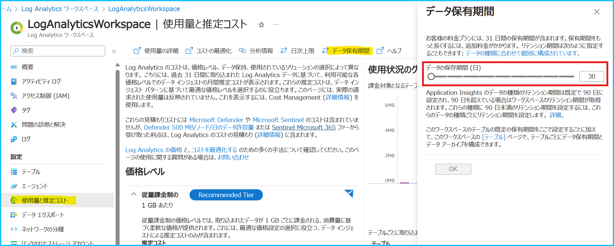
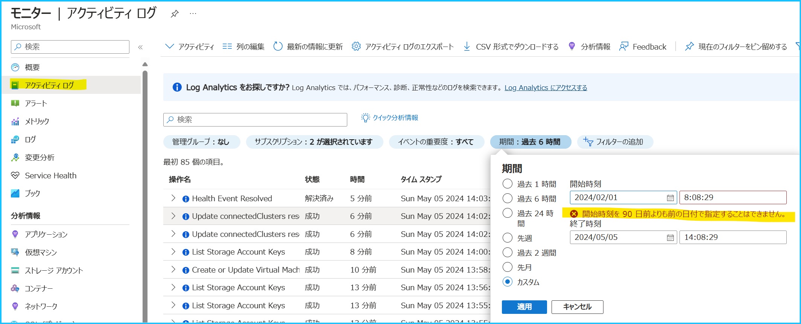
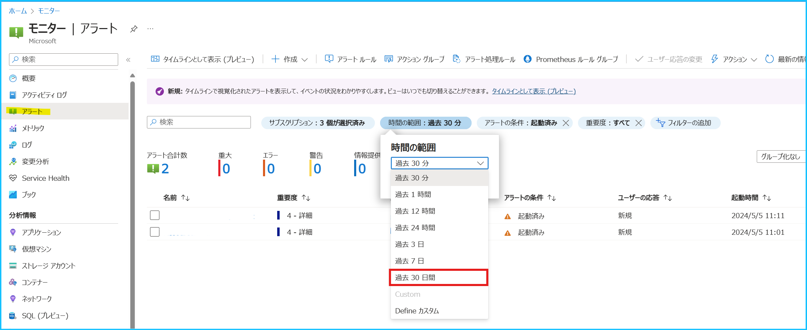
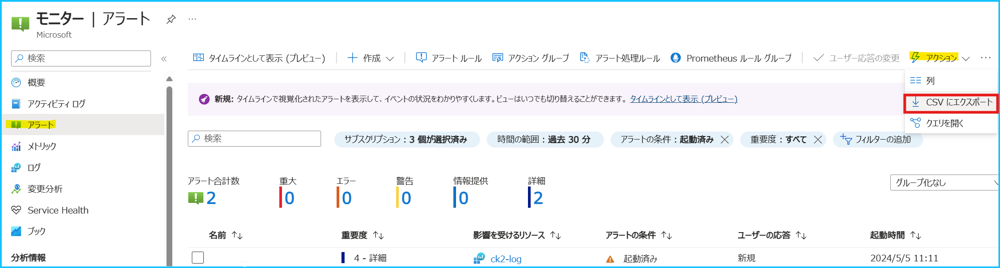
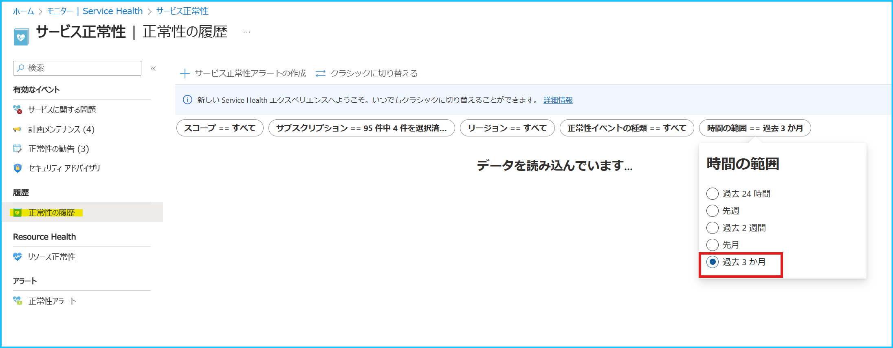
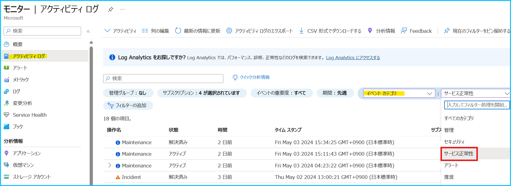
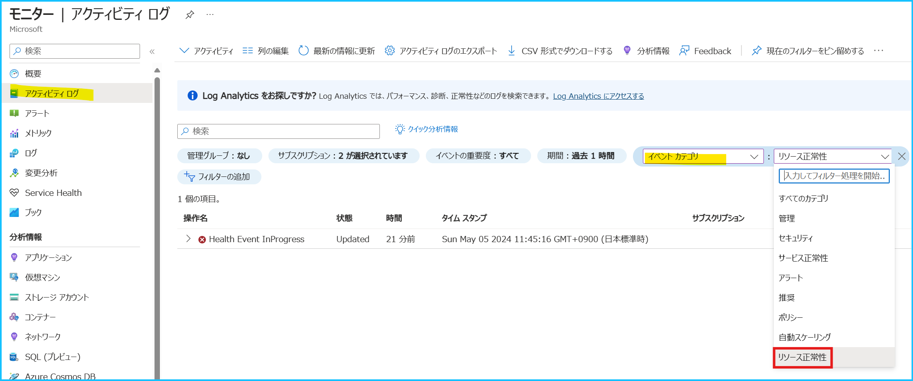

こんにちは、Azure Monitoring チームの北村です。
今回は、Azure Monitor に関するデータの保持期間を紹介します。
今回ご紹介する内容は、それぞれの公開情報に掲載されておりますが、一つのページに集約されておりません。
よくお問い合わせいただく内容ですので、本記事では情報を集約化してお伝えします。

<!-- more -->
## 目次
- [1. Azure Monitor のログとメトリック、アクティビティ ログ](#1-Azure-Monitor-のログとメトリック、アクティビティ-ログ)
  - [1-1. メトリック](#1-1-メトリック)
  - [1-2. ログ](#1-2-ログ)
  - [1-3. アクティビティ ログ](#1-3-アクティビティ-ログ)
- [2. Azure Monitor のアラートの履歴](#2-Azure-Monitor-のアラートの履歴)
  - [2-1. 各種アラートの履歴](#2-1-各種アラートの履歴)
  - [2-2. サービス正常性](#2-2-サービス正常性)
  - [2-3. リソース正常性](#2-3-リソース正常性)

 

## 1. Azure Monitor のログとメトリック、アクティビティ ログ

| データの種類 |                                 | 保持期間                                 |
| ------------ | ------------------------------- | ---------------------------------------- |
| メトリック   | プラットフォーム メトリック    | 93 日間                                  |
|              | クラシック ゲスト OS メトリック | 14 日間                                  |
|              | ゲスト OS メトリック            | 93 日間                                  |
| ログ         |                                 | Log Analytics ワークスペースの保持設定に依存 |
| アクティビティ ログ        |                                 | 90 日間 |

 

### 1-1. メトリック
[Azure Monitor のメトリック](https://learn.microsoft.com/ja-jp/azure/azure-monitor/essentials/data-platform-metrics)とは、監視対象のリソースから一定の間隔で収集される数値データです。

 

##### プラットフォーム メトリック
[プラットフォーム メトリック](https://learn.microsoft.com/ja-jp/azure/azure-monitor/essentials/data-platform-metrics#platform-and-custom-metrics)は、Azure リソースを作成すると自動的に収集されます。
このメトリックの保持期間は ***93 日間***であり、保持期間を延長することはできません。
プラットフォーム メトリックのデータを 93 日以上保持したい場合は、[Azure Monitor の診断設定](https://learn.microsoft.com/ja-jp/azure/azure-monitor/essentials/diagnostic-settings?tabs=portal)で対象リソースの[メトリック](https://learn.microsoft.com/ja-jp/azure/azure-monitor/reference/supported-metrics/metrics-index)を、 Log Analytics ワークスペースやストレージ アカウント等に送信することをご検討ください。
※ 以下は Azure VM のプラットフォーム メトリック (ホスト OS メトリック) を表示した例です。

 

##### クラシック ゲスト OS メトリック
[クラシック ゲスト OS メトリック](https://learn.microsoft.com/ja-jp/azure/azure-monitor/essentials/data-platform-metrics#retention-of-metrics) は、Azure VM に [Azure Diagnostics 拡張機能](https://learn.microsoft.com/ja-jp/azure/azure-monitor/agents/diagnostics-extension-overview)をインストールすることで収集されます。
このメトリックは、メトリック エクスプローラーで少なくとも ***14 日間*** 表示することが可能です。

 

##### ゲスト OS メトリック
[ゲスト OS メトリック](https://learn.microsoft.com/ja-jp/azure/azure-monitor/essentials/data-platform-metrics#retention-of-metrics) は、[Azure Monitor エージェント](https://learn.microsoft.com/ja-jp/azure/azure-monitor/agents/agents-overview) や [Azure Diagnostics 拡張機能](https://learn.microsoft.com/ja-jp/azure/azure-monitor/agents/diagnostics-extension-overview) の [データ シンク](https://learn.microsoft.com/ja-jp/azure/azure-monitor/agents/diagnostics-extension-windows-install#overview) 機能で収集できます。
このメトリックの保持期間は ***93 日間***であり、保持期間を延長することはできません。
※ 以下は Linux の Azure VM に Azure Monitor エージェントをインストールし、ゲスト OS メトリックを表示した例です。

 

### 1-2. ログ
Azure Monitor のログとは、監視対象のリソースのシステム内で発生したイベントのデータです。
対象のリソースや種類により、様々なデータ型や値となり、Log Analytics ワークスペースに収集されます。
ログの保持期間は、***Log Analytics ワークスペースの保持設定***に依存します。この保持期間は、テーブル単位でも設定することができます。Log Analytics ワークスペースの保持期間や各テーブルの保持期間を確認する方法は、[こちら](https://learn.microsoft.com/ja-jp/azure/azure-monitor/logs/data-retention-archive?tabs=portal-3%2Cportal-1%2Cportal-2)の公開情報をご覧ください。
※ 以下は Log Analytics ワークスペースの保持期間を表示した例です。

 

### 1-3. アクティビティ ログ
[アクティビティ ログ](https://learn.microsoft.com/ja-jp/azure/azure-monitor/essentials/activity-log-insights#retention-period)は、サブスクリプション レベルのイベントが記録されます。
例えば、リソースが作成された、変更された、削除された、VM が起動された、といった情報です。
アクティビティ ログの保持期間は ***90 日間***であり、保持期間を延長することはできません。
アクティビティ ログのデータを 90 日以上保持したい場合は、[Azure Monitor の診断設定](https://learn.microsoft.com/ja-jp/azure/azure-monitor/essentials/diagnostic-settings?tabs=portal#activity-log-settings)で [Log Analytics ワークスペースやストレージ アカウント等に送信する](https://learn.microsoft.com/ja-jp/azure/azure-monitor/essentials/activity-log?tabs=powershell)ことをご検討ください。

 

## 2. Azure Monitor のアラートの履歴

| アラートの種類 | 保持期間 |
| -------------- | -------- |
| 各種アラートの履歴 | 30 日    |
| サービス正常性 | 90 日    |
| リソース正常性 | 30 日    |

 

### 2-1. 各種アラートの履歴
[各種アラートの履歴](https://learn.microsoft.com/ja-jp/azure/azure-monitor/alerts/alerts-manage-alert-instances#access-the-alerts-page)は Azure ポータルの [モニター] > [アラート] のページで確認することができます。
アラートの履歴の保持期間は ***30 日間*** であり、保持期間を延長することはできません。

アラートの履歴を 30 日以上保持したい場合は、Azure ポータルから CSV 形式でデータをダウンロードいただくことや、
[アラート履歴を取得する Azure Resource Graph クエリ](https://learn.microsoft.com/ja-jp/azure/azure-monitor/resource-graph-samples?tabs=azure-cli#view-recent-azure-monitor-alerts)を定期的に実行いただき、外部のシステム等にエクスポートするような仕組みをご構築いただくことをご検討いただけますと幸いです。

 

### 2-2. サービス正常性
サービス正常性は Azure ポータルの [モニター] > [Service Health] のページで確認することができます。
サービス正常性の保持期間は ***90 日間*** であり、保持期間を延長することはできません。

サービス正常性のデータを 90 日以上保持したい場合は、[サービス正常性カテゴリのアクティビティ ログ](https://learn.microsoft.com/ja-jp/azure/azure-monitor/essentials/activity-log-schema#service-health-category)を、[Azure Monitor の診断設定](https://learn.microsoft.com/ja-jp/azure/azure-monitor/essentials/diagnostic-settings?tabs=portal#activity-log-settings)で [Log Analytics ワークスペースやストレージ アカウント等に送信する](https://learn.microsoft.com/ja-jp/azure/azure-monitor/essentials/activity-log?tabs=powershell)ことをご検討ください。サービス正常性は、Azure サービス自体の正常性を監視する機能です。Azure サービスの障害や計画メンテナンスの情報は、"サービス正常性カテゴリ" のアクティビティ ログとして記録されます。

 

### 2-3. リソース正常性
[リソース正常性](https://learn.microsoft.com/ja-jp/azure/service-health/resource-health-overview#history-information)は、各リソースの [リソース正常性] のページで確認することができます。
リソース正常性の保持期間は ***30 日間*** であり、保持期間を延長することはできません。
※ [リソース正常性はすべてのリソースでサポートしている機能ではございません](https://jpazmon-integ.github.io/blog/AzureMonitorEssential/ResourceHealthAlert/#Q2-%E3%83%AA%E3%82%BD%E3%83%BC%E3%82%B9%E6%AD%A3%E5%B8%B8%E6%80%A7%E3%82%A2%E3%83%A9%E3%83%BC%E3%83%88%E3%81%AF%E3%80%81%E3%81%99%E3%81%B9%E3%81%A6%E3%81%AE%E3%83%AA%E3%82%BD%E3%83%BC%E3%82%B9%E3%81%A7%E8%A8%AD%E5%AE%9A%E3%81%A7%E3%81%8D%E3%81%BE%E3%81%99%E3%81%8B%E3%80%82)ので、ご留意ください。

リソース正常性のデータを 30 日以上保持したい場合は、[リソース正常性カテゴリのアクティビティ ログ](https://learn.microsoft.com/ja-jp/azure/azure-monitor/essentials/activity-log-schema#resource-health-category)を、[Azure Monitor の診断設定](https://learn.microsoft.com/ja-jp/azure/azure-monitor/essentials/diagnostic-settings?tabs=portal#activity-log-settings)で [Log Analytics ワークスペースやストレージ アカウント等に送信する](https://learn.microsoft.com/ja-jp/azure/azure-monitor/essentials/activity-log?tabs=powershell)ことをご検討ください。リソース正常性はリソース単位で正常性を確認する機能であり、リソースの正常性に変化が生じた際に、その情報が "リソース正常性カテゴリ" のアクティビティ ログに記録されます。

 

上記の内容以外でご不明な点や疑問点などございましたら、弊社サポート サービスまでお問い合わせください。
最後までお読みいただきありがとうございました！