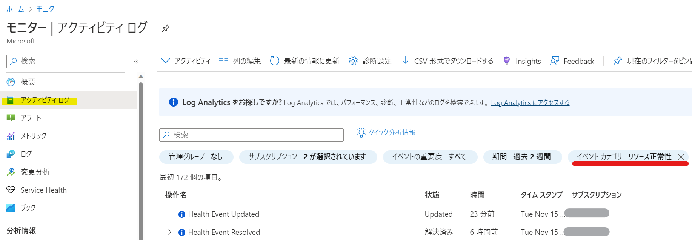
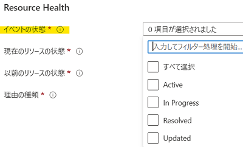
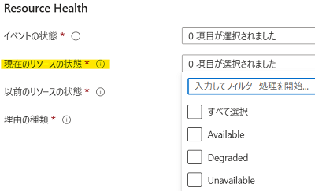
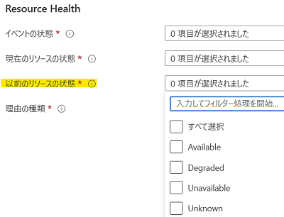
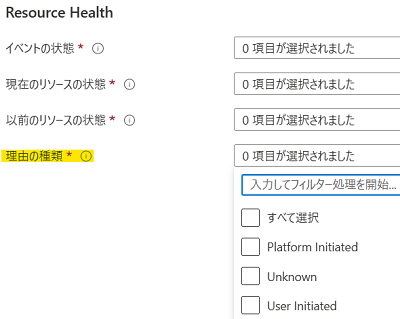
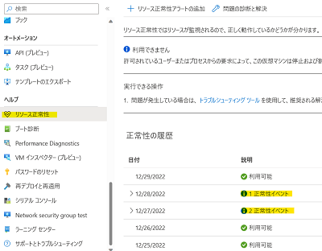

こんにちは、Azure Monitoring サポート チームの北村です。
リソース正常性アラートという機能をご存知でしょうか。
リソース正常性アラートでは、リソース単位で発生した障害を確認することができます。
今回はリソース正常性アラートでよくお問い合わせをいただくご質問を紹介いたします。

 

<!-- more -->
## Q & A タイトル
- [Q1. リソース正常性アラートの概要と仕組みを教えてください。](#Q1-リソース正常性アラートの概要と仕組みを教えてください。)
- [Q2. リソース正常性アラートは、すべてのリソースで設定できますか。](#Q2-リソース正常性アラートは、すべてのリソースで設定できますか。)
- [Q3. リソース正常性アラートの監視間隔を教えてください。](#Q3-リソース正常性アラートの監視間隔を教えてください。)
- [Q4. リソース正常性アラートとサービス正常性アラートの違いを教えてください。](#Q4-リソース正常性アラートとサービス正常性アラートの違いを教えてください。)
- [Q5. リソース正常性アラートの条件 “イベントの状態” について教えてください。](#Q5-リソース正常性アラートの条件-“イベントの状態”-について教えてください。)
- [Q6. リソース正常性アラートの条件 “現在のリソースの状態” および “以前のリソースの状態” について教えてください。](#Q6-リソース正常性アラートの条件-“現在のリソースの状態”-および-“以前のリソースの状態”-について教えてください。)
- [Q7. リソース正常性アラートの条件 “理由の種類” について教えてください。](#Q7-リソース正常性アラートの条件-“理由の種類”-について教えてください。)
- [Q8. リソース正常性アラートでテスト発報することは可能ですか。](#Q8-リソース正常性アラートでテスト発報することは可能ですか。)
- [Q9. リソース正常性アラートの利用料金を教えてください。](#Q9-リソース正常性アラートの利用料金を教えてください。)
- [Q10. リソース正常性アラートの重要度が [4 - 詳細] と表示されます。リソース正常性アラートの重要度を変更することはできますか。](#Q10-リソース正常性アラートの重要度が-4-詳細-と表示されます。リソース正常性アラートの重要度を変更することはできますか。)

 

### Q1. リソース正常性アラートの概要と仕組みを教えてください。
リソース正常性アラートは、リソースの正常性に変化が生じた際に、アラートを通知する機能でございます。
アクティビティ ログに正常性に関するイベントが書き込まれ、アラートで指定した条件に合致した場合に発報します。
リソース正常性に関するログは、Azure portal の [モニター] - [アクティビティ ログ] からご確認いただけます。

 

### Q2. リソース正常性アラートは、すべてのリソースで設定できますか。
いいえ、すべてのリソースで設定することはできません。
[弊社公開情報](https://learn.microsoft.com/ja-jp/azure/service-health/resource-health-checks-resource-types) にリソース正常性アラートで設定可能なリソースと、チェックされる内容を掲載しております。
上記公開情報に記載のないリソースは、リソース正常性アラートを設定することはできません。

 

### Q3. リソース正常性アラートの監視間隔を教えてください。
リソース正常性アラートでは、リソースの状態が遷移し、指定した条件を満たしたアクティビティ ログが出力されるとアラートが通知されます。
Azure 内部の話となりますので具体的な情報については回答できませんが、定期的にアラートの条件を満たしたアクティビティ ログが出力されているかどうかをチェックしています。
アクティビティ ログにリソース正常性に関するイベントが書き込まれ、アラートが通知されるまでに 20 分～ 30 分程度かかる場合がございます。
[弊社公開情報](https://learn.microsoft.com/ja-jp/azure/service-health/resource-health-alert-monitor-guide) にもリソース正常性アラートに関する説明を記載しておりますので、ご覧くださいませ。

 

### Q4. リソース正常性アラートとサービス正常性アラートの違いを教えてください。
サービス正常性アラートとリソース正常性アラートの違いは、監視対象のスコープです。
リソース正常性アラートは 「リソース単位」 で正常性を確認しますが、サービス正常性アラートは 「Azure サービスやリージョン」 単位で正常性を監視します。サービス正常性アラートの内容や設定手順は [弊社サポート ブログ](https://jpazmon-integ.github.io/blog/ame/HowToSetUpServiceHealthAlertsAndRecommendedSettings/) でも紹介しておりますので、ぜひご覧ください。

 

### Q5. リソース正常性アラートの条件 "イベントの状態" について教えてください。
対象リソースのイベント状態を表します。
イベントの状態が Active である場合、リソースの正常性が異常な状態であることを表します。
一方で Resolved に変化した場合、異常な状態から正常な状態に遷移したことを表します。
In Progress は、以前のリソースの状態から現在のリソースの状態への変化が行われている途中で、
Updated は変化が完了したことを示します。
In Progress も Updated も、どちらも正常性の状態としては異常であるとご認識いただけますと幸いです。

 

### Q6. リソース正常性アラートの条件 "現在のリソースの状態" および "以前のリソースの状態" について教えてください。
対象リソースの状態を表します。
Unavailable と Degraded はリソースが利用可能でないことを意味し、Available はリソースが利用可能であることを意味します。
Unknown は、リソース正常性がリソースに関する情報を 10 分以上受け取っていないことを意味します。

例えば、以下のような設定の場合、
リソースの状態が 「Available」 の状態から 「Degraded または Unavailable」 に遷移したタイミングでアラートがトリガーされます。

■ 以前のリソースの状態 : Available
■ 現在のリソースの状態 : Degraded, Unavailable

「障害発生時にアラート メールを通知」する際は、
リソースの状態が "利用可能" (Available) から、"利用可能以外の状態" (Unavailable , Degraded) であるイベント (状態の変化) を検知する必要がございます。

「障害復旧時にアラート メールを通知」する際は、
リソースの状態が "利用可能以外の状態" (Unavailable , Degraded , Unknown) から、"利用可能" (Available) であるイベント (状態の変化) を検知する必要がございます。

* 現在のリソースの状態

 

* 以前のリソースの状態

 

### Q7. リソース正常性アラートの条件 "理由の種類" について教えてください。
リソースの状態が変化した理由を表します。
User Initiated はユーザー起因、Platform Initiated はプラットフォーム起因であることを意味します。
Unknown は、一時的に状態を確認できない場合等に出力されます。

 

### Q8. リソース正常性アラートでテスト発報することは可能ですか。
リソース正常性アラートでは、テスト アラートという仕組みはございません。
リソース正常性アラートでは、リソース正常性履歴の「正常性イベント」と表示されている項目が通知されます。
そのため、リソース正常性の「正常性イベント」の項目が、
リソース正常性アラートで設定したアラートの条件で通知されるかどうかをチェックいただくことで、アラートの動作をご確認いただけます。

なお、リソース正常性アラートの設定次第ではございますが、
例えば VM を再起動させた場合に、意図的にリソース正常性アラートを発報することは可能でございます。
ただし、Azure リソースによっては意図的にリソース正常性アラートの発報ができない可能性もございます。
各リソースでチェックされる正常性イベントは [弊社公開情報](https://learn.microsoft.com/ja-jp/azure/service-health/resource-health-checks-resource-types) に記載がございますので、ご確認いただけますと幸いです。

 

### Q9. リソース正常性アラートの利用料金を教えてください。
リソース正常性アラートは、アクティビティ ログ アラートに含まれます。
そのため、リソース正常性アラートの設定にかかる課金は発生いたしません。
一方で、リソース正常性アラートを設定し、アクション グループを利用してメール等へ通知する場合は、通知にかかる課金が発生いたします。通知にかかる課金の詳細につきましては、[弊社公開情報](https://azure.microsoft.com/ja-jp/pricing/details/monitor/) の [通知] の項目をご覧ください。

 

### Q10. リソース正常性アラートの重要度が [4 - 詳細] と表示されます。リソース正常性アラートの重要度を変更することはできますか。
いいえ、リソース正常性アラートの重要度を変更することはできません。

 

上記の内容以外でご不明な点や疑問点などございましたら、弊社サポート サービスまでお問い合わせください。
また、弊社公開情報の [Resource Health の概要](https://learn.microsoft.com/ja-jp/azure/service-health/resource-health-overview) や [Azure Resource Health の FAQ](https://learn.microsoft.com/ja-JP/azure/service-health/resource-health-faq) もあわせてご確認いただけますと幸いです。

最後までお読みいただきありがとうございました！
