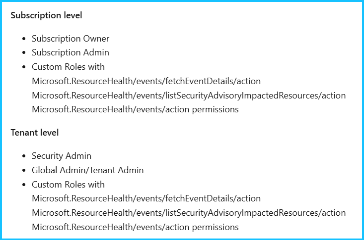
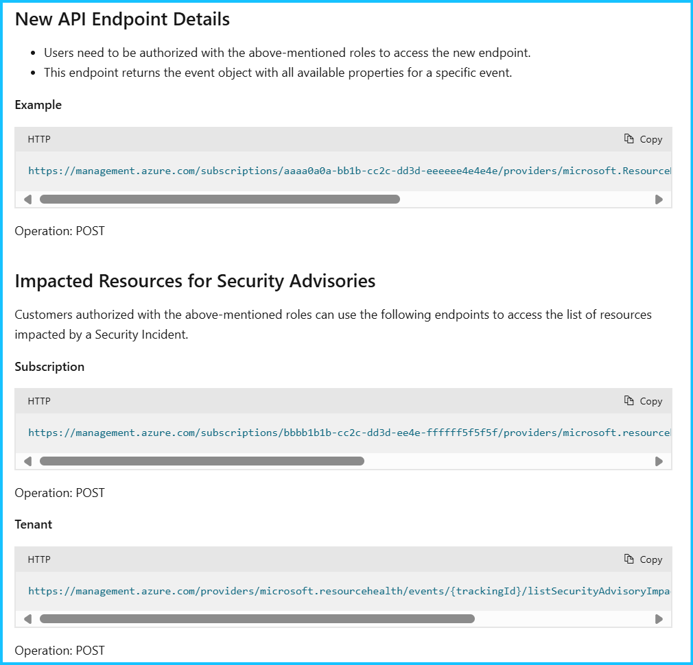

こんにちは、Azure Monitoring サポート チームの北村です。
今回は、サービス正常性にて通知された「Action required: Ensure the right people can access security advisories in Azure Service Health」についてご案内します。

 

<!-- more -->
## 目次
- [1. 報告された正常性の勧告について](#1.-報告された正常性の勧告について)
  - [1-1.概要](#1-1-概要)
  - [1-2.内容](#1-2-内容)
  - [1-3.実施いただきたいアクション](#1-3-実施いただきたいアクション)
- [2. Azure Service Health (サービス正常性) の「セキュリティ アドバイザリ」に関する仕様変更について](#2-Azure-Service-Health-サービス正常性-の「セキュリティ-アドバイザリ」に関する仕様変更について)
  - [2-1. 「セキュリティ アドバイザリ」 のイベントを閲覧・取得するための権限について](#2-1-「セキュリティ-アドバイザリ」-のイベントを閲覧・取得するための権限について)
  - [2-2. 「セキュリティ アドバイザリ」 のイベントを取得する REST API について](#2-2-「セキュリティ-アドバイザリ」-のイベントを取得する-REST-API-について)
- [3. Azure Service Health (サービス正常性) の「セキュリティ アドバイザリ」に関する仕様変更に伴う必要なアクション](#3-Azure-Service-Health-サービス正常性-の「セキュリティ-アドバイザリ」に関する仕様変更に伴う必要なアクション)
  - [3-1. Azure ポータル、または Azure Resource Graph でサービス正常性を閲覧している場合](#3-1-Azure-ポータル、または-Azure-Resource-Graph-でサービス正常性を閲覧している場合)
  - [3-2. REST API でサービス正常性のイベントを取得している場合](#3-2-REST-API-でサービス正常性のイベントを取得している場合)
- [4. よくあるご質問](#4-よくあるご質問)

 

## 1. 報告された正常性の勧告について
### 1-1. 概要

<table>
  <tr>
    <th style="width: 150px;">項目名</th>
    <th>項目値</th>
  </tr>
  <tr>
    <td>題名</td>
    <td>Action required: Ensure the right people can access security advisories in Azure Service Health</td>
  </tr>
  <tr>
    <td>追跡 ID</td>
    <td>T_Z2-LX8</td>
  </tr>
  <tr>
    <td>影響を受けるリージョン</td>
    <td>Southeast Asia, East US, West US 2, Sweden Central, South Africa West, West US 3, Canada Central, UK South, South India, North Central US, New Zealand North, West India, Australia Central 2, France South, Switzerland North, Jio India West, Italy North, Central US, Japan West, Australia Southeast, Mexico Central, Qatar Central, Switzerland West, Central India, East US 2 EUAP, Taiwan North, East Asia, UAE Central, Canada East, West US, France Central, Norway West, Germany West Central, South Africa North, West Europe, East US 2, Israel Central, Australia Central, Central US EUAP, Brazil Southeast, Japan East, Korea South, Germany North, Brazil South, UK West, Sweden South, West Central US, South Central US, Jio India Central, North Europe, Australia East, UAE North, Spain Central, Norway East, Korea Central, Poland Central</td>
  </tr>
  <tr>
    <td>正常性イベントの種類</td>
    <td>正常性の勧告</td>
  </tr>
</table>

 

### 1-2. 内容
You’re receiving this notice because you use Azure Service Health. 
To ensure sensitive security advisories are only received by people with elevated permissions, we’re making [changes to role-based access control](https://learn.microsoft.com/ja-jp/azure/service-health/security-advisories-elevated-access?branch=pr-en-us-255499) (RBAC) in Azure Service Health beginning 22 April 2025. To make the changes, we’ll:

- Introduce a new version of the Resource Health API on 22 April 2025 which makes sure security advisory event details will be accessible only to privileged users.
- Enable RBAC for security advisory events in the Azure portal on 22 October 2025.
- Enable RBAC for security advisory events in Azure Resource Graph on 22 October 2025.

To avoid disruption, please ensure the right users have access by following the steps below.

 

### 1-3. 実施いただきたいアクション
If you’re accessing security advisories using the Azure portal:
- Review your [security RBAC assignments](https://learn.microsoft.com/ja-jp/azure/service-health/security-advisories-elevated-access?branch=pr-en-us-255499) before 22 October 2025 and make changes or additions as needed.

If you monitor the health of your resources or services using the Resource Health API, including viewing security advisories:
- Update to the new Resource Health API before old versions are deprecated, starting on 22 October 2025.
- Use [FetchEventDetails](https://learn.microsoft.com/ja-jp/rest/api/resourcehealth/event/fetch-details-by-subscription-id-and-tracking-id?view=rest-resourcehealth-2024-02-01&tabs=HTTP) to view sensitive security information going forward.

If you’re accessing security advisories in Azure Resource Graph:
- Review the [ServiceHealthResources properties](https://learn.microsoft.com/ja-jp/azure/service-health/resource-graph-samples?tabs=azure-cli) that will require elevated access and make changes or additions before 22 October 2025.

Visit [Microsoft Learn](https://learn.microsoft.com/ja-jp/azure/service-health/stay-informed-security) to read more about these changes and stay informed about Azure security issues.

 
 

## 2. Azure Service Health (サービス正常性) の「セキュリティ アドバイザリ」に関する仕様変更について
今回の通知は、 [Azure Service Health (サービス正常性)](https://learn.microsoft.com/ja-jp/azure/service-health/overview) の「セキュリティ アドバイザリ」に関する仕様変更を通知しております。
サービス正常性の中でセキュリティ問題に関するイベントは 「セキュリティ アドバイザリ」 に分類されます。今後 「セキュリティ アドバイザリ」 の情報に取得・閲覧に際し、下記の仕様変更が行われます。

1. 「セキュリティ アドバイザリ」 のイベントを閲覧・取得するための権限について
2. 「セキュリティ アドバイザリ」 のイベントを取得する REST API について

 

### 2-1. 「セキュリティ アドバイザリ」 のイベントを閲覧・取得するための権限について

Azure ポータルの [サービス正常性] – [セキュリティ アドバイザリ] を開きますと、
[セキュリティ アドバイザリの詳細は \[概要\]、\[影響を受けるサービス\]、\[問題の更新\]、\[影響を受けるリソース\] の 4 つのタブに表示されます](https://learn.microsoft.com/ja-jp/azure/service-health/security-advisories-elevated-access?branch=pr-en-us-255499#what-are-security-advisories)。今回の仕様変更に伴い、これらのタブを表示するために必要な権限が変更されます。

- **変更前（現状） :**
[影響を受けるリソース] 以外のタブは、サブスクリプションの閲覧者ロール以上の権限、もしくはテナント管理者のアクセス権が付与されていればアクセス可能です。機密性の高い [影響を受けるリソース] を確認する場合のみ、下記の [Role Based Access (RBAC) For Security Incident](https://learn.microsoft.com/en-us/azure/service-health/impacted-resources-security#role-based-access-rbac-for-security-incident-resource-impact) に記載の権限 (*) が必要です。

- **変更後 :**
[影響を受けるリソース] 以外のタブを閲覧する場合も、すなわち、今後「セキュリティ アドバイザリ」のイベントを閲覧・取得するには、下記の [Role Based Access (RBAC) For Security Incident](https://learn.microsoft.com/en-us/azure/service-health/impacted-resources-security#role-based-access-rbac-for-security-incident-resource-impact) に記載の権限 (*) が必要となります。

[(*) Role Based Access (RBAC) For Security Incident](https://learn.microsoft.com/en-us/azure/service-health/impacted-resources-security#role-based-access-rbac-for-security-incident-resource-impact)

 

### 2-2. 「セキュリティ アドバイザリ」 のイベントを取得する REST API について

- **変更前 :**
現在は、[Event - Get By Subscription Id And Tracking Id](https://learn.microsoft.com/en-us/rest/api/resourcehealth/event/get-by-subscription-id-and-tracking-id?view=rest-resourcehealth-2024-02-01&tabs=HTTP) や [Event - Get By Tenant Id And Tracking Id](https://learn.microsoft.com/en-us/rest/api/resourcehealth/event/get-by-tenant-id-and-tracking-id?view=rest-resourcehealth-2024-02-01&tabs=HTTP) の REST API を利用して「セキュリティ アドバイザリ」の詳細情報を取得することができます。

- **変更後 :**
今後、上記の API では「セキュリティ アドバイザリ」の機密情報に該当するプロパティは含まれなくなります。
「セキュリティ アドバイザリ」 のイベントの詳細情報を取得するには、上記 API の代わりに[下記のAPI](https://learn.microsoft.com/en-us/azure/service-health/security-advisories-elevated-access#new-api-endpoint-details) をご利用いただく必要があり、[Role Based Access (RBAC) For Security Incident](https://learn.microsoft.com/en-us/azure/service-health/impacted-resources-security#role-based-access-rbac-for-security-incident-resource-impact) に記載の権限も必要となります。

 
 

## 3. Azure Service Health (サービス正常性) の「セキュリティ アドバイザリ」に関する仕様変更に伴う必要なアクション
上記 2 点の仕様変更に伴って必要なアクションは以下の通りです。
誠に恐れ入りますが、今回の仕様変更によりお客様環境で影響のあるユーザー様や、REST API のご利用状況、アプリケーションの確認方法については、弊社からご案内できる情報がございません。お客様ご自身でシステムの設計資料や運用方法などを確認していただき、影響を受ける可能性のあるユーザー様やアプリケーションを特定していただく必要がございますので予めご了承ください。

 

### 3-1. Azure ポータル、または Azure Resource Graph でサービス正常性を閲覧している場合
[Azure ポータル](https://learn.microsoft.com/ja-jp/azure/service-health/security-advisories-elevated-access?branch=pr-en-us-255499#what-are-security-advisories)、または [Azure Resource Graph](https://learn.microsoft.com/ja-jp/azure/service-health/resource-graph-samples?tabs=azure-cli) でサービス正常性イベントを確認している場合、2025 年 10 月 22 日までに対象のユーザー様に[必要なロール](https://learn.microsoft.com/en-us/azure/service-health/impacted-resources-security#role-based-access-rbac-for-security-incident-resource-impact)を付与してください。

 

### 3-2. REST API でサービス正常性のイベントを取得している場合
今後も　REST API で 「セキュリティ アドバイザリ」 のイベントの詳細情報を確認する場合には、 2025 年 10 月 22 日までに下記事項を実施してください。

- REST API を実行しているアプリケーションに対して[必要な権限](https://learn.microsoft.com/en-us/azure/service-health/impacted-resources-security#role-based-access-rbac-for-security-incident-resource-impact)を付与すること

- 新 API の [Event - fetch Details By Subscription Id And Tracking Id](https://learn.microsoft.com/en-us/rest/api/resourcehealth/event/fetch-details-by-subscription-id-and-tracking-id?view=rest-resourcehealth-2024-02-01&tabs=HTTP) や [Event - fetch Details By Tenant Id And Tracking Id](https://learn.microsoft.com/en-us/rest/api/resourcehealth/event/fetch-details-by-tenant-id-and-tracking-id?view=rest-resourcehealth-2024-02-01&tabs=HTTP) で「セキュリティ アドバイザリ」 の詳細情報を取得いただくこと

 
 

## 4. よくあるご質問

### Q. 今回の仕様変更に関する情報が掲載されている公開情報はありますか。
[セキュリティ アドバイザリを表示するための昇格されたアクセス権](https://learn.microsoft.com/ja-jp/azure/service-health/security-advisories-elevated-access#new-api-endpoint-details) の公開情報をご覧ください。

 

### Q. 今回の仕様変更に伴って、サービス正常性アラートに影響はありますか。
今回の仕様変更は、[サービス正常性アラート](https://jpazmon-integ.github.io/blog/ame/HowToSetUpServiceHealthAlertsAndRecommendedSettings/)の動作に影響しません。
一方で、サービス正常性アラートで通知されるメールには、セキュリティ アドバイザリに関するセンシティブな情報が含まれることもございません。このため、セキュリティ アドバイザリに関する通知メールを受信した場合に、センシティブな情報も含んで詳細を確認したい場合は、Azure ポータルのサービス正常性の画面にて直接ご確認いただきますようお願いいたします。

 

### Q. Azure ポータルから REST API の利用状況を確認することはできますか。
いいえ、Azure ポータルから REST API の利用状況を確認することはできません。
お手数ではございますが、お客様ご自身でシステムの設計資料や運用方法などをご確認いただき、REST API のご利用状況をご確認くださいますようお願い申し上げます。

 

### Q. Azure ポータルからセキュリティ アドバイザリの詳細画面を見るための権限が変更されるのは 2025/4/22 と 2025/10/22 のどちらですか。
権限が変更されるのは「2025/10/22」です。これまでに必要な権限を付与いただきますようお願いいたします。

 

### Q. 現時点でユーザーに必要なロールが割り当てられているかを確認する方法を教えてください。
[Azure portal を使用して Azure でのロールの割り当てを一覧表示する](https://learn.microsoft.com/ja-jp/azure/role-based-access-control/role-assignments-list-portal) の公開情報をご覧いただき、該当の湯ユーザー様に割り当てられているロールをご確認ください。

 

