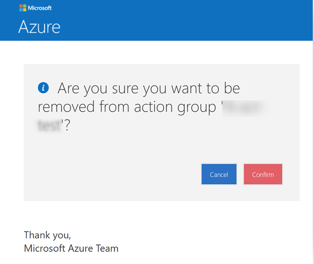
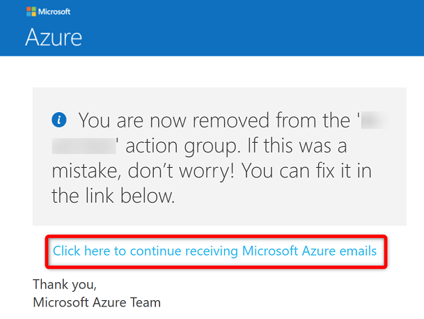
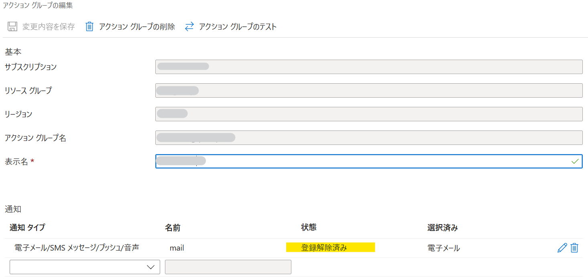
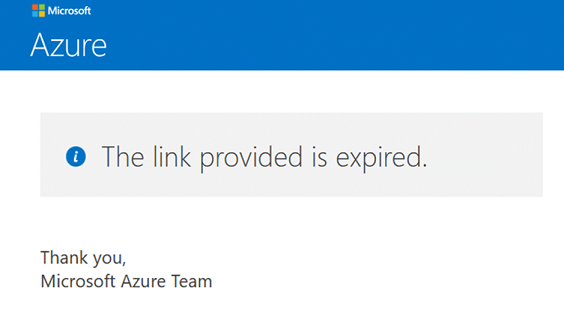
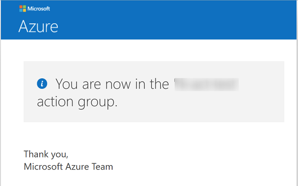
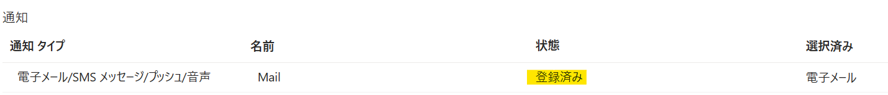
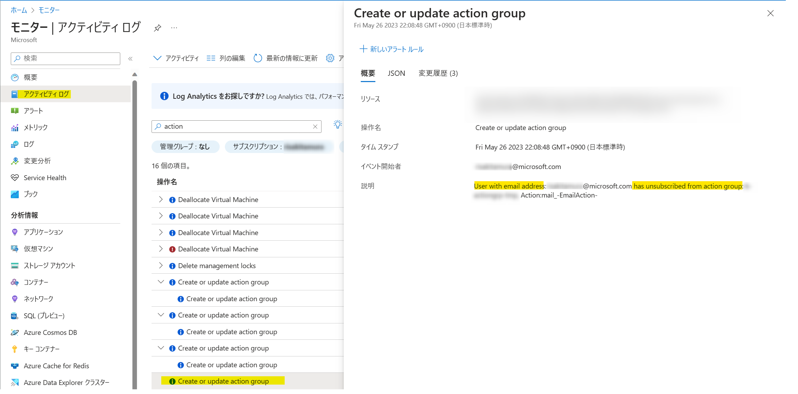

[更新履歴]  
- 2023/6/6 ブログ公開
- 2026/1/27 最新情報であることを確認済み
  
こんにちは、Azure Monitoring サポート チームの北村です。
今回は、Azure Monitor のアラート メールの登録解除と再登録の手順等をご紹介します。
お客様からよくお問い合わせいただくご質問もご紹介しますので、ご参考になれば幸いです。

 

<!-- more -->
## 目次
- [目次](#目次)
- [1. アラート メールの登録解除について](#1-アラート-メールの登録解除について)
- [2. アラート メールの登録解除に関するよくあるご質問](#2-アラート-メールの登録解除に関するよくあるご質問)
  - [Q1. アラート メールの登録が解除されると、そのアクション グループによるメールが通知されなくなりますか。](#q1-アラート-メールの登録が解除されるとそのアクション-グループによるメールが通知されなくなりますか)
  - [Q2. アラート メールの登録が解除されたことを確認する方法を教えてください。](#q2-アラート-メールの登録が解除されたことを確認する方法を教えてください)
  - [Q3. アラート メールを再登録する方法を教えてください。](#q3-アラート-メールを再登録する方法を教えてください)
      - [\<1\> アラート メールの登録を解除したときに表示される画面で再登録する](#1-アラート-メールの登録を解除したときに表示される画面で再登録する)
      - [\<2\> アラート メールの登録を解除した後に通知されるメールから再登録する](#2-アラート-メールの登録を解除した後に通知されるメールから再登録する)
      - [\<3\> Azure ポータルからアクション グループを再設定する](#3-azure-ポータルからアクション-グループを再設定する)
  - [Q4. アラート メール内にある Unsubscribe のリンクを無効化する方法はありますか。](#q4-アラート-メール内にある-unsubscribe-のリンクを無効化する方法はありますか)
  - [Q5. アラート メールの登録を解除したユーザーを特定する方法はありますか。](#q5-アラート-メールの登録を解除したユーザーを特定する方法はありますか)

 

## 1. アラート メールの登録解除について
Azure Monitor のアラート ルールでは、アラート ルールに [アクション グループ](https://learn.microsoft.com/ja-jp/azure/azure-monitor/alerts/action-groups) を設定することで、アラートが発報したときに通知することができます。このアクション グループで、アラートが発報したときにメールを通知するようにご設定いただいている方が多いかと思います。

アクション グループによって通知されたアラート メールには、当該アクション グループによるメール通知を解除するリンクが記載されています。赤線で囲んだ ***Unsubscribe*** というリンクから、アラート メールの登録を解除することができます。
アラート メールの登録を解除しますと、当該アクション グループによって通知されるアラート メールが配信されなくなります。

(*) 以下は、Azure Monitor のアラート ルールによって通知されたアラート メールの例です。

 

アラート メールの ***Unsubscribe from emails directed to this group.*** のリンクをクリックすると、以下のような画面に遷移します。アクション グループによるアラート メールの登録を解除するかどうかを聞かれます。

 

上の画面で ***Confirm*** をクリックすると、以下の画面が表示され、アラート メールの登録が解除されます。
誤ってアラート メールの登録を解除してしまった場合は、***Click here to continue receiving Microsoft Azure emails*** というリンクより、再登録することが可能です。

 

アラート メールの登録を解除しますと、該当のアクション グループで設定されているメール アドレスに ***You’re no longer in the <アクション グループの表示名> action group*** というタイトルのメールが送信され、該当のアクション グループによるアラート メールの登録が解除されたことが通知されます。このメールにも、アラート メールの再登録のリンクが記載され、***click here*** より、アラート メールを再登録することが可能です。

(*) 以下は、アラート メールの登録を解除した後に通知されたメールの例です。

 
 

## 2. アラート メールの登録解除に関するよくあるご質問
アラート メールの登録解除に関するよくあるご質問をご紹介します。
 

### Q1. アラート メールの登録が解除されると、そのアクション グループによるメールが通知されなくなりますか。
はい、アラート メールの登録を解除すると、該当のアクション グループが紐づいているアラート ルールのメールは通知されません。

 
 

### Q2. アラート メールの登録が解除されたことを確認する方法を教えてください。
アクション グループで設定しているメール アドレスに ***You’re no longer in the <アクション グループの表示名> action group*** という件名のメールが届ているかどうかをご確認ください。
また、Azure ポータルからアクション グループの編集画面を開き、[通知] の [状態] で ***登録解除済み*** と表示されている場合は、アラート メールの登録が解除された状態を意味します。

 
 

### Q3. アラート メールを再登録する方法を教えてください。
"1. アラート メールの登録解除リンクについて" でもご紹介した方法を含め、再登録する方法は 3 つございます。
なお、<1> および <2> の再登録のリンクをクリックしても、リンクの期限切れを表すページへ遷移する可能性がございます。
この場合は <3>のアクション グループの再設定をお試しいただけますと幸いです。

 
 

##### <1> アラート メールの登録を解除したときに表示される画面で再登録する
***Click here to continue receiving Microsoft Azure emails*** というリンクをクリックしてください。

 

このリンクをクリックすると、以下の画面が表示され、アラート メールが再登録されます。

 

##### <2> アラート メールの登録を解除した後に通知されるメールから再登録する
***If this was a mistake, click here to subscribe.*** の ***click here*** をクリックしてください。
このリンクをクリックすると、<1> と同様、再登録された旨の画面が表示されます。

 

##### <3> Azure ポータルからアクション グループを再設定する
Azure ポータルから配信停止を解除する場合は、アクション グループの再設定をお願いいたします。
1. アクション グループから該当のメール アドレスを削除し、当該アクション グループを保存します。
2. アクション グループに該当のメール アドレスを追加し、当該アクション グループを保存します。
3. 通知の状態欄が "登録済み" と表示されることを確認します。

 
 

### Q4. アラート メール内にある Unsubscribe のリンクを無効化する方法はありますか。
[アラートの通知メールはカスタマイズすることができない](https://jpazmon-integ.github.io/blog/AzureMonitorEssential/AboutCustomizingAlertNotificationEmail/)ため、メール内の ***Unsubscribe*** のリンクを削除することはできません。また、このリンクをクリックした後の動作を制御する方法もございません。
そのため、誤ってアラート メールの登録を解除されてしまった場合は、前述の再登録手順を実施してください。

 
 

### Q5. アラート メールの登録を解除したユーザーを特定する方法はありますか。
アラート メールの登録を解除したユーザーを特定することはできません。
アクティビティ ログには、イベント開始者に対象のメール アドレスが記録されますが、そのアドレスを具体的にどのユーザーが無効化したのかまでは確認する方法がございません。

 

上記の内容以外でご不明な点や疑問点などございましたら、弊社サポート サービスまでお問い合わせください。
また、[弊社公開情報](https://learn.microsoft.com/ja-jp/azure/azure-monitor/alerts/alerts-troubleshoot#did-not-receive-expected-email) もあわせてご確認いただけますと幸いです。
最後までお読みいただきありがとうございました！