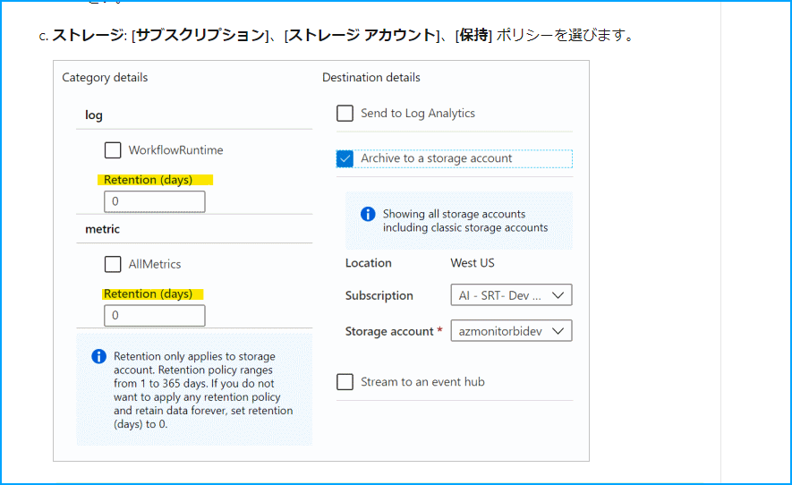
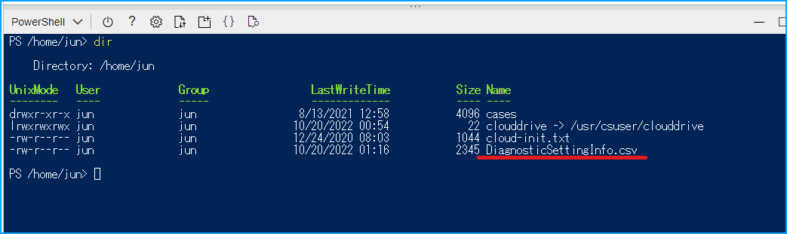
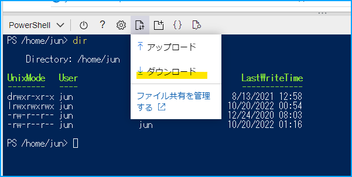

こんにちは、Azure Monitoring & Integration サポート チームの北山です。  
今回の記事では、サービス正常性にて通知された「Action required: Migrate to Azure Storage lifecycle management from diagnostic settings storage retention」について説明します。

## 目次
- [目次](#目次)
- [報告された正常性の勧告について](#報告された正常性の勧告について)
  - [概要](#概要)
  - [内容](#内容)
  - [実施いただきたいアクション](#実施いただきたいアクション)
- [抄訳](#抄訳)
  - [2V_C-980 の概要](#2v_c-980-の概要)
  - [廃止されるとどうなるか](#廃止されるとどうなるか)
  - [影響を受けるお客様](#影響を受けるお客様)
  - [お客様に必要なアクションについて](#お客様に必要なアクションについて)
- [診断設定側のデータ保持機能を利用している診断設定を特定する方法について](#診断設定側のデータ保持機能を利用している診断設定を特定する方法について)
  - [サンプル スクリプト](#サンプル-スクリプト)

## 報告された正常性の勧告について
### 概要


| 項目名         | 項目値                                                                                                       |
|-------------|-----------------------------------------------------------------------------------------------------------|
| 題名          | Action required: Migrate to Azure Storage lifecycle management from diagnostic settings storage retention |
| 追跡 ID       | 2V_C-980                                                                                                  || 影響を受けるサービス  | Azure Monitor                                                                                             |
| 影響を受けるリージョン | Global                                                                                                    |
| 正常性イベントの種類  | 正常性の勧告                                                                                                    |


### 内容
You're receiving this notice because you use the Azure Monitor diagnostic settings storage retention feature.  
On 30 September 2025, the diagnostic settings storage retention feature of Azure Monitor will be retired and retention will no longer be applied to logs sent to storage account destinations via diagnostic settings.  
You'll need to migrate to the Azure Storage lifecycle management feature by that date.  

Azure Storage lifecycle management provides all the same functionality, plus it enables you to:

- Transition blobs to a cooler storage tier to optimize for performance and cost.
- Define up to 100 separate rules.
- Apply rules to containers or specific subsets of blobs.

### 実施いただきたいアクション
To continue applying retention to logs sent to storage accounts via diagnostic settings, [migrate](https://docs.microsoft.com/azure/azure-monitor/essentials/migrate-to-azure-storage-lifecycle-policy) to Azure Storage lifecycle management by 30 September 2025.


## 抄訳
### 2V_C-980 の概要
Azure リソースのリソース ログやメトリックを Log Analytics ワークスペースやストレージ アカウント、Event Hubs に出力する場合に診断設定をご構築いただく必要があります。  

> [!NOTE]
> 診断設定については[こちら](https://learn.microsoft.com/ja-jp/azure/azure-monitor/essentials/diagnostic-settings?tabs=portal)の公開情報をご確認ください。

リソース ログやメトリックをストレージ アカウントへ出力する場合、下図のように診断設定側にデータの保持期間を指定することが可能です。  



もし保持期間を設定いただいた場合、ストレージ アカウントに出力されたデータは設定した保持期間に従って自動的に削除されます。  
今回の正常性の勧告は、診断設定に実装されたデータの保持期間機能が 2025 年 9 月 30 日に廃止となる案内です。

### 廃止されるとどうなるか
診断設定側のデータ保持機能が廃止となるため、ストレージ アカウントに保存されたデータが自動的に削除されなくなります。  
結果的に、診断設定により出力されたデータストレージ アカウントに永久的に残るため、期待しないコストが発生する可能性があります。  
診断設定側のデータ保持機能が廃止された後は、ストレージ アカウント側のライフサイクル管理ポリシーを用いてデータの保持期間を管理していただく必要があります。

- [ライフサイクル管理ポリシーを構成する](https://learn.microsoft.com/ja-jp/azure/storage/blobs/lifecycle-management-policy-configure?tabs=azure-portal)

### 影響を受けるお客様
診断設定側のデータ保持機能をご利用いただいているお客様が影響を受けます。


### お客様に必要なアクションについて
診断設定によってストレージ アカウントへ出力されたデータの保持期間を引き続きご指定いただきたい場合は、2025 年 9 月末までにストレージ アカウント側のライフサイクル管理ポリシーへ移行していただく必要がございます。  
移行に関する手順の詳細につきましては、下記の公開情報をご参考いただけますと幸いです。

- [診断設定ストレージ保持から Azure Storage ライフサイクル管理に移行する](https://learn.microsoft.com/ja-jp/azure/azure-monitor/essentials/migrate-to-azure-storage-lifecycle-policy)


## 診断設定側のデータ保持機能を利用している診断設定を特定する方法について
[ストレージ アカウントのライフサイクル管理に移行する公開情報](https://learn.microsoft.com/ja-jp/azure/azure-monitor/essentials/migrate-to-azure-storage-lifecycle-policy)には、どの診断設定が診断設定側のデータ保持機能を利用しているかを特定する方法の記載がありません。  
そのため、複数ある診断設定に対して一つ一つ Azure portal から確認する必要があります。  
この方法はかなり大変な作業だと思うので、診断設定側のデータ保持機能を利用している診断設定一覧を CSV として出力するサンプル PowerShell スクリプトを用意いたしました。


### サンプル スクリプト
#### 注意点
- PowerShell 7 を用いて動作確認を実施しております。
- 以下のコマンドでインストールした Az モジュールを用いて動作確認を実施しております。
```powershell
Install-Module Az -force -AllowPrerelease -AllowClobber -SkipPublisherCheck -Repository PSGallery
Update-Module -Name Az -AllowPrerelease -Force -Confirm
```
- サンプル スクリプト実行前に、必ず Connect-AzAccount を実行して Azure へログインいただき、Set-AzContext を実行して対象のサブスクリプションをご指定ください。
  - なお、Cloud Shell から実行される場合は、Connect-AzAccount の実行は不要です。
- もし、どれか一つの診断設定に対して保持期間が指定されていた場合は、サンプル スクリプト実行後に CSV ファイルが出力されます。
- 一方で、どの診断設定にも保持期間が指定されていない場合は、CSV ファイルは出力されません。そのため、ファイルが出力されなかった場合は 2V_C-980 に対する対処は不要です。


#### サンプル
```powershell
## Need to use Az module(version 9.0.0) and PowerShell version 7 ##

# リソースすべて取得
$Resrouces = Get-AzResource

# 診断設定の取得
$Resrouces.Id | ForEach-Object -Parallel{
    $ResroucesId = $_
    
    # 出力する csv ファイルパス、ファイル名を定義する
    $FilePath = "DiagnosticSettingInfo.csv" 

    # 書き込みのリトライ待機時間
    $RetryWaitMilliseconds = 1
    
    # 診断設定を取得する。なければ $DiagnosticSettings は Null となる
    $DiagnosticSettings = Get-AzDiagnosticSetting -ResourceId $ResroucesId -WarningAction SilentlyContinue -ErrorAction SilentlyContinue

    # 診断設定があるかどうか
    if ($DiagnosticSettings -ne $null){
        # 診断設定ある場合、各設定についてみていく
        ForEach ($DiagnosticSetting in $DiagnosticSettings){
            # LOG 系の診断設定があるかどうか
            $LogSettings = $DiagnosticSetting.Log
            if ($LogSettings -ne $null){
                # 各カテゴリについて、保持期間があるかどうか確認していく
                foreach ($LogSetting in $LogSettings){
                    $DiagnosticSettingInfo = New-Object System.Collections.Generic.List[string]
                    if ( $LogSetting.RetentionPolicyDay -ne 0 )
                    {   
                        # 保持期間が設定された診断設定がある場合、情報を追記する
                        $DiagnosticSettingInfo.add($ResroucesId)
                        $DiagnosticSettingInfo.add($DiagnosticSetting.Name)
                        $DiagnosticSettingInfo.add($LogSetting.Category)
                        $DiagnosticSettingInfo.add($LogSetting.RetentionPolicyDay)
                        
                        # 書き込みが完了するまでリトライする
                        while ($true){
                            try{
                                $DiagnosticSettingInfo -join "," | Out-File -FilePath $FilePath -Append -ErrorAction Stop
                                break
                            }catch [System.IO.IOException]{
                                Start-Sleep -Milliseconds $RetryWaitMilliseconds
                            }
                        }
                    }
                } 
            }
            # METRIC 系の診断設定がある場合
            $MetricSettings = $DiagnosticSetting.Metric
            if ($MetricSettings -ne $null){
                # 各カテゴリについて、保持期間があるかどうか確認していく
                foreach ($MetricSetting in $MetricSettings){
                    $DiagnosticSettingInfo = New-Object System.Collections.Generic.List[string]
                    if ( $MetricSetting.RetentionPolicyDay -ne 0 )
                    {   
                        # 保持期間が設定された診断設定がある場合、情報を追記する
                        $DiagnosticSettingInfo.add($ResroucesId)
                        $DiagnosticSettingInfo.add($DiagnosticSetting.Name)
                        $DiagnosticSettingInfo.add($MetricSetting.Category)
                        $DiagnosticSettingInfo.add($MetricSetting.RetentionPolicyDay)
                        
                        # 書き込みが完了するまでリトライする
                        while ($true){
                            try{
                                $DiagnosticSettingInfo -join "," | Out-File -FilePath $FilePath -Append -ErrorAction Stop
                                break
                            }catch [System.IO.IOException]{
                                Start-Sleep -Milliseconds $RetryWaitMilliseconds
                            }
                        }
                    }
                } 
            }
        } 
    }
} -ThrottleLimit 100
```

#### その他
上記 PowerShell スクリプトは Azure portal の Cloud Shell からも実行可能です。

- [Azure Cloud Shell の概要](https://learn.microsoft.com/ja-jp/azure/cloud-shell/overview)

上記スクリプトの処理時間は、当該サブスクリプションに存在するリソース数に影響いたします。  
弊社検証環境には 2000 個の Azure リソースがございますが、およそ 5 分から 10 分ほど時間を要しました。  
Cloud Shell にてスクリプトを実行後、下記の手順にて CSV ファイルのダウンロードが可能です。

1. Dir コマンドで対象の CSV ファイルが存在する事を確認します。


2. ダウンロードをクリックします。  


3. ファイル名を入力して [ダウンロード] をクリックします。

