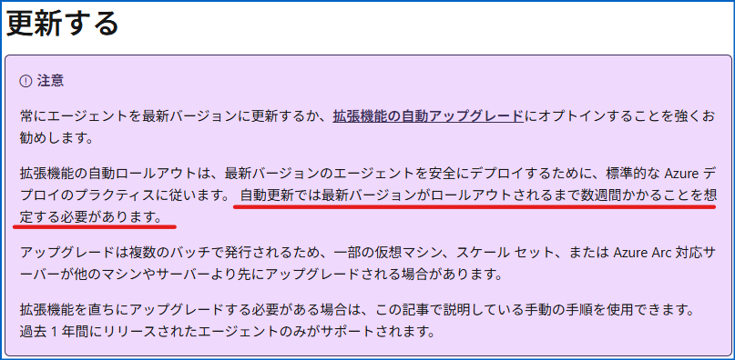
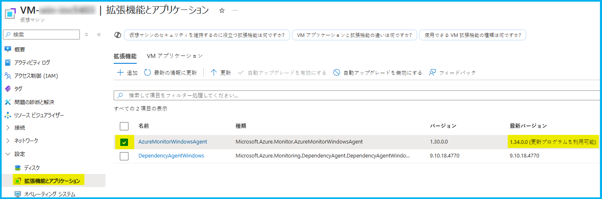
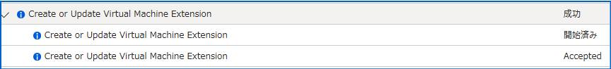
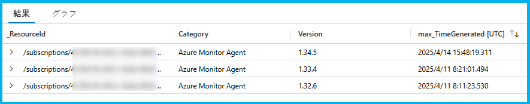

こんにちは、Azure Monitoring チームの徳田です。  
本ブログでは、Azure Monitor エージェントの自動アップグレード機能に関するよくあるご質問に対する回答をご紹介いたします。  
弊社公開情報としては以下のページにてご紹介しておりますため、こちらも併せてご参照ください。
<br>
[Azure の仮想マシンとスケール セットの拡張機能の自動アップグレード](https://learn.microsoft.com/ja-jp/azure/virtual-machines/automatic-extension-upgrade?tabs=RestAPI1%2CRestAPI2)

<!-- more -->

<br>

<!-- more -->
## Q & A タイトル

### <自動アップグレード有効化に関する質問>
- [Q. 自動アップグレードを有効化する手順を教えてください。](#Q-自動アップグレードを有効化する手順を教えてください。)
- [Q. Set-AzVMExtension コマンドの EnableAutomaticUpgrade と DisableAutoUpgradeMinorVersion パラメーターの違いについて教えてください。](#Q-Set-AzVMExtension-コマンドの-EnableAutomaticUpgrade-と-DisableAutoUpgradeMinorVersion-パラメーターの違いについて教えてください。)

### <自動アップグレードの実行に関する質問>
- [Q. どのようなタイミングでアップグレードされますか。利用者側で指定できますか。](#Q-どのようなタイミングでアップグレードされますか。利用者側で指定できますか。)
- [Q. 最新バージョンがリリースされてすぐにアップグレードされますか。](#Q-最新バージョンがリリースされてすぐにアップグレードされますか。)
- [Q. 利用中のリージョンで最新バージョンが利用可能になっていますが、自動アップグレードによるアップグレードがまだ行われていません。すぐにアップグレードしたい場合はどうすればいいですか。](#Q-利用中のリージョンで最新バージョンが利用可能になっていますが、自動アップグレードによるアップグレードがまだ行われていません。すぐにアップグレードしたい場合はどうすればいいですか。)

### <アップグレード時に関する質問>
- [Q. アップグレード中はログ収集が停止しますか。停止期間中のログはアップグレード後に再送されますか。](#Q-アップグレード中はログ収集が停止しますか。停止期間中のログはアップグレード後に再送されますか。)
- [Q. 停止している VM に対して自動アップグレードは行われますか。](#Q-停止している-VM-に対して自動アップグレードは行われますか。)
- [Q. アップグレードの際に仮想マシン (OS) は停止・再起動されますか。](#Q-アップグレードの際に仮想マシン-OS-は停止・再起動されますか。)
- [Q. 自動アップグレードが失敗した場合は再実行されますか。](#Q-自動アップグレードが失敗した場合は再実行されますか。)

### <その他>
- [Q. アップグレードの成否は確認できますか。](#Q-アップグレードの成否は確認できますか。)
- [Q. Azure Monitor エージェントの各バージョンの情報はどこで確認できますか。](#Q-Azure-Monitor-エージェントの各バージョンの情報はどこで確認できますか。)

<br>

### <自動アップグレード有効化に関する質問>
--------------------------------------------------------
### Q. 自動アップグレードを有効化する手順を教えてください。
--------------------------------------------------------
自動アップグレードを有効化する方法には、主に以下の様なものがあります。
- [Azure portal 上で有効化する](#Azure-portal-上で有効化する)
- [PowerShell コマンドを使用して有効化する](#PowerShell-コマンドを使用して有効化する)
- [Azure CLI コマンドを使用して有効化する](#Azure-CLI-コマンドを使用して有効化する)

それぞれの方法について紹介します。

#### Azure portal 上で有効化する  
Azure portal で仮想マシン、または仮想マシン スケール セットのリソースを開き、[設定] > [拡張機能とアプリケーション] のページから有効化できます。  
詳細な手順については、以下の弊社公開情報をご確認ください。  

[Azure の仮想マシンとスケール セットの拡張機能の自動アップグレード | 拡張機能の自動アップグレードを有効にする | Azure portal を使用する](https://learn.microsoft.com/ja-jp/azure/virtual-machines/automatic-extension-upgrade?tabs=powershell1%2CRestAPI2#use-the-azure-portal)


#### PowerShell コマンドを使用して有効化する  
以下のコマンドを実行して有効化することができます。

```
# Windows の場合
Set-AzVMExtension `
-Name AzureMonitorWindowsAgent `
-ExtensionType AzureMonitorWindowsAgent `
-Publisher Microsoft.Azure.Monitor `
-ResourceGroupName <resourceGroupName> `
-VMName <vmName> `
-Location <region> `
-HandlerVersion <version> `
-DisableAutoUpgradeMinorVersion `
-EnableAutomaticUpgrade $true

# Linux の場合
Set-AzVMExtension `
-Name AzureMonitorLinuxAgent `
-ExtensionType AzureMonitorLinuxAgent `
-Publisher Microsoft.Azure.Monitor `
-ResourceGroupName <resourceGroupName> `
-VMName <vmName> `
-Location <region> `
-HandlerVersion <version> `
-DisableAutoUpgradeMinorVersion `
-EnableAutomaticUpgrade $true
```
※ <> で囲まれた箇所は環境に合わせて変更してください。  

<br>

#### Azure CLI コマンドを使用して有効化する  
以下のコマンドを実行して有効化することができます。

```
# Windows の場合
az vm extension set `
--name AzureMonitorWindowsAgent `
--publisher Microsoft.Azure.Monitor `
--ids <vm-resource-id> `
--version <version> `
--no-auto-upgrade-minor-version `
--enable-auto-upgrade true

# Linux の場合
az vm extension set `
--name AzureMonitorLinuxAgent `
--publisher Microsoft.Azure.Monitor `
--ids <vm-resource-id> `
--version <version> `
--no-auto-upgrade-minor-version `
--enable-auto-upgrade true
```
※ <> で囲まれた箇所は環境に合わせて変更してください。 
※ `no-auto-upgrade-minor-version` パラメーターについては、後述の [Q. Set-AzVMExtension コマンドの EnableAutomaticUpgrade と DisableAutoUpgradeMinorVersion パラメーターの違いについて教えてください。](#Q-Set-AzVMExtension-コマンドの-EnableAutomaticUpgrade-と-DisableAutoUpgradeMinorVersion-パラメーターの違いについて教えてください。) を参照してください。

<br>

なお、以下弊社公開情報には、上記の方法に加えて ARM テンプレートや REST API を使用した有効化方法についてもご紹介しております。

[Azure の仮想マシンとスケール セットの拡張機能の自動アップグレード | 拡張機能の自動アップグレードを有効にする](https://learn.microsoft.com/ja-jp/azure/virtual-machines/automatic-extension-upgrade?tabs=cli1%2CRestAPI2#enable-automatic-extension-upgrade)

<br>

--------------------------------------------------------
### Q. Set-AzVMExtension コマンドの EnableAutomaticUpgrade と DisableAutoUpgradeMinorVersion パラメーターの違いについて教えてください。
--------------------------------------------------------
**EnableAutomaticUpgrade**  
- EnableAutomaticUpgrade は、拡張機能の自動アップグレード機能を有効化の有無を指定するパラメーターです。
- したがって、拡張機能の自動アップグレード機能を有効化したい場合は、値を $true に設定する必要があります。
- このパラメーターは Azure CLI の `az vm extension set` コマンドにおける `--enable-auto-upgrade` と同じはたらきです。

**DisableAutoUpgradeMinorVersion**
- このパラメーターは、Set-AzVMExtension が実行される際 (拡張機能をインストールするときや手動アップグレードするとき) に、どのバージョンがインストールされる (どのバージョンにアップグレードされる) かを指定するものです。
- `-DisableAutoUpgradeMinorVersion $true` とした場合は、`-TypeHandlerVersion` に指定したバージョンがインストールされ (`-TypeHandlerVersion` に指定したバージョンにアップグレードされ) ます。 
- `-DisableAutoUpgradeMinorVersion $false` とした場合、その時使用できる最新の安定したマイナー バージョンがインストールされ (にアップグレードされ) ます。

(ご参考)
[Azure の仮想マシンとスケール セットの拡張機能の自動アップグレード | EnableAutomaticUpgrade と AutoUpgradeMinorVersion の違い](https://learn.microsoft.com/ja-jp/azure/virtual-machines/automatic-extension-upgrade?tabs=RestAPI1%2CRestAPI2#difference-between-enableautomaticupgrade-and-autoupgrademinorversion)
[Set-AzVMExtension](https://learn.microsoft.com/en-us/powershell/module/az.compute/set-azvmextension?view=azps-13.4.0)
[az vm extension | az vm extension set | 省略可能のパラメーター](https://learn.microsoft.com/ja-jp/cli/azure/vm/extension?view=azure-cli-latest#az-vm-extension-set-optional-parameters)

<br>

--------------------------------------------------------
### Q. どのようなタイミングでアップグレードされますか。利用者側で指定できますか。
--------------------------------------------------------
残念ながら、利用者様側で自動アップグレードのタイミングを制御することはできません。  
起動している仮想マシン上で動作するエージェントが、定期的に最新バージョンの値をチェックし、最新のものが存在する場合は、その後自動アップグレードの処理がトリガーされます。

<br>

--------------------------------------------------------
### Q. 最新バージョンがリリースされてすぐにアップグレードされますか。
--------------------------------------------------------
新しいバージョンがリリースされた後、順次各リージョンにデプロイされ、利用可能となります。
ご利用のリージョンで最新バージョンが利用可能になってから、すぐにその最新版への自動アップグレードが実行されるわけではありません。  
以下弊社公開情報にもある通り、自動アップグレードによるアップグレードが実行されるまで、数週間かかるとご認識ください。  

[Azure Monitor エージェントのインストールと管理 | 更新する](https://learn.microsoft.com/ja-jp/azure/azure-monitor/agents/azure-monitor-agent-manage?tabs=azure-portal#update)  

<br>



<br>

--------------------------------------------------------
### Q. 利用中のリージョンで最新バージョンが利用可能になっていますが、自動アップグレードによるアップグレードがまだ行われていません。すぐにアップグレードしたい場合はどうすればいいですか。
--------------------------------------------------------
以下の方法で手動でアップグレードすることで任意のタイミングで最新バージョンの利用を開始することが可能です。

#### Azure portal 上で手動アップグレードする
リソースの [設定] > [拡張機能とアプリケーション] にて "状態" 列に 「更新プログラムを利用可能」と表記されている場合、その拡張機能のバージョンよりも新しいマイナー バージョンが利用可能であることを意味しています。  
[拡張機能とアプリケーション] 画面にて、当該拡張機能にチェックを入れ [更新] を押下することで、最新のバージョンにアップグレードできます。

<br>




<br>

### <アップグレード時に関する質問>
--------------------------------------------------------
### Q. アップグレード中はログ収集が停止しますか。停止期間中のログはアップグレード後に再送されますか。
--------------------------------------------------------  
まず、AMA で収集可能なログは、仕組みによって大きく 2 種類に分かれます。  
1. 一定の間隔で取得して収集するログ : Heartbeat、パフォーマンス データ、Change Tracking データ  
2. 内部の仕組みでログの更新を検知して収集するログ : イベント ログ、 Syslog、カスタム ログ

1 のログについては、アップグレードしている間はログ収集できなくなるため、その分のログは欠損してしまいます。  
2 のログについては、アップグレード後に再度ログの更新を検知することが可能なため、理論上欠損は発生しません。

<br>

--------------------------------------------------------
### Q. 停止している VM に対して自動アップグレードは行われますか。
--------------------------------------------------------

仮想マシンが停止している場合は、自動アップグレード機能によるアップグレードは実行されません。

<br>

--------------------------------------------------------
### Q. アップグレードの際に仮想マシン (OS) は停止・再起動されますか。
--------------------------------------------------------

Azure Monitor エージェントのアップグレードの際に、仮想マシンの再起動は起こりません。

<br>

--------------------------------------------------------
### Q. 自動アップグレードが失敗した場合は再実行されますか。
--------------------------------------------------------

AMAの自動アップグレードが失敗した場合、バージョンアップ前のバージョンが再インストール (ロールバック) されます。  
ロールバックが成功した場合は、翌日の処理で再度自動アップグレードが施行されます。  
なお、ロールバックが失敗すると、AMA 自体の機能が停止し、ログ転送機能が停止する可能性が高いですが、ロールバックが失敗した際の挙動と解消方法は状況により異なります。  
そのため、ロールバックも失敗した場合は、必要に応じて、原因と解消方法の調査のために弊社サポート サービスまでお問い合わせください。

<br>

### <その他>
--------------------------------------------------------
### Q. アップグレードの成否は確認できますか。
--------------------------------------------------------

アクティビティ ログから確認が可能です。  
具体的には、Create or Update Virtual Machine Extension というアクティビティ ログが記録されます。  
なお、手動で拡張機能をアップロードした場合も同様のログが記録されますため、こちらの点についてご留意ください。

<br>



<br>

また、各マシンで動作している Azure Monitor エージェントのバージョンは、Log Analytics ワークスペースの Heartbeat テーブルの Version 列からもご確認いただけます。  
そのため、当該エージェントのバージョンがどのタイミングで変更されたかは、Heartbeat ログからもご確認が可能です。

// クエリの例
```
Heartbeat
| where _ResourceId =~ "<VMResourceId>"
| where Category == "Azure Monitor Agent"
| where TimeGenerated >= ago(100d)
| summarize max(TimeGenerated) by _ResourceId, Category, Version
```

<br>



<br>

--------------------------------------------------------
### Q. Azure Monitor エージェントの各バージョンの情報はどこで確認できますか。
--------------------------------------------------------

Azure Monitor エージェントのバージョンのリリース情報は、以下弊社公開情報に記載されます。  

[Azure Monitor エージェント拡張機能のバージョン | バージョンの詳細](https://learn.microsoft.com/ja-jp/azure/azure-monitor/agents/azure-monitor-agent-extension-versions#version-details)  

<br>

なお、上記サイトにリリース情報が記録されるタイミングと、新しいバージョンが実際に利用できるようになるタイミングは前後する可能性がございますため、恐れ入りますが、あらかじめご理解・ご了承ください。  

<br>

補足として、リージョンごとにデプロイされている Azure Monitor エージェント拡張機能のバージョンは、以下の PowerShell コマンドを実行することで確認が可能でございます。

<br>

```
# Windows
((Get-AzVMExtensionImage -Location <region> -PublisherName "Microsoft.Azure.Monitor" -Type "AzureMonitorWindowsAgent").Version | Sort-Object -Property { [Version]$_})

# Linux
((Get-AzVMExtensionImage -Location <region> -PublisherName "Microsoft.Azure.Monitor" -Type "AzureMonitorLinuxAgent").Version | Sort-Object -Property { [Version]$_})
```
※ <region> の箇所は、任意のリージョン名にご変更ください (japaneast など)。

<br>
<br>

上記の内容以外でご不明な点や疑問点などございましたら、弊社サポート サービスまでお問い合わせください。
皆さんの疑問点が 1 つでも解消すれば幸いです。