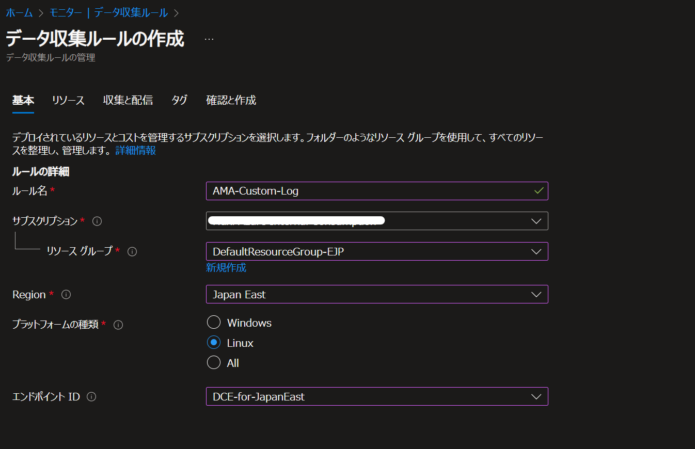
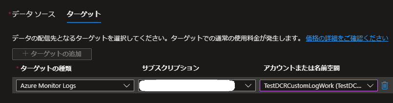
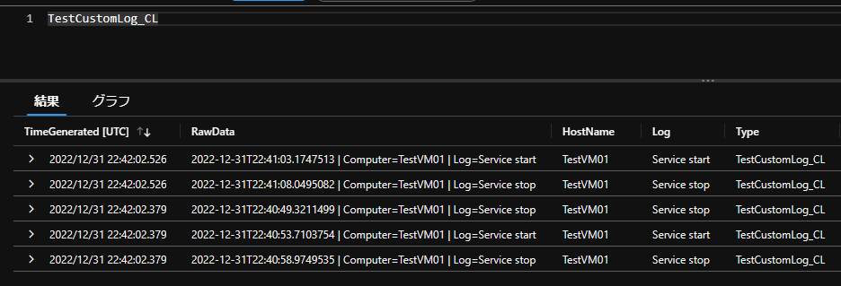
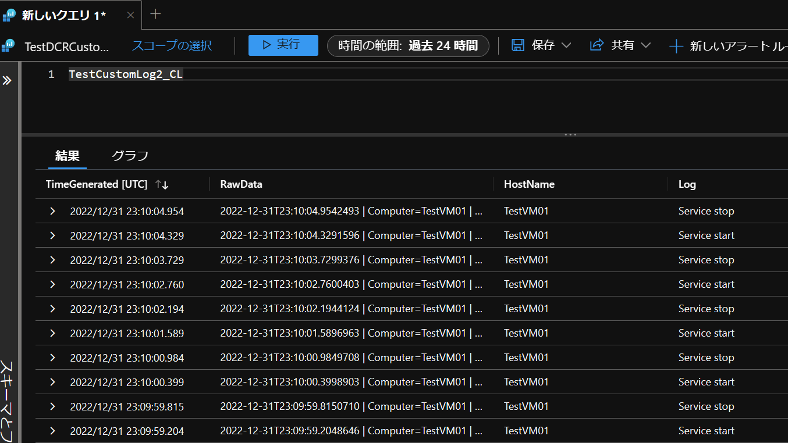
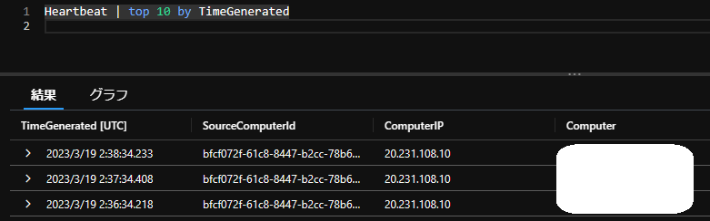

こんにちは、Azure Monitor サポートの三輪です。
今回は Azure Monitor エージェントにて任意のテキスト ログ (カスタム ログ) を取得する方法についてご案内します。


Azure Monitor エージェントでは、Windows/Linux 各 OS 上にあるテキスト ログを Log Analytics ワークスペースへ収集することが可能です。
一方で、以下公開情報の手順が煩雑でわかりにくい、また REST API を用いており Azure ポータル上で作業が完結しない等の問題があることから、本記事にて改めて手順をご案内致します。

- Azure Monitor エージェントを使用してテキスト ログを収集する
https://learn.microsoft.com/ja-jp/azure/azure-monitor/agents/data-collection-text-log?tabs=portal


Azure Monitor エージェントを用いたカスタム ログ収集手順
==

本手順は以下の順序で作業を進めます。
- [モニター] にてデータ収集エンドポイント (DCE) を作成
- PowerShell でカスタム ログ テーブルを作成
- DCR を作成して、 VM リソースとの紐づけを行う

データ収集エンドポイント (DCE) を作成する
--

- Azure Monitor のデータ収集エンドポイント
https://learn.microsoft.com/ja-jp/azure/azure-monitor/essentials/data-collection-endpoint-overview?tabs=portal#create-data-collection-endpoint


1. [モニター] を開き、[データ収集エンドポイント] より [作成] を選択します。


2. データ収集エンドポイント (DCE) を任意の名前、リソース グループを指定して作成します。


カスタム ログ テーブルを作成する
--

- カスタム テーブルを作成する
https://learn.microsoft.com/ja-jp/azure/azure-monitor/agents/data-collection-text-log?tabs=portal#create-a-custom-table


### 前提
今回は、以下の様なテキスト ファイルを取得することを想定します。
```
2022-12-31T01:00:00.1234567Z | Computer=TestVM01 | Log=Service stop
2022-12-31T01:01:00.1234567Z | Computer=TestVM01 | Log=Service start
2022-12-31T01:02:00.1234567Z | Computer=TestVM01 | Log=Service stop
```

### 手順
以下 PowerShell コマンドでテーブルを作成します。
   ```PowerShell
    $tableParams = @'
{
    "properties": {
        "schema": {
               "name": "{TableName}_CL",
               "columns": [
        {
                                "name": "TimeGenerated",
                                "type": "DateTime"
                        }, 
                       {
                                "name": "RawData",
                                "type": "String"
                       },
                       {
                                "name": "HostName",
                                "type": "String"
                       },
                      {
                                "name": "Log",
                                "type": "String"
                     }
              ]
        }
    }
}
'@

Invoke-AzRestMethod -Path "/subscriptions/{subscription}/resourcegroups/{resourcegroup}/providers/microsoft.operationalinsights/workspaces/{WorkspaceName}/tables/{TableName}_CL?api-version=2021-12-01-preview" -Method PUT -payload $tableParams
```

### 注意事項

※1 TimeGenerated のカラムは必須です。

※2 AMA のカスタム ログは既定で RawData カラムに全てのデータが格納されますので、基本的 RawData のカラムも必要となります。

※3 後述する TransformKql のデータの変換機能を利用することで、カスタム ログを RawData 以外のカラムに格納することが可能です。

※4 データの変換機能を利用する場合は、必要に応じて他のカラムを作成してください。

DCR を設定する
--

1. [モニター] を開き、[データ収集ルール] より新規にデータ収集ルール (DCR) を作成します。

2. [基本] タブで、エンドポイント ID (DCE) を含めて、全ての項目を設定します。


3. [リソース] タブを開き、[+リソースの追加] より、カスタム ログを収集したい VM を選び、[適用] を選択します。


4. [収集と配信] タブを開き、[+データ ソースの追加]をクリックします。


5. [データ ソースの種類] にて [カスタム テキスト ログ] を選択します。
[ファイル パターン] にて収集先のログファイル パスを指定します。
今回は Linux OS 上のテキスト ログを取得することを想定し、以下のパスを入力します
```
/var/log/test.log
```

6. [テーブル名] にはさきほど作成したテーブル名 (_CL 含む) を指定します。
[Transform] には、以下のクエリを設定してデータを整形します。
```
source| extend TimeGenerated = now()| parse RawData with * "Computer="HostName "| " *| parse RawData with * "Log="Log"
```

※ TransformKql の書き方については、以下公開情報をご参考ください。
https://learn.microsoft.com/ja-jp/azure/azure-monitor/essentials/data-collection-transformations-structure

7. [ターゲット] にて、テーブルを作成済みの対象の Log Analytics ワークスペースを選択し、[データ ソースの追加] を選択します。


8. [確認と作成] タブを開き、[作成] ボタンで DCR を作成します。


この後、指定したパスへテキスト ログを出力していくと、ログが取得されます。



なお、今回のサンプルでは、TimeGenerated 列はログがエージェントによって収集されたタイミングとなります。
テキスト ログ内の RawData 内の日時を、Log Analytics ワークスペース上の TimeGenerated 列としたいたい場合は、Transform のクエリを以下の様に指定し、ログから時刻を取得し、日付形式に変換の上、TimeGenerated 列として定義します。
```
source
| extend TimeGenerated = todatetime(substring(RawData,0,28))
| parse RawData with * "Computer="HostName "| " *
| parse RawData with * "Log="Log"
```

これにより、TimeGenerated 列の値が RawData 内の日時をもとに設定されます。




- substring()
https://learn.microsoft.com/en-us/azure/data-explorer/kusto/query/substringfunction
- todatetime()
https://learn.microsoft.com/en-us/azure/data-explorer/kusto/query/todatetimefunction


正常に収集されない場合
--
カスタム ログを設定し、OS 上にログが出力された後、2 時間程度経過しないと Log Analytics ワークスペース上でクエリが出来ない場合があります。
ログを出力したまま、数時間お待ちいただき、クエリをお試し下さい。

また、時間経過してもログが収集されない場合、以下の点をご確認下さい。

1. VM の Heartbeat ログが到達しているか確認下さい。
Log Analytics ワークスペース上で以下のクエリを実行し、収集対象の VM から Heartbeat ログが取得されているか確認下さい。
Heartbeat ログは通常、1 分間に 1 回 Log Analytics ワークスペースへ送られてきます。

- クエリ
```
Heartbeat | top 10 by TimeGenerated
```
- 結果例



Heartbeat ログが確認出来ない場合、多くの場合ネットワーク要件が満たされていない可能性が高いです。
以下の公開情報をもとに、VM の NSG や ファイアウォールにおいて、通信要件が満たされているかご確認下さい。

- Azure Monitor エージェントのネットワーク設定を定義する
https://learn.microsoft.com/ja-JP/azure/azure-monitor/agents/azure-monitor-agent-data-collection-endpoint?tabs=PowerShellWindows


上記ポイントに問題がなく、また時間が経過してもログが Log Analytics ワークスペース上に収集がされない場合、以下の手順をお試し下さい。

A. DCR を再作成する
1. [モニター] より作成した DCR を選択し、[削除] します。
2. 再度、[モニター] - [データ収集ルール] - [+ 作成] より DCR を新規作成します。
3. 任意のルール名、リソース グループを選択します。また、DCE を作成したリージョンと同じリージョンを選択し、ログを収集する VM の OS を選択します。(Windows または Linux)
   エンドポイント ID の箇所で、作成した DCE を選択し、次へ進みます。
4. [+ リソースの追加] より収集対象の VM を選択します。[データ収集エンドポイントを有効にする] にチェックを入れ、作成した DCE を選択し、次へ進みます。
5. [+ データ ソースの追加] より、[カスタム テキスト ログ] を選択します。
6. [データ ソース] にて、[ファイル パターン]、[テーブル名]、[Transform] の各項目にて、【DCR を設定する】 にて対して設定した内容を行います。
7. [ターゲット] にて、テーブルを作成済みの対象の Log Analytics ワークスペースを選択し、[データ ソースの追加] を選択します。
8. 次へ進み、最後に [作成] を選択します。

B. Azure Monitor エージェントを再インストールする
1. 対象の VM を開き、[拡張機能とアプリケーション] を選択します。
2. OS が Windows の場合は [AzureMonitorWindowsAgent]、Linux の場合は [AzureMonitorLinuxAgent] を選択し [アンインストール] をクリックします。
3. Azure Monitor エージェントのアンインストールが完了するまで待ちます。
4. 続いて、作成した DCR を開きます。
5. [リソース] より、Azure Monitor エージェントをアンインストールした VM を選択し、[削除] を選択します。
6. [+ 追加] より、Azure Monitor エージェントをアンインストールした VM を選択し、[適用] を選択します。
このとき、[データ収集エンドポイント] にて作成した DCE が設定されていることを確認します。


補足
--
上記手順利用した JSON ファイルは以下より入手が可能です。貴社環境やログの形状に合わせて変更いただければと存じます。
[sampleJson.json](./AMA_CustomLog/sampleJson.json.txt)

また、Linux OS 上で今回収集するログを、テストとしてテキスト ログに出力するコマンドは以下です。
本手順をテストされる場合、以下のコマンドにて簡単に検証が可能です。

```
echo "`date '+%Y-%m-%dT%H:%M:%S.%7N'` | Computer=`hostname` | Log=Service stop" >> /var/log/test.log
echo "`date '+%Y-%m-%dT%H:%M:%S.%7N'` | Computer=`hostname` | Log=Service start" >> /var/log/test.log
```
