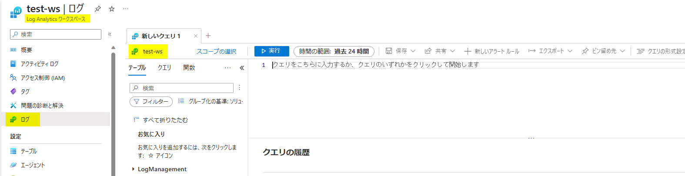
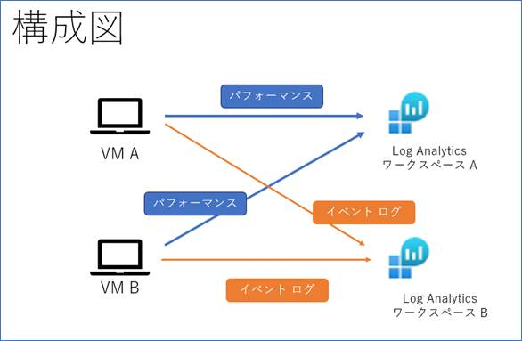
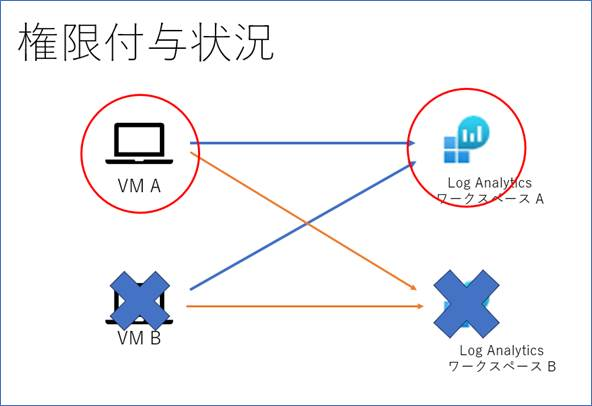

こんにちは、Azure Monitoring サポート チームの秋田です。
本ブログでは、以下の公開情報に記載されています Log Analytics ワークスペースのアクセス制御モードについて、具体例を用いて違いをご説明します。

- アクセス制御モード
https://learn.microsoft.com/ja-jp/azure/azure-monitor/logs/manage-access?tabs=portal#access-control-mode

 

<!-- more -->

# アクセス制御モードとは
ユーザーが Log Analytics ワークスペースにアクセスする際に、どのような権限を持っていればどのデータを閲覧可能とするかを定義する設定です。
アクセス制御モードには、"ワークスペースのアクセス許可が必要" と "リソースまたはワークスペースのアクセス許可を使用" の 2 つがあります。
2019 年 3 月以降に作成された Log Analytics ワークスペースは、アクセス制御モードが既定で "リソースまたはワークスペースのアクセス許可を使用" となっています。

アクセス制御モードの確認および変更方法は以下の公開情報をご参照ください。
- ワークスペースのアクセス制御モードを構成する
https://learn.microsoft.com/ja-jp/azure/azure-monitor/logs/manage-access?tabs=portal#configure-access-control-mode-for-a-workspace

# アクセス モードとは
各アクセス制御モードを説明するにあたり、前提知識として似た名前のアクセス モードについて先にお話しします。
アクセス モードとは一言でいうと、どのように Log Analytics ワークスペースにアクセスをするかです。
アクセス モードには、ワークスペース コンテキストとリソース コンテキストの 2 種類があります。

## ワークスペース コンテキスト
ワークスペース コンテキストで Log Analytics ワークスペースにアクセスするとは、
Log Analytics ワークスペースの [ログ] メニューよりログを確認することを指します。

## リソース コンテキスト
リソース コンテキストで Log Analytics ワークスペースにアクセスするとは、
リソース (例. 仮想マシン) の画面左側メニューにある [ログ] メニューより Log Analytics ワークスペースにアクセスしてログを確認することを指します。

//参考情報
- アクセス モード
https://learn.microsoft.com/ja-jp/azure/azure-monitor/logs/manage-access?tabs=portal#access-mode

# アクセス制御モードによる差異について
ワークスペース コンテキストで Log Analytics ワークスペースにアクセスする場合、アクセス制御モードに依らず Log Analytics ワークスペースへのアクセス権限により情報の閲覧可否が決まるため、
アクセス制御モードによる差異はありません。
 
リソース コンテキストで Log Analytics ワークスペースにアクセスする場合は以下の通りです。
アクセス制御モードが “ワークスペースへのアクセス許可が必要” の場合、権限があるリソースのデータのうち、権限がある Log Analytics ワークスペースに格納されているデータのみが閲覧可能です。
一方で、アクセス制御モードが “リソースまたはワークスペースのアクセス制御” の場合、権限があるリソースのデータであれば、
データが格納されている Log Analytics ワークスペースに対して権限を持っていなくても、リソースに関するすべてのデータが閲覧可能です。

# 具体例
"アクセス制御モードによる差異について" に記載した内容を、具体例を用いてご説明します。

## シナリオ
<構成>

VM A, VM B の 2 台の VM があり、どちらの VM についても、
Log Analytics ワークスペース A にはパフォーマンス データを送信し、Log Analytics ワークスペース B にはイベント ログを送信しているとします。

<権限付与状況>

ユーザーには、以下の権限を付与しております。
VM A : 仮想マシン共同作成者権限、Log Analytics 閲覧者権限
VM B : 何も権限を付与しない
Log Analytics ワークスペース A : Log Analytics 閲覧者権限
Log Analytics ワークスペース B : 何も権限を付与しない

## ワークスペース コンテキストでログにアクセスする場合
アクセス制御モードに依らず、Log Analytics ワークスペースに対するアクセス権限の有無によりデータの閲覧可否を判断します。
そのため、どちらのアクセス制御モードについても以下の結果となります。
Log Analytics ワークスペース A に格納されているデータについては、VM A についても VM B についても閲覧可能。
権限のない Log Analytics ワークスペース B に格納されたデータは一切閲覧ができません。

## リソース コンテキストでログにアクセスする場合
### アクセス制御モード : ワークスペースへのアクセス許可が必要の場合
VM A についての情報のうち、パフォーマンス データ (権限をもつ Log Analytics ワークスペース A に収集される) は閲覧可能であるが、
イベント ログ (権限を持たない Log Analytics ワークスペース B に収集される) は閲覧ができない。
VM B の情報については、リソースに対するアクセス権限を持たないため、一切閲覧できない。
 
### アクセス制御モード : リソースまたはワークスペースのアクセス制御の場合
VM A についての情報はすべて閲覧可能である。
すなわち、パフォーマンス データ (権限をもつ Log Analytics ワークスペース A に収集される) も、
イベント ログ (権限を持たない Log Analytics ワークスペース B に収集される) も閲覧が可能である。
VM B の情報については、リソースに対するアクセス権限を持たないため、一切閲覧できない

今回は、Log Analytics ワークスペースのアクセス制御モードとは何かをご紹介しました。
最後までお読みいただき、ありがとうございました！
