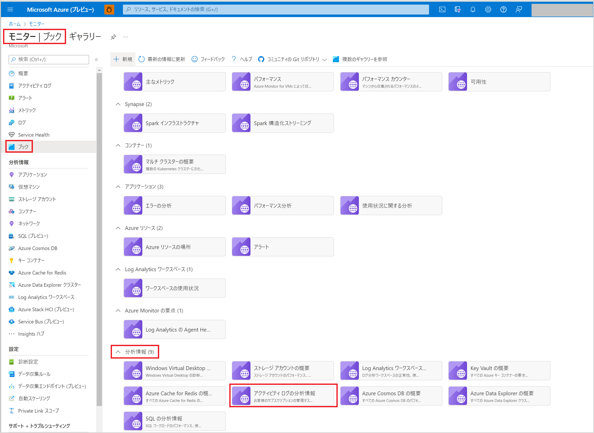
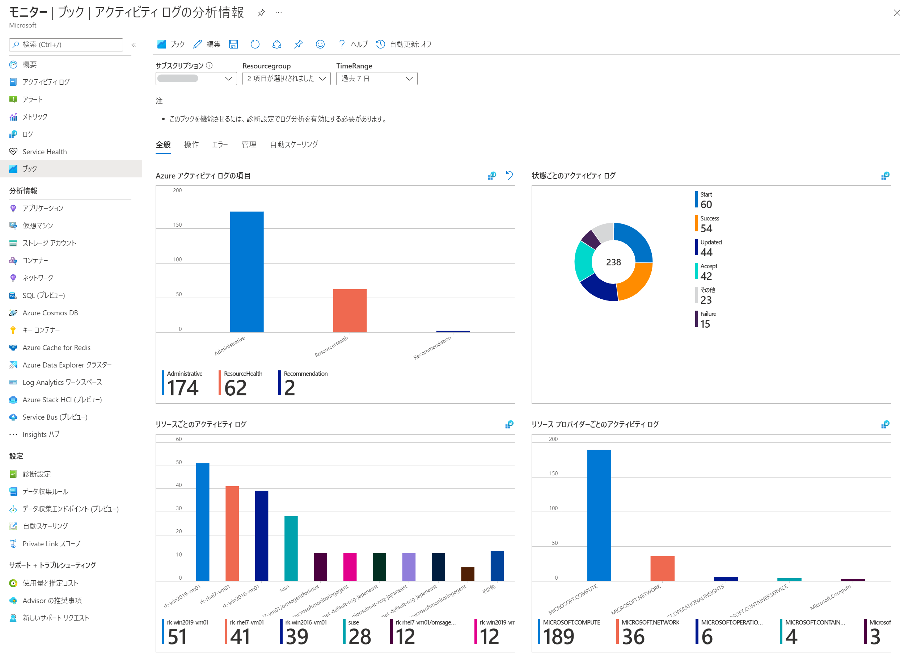
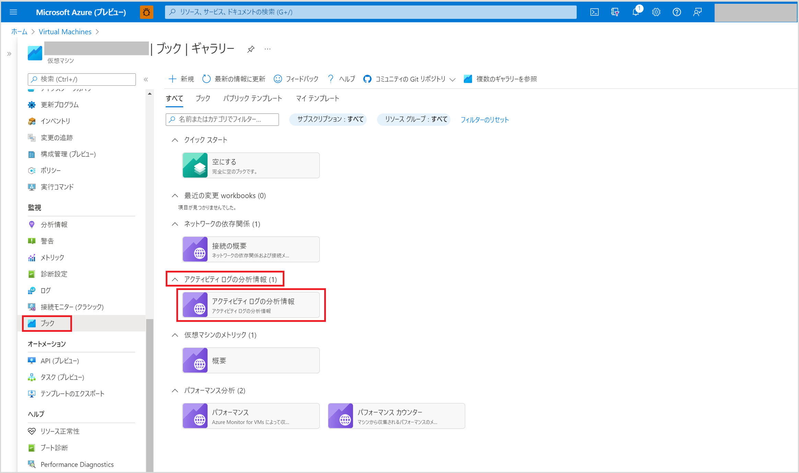
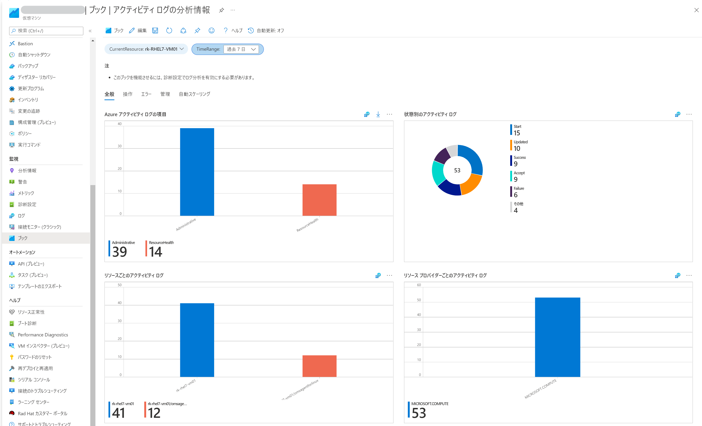

こんにちは、Azure Monitoring チームの 北村 です。

本記事は、2022 年 4 月 24 日に Azure Monitor Blog で公開された [Activity Logs Insights (Preview)](https://techcommunity.microsoft.com/t5/azure-observability-blog/activity-logs-insights-preview/ba-p/3291892) を翻訳したものになります。
プレビューとして提供されているアクティビティ ログの分析情報に関する記事をお届けいたします。

==========================================================================================

<!-- more -->
この記事では、アクティビティ ログの分析情報の概要、またその有効化および設定手順をご説明いたします。

- [アクティビティ ログの分析情報の概要](#アクティビティ-ログの分析情報の概要)
- [アクティビティ ログの分析情報に必要な設定手順](#アクティビティ-ログの分析情報に必要な設定手順)
- [アクティビティ ログの分析情報の閲覧方法](#アクティビティ-ログの分析情報の閲覧方法)

## アクティビティ ログの分析情報の概要
"アクティビティ ログの分析情報" は、Azure Monitor の Workbook 機能を利用したアクティビティ ログの分析機能です。
診断設定により Log Analytics ワークスペースに収集されたアクティビティ ログをもとに、
アクティビティ ログをカテゴリごとに表示したグラフや、リソース プロバイダーごとに表示したグラフなどが表示されます。
そのため、ユーザー様がクエリを構成することや、アクティビティ ログの一覧から必要な情報を苦労して抽出することなく、
アクティビティ ログを視覚的かつ容易に分析することが可能です。

**注意** 現在、"アクティビティ ログの分析情報" の機能はプレビューとして提供しています。
そのため現時点では一部の基本的な機能が実装されており、今後さらに新たな分析項目を追加する予定です。

## アクティビティ ログの分析情報に必要な設定手順
アクティビティ ログの分析情報を有効化するには、アクティビティ ログを Log Analytics ワークスペースに
エクスポートするように設定するだけです。
-- Log Analytics ワークスペースに送信する
https://docs.microsoft.com/ja-jp/azure/azure-monitor/essentials/activity-log#send-to-log-analytics-workspace

## アクティビティ ログの分析情報の閲覧方法
アクティビティ ログの分析を行うスコープ (リソース、リソース グループ、サブスクリプション) によって表示手順が異なります。
それぞれ手順を説明します。

- リソース グループまたはサブスクリプション レベル
- リソース レベル

**リソース グループまたはサブスクリプション レベル**
リソース グループまたはサブスクリプション レベルでアクティビティ ログの分析情報を表示するための手順は以下のとおりです。
1. Azure ポータル で [**モニター**] - [**ブック**] を選択します。
2. **分析情報** セクションで **アクティビティ ログの分析情報** を選択します。

3. アクティビティ ログの分析情報ページの上部で以下のとおり選択します。
   1. **サブスクリプション** メニューで 1 つもしくは複数のサブスクリプションを選択します。
   2. **ResourceGroup** メニューでリソース グループを選択します。
   3. **TimeRange** メニューでデータを表示する時間の範囲を選択します。
   以下のとおり選択したリソース グループに関するアクティビティ ログの状態や、アクティビティ ログのカテゴリを確認できます。

**リソース レベル**
リソース レベルでアクティビティ ログの分析情報を表示するための手順は以下のとおりです。
1. まず、アクティビティ ログの分析情報を確認したいリソースを選択します。
   下図は、Azure portal から仮想マシンを選択し、 [ブック] を選択した例です。
2. **アクティビティ ログの分析情報** を選択します。

3. アクティビティ ログの分析情報ページの上部で以下のとおり選択します。
   1. TimeRange メニューでデータを表示する時間の範囲を選択します。
   以下のとおりアクティビティ ログの状態や、リソース プロバイダーごとのアクティビティ ログを視覚的に確認することができます。
   

アクティビティログ の分析情報の詳細につきましては、以下記事をご覧ください。
-- アクティビティ ログの分析情報
https://docs.microsoft.com/ja-jp/azure/azure-monitor/essentials/activity-log#activity-log-insights