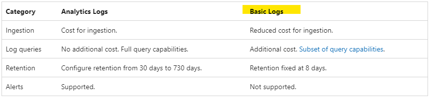
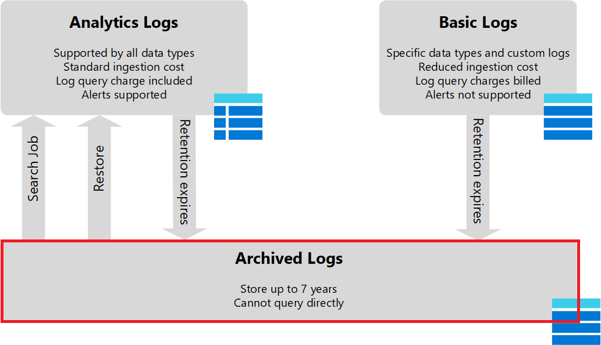
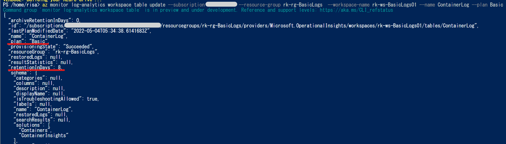
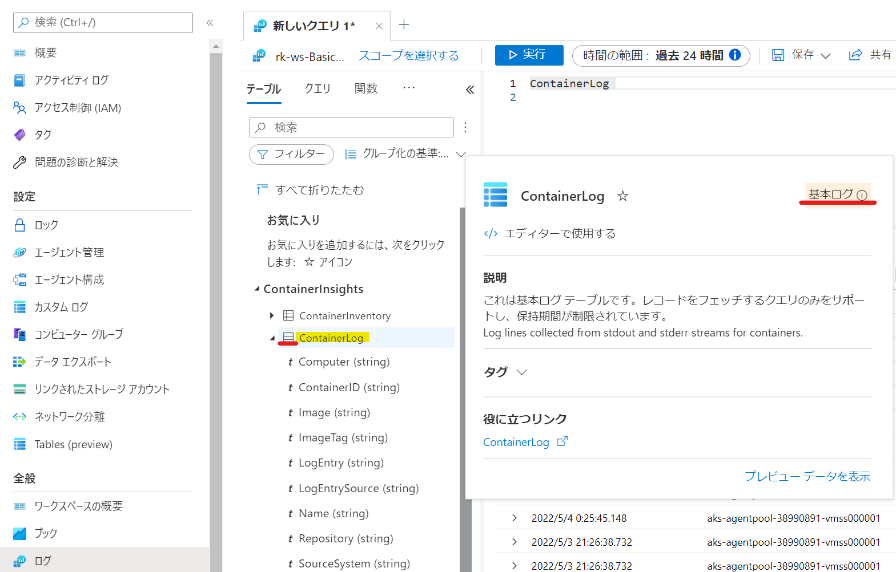
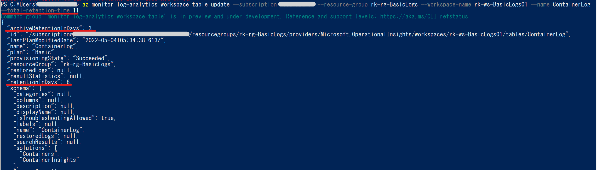
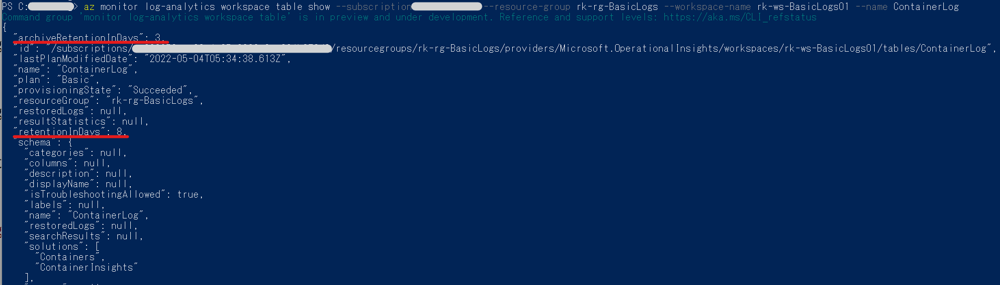

こんにちは！ Azure Monitoring サポート チームの北村です。

今回は Log Analytics の新機能としてプレビューで提供されている Basic Logs と Archived Logs をご紹介いたします。
Log Analytics ワークスペースにログを収集しているが、コストを削減したい...という方にはお勧めしたい機能です。
本記事では Basic Logs と Archived Logs の概要とその設定方法をご案内します。

<!-- more -->

## 目次
- Basic Logs とは
- Archived Logs とは 
- Azure CLI コマンドを利用した Basic Logs の設定方法
- Azure CLI コマンドを利用した Archived Logs の設定方法
- まとめ

## Basic Logs とは
まず、Basic Logs のプレビュー リリースに伴い、Azure Monitor のすべての機能を使用できる Log Analytics ワークスペース内の
テーブルは Analytics Logs と呼ばれるようになりました。今まで Log Analytics ワークスペースに収集されていたログは
すべて Analytics Logs であり、デフォルトでは Analytics Logs となっています。

そして、今回の大幅なアップデートに伴い、Analytics Logs とは別に Basic Logs というプランが追加されました。
Basic Logs のデフォルトのデータ保有期間は 8 日間であり、クエリで使用できる演算子が限定的であったり、
アラートには使用できない等の制限事項がございます。
しかし、Azure Monitor のすべての機能を使用できないという制約がある分、Analytics Logs より安くご利用いただけます。

**Analytics Logs と Basic Logs の違い**
※ [Log Analytics ワークスペースの概要 - ログ データ プラン（プレビュー）](https://docs.microsoft.com/ja-JP/azure/azure-monitor/logs/log-analytics-workspace-overview#log-data-plans-preview) より抜粋

<参考>
- Basic Logs で使用できる演算子は [KQL 言語の制限](https://docs.microsoft.com/ja-JP/azure/azure-monitor/logs/basic-logs-query?tabs=portal-1#kql-language-limits) をご覧ください。
- 現在はすべてのテーブルで Basic Logs のプランを選択することはできません。サポート テーブルは [Basic Logs をサポートするテーブル](https://docs.microsoft.com/ja-JP/azure/azure-monitor/logs/basic-logs-configure?tabs=cli-1%2Ccli-2#which-tables-support-basic-logs) でご確認ください。
- Basic Logs のご利用料金は [Azure Monitor の価格](https://azure.microsoft.com/ja-jp/pricing/details/monitor/) の [Basic ログ] をご確認ください。
  

## Archived Logs とは
Archived Logs は、名前のとおりログをアーカイブ領域に移動させ、長期保管するための機能です。
Analytics Logs は 最大 730 日、Basic Logs は 8 日間しかログを保持できませんが、
Archived Logs では 最大 7 年間データを保持することができます。

<参考>
- アーカイブしたデータにアクセスする場合はデータを復元するかジョブで検索する必要があります。詳細は [データ保持とアーカイブ](https://docs.microsoft.com/ja-JP/azure/azure-monitor/logs/log-analytics-workspace-overview#data-retention-and-archive) をご確認ください。
- Archived Logs のご利用料金は [Azure Monitor の価格](https://azure.microsoft.com/ja-jp/pricing/details/monitor/) をご参照ください。
  

## Azure CLI コマンドを利用した Basic Logs の設定方法
それでは Basic Logs の設定をしてみましょう！
本記事では `az monitor log-analytics workspace table update` コマンドを使用し、テーブル単位で設定する方法をご案内します。
Log Analytics ワークスペース名、ワークスペースが属するリソース グループ名、テーブル名等を指定し、以下のとおり実行します。

`az monitor log-analytics workspace table update --subscription <サブスクリプション名> --resource-group <リソース グループ名> --workspace-name <ワークスペース名> --name <テーブル名> --plan Basic`

Azure portal から変更内容を確認することができます。Log Analytics ワークスペース から [全般] - [ログ] を選択し、
Basic Logs プランに変更したテーブル名をクリックすると、テーブル名の右横に **基本ログ** と表示されていることがわかります。

なお、Basic Logs に変更する前は、以下のとおり表示されます（Analytics Logs とは表示されません）。

また、`az monitor log-analytics workspace table show` コマンドで設定内容を確認することもできます。
下図の実行例では `plan` が **Basic** 、`retentionInDays` が **8** となっていることがわかります。

`az monitor log-analytics workspace table show --subscription <サブスクリプション名> --resource-group <リソース グループ名> --workspace-name <ワークスペース名> --name <テーブル名> --output table`

<ご参考>
Basic Logs に関する設定方法等につきましては、下記弊社公開情報にも掲載しております。
Azure portal から設定する手順等につきましても以下をご覧ください。
- Basic Logs の設定方法 : [テーブル構成の設定](https://docs.microsoft.com/ja-JP/azure/azure-monitor/logs/basic-logs-configure?tabs=cli-1%2Ccli-2#set-table-configuration) もご覧ください。
- Basic Logs の確認方法 : [テーブル構成の確認](https://docs.microsoft.com/ja-JP/azure/azure-monitor/logs/basic-logs-configure?tabs=cli-1%2Ccli-2#check-table-configuration) にも掲載しております。
  

## Azure CLI コマンドを利用した Archived Logs の設定方法
Basic Logs と同様に、Azure CLI コマンドで設定する方法をご紹介します。こちらもテーブル単位で指定します。

`az monitor log-analytics workspace table update` コマンドには、保有期間を設定するパラメータが 2 つあります。
`retention-time` は Basic Logs もしくは Analytics Logs として保有する期間、
`total-retention-time` は Archived Logs としての保有期間を含めた、データの総保有期間を意味します。

以下の例では、Basic Logs を設定したテーブルに対し、 `total-retention-time` を `11` 日間に指定しています。
つまり、Basic Logs として 8 日間、Archived Logs として 3 日間の合計 11 日間、データが保持されることになります。

`az monitor log-analytics workspace table update --subscription <サブスクリプション名> --resource-group <リソース グループ名> --workspace-name <ワークスペース名> --name <テーブル名> ----retention-time <アーカイブされる前のデータ保有期間> --total-retention-time <総保有期間>`

なお、Basic Logs と同様に下記コマンドで設定内容を確認することができます。
`az monitor log-analytics workspace table show --subscription <サブスクリプション名> --resource-group <リソース グループ名> --workspace-name <ワークスペース名> --name <テーブル名>`

<ご参考>
Archived Logs に関する設定方法につきましては、下記弊社公開情報にも掲載しております。
Azure portal から設定する手順等につきましても以下をご覧ください。
- Archived Logs の設定方法 : [テーブル別に保持ポリシーとアーカイブ ポリシーを設定する](https://docs.microsoft.com/ja-JP/azure/azure-monitor/logs/data-retention-archive?tabs=cli-1%2Capi-2#set-retention-and-archive-policy-by-table) 
- Archived Logs の確認方法 : [テーブル別の保持ポリシーとアーカイブ ポリシーを取得する](https://docs.microsoft.com/ja-JP/azure/azure-monitor/logs/data-retention-archive?tabs=cli-1%2Ccli-2#get-retention-and-archive-policy-by-table)
  

## まとめ
本記事では、以下についてご案内いたしましたが、いかがでしたでしょうか。

- Basic Logs とは
- Archived Logs とは 
- Azure CLI コマンドを利用した Basic Logs の設定方法
- Azure CLI コマンドを利用した Archived Logs の設定方法

本記事が少しでもお役に立ちましたら幸いです。
以上、Log Analytics の新しい機能 Basic Logs と Archived Logs の概要と設定方法についてお伝えしました。
最後までお読みいただきありがとうございました！