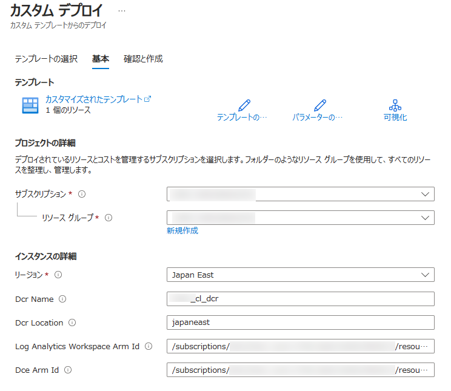
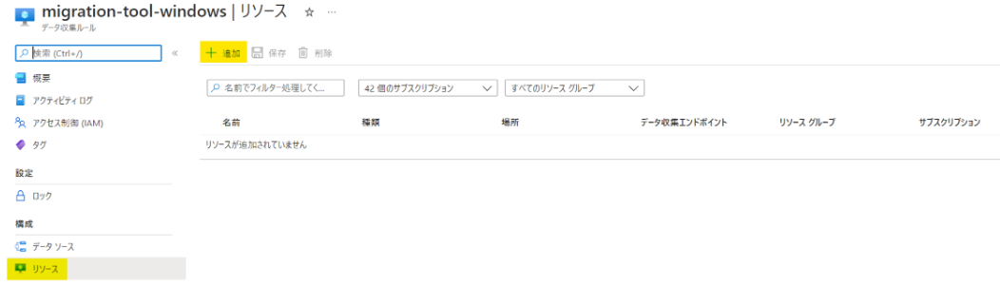

---
title: DCR Config Generator の使用方法
date: 2023-12-24 00:00:00
tags:
 - How-To
 - Log Analytics
 - Azure Monitor Agent
---
[更新履歴]  
- 2023/12/24 ブログ公開  
- 2026/01/19 廃止情報について追記 

>[!IMPORTANT] Log Analytics エージェント（MMA/OMS）は 2024 年 8 月 31 日をもって完全に廃止されました。
>本記事で紹介している DCR Config Generator は、廃止済みエージェントから Azure Monitor エージェント (AMA) への移行を支援するためのツールです。
>新規構成や運用では AMA をご利用ください。


こんにちは！Azure Monitoring チームの加治屋です。
この記事では、Log Analytics エージェントから Azure Monitor エージェントへの移行のために使用できるツールについてご紹介いたします。

※
DCR Config Generator の更新に伴い、ツールの利用方法が変更されております。
当記事は、DCR Config Generator バージョン 1.0.0 を前提として記載しております。

<!-- more -->

Log Analytics エージェントは 2024 年 8 月末でリタイアとなります。
継続してサポートを受けるためには、後継の Azure Monitor エージェントへ移行を行っていただく必要がございます。

Azure Monitor エージェントへの移行を行う場合、データ収集ルール (DCR) に対して、Log Analytics ワークスペースで設定されている収集設定を移行する必要があります。
お客様によっては、マシンの用途によって Log Analytics ワークスペースを分けられており、DCR への移行に以下のような問題を抱えていらっしゃるお客様も多いものと存じます。

例えば、、、
・Log Analytics ワークスペースから DCR に対する移行方法がよくわからない。
・Log Analytics ワークスペースが多くあり、かつログ収集定義がそれぞれ異なり、移行するのに工数がかかる。
・多くの Log Analytics ワークスペースを効率的に移行したいと思っているが、方法がわからない。
・移行に際して人為的なミスがあると困るので、機械的に移行を行いたい。
このようなお客様のお困りごとを解消するため、DCR Config Genetaor というツールをご用意しております。

以下の手順にて、DCR Config Generator を使用して、データ収集設定を Log Analytics ワークスペースから データ収集ルールへ移行することができます。

## DCR Config Generator の仕様
このツールは、指定した Log Analytics ワークスペースに登録されている Log Analytics エージェント用の定義をもとに、データ収集ルールをデプロイするための JSON ファイルを作成するためのツールです。
このツールを実行することにより、以下の JSON ファイルが作成されます。

・Windows イベントログ・パフォーマンス カウンター用ファイル
・Linux Syslog・パフォーマンス カウンター用ファイル
・VM Insights 用ファイル
・カスタム テキスト ログ用ファイル
・IIS Logs 用ファイル

上記のうち、カスタム テキスト ログ定義用ファイルのみ、カスタム テキスト ログ用として使用されているのカスタム テーブルの数だけデータ収集ルール用ファイルが作成されます。
また、上記それぞれに ARM テンプレート用のファイル (arm_template を含むファイル)、およびコマンドによるデータ収集ルール作成時用のファイル (payload を含むファイル) が作成されます。

### DCR Config Generator 使用のための前提条件
DCR Config Generator を使用するためには、以下のものが必要です。
・PowerShell バージョン 5.1 以降。 PowerShell バージョン 7.1.3 以降の使用をお勧めします。
・指定したワークスペース リソースへの読み取り/書き込みアクセス権
・ワークスペース エージェント構成情報をプルする Az Powershell モジュール。 Az.Accounts および Az.OperationalInsights モジュールが必要です。
・スクリプトを実行するためのコンテキストを設定する、Connect-AzAccount および Select-AzContext の実行用の Azure 資格情報。

### DCR Config Generator 使用前の確認事項
現在、Log Analytics エージェントにて VM Insights をご利用されており、かつ Azure Monitor エージェント移行後も VM Insights のご利用を予定されている場合は、以下の点についてご確認をお願いいたします。

＜確認事項＞
移行対象とするマシンにて、Dependency Agent がインストールされているかをご確認ください。
マシンの [拡張機能とアプリケーション] より、[DependencyAgentLinux] もしくは [DependencyAgentWindows] が表示されているかどうかで判断が可能です。
Dependency Agent がインストールされているマシンについては、Log Analytics エージェントの削除後に VM Insights 用のデータ収集ルールへの紐づけが必要です。

## DCR Config Generator の使用手順
### 手順 1
WorkspaceConfigToDCRMigrationTool.ps1 というスクリプトをダウンロードします。
スクリプトはこちらよりダウンロードください。
https://github.com/microsoft/AzureMonitorCommunity/tree/master/Azure%20Services/Azure%20Monitor/Agents/Migration%20Tools/DCR%20Config%20Generator

### 手順 2
手順 1 でダウンロードしたスクリプトを実行します。
実行例は以下の通りです。

<実行例>
```
$subId = "<subscription_id>"
$rgName = "<resourcegroup_Name>"
$workspaceName = "<ws_name>"
$dcrName = "<newdcr_name>"
$folderPath = "<結果を出力するフォルダへのパス>"
.\WorkspaceConfigToDCRMigrationTool.ps1 -SubscriptionId $subId -ResourceGroupName $rgName -WorkspaceName $workspaceName -DCRName $dcrName -OutputFolder $folderPath
```
まず上記を実行すると Azure アカウントへのログインが求められますので、ログインをお願いいたします。
その後、実行が完了すると、次のような出力がございます。

```
You entered:

Subscription Id     <subscription_id>
ResourceGroupName   <rg_name>
Workspace Name      <ws_name>

You are already logged into Azure

Success!
Check your output folder! (Relative path:  <結果を出力するよう指定したフォルダのパス>)
```

※ この手順にて、「デジタル署名されていない」旨のエラーが出る場合は ...
`Get-ExecutionPolicy -list` により、ポリシーを確認いただいた後、
`Set-ExecutionPolicy -Scope Process -ExecutionPolicy Bypass` により、設定を変更して再度お試しください。


このツールを実行すると、$folderPath に設定したフォルダに JSON ファイルが出力されます。
ただし、カスタム テキスト ログ収集定義につきましては、最初に以下の選択肢が出力されます。
```
Info: A Data Collection Endpoint is required for the Ingestion of Custom Logs via DCR
Do you want us to provision a DCE for you (in case you don't have one)? (y/n):
```

Azure Monitor エージェントを使用してカスタム テキスト ログの収集を行う場合、データ収集エンドポイント (DCE) が必要となります。
データ収集エンドポイントを事前に作成されていないお客様は、こちらの選択肢にてデータ収集エンドポイントの作成が可能です。

作成する場合は、以下の入力プロンプトが順番に表示されますので、必要な情報を入力します。
```
Info: Provisioning a Data Collection Endpoint (DCE) on your behalf
>>>>> Sub Id: 
>>>>> Resource Group: 
>>>>> Name: 
>>>>> Location: 
```

データ収集エンドポイントが作成されますと、以下のようなメッセージが表示されます。
```
Info: The DCE was successfully provisioned: /subscriptions/<Subscription Id>/resourceGroups/<Resouregroup Name>/providers/Microsoft.Insights/dataCollectionEndpoints/<dce-Name>
```

この項目でデータ収集エンドポイントを作成した場合は、カスタム テキスト ログ収集用の JSON ファイルにてデータ収集ルールをデプロイする際、ここで作成したデータ収集エンドポイントを使用するように JSON ファイルが構成されます。

ここでデータ収集エンドポイントの作成を行わない場合は、データ収集エンドポイントのリソース ID の指定が必要です。
以下の入力プロンプトが表示されますので、使用するデータ収集エンドポイントのリソース ID をご指定ください。

```
Please provide the full ARM ID of the DCE to use: 
```

なお、データ収集エンドポイントは Log Analytics ワークスペース、データ収集ルールと同じリージョンに作成する必要がございます。

### 手順 3 
ツールは終了していない状況ですが、エクスプローラーなどを使用して出力された JSON ファイルを確認し、必要なファイルが存在することを確認します。
この手順を使用する場合、ARM テンプレートを使用するため、arm_template が含まれる json で終わるファイルが作成されていることを確認してください。
対象とした Log Analytics ワークスペースに Windows 用のデータ収集設定が含まれている場合は Windows 用の JSON ファイル、Linux 用のデータ収集設定が含まれている場合は Linux 用の JSON ファイル、といったように Log Analytics ワークスペースに存在するログ収集定義に対応した JSON ファイルが出力されます。
出力される可能性があるファイルの種類につきましては、DCR Config Generator の仕様 をご確認ください。

### 手順 4
出力された JSON ファイルを使用し、データ収集ルールを作成します。

### 手順 4-I
すべての JSON ファイルの出力が完了しますと、ツールにて以下の選択肢が出力されます。

```
Do you want to run a test deployment of one of the generated DCR ARM templates? (y/n):
```

上記は JSON ファイルのテスト デプロイを行うための機能を使用するかを選択する質問でございます。
この設問で y を入力することで、実際に JSON ファイル (ARM テンプレート) をデプロイし、データ収集ルールを作成することが可能です。
※ この機能でデータ収集ルールのデプロイを実施しない場合は、個の選択肢では n を入力し、手順 4-II をご確認ください。

この機能を使用する場合は、以下のプロンプトが順番に表示されますので、必要な情報を入力します。
```
>>>> Deployment Subscription:   
>>>> Deployment Resource Group: 
>>>> ARM template file name   : 
```
※ ARM template file name の項目は、ファイル名のみを入力してください。(例: windows_dcr_arm_template.json)

正常にデプロイされますと、以下のメッセージが表示されます。
```
Info: Deployment done! Check your resource group in Azure for the newly created DCR.
```

以下の入力プロンプトが表示されます。引き続きデプロイする場合は y を入力することで続けてのデプロイが可能です。
もし、これ以上デプロイしない場合は n を入力してください。DCR Config Generator の実行が終了します。
```
Do you want to run another deployment? (y/n):
```

### 手順 4-II
出力された JSON ファイルを使用し、データ収集ルールを作成します。
ここでは、Azure ポータルの [カスタム テンプレートのデプロイ] よりデータ収集ルールを作成する手順をご案内いたします。

### 手順 4-II-1
Azure のサービス一覧から [カスタム テンプレートのデプロイ] を選択します。
[エディターで独自のテンプレートを作成する] をクリック後、[ファイルの読み込み] をクリックし、出力されたテンプレート ("arm_template" が含まれている .json で終わるファイル) を読み込み [保存] をクリックします。

#### 手順 4-II-2
必須項目を埋めて、 [確認と作成] -> [作成] の順にクリックします。
デプロイが完了したら、作成したリソースに移動します。


#### 手順 4-II-3
DCR とリソースの紐づけを行います。
※ 紐づけたいマシンの電源は、あらかじめ ON にしておく必要がございます。



手順は以上です。
もし、スクリプトの動作がおかしい、使用方法がよくわからない、などございましたら、ご遠慮なく弊社サポート チームへお問い合わせください。


## 参考情報
- DCR Config Generator のインストールと使用
https://learn.microsoft.com/ja-jp/azure/azure-monitor/agents/azure-monitor-agent-migration-tools#installing-and-using-dcr-config-generator
https://learn.microsoft.com/en-US/azure/azure-monitor/agents/azure-monitor-agent-migration-tools#installing-and-using-dcr-config-generator
