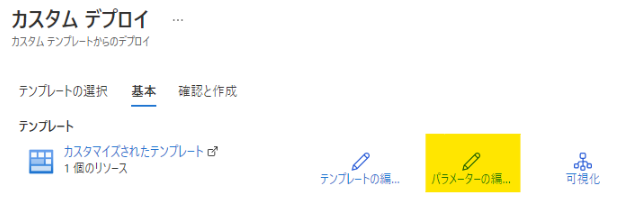

---
title: DCR Config Generator の使用方法
date: 2023-06-05 00:00:00
tags:
 - How-To
 - Log Analytics
 - Azure Monitor Agent
---

こんにちは！Azure Monitoring チームの加治屋です。
この記事では、Log Analytics エージェントから Azure Monitor エージェントへの移行のために使用できるツールについてご紹介いたします。

<!-- more -->

Log Analytics エージェントは 2024 年 8 月末でリタイアとなります。
継続してサポートを受けるためには、後継の Azure Monitor エージェントへ移行を行っていただく必要がございます。

Azure Monitor エージェントへの移行を行う場合、データ収集ルール (DCR) に対して、Log Analytics ワークスペースで設定されている収集設定を移行する必要があります。
お客様によっては、マシンの用途によって Log Analytics ワークスペースを分けられており、DCR への移行に以下のような問題を抱えていらっしゃるお客様も多いものと思っております。

例えば、、、
・Log Analytics ワークスペースから DCR に対する移行方法がよくわからない。
・Log Analytics ワークスペースが多くあり、かつログ収集定義がそれぞれ異なり、移行するのに工数がかかる。
・多くの Log Analytics ワークスペースを効率的に移行したいと思っているが、方法がわからない。
・移行に際して人為的なミスがあると困るので、機械的に移行を行いたい。
このようなお客様のお困りごとを解消するため、DCR Config Genetaor というツールをご用意しております。

以下の手順にて、DCR Config Generator を使用して、データ収集設定を Log Analytics ワークスペースから データ収集ルールへ移行することができます。

## DCR Config Generator の使用手順
### 手順 1
WorkspaceConfigToDCRMigrationTool.ps1 というスクリプトをダウンロードします。
スクリプトはこちらよりダウンロードください。
https://github.com/microsoft/AzureMonitorCommunity/tree/master/Azure%20Services/Azure%20Monitor/Agents/Migration%20Tools/DCR%20Config%20Generator

### 手順 2
手順 1 でダウンロードしたスクリプトを実行します。
実行例は以下の通りです。

<実行例>
```
$subId = "<subscription_id>"
$rgName = "<rg_name>"
$workspaceName = "<ws_name>"
$dcrName = "<newdcr_name>"
$location = "<location>"
$folderPath = "<結果を出力するフォルダへのパス>"
.\WorkspaceConfigToDCRMigrationTool.ps1 -SubscriptionId $subId -ResourceGroupName $rgName -WorkspaceName $workspaceName -DCRName $dcrName -Location $location -FolderPath $folderPath
```
まず上記を実行すると Azure アカウントへのログインが求められますので、ログインをお願いいたします。
その後、実行が完了すると、次のような出力がございます。

```
You entered:

Subscription Id     <subscription_id>
ResourceGroupName   <rg_name>
Workspace Name      <ws_name>

You are already logged into Azure

Success!
Check your output folder! (Relative path:  <結果を出力するよう指定したフォルダのパス>)
```

※ この手順にて、「デジタル署名されていない」旨のエラーが出る場合は ...
`Get-ExecutionPolicy -list` により、ポリシーを確認いただいた後、
`Set-ExecutionPolicy -Scope Process -ExecutionPolicy Bypass` により、設定を変更して再度お試しください。


### 手順 3 
上記手順 2 で設定した、$folderPath に ARM テンプレートが出力されます。
出力された ARM テンプレートを確認し、必要なテンプレートが存在することを確認します。

対象とした Log Analytics ワークスペースに Windows 用のデータ収集設定が含まれている場合は、Windows 用の ARM テンプレートとパラメーター ファイル、Linux 用のデータ収集設定が含まれている場合は Linux 用の ARM テンプレートとパラメーター ファイルが出力されます。
Log Analytics ワークスペースに両方の定義が含まれている場合は、両方の ARM テンプレートとパラメーター ファイルがそれぞれ出力されます。

### 手順 4
出力された JSON を使用して DCR を作成します。

### 手順 4-1
Azure のサービス一覧から [カスタム テンプレートのデプロイ] を選択します。
[エディターで独自のテンプレートを作成する] をクリック後、[ファイルの読み込み] をクリックし、出力されたテンプレート ("parameters" が含まれていない .json で終わるファイル) を読み込み [保存] をクリックします。

### 手順 4-2
[パラメーターの編...]　をクリックします。
parameters.json で終わるファイルを手順 4-1 と同様に読み込み、 [保存]  をクリックします。


#### 手順 4-3
必須項目を埋めて、 [確認と作成] -> [作成] の順にクリックします。
デプロイが完了したら、作成したリソースに移動します。


#### 手順 4-4
DCR とリソースの紐づけを行います。
※ 紐づけたいマシンの電源は、あらかじめ ON にしておく必要がございます。


手順は以上です。
もし、スクリプトの動作がおかしい、使用方法がよくわからない、などございましたら、ご遠慮なく弊社サポート チームへお問い合わせください。


## 参考情報
- DCR Config Generator のインストールと使用
https://learn.microsoft.com/ja-jp/azure/azure-monitor/agents/azure-monitor-agent-migration-tools#installing-and-using-dcr-config-generator

