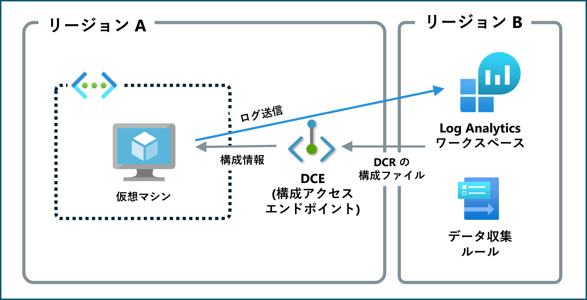
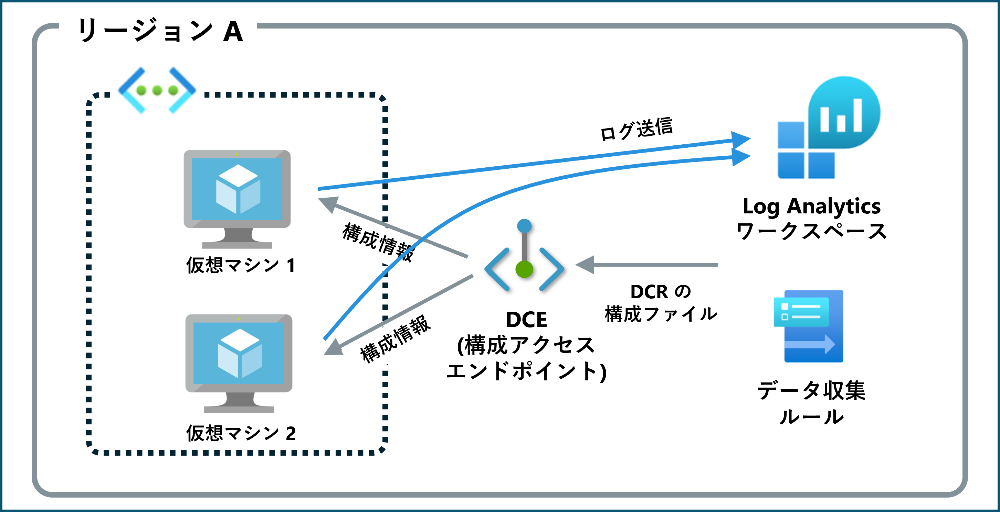

こんにちは、Azure Monitoring チームの徳田です。

本ブログでは、以下の公開情報に記載されていますデータ収集エンドポイントについて、具体例を用いてご説明します。

https://learn.microsoft.com/ja-jp/azure/azure-monitor/essentials/data-collection-endpoint-overview?tabs=portal
<!-- more -->

## 目次
- はじめに
- データ収集エンドポイント (DCE) とは
- データ収集ルールが使用するエンドポイントの種類
  - ログ インジェスト エンドポイント
  - (メトリック インジェスト エンドポイント)
  - 構成アクセス エンドポイント
- データ収集エンドポイントの二種類の設定箇所
  - データ収集ルールの作成 [基本] タブ
    - 設定方法
    - 目的
    - 制限事項
  - データ収集ルールの作成 [リソース] タブ
    - 設定方法
    - 目的
    - 制限事項
- 具体的なシナリオにおけるデータ収集エンドポイントの構成
- データ収集エンドポイントに関する FAQ
- まとめ

## はじめに
Azure Monitor エージェントを使用してログやメトリックを収集する場合、その収集ルールはデータ収集ルール (DCR) を使用して設定します。
データ収集ルールを作成する際、データ収集エンドポイントを設定できる箇所が 2 つあります。
今回は、それぞれで設定できるデータ収集エンドポイントの違いを説明するとともに、具体的な例を用いて、どのようにそれぞれのエンドポイントを構成すればよいのかをご紹介します。

## データ収集エンドポイント (DCE) とは
データ収集エンドポイント (DCE) は、Azure Monitor エージェントなどのデータ ソースが収集したデータを、処理して Azure Monitor に送信する際の接続を担います。

// ## データ収集ルール (DCR) エンドポイントとは
// DCR エンドポイントは、データ収集エンドポイントと同様の役割を担います。

// 2024 年 3 月 31 日以前は (エンドポイントが必要なすべてのシナリオにおいて) DCR 作成時にエンドポイントとして DCE が必要でした。
// しかし、2024 年 3 月 1 日以降は、DCR 独自のログ及びメトリック インジェスト エンドポイント (DCR エンドポイント) が含まれます。

## データ収集ルールが使用するエンドポイントの種類
### ログ インジェスト エンドポイント
ログをデータ インジェスト パイプラインに取り込むエンドポイントです。
カスタム ログ、および IIS ログを取り込む際またはログ インジェスト APIを使用してログ収集を行いたい場合に必要です。

### (メトリック インジェスト エンドポイント)

### 構成アクセス エンドポイント
Azure Monitor エージェントがデータ収集ルール (DCR) の構成情報を取得するためのエンドポイントです。
データ収集元となる VM に紐づけられます。
Azure Monitor Private Link Scope を使用してログ収集を行いたい場合に必要です。

## データ収集エンドポイントの二種類の設定箇所
[データ収集ルールが使用するエンドポイントの種類] でご紹介したそれぞれのエンドポイントは、データ収集ルール作成時に設定することが可能です。
その方法をご紹介します。

### データ収集ルールの作成 - [基本] タブ
#### 設定方法
Azure portal のデータ収集ルールの作成手順における [基本] タブで設定します。
以下画像に示す、"エンドポイント ID" で設定します。

#### 目的
ログ インジェスト エンドポイント (およびメトリック インジェスト エンドポイント) を設定します。

#### 制限事項
* 送信先の Log Analytics ワークスペース、およびデータ収集ルールと同じリージョンに存在する必要があります。

#### 補足
ログ インジェスト API を使用しない場合、およびカスタム ログ、IIS ログの収集を行わない場合、このデータ収集エンドポイントの設定は必要ありません。
この場合、Log Analytics ワークスペース リソース固有のエンドポイントを介してデータが収集されます。

### データ収集ルールの作成 - [リソース] タブ
#### 設定方法
Azure portal のデータ収集ルールの作成手順における [リソース] タブで設定します。
以下画像に示す "データ収集エンドポイントを有効にする" のチェック ボックスにチェックを入れ、"データ収集エンドポイント" 列でエンドポイントを設定します。

#### 目的
構成アクセス エンドポイントを設定します。

#### 制限事項
* 収集元の VM と同じリージョンに存在する必要があります。
* 1 つの VM に複数の DCE を紐づけることはできません。

#### 補足
[Azure Private Link Scope (APMPLS)](https://learn.microsoft.com/ja-jp/azure/private-link/private-link-overview) を使用せずにログ収集を行う場合、このデータ収集エンドポイントの設定は必要ありません。
この場合、Azure Monitor エージェントはグローバルまたはリージョン共通の構成アクセス エンドポイントを介して構成情報を取得します。

//参考情報
- ファイアウォールの要件
https://learn.microsoft.com/ja-jp/azure/azure-monitor/agents/azure-monitor-agent-data-collection-endpoint?tabs=PowerShellWindows#firewall-requirements

## 具体的なシナリオ
### ログ インジェスト API が使用したい / カスタム ログ または IIS ログを収集したい
* ログ インジェスト エンドポイント用の DCE が必要です。
* DCE はそれと紐づいている DCE と送信先 Log Analytics ワークスペースと同じリージョンに存在している必要があります。

#### 例 1

#### 例 2

### Azure Private Link Scope を使用してログを収集したい
* 構成アクセス エンドポイント用の DCE が必要です。
* DCE はデータ収集元の VM と同じリージョンに存在している必要があります
※ 以下の図内では、簡略化のためグローバル/リージョン共通のログ インジェスト エンドポイントを省略しております。

#### 例 1

#### 例 2

#### 例 3

#### 例 4

### ログ インジェスト API が使用したい / カスタム ログ または IIS ログを収集したい かつ Azure Private Link Scope を使用してログを収集したい
* ログ インジェスト エンドポイント用の DCE と構成アクセス エンドポイント用の DCE が必要です。
* VM、 Log Analytics ワークスペース、データ収集ルールが同じリージョンに存在する場合、これらと同じリージョンに存在する DCE 1 つをログ インジェスト エンドポイントと構成アクセス エンドポイントの両方に使用できます。

## データ収集エンドポイントに関する FAQ
既存のデータ収集エンドポイントが 1 つ存在する場合、それをデータ収集ルール作成時の [基本] タブと [リソース] の両方で指定することはできますか？
> 
はい、可能です。ただし、この場合はデータ収集ルール、送信先 Log Analytics ワークスペース、送信元 VM、データ収集エンドポイントがすべて同じリージョンに存在する必要があります。

最低限必要なデータ収集エンドポイントの数が分かりません。どのように考えればよいですか？
> 
ログ インジェスト エンドポイント、構成アクセス エンドポイントどちらが必要かによって考え方が異なります。
ログ インジェスト エンドポイントだけが必要な場合、必要な DCE の最低数は送信先の Log Analytics ワークスペースと使用するデータ収集ルールが存在するリージョンの数です。
この際、1 つの Log Analytics ワークスペースとそれに紐づいている DCR, DCE は同じリージョンに存在している必要があります。
構成アクセス エンドポイントだけが必要な場合、必要な DCE の最低数は送信元の VM が存在しているリージョンの数です。
この際、VM とそれに紐づける DCE は同じリージョンに存在している必要があります (複数の VM に同じ DCE を設定することができます)。

データ収集エンドポイントには料金がかかりますか？
>
データ収集エンドポイントの使用にあたり課金は発生しません。

Windows VM と Linux VM, どちらに対しても同じデータ収集エンドポイントを指定できますか？
> 
OS の種類に関わらず、複数の VM に 1 つのDCE (構成アクセス エンドポイント) を紐づけることが可能です。
この際も、VM とそれに紐づける DCE は同じリージョンに存在している必要があります。

## まとめ 
データ収集ルールを作成する際、ご自身の環境においてログ インジェスト エンドポイントと構成アクセス エンドポイント、それぞれ設定が必要かどうかを検討する必要があります。
そして必要なデータ収集エンドポイントの数は VM および Log Analytics ワークスペースが存在するリージョンによって変化します。