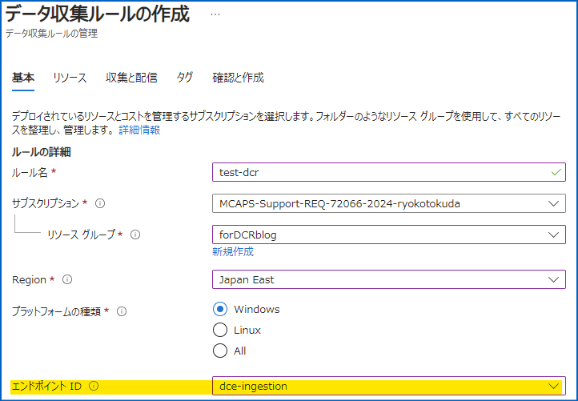
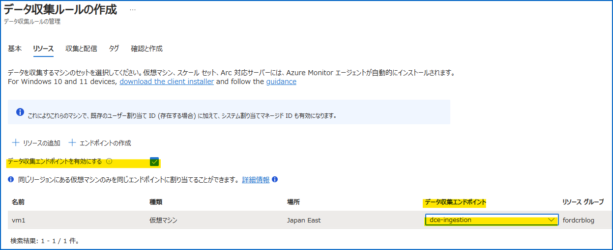
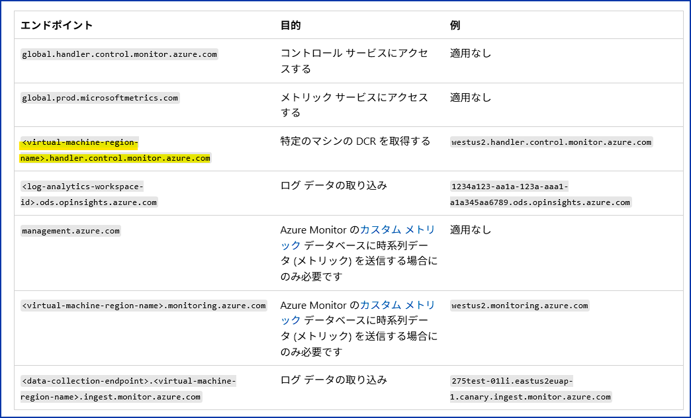
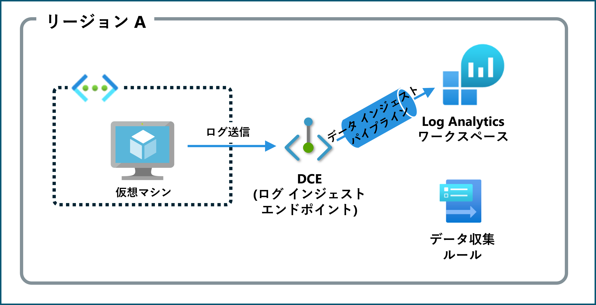
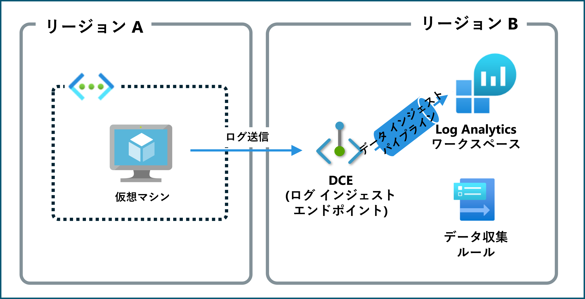
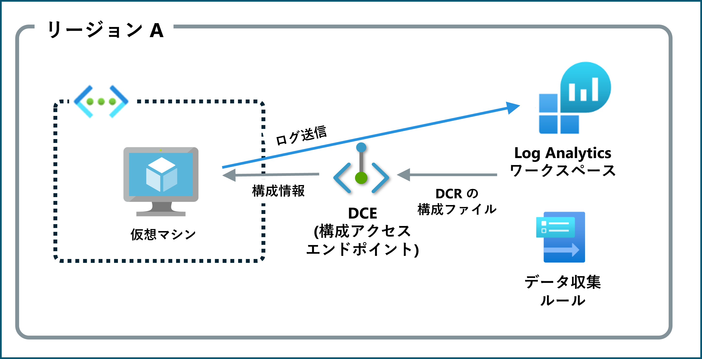
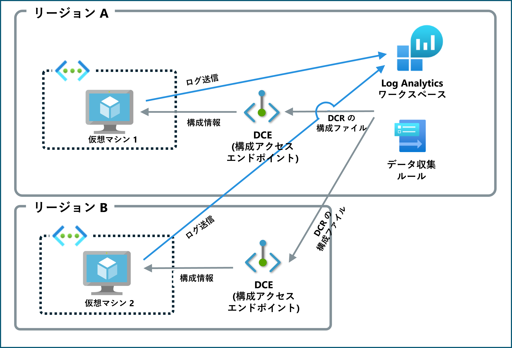
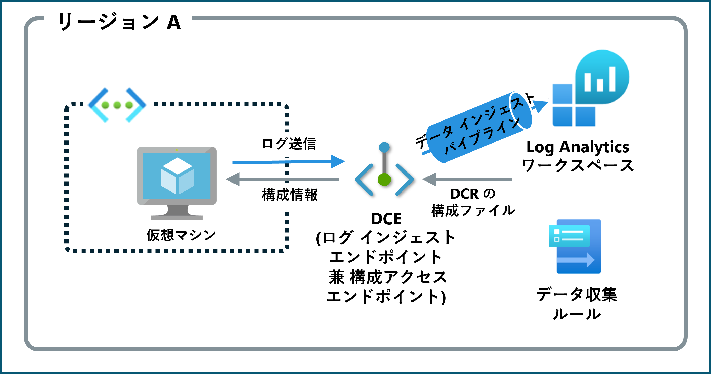
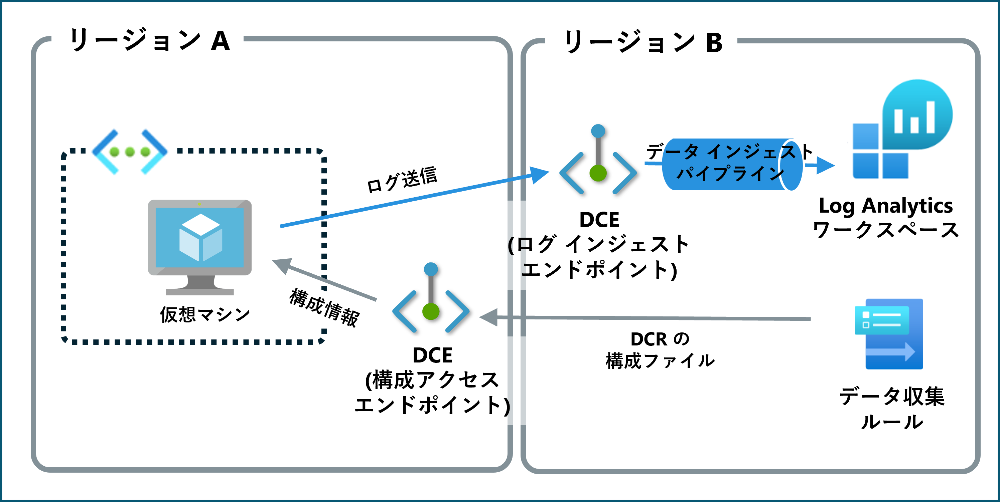

[更新履歴]  
- 2024/07/24 ブログ公開  
- 2026/08/12 一部仕様変更につき更新

こんにちは、Azure Monitoring チームの徳田です。

本ブログでは、以下の公開情報に記載されているデータ収集エンドポイントについて、その設定方法、利用目的、設定時の制限事項を、構成例を用いてご説明します。

[Azure Monitor のデータ収集エンドポイント](https://learn.microsoft.com/ja-jp/azure/azure-monitor/data-collection/data-collection-endpoint-overview?tabs=portal)
<!-- more -->

## 目次
- はじめに
- データ収集エンドポイント (DCE) とは
- データ収集ルールが使用するエンドポイントの種類
  - ログ インジェスト エンドポイント
  - メトリック インジェスト エンドポイント
  - 構成アクセス エンドポイント
- データ収集エンドポイントの 2 種類の設定箇所
  - データ収集ルールの作成 [基本] タブ
    - 設定方法
    - 目的
    - 制限事項
  - データ収集ルールの作成 [リソース] タブ
    - 設定方法
    - 目的
    - 制限事項
- データ収集エンドポイントのしくみ
- データ収集エンドポイントに関する FAQ
- まとめ

## はじめに
Azure Monitor エージェントを使用してログやメトリックを収集する場合、収集するデータや送信先などをデータ収集ルール (DCR) で設定します。  
データ収集ルールを作成する際、データ収集エンドポイントを設定できる箇所が 2 つあります。  
今回は、それぞれの箇所で設定するエンドポイントの役割と、リージョンに応じた構成方法をご紹介します。

## データ収集エンドポイント (DCE) とは
データ収集エンドポイント (DCE) は、収集したデータを Azure Monitor に取り込むためのエンドポイントと、Azure Monitor エージェントがデータ収集ルールの構成情報を取得するためのエンドポイントを提供する Azure リソースです。

## データ収集ルールが使用するエンドポイントの種類
### ログ インジェスト エンドポイント
ログをデータ インジェスト パイプラインに取り込むエンドポイントです。
DCE が必要となる条件については、「[補足 1: ログ インジェスト エンドポイントの設定について](#logs-ingestion-endpoint-settings)」で説明します。

### メトリック インジェスト エンドポイント
メトリックをデータ インジェスト パイプラインに取り込むエンドポイントです。  
エンドポイントを介してデータ インジェスト パイプラインに取り込まれたメトリックは、データ収集ルールで設定された [Azure Monitor ワークスペース](https://learn.microsoft.com/ja-jp/azure/azure-monitor/essentials/azure-monitor-workspace-overview)とテーブルに送信されます。

Azure Monitor ワークスペースとは

Azure Monitor が収集したメトリック データが収集されます。2026 年 8 月時点では、Prometheus および OpenTelemetry ベースの VM Insights メトリックが収集対象です。

### 構成アクセス エンドポイント
Azure Monitor エージェントがデータ収集ルールの構成情報を取得するためのエンドポイントです。  
データ収集元となる仮想マシン (以下、VM) に紐づけられます。  
[Azure Monitor Private Link Scope (AMPLS)](https://learn.microsoft.com/ja-jp/azure/azure-monitor/fundamentals/private-link-security) を使用して、Azure Monitor エージェントの通信をプライベート化する場合に必要です。

## データ収集エンドポイントの 2 種類の設定箇所
「データ収集ルールが使用するエンドポイントの種類」でご紹介したそれぞれのエンドポイントは、データ収集ルールの作成時に設定できます。
その方法をご紹介します。

### データ収集ルールの作成 - [基本] タブ
#### 設定方法
Azure portal のデータ収集ルールの作成手順における [基本] タブで設定します。
以下画像に示す、"エンドポイント ID" で設定します。

#### 目的
ログ インジェスト エンドポイントおよびメトリック インジェスト エンドポイントを設定します。

#### 制限事項
* 送信先の Log Analytics ワークスペース (メトリックを収集する場合は Azure Monitor ワークスペース)、およびデータ収集ルールと同じリージョンに存在する必要があります。

#### 補足 1 : ログ インジェスト エンドポイントの設定について
##### Azure Monitor エージェントのログ収集について
データ収集エンドポイントのログ インジェスト エンドポイントは以下のログ収集で使用することが可能です。

- [Windows ファイアウォール ログ](https://learn.microsoft.com/ja-jp/azure/azure-monitor/agents/data-sources-firewall-logs)
- カスタム ログ
  - [テキスト](https://learn.microsoft.com/ja-jp/azure/azure-monitor/agents/data-collection-text-log?tabs=portal)
  - [JSON](https://learn.microsoft.com/ja-jp/azure/azure-monitor/vm/data-collection-log-json)
- [IIS ログ](https://learn.microsoft.com/ja-jp/azure/azure-monitor/vm/data-collection-iis)

ファイアウォールなどで通信制限を行っている環境、また AMPLS を利用してプライベート通信を行う環境では、明示的にデータ収集エンドポイントを設定して、ログ インジェスト エンドポイントを指定する必要があります。
 
一方で、上記以外の環境構成では、明示的にデータ収集エンドポイントを設定しなくてもログ収集自体は可能です。この場合、弊社 Azure 内部の共通ログ インジェスト エンドポイントが利用されます。

##### ログ インジェスト API について
ログ インジェスト API では、DCR にログ インジェスト エンドポイントがない場合や、Private Link 経由でデータを送信する場合に DCE が必要です。
詳細は、以下公開情報をご参照ください。
https://learn.microsoft.com/ja-jp/azure/azure-monitor/logs/logs-ingestion-api-overview#endpoint

#### 補足 2 : メトリック インジェスト エンドポイントの設定について
Prometheus メトリックを収集するデータ収集ルールを手動で作成する場合、明示的にデータ収集エンドポイントを設定して、メトリック インジェスト エンドポイントを指定する必要があります。
 
(参考情報) Prometheus 用の Azure Monitor マネージド サービス
https://learn.microsoft.com/ja-jp/azure/azure-monitor/essentials/prometheus-metrics-overview#enable

### データ収集ルールの作成 - [リソース] タブ
#### 設定方法
Azure portal のデータ収集ルールの作成手順における [リソース] タブで設定します。  
以下画像に示す "データ収集エンドポイントを有効にする" のチェック ボックスにチェックを入れ、"データ収集エンドポイント" 列でエンドポイントを設定します。

#### 目的
構成アクセス エンドポイントを設定します。

#### 制限事項
* 収集元の VM と同じリージョンに存在する必要があります。
* 1 つの VM に複数の DCE を紐づけることはできません。

#### 補足
Azure Private Link Scope (AMPLS) を使用せずにログ収集を行う場合、このデータ収集エンドポイントの設定は必要ありません。  
この場合、Azure Monitor エージェントはリージョン共通の構成アクセス エンドポイント (下記参考情報のハイライト箇所) を介して構成情報を取得します。

(参考情報) ファイアウォールの要件
https://learn.microsoft.com/ja-jp/azure/azure-monitor/agents/azure-monitor-agent-network-configuration?tabs=PowerShellWindows#firewall-endpoints

## データ収集エンドポイントのしくみ

DCE のリージョン要件は、使用するエンドポイントの用途によって異なります。ここでは、ログの送信と構成情報の取得に分けて、そのしくみを説明します。

### ログ インジェスト エンドポイントによるログ送信
ログ インジェスト エンドポイントは、収集したログをデータ インジェスト パイプラインに送信するために使用されます。  
DCE をログ インジェスト エンドポイントとして使用する場合、DCE は送信先の Log Analytics ワークスペースおよびデータ収集ルールと同じリージョンに配置します。VM のリージョンは、この DCE の配置先には影響しません。

#### VM と送信先が同じリージョンにある場合
VM、Log Analytics ワークスペース、データ収集ルールが同じリージョンにある場合、ログ インジェスト エンドポイントとして使用する DCE も同じリージョンに配置します。  

#### VM と送信先が異なるリージョンにある場合
VM と送信先が異なるリージョンにある場合も、ログ インジェスト エンドポイントとして使用する DCE は、Log Analytics ワークスペースおよびデータ収集ルールと同じリージョンに配置します。  

### 構成アクセス エンドポイントによる構成情報の取得
構成アクセス エンドポイントは、Azure Monitor エージェントがデータ収集ルールの構成情報を取得するために使用されます。AMPLS を使用してこの通信をプライベート化する場合、VM に構成アクセス エンドポイントとして使用する DCE を関連付けます。  
この DCE は、データ収集ルールや送信先ではなく、VM と同じリージョンに配置します。

※ 以降の図では、簡略化のためログの送信経路を省略しています。

#### VM が 1 つのリージョンにある場合
構成アクセス エンドポイントとして使用する DCE を VM と同じリージョンに配置し、VM に関連付けます。下図では、この DCE を構成情報の取得にのみ使用しているため、ログの送信経路は分けて示しています。  

#### VM が複数のリージョンにある場合
構成アクセス エンドポイントとして使用する DCE は、VM が存在するリージョンごとに配置します。同じリージョンにある複数の VM で 1 つの DCE を共有できますが、1 つの VM に関連付けられる構成アクセス用の DCE は 1 つです。  

### ログ送信と構成情報取得の両方で DCE を使用する場合
ログの送信と構成情報の取得の両方で DCE を使用する場合、それぞれのリージョン要件を満たすように DCE を配置します。  
VM と送信先が同じリージョンにあるかどうかによって、1 つの DCE を両方の経路で共有できる場合と、経路ごとに DCE が必要な場合があります。

#### 1 つの DCE を共有できる配置
VM、Log Analytics ワークスペース、データ収集ルールが同じリージョンにある場合、1 つの DCE が両方のリージョン要件を満たします。この DCE を、ログ インジェスト エンドポイントと構成アクセス エンドポイントの両方に使用できます。  

#### 経路ごとに DCE が必要な配置
VM と送信先が異なるリージョンにある場合、1 つの DCE では両方のリージョン要件を満たせないため、2 つの DCE が必要です。  
構成アクセス エンドポイントとして使用する DCE は VM と同じリージョンに、ログ インジェスト エンドポイントとして使用する DCE は Log Analytics ワークスペースおよびデータ収集ルールと同じリージョンに配置します。

## データ収集エンドポイントに関する FAQ
**Q1.** 既存のデータ収集エンドポイントが 1 つ存在する場合、それをデータ収集ルール作成時の [基本] タブと [リソース] の両方で指定することはできますか？

**A1.** はい、可能です。  
ただし、この場合はデータ収集ルール、送信先 Log Analytics ワークスペース、送信元 VM、データ収集エンドポイントがすべて同じリージョンに存在する必要があります。

***

**Q2.** 最低限必要なデータ収集エンドポイントの数が分かりません。どのように考えればよいですか？

**A2.** ログ インジェスト エンドポイント、構成アクセス エンドポイントのどちらが必要かによって考え方が異なります。  

ログ インジェスト エンドポイントだけが必要な場合、必要な DCE の最低数は、送信先の Log Analytics ワークスペースと使用するデータ収集ルールが存在するリージョンの数です。  
この際、1 つの Log Analytics ワークスペースと、それに紐づいているデータ収集ルール、DCE は同じリージョンに存在している必要があります。  

構成アクセス エンドポイントだけが必要な場合、必要な DCE の最低数は送信元の VM が存在しているリージョンの数です。
この際、VM とそれに紐づける DCE は同じリージョンに存在している必要があります (複数の VM に同じ DCE を設定することができます)。

なお、ログ インジェスト エンドポイントと構成アクセス エンドポイントの両方が必要な場合、それぞれのリージョン要件を満たしていれば、1 つの DCE を両方の用途に使用できます。

***

**Q3.** データ収集エンドポイントには料金がかかりますか？

**A3.** Azure Monitor の公開料金情報では、データ収集エンドポイントは個別の課金項目として記載されていません。ただし、収集したデータの取り込みや保持などには料金が発生する場合があります。最新の情報については、[Azure Monitor の価格](https://azure.microsoft.com/ja-jp/pricing/details/monitor/)をご確認ください。

***

**Q4.** Windows VM と Linux VM のどちらに対しても、同じデータ収集エンドポイントを指定できますか？

**A4.** OS の種類に関わらず、複数の VM に 1 つの DCE (構成アクセス エンドポイント) を紐づけることが可能です。  
この際も、VM とそれに紐づける DCE は同じリージョンに存在している必要があります。

## まとめ 
データ収集ルールを作成する際は、ご自身の環境でログ インジェスト エンドポイントと構成アクセス エンドポイントが必要かどうかを、それぞれ確認します。  
必要な DCE の数と配置先は、送信先の Log Analytics ワークスペースおよびデータ収集元の VM が存在するリージョンによって異なります。