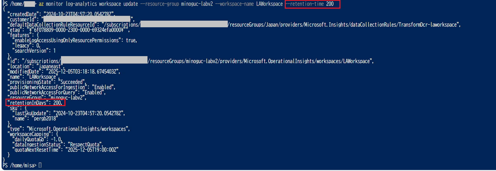
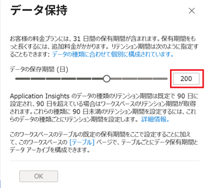
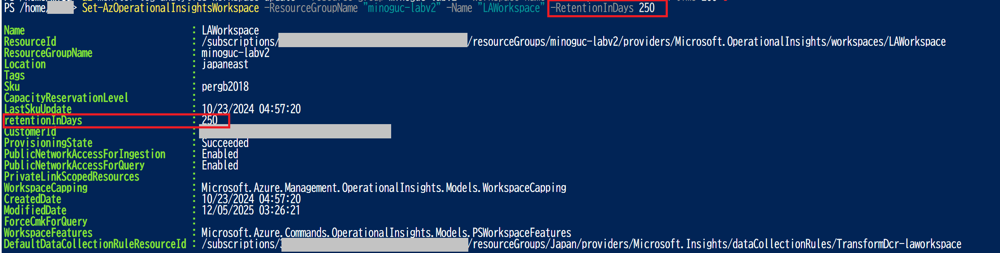

[更新履歴]
- 2022/4/4 ブログ公開
- 2025/12/26 最新情報に更新

こんにちは！ Azure Monitoring & Integration サポート チームの北村です。

今回は Log Analytics ワークスペースのデータ保有期間の変更方法をご案内いたします。
Azure portal では ワークスペースの保有期間は、30、31、60、90、120、180、270、365、550、および 730 日 しか設定できません。そのため、前述した日数以外の値を設定する場合は、Azure PowerShell や Azure CLI で設定する必要があります。
今回は、Azure portal 以外での設定変更方法として、Azure PowerShell と Azure CLI コマンドの例をご紹介します。

<!-- more -->

## 目次
- Log Analytics ワークスペースの保有期間
- Azure CLI コマンドを利用した設定
- Azure PowerShell を利用した設定
- まとめ

## Log Analytics ワークスペースの保有期間
まず、Log Analytics ワークスペースの保有期間は、30 日から 730 日まで設定できます。
730 日間を超えてログ データを保持する場合は、Azure ストーレジ アカウントや Azure イベント ハブにエクスポートすることを
ご検討ください。

-- Azure Monitor ログで使用量とコストを管理する - [データ保持期間の変更]
https://learn.microsoft.com/ja-jp/azure/azure-monitor/logs/manage-cost-storage#change-the-data-retention-period

## Azure CLI コマンドを利用した設定
`az monitor log-analytics workspace update` コマンドは、Log Analytics ワークスペースの設定を更新するコマンドです。
Log Analytics ワークスペース名、ワークスペースが属するリソース グループ名、retention-time に 30 ～ 730 の範囲で
任意の保持期間日数を指定します。

`az monitor log-analytics workspace update --resource-group <リソースグループ名> --workspace-name <ワークスペース名> --retention-time <保有期間>`

上記コマンドで変更した内容は、Azure portal から確認することもできます。
Log Analytics ワークスペース - [使用量と推定コスト] - [データ保持] をご覧ください。

<ご参考>
-- az monitor log-analytics workspace update
https://learn.microsoft.com/ja-jp/cli/azure/monitor/log-analytics/workspace?view=azure-cli-latest#az-monitor-log-analytics-workspace-update

-- az monitor log-analytics workspace show
https://learn.microsoft.com/ja-jp/cli/azure/monitor/log-analytics/workspace?view=azure-cli-latest#az-monitor-log-analytics-workspace-show
※ 上記コマンドでは、Log Analytics ワークスペースの設定値を確認することができます。

## Azure PowerShell を使用した設定
前述の Azure CLI コマンドと同様、Log Analytics ワークスペースの設定を更新するコマンドを使用します。
Log Analytics ワークスペース名、ワークスペースが属するリソース グループ名、RetentionInDays に 30 ～ 730 の範囲で
任意の保持期間日数を指定します。
`Set-AzOperationalInsightsWorkspace -ResourceGroupName "<リソースグループ名>" -Name "<ワークスペース名>" -RetentionInDays <保有期間>`

<ご参考>
下記弊社公開情報は、Az PowerShell 15.1.0 の情報でございます。お客様がご利用されているバージョンに沿った公開情報を
ご覧ください。

-- Set-AzOperationalInsightsWorkspace
https://learn.microsoft.com/en-us/powershell/module/az.operationalinsights/set-azoperationalinsightsworkspace?view=azps-15.1.0

-- Get-AzOperationalInsightsWorkspace
https://learn.microsoft.com/en-us/powershell/module/az.operationalinsights/get-azoperationalinsightsworkspace?view=azps-15.1.0
※ 上記コマンドでは、Log Analytics  ワークスペースの設定値を確認することができます。

## まとめ
本記事では、以下についてご案内いたしましたが、ご理解いただけましたでしょうか。
 
- Log Analytics ワークスペースの保有期間
- Azure CLI コマンドを利用した設定
- Azure PowerShellを利用した設定

本記事が少しでもお役に立ちましたら幸いです。
以上、Log Analytics  ワークスペース の保有期間の変更方法についてお伝えしました。
最後までお読みいただきありがとうございました！