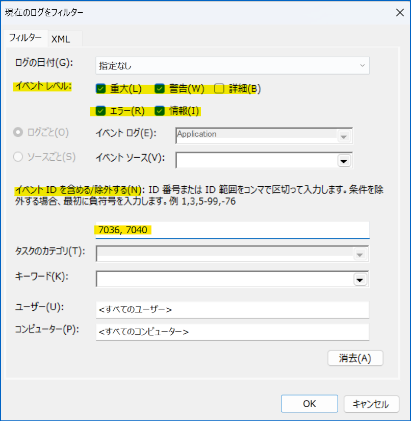
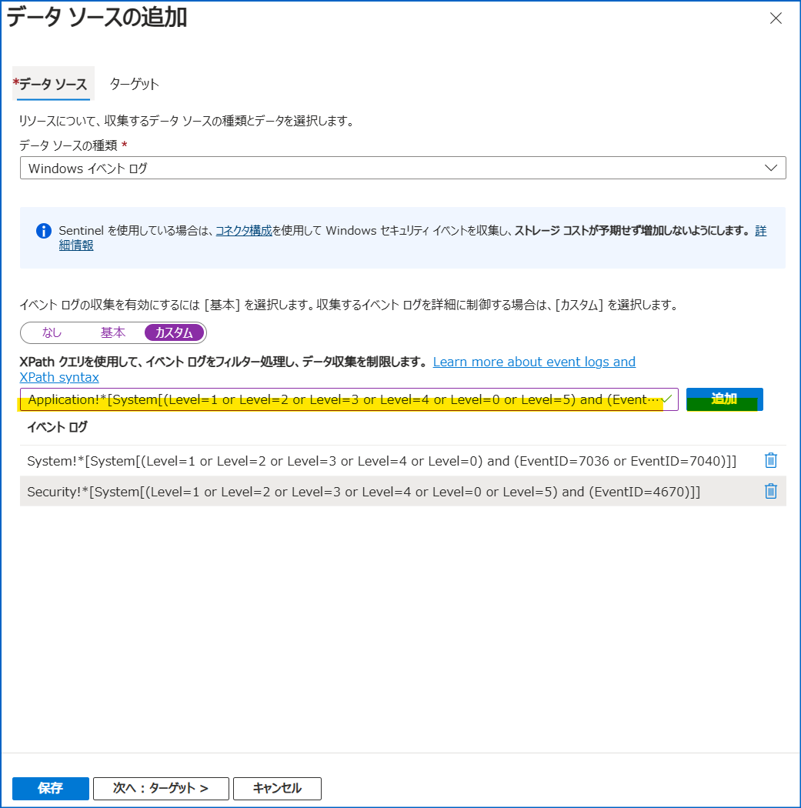
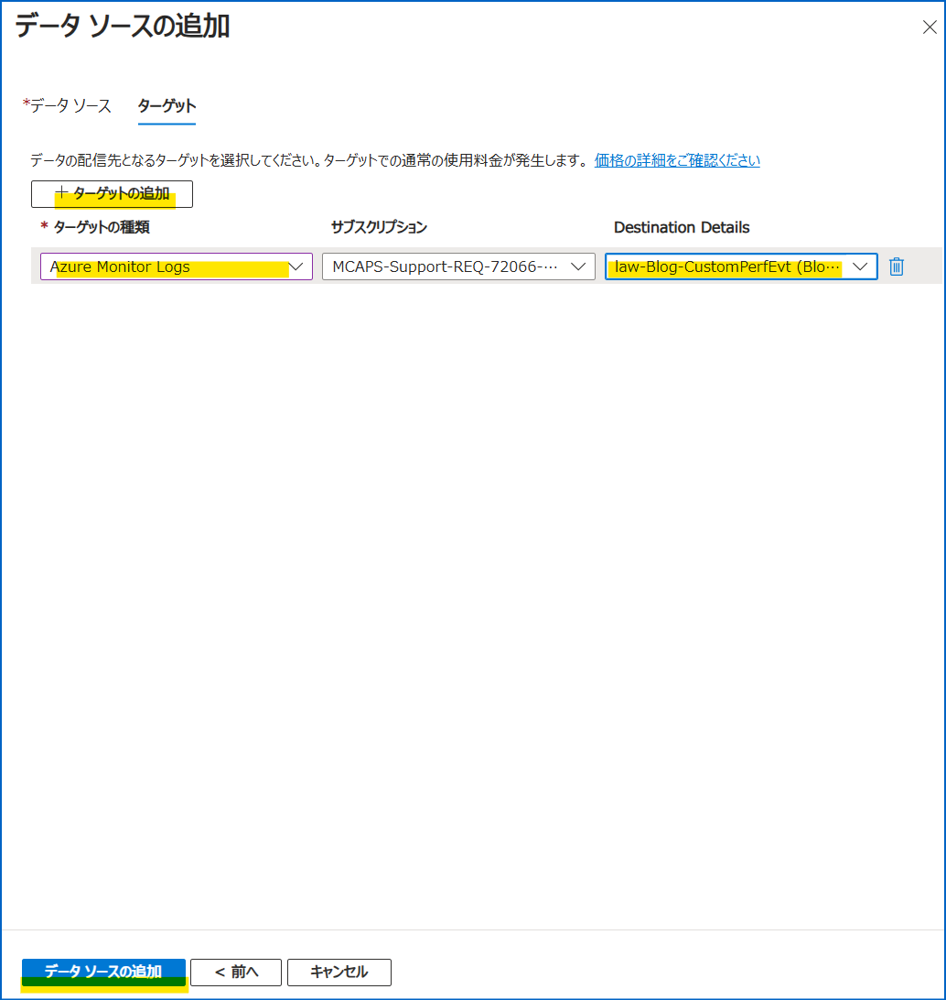
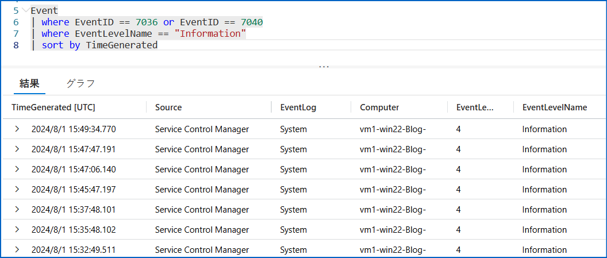

こんにちは、Azure Monitoring チームの徳田です。

本ブログでは、以下の公開情報に記載されています、Azure Monitor エージェントを使用してカスタムの Windows イベント ログを収集する方法についてご説明します。  

https://learn.microsoft.com/ja-jp/azure/azure-monitor/agents/data-collection-windows-events

<!-- more -->

## 目次
- はじめに
- カスタムのイベント ログの収集手順
  - 事前準備
  - 収集したいイベント ログの XPath を取得する
  - データ収集ルールを作成する
  - Windows イベント ログが収集されていることを確認する
- まとめ

## はじめに
Windows イベント ログは、データ収集ルール (DCR) のデータ ソースとして使用できるものの 1 つです。  
Windows イベント ログの種類は多数存在し、Azure portal でデフォルトで用意されているものと、そうでないものがあります。  
今回は、Azure portal でデフォルトで用意されていない Windows イベント ログ (以降、カスタム Windows イベント ログ) の収集設定方法についてご紹介します。

https://learn.microsoft.com/ja-jp/azure/azure-monitor/agents/data-collection-windows-events

## カスタム Windows イベント ログの収集手順
### 事前準備
以下のリソースがご自身の環境にあることを確認してください。
* データ収集元となる Windows OS の仮想マシン (以下 VM)
* データ収集先となる Log Analytics ワークスペース

### 収集したいイベント ログの XPath を取得する
任意のイベント ログをデータ収集ルールのデータ ソースとして指定し、収集設定したい場合、そのイベント ログの XPath が必要になります。
以下の手順に沿って任意のイベント ログの XPath を取得することができます。  

1. VM のスタート画面で "イベント ビューアー" または "Event Viewer" を検索し、開きます。

2. 左ペインで "Windows ログ" を押下し、配下の "Application", "セキュリティ", "Setup", "システム", "Forwarded Events" のいずれかを押下します。


3. 右ペインで "現在のログをフィルター" を押下します。
以下のようなウィンドウが表示されるため、"フィルター" タブで以下 2 つのパラメーターを設定します。
- イベント レベル
- イベント ID  
      

4. フィルターの設定ができたら、同ウィンドウの "XML" タブを開きます。
   以下 2 点を手元にメモします。
   - `<Select Path="2で選択したフォルダ">` の `2で選択したフォルダ` -- A
   - `<Select Path="2で選択したフォルダ">` と `</Select>` の間の `*[System[(Level=...) and (EventID=...)]]` の箇所 -- B

    

> [!NOTE]  
> 上記の方法で取得した XPath が有効であるかを確認したい場合、ローカルで確認することができます。  
> 手順は以下の通りです。  
> 1. Windows コンピュータで、PowerShell を開きます。  
> 2. 以下のクエリを実行します。  
>    この際、$XPath には、上記 4 で取得した B の値を設定してください。  
>    また、$LogName には、上記 4 で取得した A の値を設定してください。  
> ```   
> $XPath = '*[System[EventID=1035]]'   
> $LogName = 'Application' 
> Get-WinEvent -LogName $LogName -FilterXPath $XPath
> ```  
> 3. 結果を確認します。ログの一覧が表示されれば、指定した XPath は有効であると判断できます。

### データ収集ルールを作成する
1. Azure potral にログインします。
2. "deta collection rules" を選択します。
3. [作成] を押下し、"基本" タブの各値を入力します。  
    続いて "リソース" タブで収集元 VM を選択・追加します。
4. "収集と配信" タブで [データ ソースの追加] を押下します。  
    右ペイン内 "データ ソース" タブの "データ ソースの種類" で "Windows イベント ログ" を選択します。  
5. [カスタム] を押下し、入力欄に [収集したいイベント ログの XPath の取得](#収集したいイベント-ログの-xpath-の取得) にて取得した XPath の先頭に `<4で取得した A の値>!` ("<>" は不要です) を足したものを入力し、[追加] を押下します。  
    

6. [次へ : ターゲット >] を押下し、[+ ターゲットの追加] を押下します。  
    "ターゲットの種類" で "Azure Monitor Logs" を選択し、収集先となる Log Analytics ワークスペースを選択し、"データ ソースの追加" を押下します。  
    

7. [確認と作成] タブにて [作成] を押下し、完了です。

### Windows イベント ログが収集されていることを確認する
1. Azure portal にログインします。
2. [データ収集ルールの作成](#データ収集ルールの作成) の 6 で選択した Log Analytics ワークスペースのページを開きます。
3. 左ペインの [ログ] を押下し、以下のクエリを貼り付け、実行します。
   なお、where から始まる行は、収集の有無を確認したい EventID およびイベントレベルに置き換えてください。
```
Event
| where EventID == <イベント ID> 
| where EventLevelName == "Information" // 又は where EventLevel == "4"
| sort by TimeGenerated
```

例 : EventID が 7036 または 7040 の Information レベルのログ 
```
Event
| where EventID == 7036 or EventID == 7040
| where EventLevelName == "Information"
| sort by TimeGenerated
```

4. 以下画像のようにログが表示されれば、ログが収集できています。


## まとめ
本ブログではカスタム Windows イベント ログの収集設定方法についてご紹介しました。
データ収集ルールでは、収集したいイベント ログの XPath を指定することで、任意のログを収集することができます。
