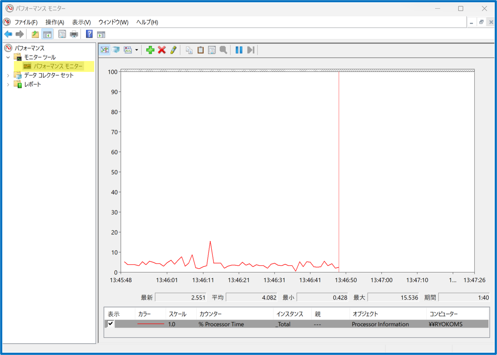
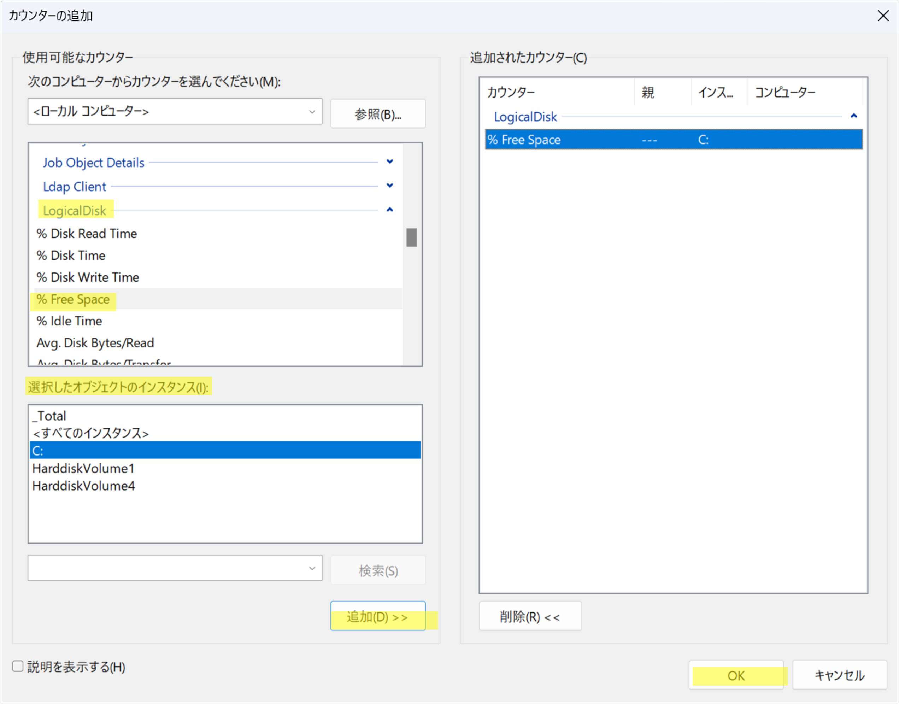
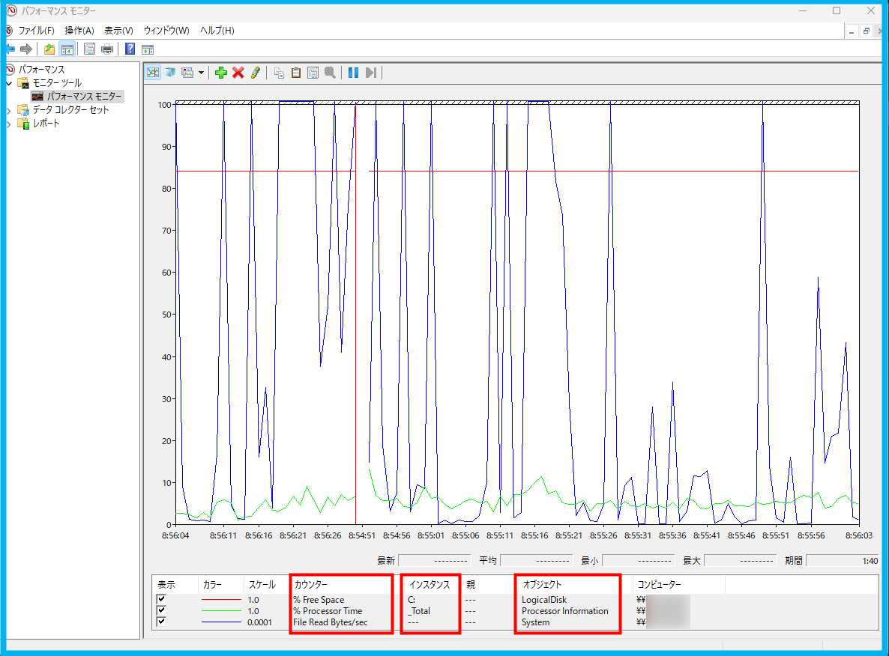
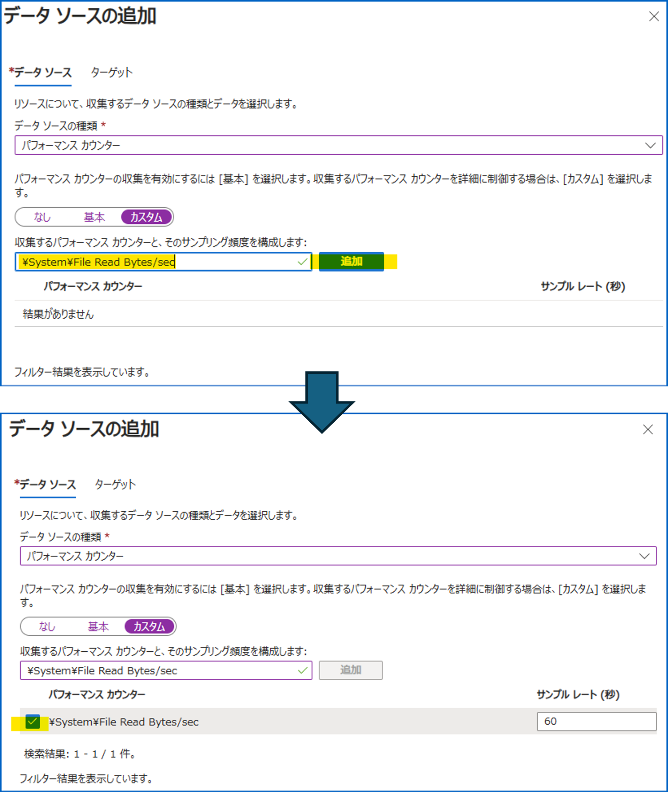
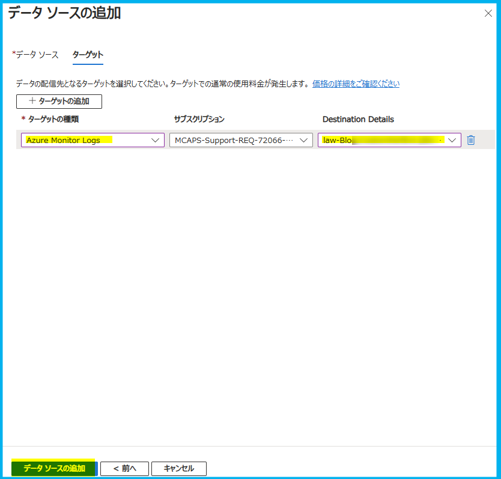

こんにちは、Azure Monitoring チームの徳田です。

本ブログでは、以下の公開情報に記載されています、についてご説明します。

<!-- more -->

## 目次
- はじめに
- カスタムのイベント ログの収集手順
  - 事前準備
  - 収集したいイベント ログの XPath の取得
  - データ収集ルールの作成
- まとめ

## はじめに
イベント ログは、データ収集ルール (DCR) のデータ ソースとして使用できるものの 1 つです。  
イベント ログの種類は多数存在し、Azure portal で定義済みのものと、そうでないものがあります。  
今回は、Azure portal で定義済みでない、カスタム イベント ログの収集設定方法についてご紹介します。

https://learn.microsoft.com/ja-jp/azure/azure-monitor/agents/data-collection-windows-events

## カスタムのパフォーマンス カウンターの収集手順
### 事前準備
以下のリソースがご自身の環境にあることを確認してください。
* データ収集元となる Windows OS の仮想マシン (以下 VM)
* データ収集先となる Log Analytics ワークスペース

### 収集したいイベント ログの XPath の取得
任意のイベント ログをデータ収集ルールのデータ ソースとして指定し、収集設定したい場合、そのイベント ログの XPath が必要になります。
以下の手順に沿って任意のイベント ログの XPath を取得することができます。  

1. VM のスタート画面で "パフォーマンス モニター" または "Performance Monitor" を検索し、開きます。

2. 左ペインで Monitoring Tools > Performance Monitor (モニター ツール > パフォーマンス モニター) を押下します。ウィンドウ中央に折れ線グラフが表示されます。  


3. 上部 + ボタンを押下し、確認したいパフォーマンス カウンターを押下します。この際、"選択したオブジェクトのインスタンス (I)" に複数の値が表示されている場合は任意のインスタンスも押下します。  
"追加" を押下し、"OK" を押下します。  

例 : パフォーマンス カウンターにインスタンスがない場合
  

例 : パフォーマンス カウンターにインスタンスがある場合



4. 折れ線グラフの下に、選択したパフォーマンス カウンターの一覧が表示されます。  
オブジェクト、インスタンス、カウンター列を参照し、以下のルールに従ってパフォーマンス カウンター名を手元にメモします。  



インスタンスがない場合 : `\<オブジェクト>\<カウンター>`  
    例 : `\System\File Read Bytes/sec`  
    
インスタンスがある場合 : `\<オブジェクト>(<インスタンス>)\<カウンター>`  
    例 : `\LogicalDisk(C:)\% Free Space`

### データ収集ルールの作成
1. Azure potral にログインします。
2. "deta collection rules" を選択します。
3. "作成" を押下し、"基本" タブの各値を入力します。  
    続いて "リソース" タブで収集元 VM を選択・追加します。
4. "収集と配信" タブで "データ ソースの追加" を押下します。  
    右ペイン内 "データ ソース" タブの "データ ソースの種類" で "Windows イベント ログ" を選択します。  
5. "カスタム" を押下し、入力欄に [収集したいイベント ログの XPath の取得](#収集したいイベント-ログの-xpath-の取得) で取得した XPath を入力し、"追加" を押下します。
    

6. "次へ : ターゲット >" を押下し、"+ ターゲットの追加" を押下します。  
    "ターゲットの種類" で "Azure Monitor Logs" を選択し、収集先となる Log Analytics ワークスペースを選択し、"データ ソースの追加" を押下します。
    

7. [確認と作成] タブにて "作成" を押下し、完了です。

### イベント ログの収集の確認
1. Azure portal にログインします。
2. [データ収集ルールの作成](#データ収集ルールの作成) の 6 で選択した Log Analytics ワークスペースのページを開きます。
3. 左ペインの [ログ] を押下し、以下のクエリを貼り付け、実行します。
   なお、where から始まる行は、収集の有無を確認したい EventID およびイベントレベルに置き換えてください。
```
Event
| where EventID == <イベント ID>
| where EventLevelName == "Information" // 又は where EventLevel == "4"
| sort by TimeGenerated
```

例 : EventID が 7036 または 7040 の Information 
```
Event
| where EventID == 7036 or EventID == 7040
| where EventLevelName == "Information"
| sort by TimeGenerated
```

4. 以下画像のようにログが表示されれば、ログが収集できています。


## まとめ
本ブログではパフォーマンス カウンターおよびカスタム パフォーマンス カウンターの収集設定方法についてご紹介しました。
データ収集ルールでは、収集したいパフォーマンス カウンターのパフォーマンス カウンター名を指定することで、任意のログを収集することができます。