こんにちは！ Azure Monitoring & Integration サポート チームの北村です。

今回は Log Analytics ワークスペースにセキュリティ イベント ログを収集する方法をご案内いたします。
ご利用されているエージェントによってログ収集方法が異なりますので、エージェントごとに設定方法をご紹介いたします。

<!-- more -->

## 目次
- Log Analytics エージェントと Azure Monitor エージェントにおける収集方法の違い
- Log Analytics エージェントによるセキュリティ イベント ログ収集の設定
- Azure Monitor エージェントによるセキュリティ イベント ログ収集の設定
- まとめ

## Log Analytics エージェントと Azure Monitor エージェントにおける収集方法の違い
Azure Monitor でセキュリティ イベント ログを収集する場合、
Azure Monitor エージェント または Log Analytics エージェントを使用します。
冒頭でも申し上げたとおり、エージェントによって収集方法が異なります (下表参照)。

### Log Analytics エージェントによるログ収集
Log Analytics エージェントは、他の Windows イベント ログとは異なり、
Log Analytics ワークスペースの [エージェント構成] からセキュリティ イベント ログの収集を設定することができません。
Microsoft Defender for Cloud または Microsoft Sentinel を使用する必要があり、ログは SecurityEvent テーブルに送信されます。
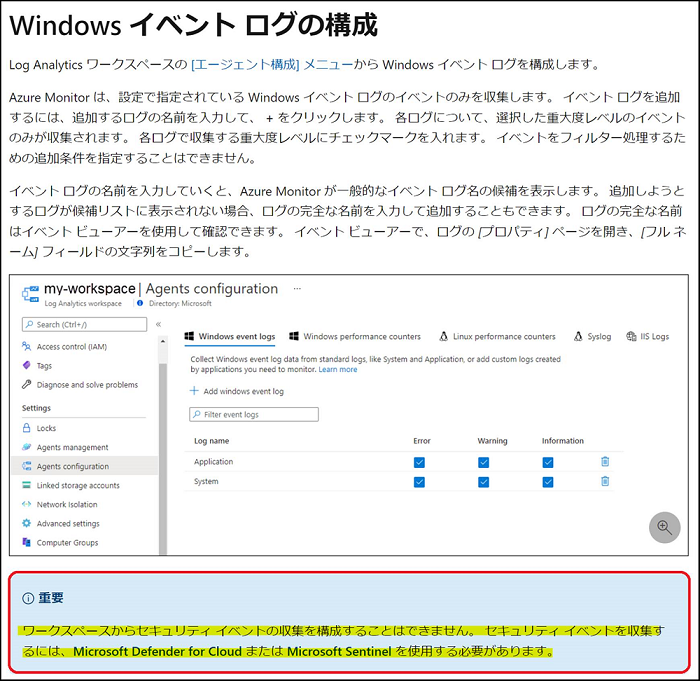

<参考>
-- Log Analytics エージェントを使用して Windows イベント ログのデータ ソースを収集する - [Windows イベント ログの構成] を
ご参照ください。
https://docs.microsoft.com/ja-jp/azure/azure-monitor/agents/data-sources-windows-events#configuring-windows-event-logs
-- Microsoft Sentinel に送信できるセキュリティ イベント ログは下記弊社公開情報をご覧ください。
https://docs.microsoft.com/ja-jp/azure/sentinel/windows-security-event-id-reference

### Azure Monitor エージェントによるログ収集
Azure Monitor エージェントでは、他の Windows イベント ログと同様に、
データ収集ルール (DCR) でセキュリティ イベント ログを収集することができます。ログは、Event テーブルに送信されます。
また、Microsoft Sentinel を使用して Azure Monitor エージェント経由でログを収集することもできますが、
その場合は SecurityEvent テーブルに送信されます (Log Analytics エージェントを使用する場合と同様です)。
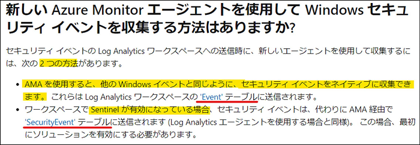

<参考>
-- 新しい Azure Monitor エージェントを使用して Windows セキュリティ イベントを収集する方法はありますか?
https://docs.microsoft.com/ja-jp/azure/azure-monitor/faq#----azure-monitor-------------windows--------------------------

## Log Analytics エージェントによるセキュリティ イベント ログ収集の設定
ここでは、Microsoft Sentinel を使用した Log Analytics エージェントによる セキュリティ イベント ログの収集手順をご紹介します。
下記手順は Azure VM を使用することを前提としております。
 
1. Azure portal から Microsoft Sentinel を選択します。
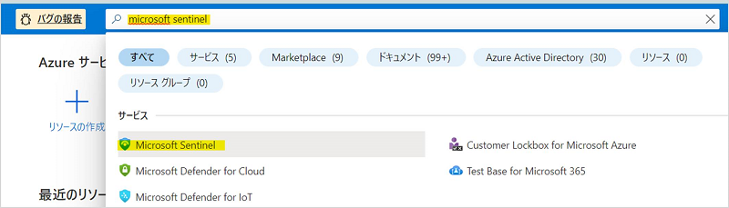

2. Microsoft Sentinel の画面上部の [+ 作成] をクリックします。

3. 新しい Log Analytics ワークスペースを作成する場合は、
画面上部の [+ 新しいワークスペースの作成] をクリックしてください。本手順では既に作成済みのワークスペースを選択します。
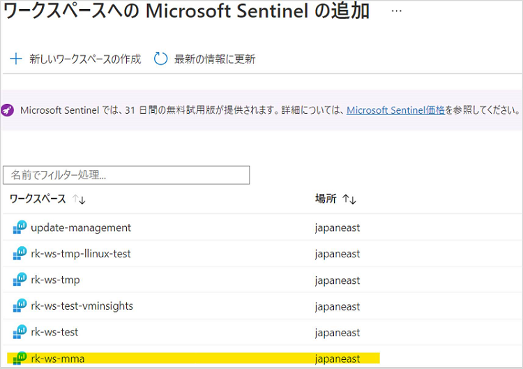

4. リソース メニュー の [データ コネクタ] から [レガシ エージェントを使用したセキュリティ イベント] のコネクタを選択し、
画面左下部の [コネクタ ページを開く] をクリックします。
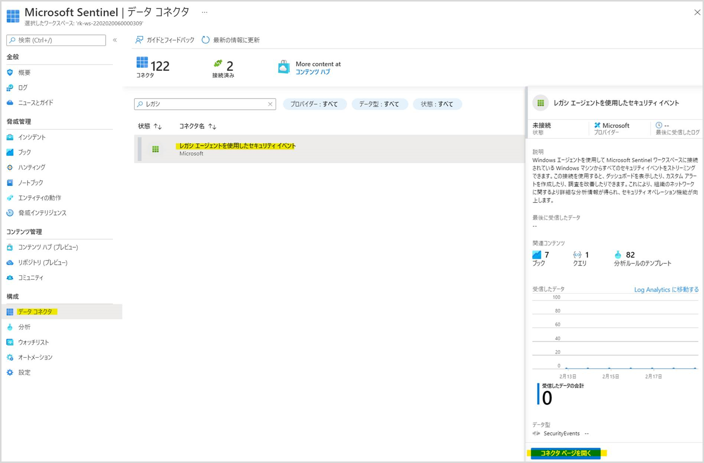

5. Log Analytics エージェントをダウンロードします。
[Azure Windows 仮想マシンのエージェントをダウンロードしてインストールする] をクリックします。
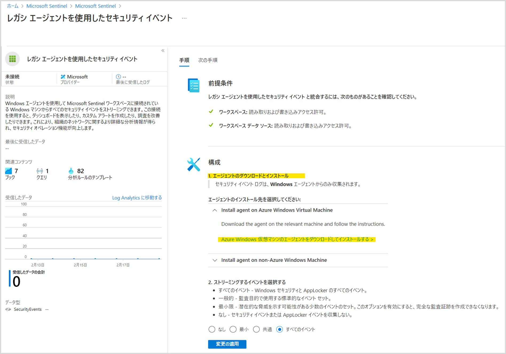

6. セキュリティ イベント ログを収集する仮想マシンを選択し、Log Analytics ワークスペースに接続します。

7. 収集するイベントを選択し、[変更の適用] を選択します。

8. Microsoft Sentinel のリソース メニューの [ログ] から SecurityEvent テーブルにログが収集されていることが分かります。
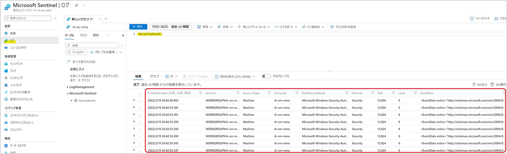

<参考>
-- 使用した Microsoft Sentinel のコネクタは [レガシ エージェントを使用したセキュリティ イベント (Windows)] です。
https://docs.microsoft.com/ja-jp/azure/sentinel/data-connectors-reference#security-events-via-legacy-agent-windows
-- 上記手順は、下記弊社公開情報にも掲載しております。
https://docs.microsoft.com/ja-jp/azure/sentinel/connect-azure-windows-microsoft-services?tabs=SA%2CLAA#windows-agent-based-connections

### Azure Monitor エージェントによるセキュリティ イベント ログ収集の設定
次に、Azure VM で データ収集ルール (DCR) を使用したセキュリティ イベント ログの収集設定手順をご紹介します。

1. Azure portal から [モニター] を開きます。左リソース メニューから [設定] - [データ収集ルール] を選択し、
画面左上部の [+ 作成] をクリックします。
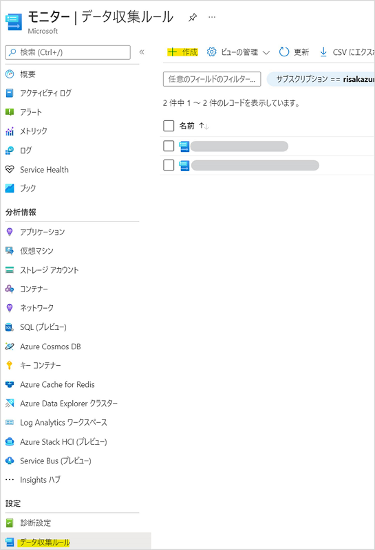

2. データ収集ルールを作成します。以下のとおり必要項目を入力します。

3. [+ リソースの追加] をクリックし、セキュリティ イベント ログを収集する仮想マシンを選択します。

4. [+ データ ソースの追加] を選択します。データ ソースの種類に [Windows event logs] の [セキュリティ] を選択します。
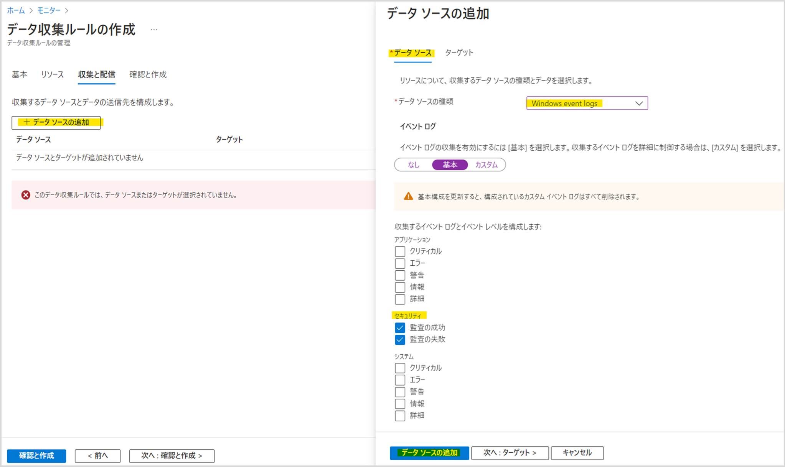
次にログを収集する Log Analytics ワークスペースを選択します。
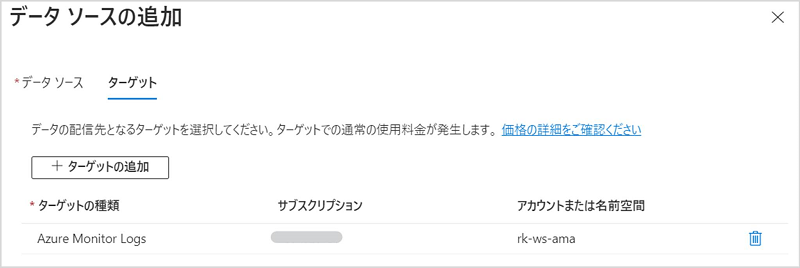

5. 最後に設定内容を確認し、[作成] をクリックします。
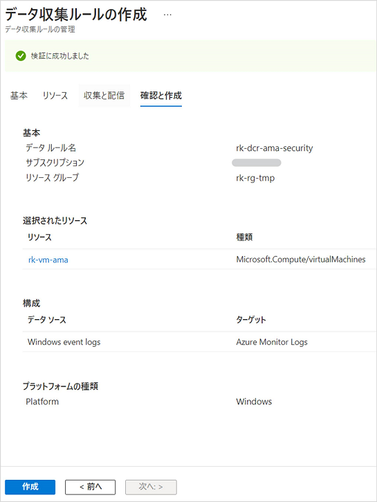

6. 前述 4. で指定した Log Analytics ワークスペースの [ログ] から Event テーブルにセキュリティ イベント ログが収集されていることが分かります。
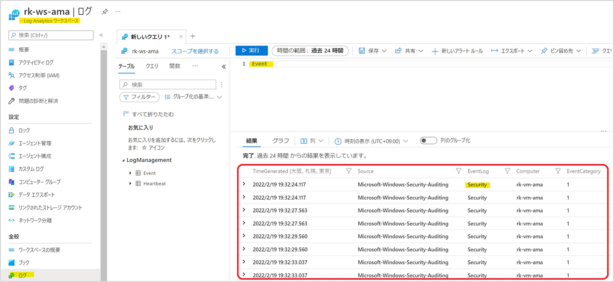

<参考>
-- データ収集ルール (DCR) につきましては、下記公開情報をご覧ください。
https://docs.microsoft.com/ja-jp/azure/azure-monitor/agents/data-collection-rule-azure-monitor-agent
-- Azure Monitor エージェントでも、Microsoft Sentinel にセキュリティ イベント ログを収集することは可能です。
使用するコネクタは下記弊社公開情報をご覧ください。
https://docs.microsoft.com/ja-jp/azure/sentinel/data-connectors-reference#windows-security-events-via-ama

## まとめ
本記事では、以下についてご案内いたしましたが、ご理解いただけましたでしょうか。
 
- Log Analytics エージェントと Azure Monitor エージェントにおける収集方法の違い
- Log Analytics エージェントによるセキュリティ イベント ログ収集の設定
- Azure Monitor エージェントによるセキュリティ イベント ログ収集の設定

本記事がご理解の助けとして、お役立ていただければ幸いです。
以上、Windows セキュリティ イベント ログの収集設定についてお伝えしました。

最後までお読みいただきありがとうございました！
