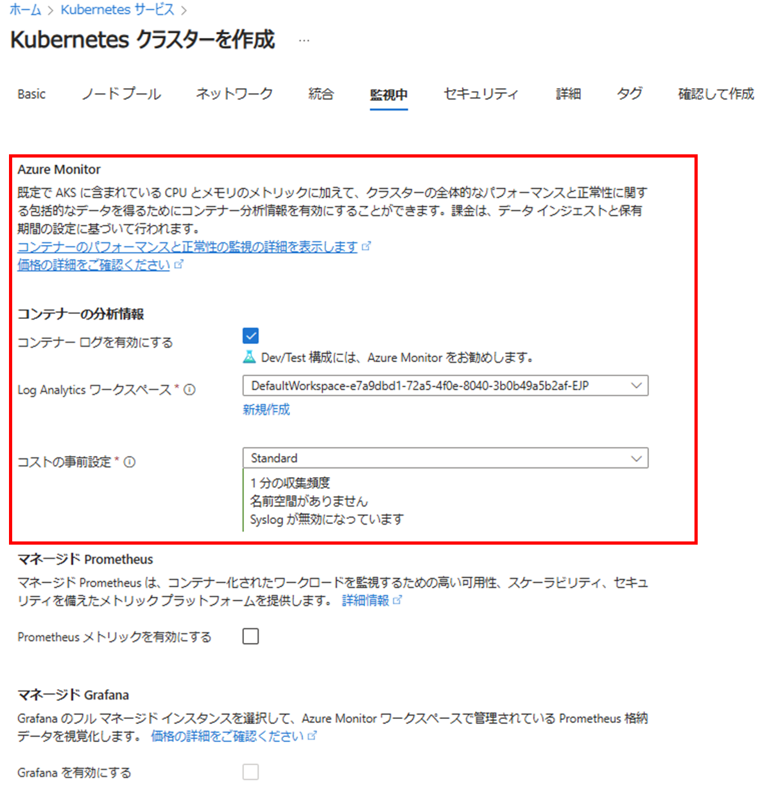
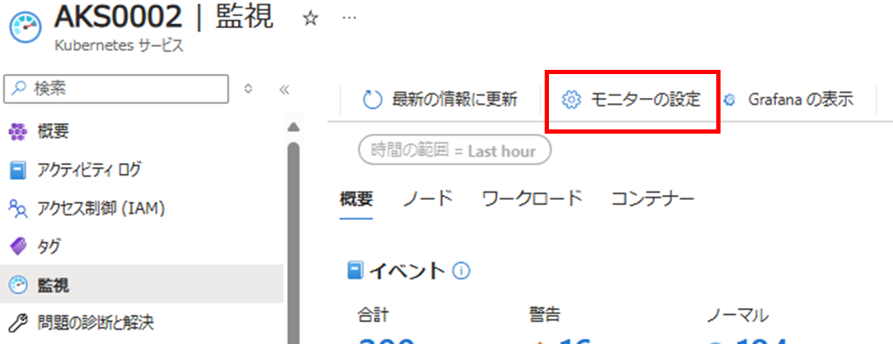
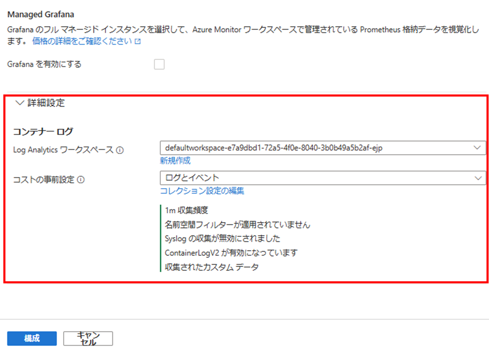
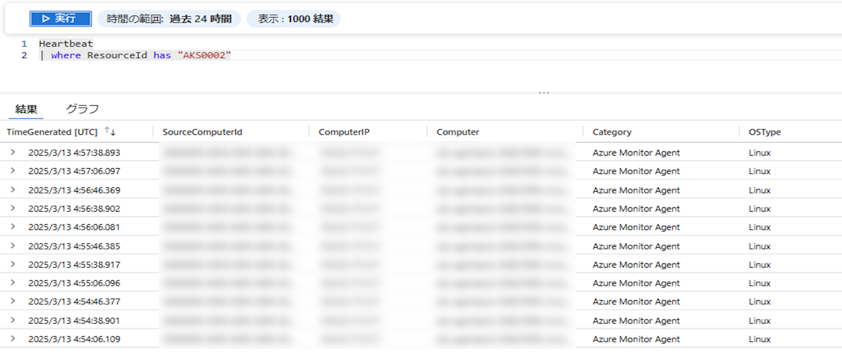

---
title: Container Insights のご紹介
date: 2025-03-26 00:00:00
tags:
 - How-To
 - Log Analytics
 - Container Insights
---

こんにちは！Azure Monitoring チームの加治屋です。
この記事では、Container Insights に関する説明、導入のための前提条件、導入方法をご紹介いたします。

<!-- more -->

## Container Insights とは？
AKS クラスターをはじめとした コンテナー環境へデプロイすることで、コンテナー環境で収集された情報を ログとして Log Analytics ワークスペースに収集する、Azure Monitor の製品です。
Log Analytics ワークスペースへ収集した情報は通常の VM などから収集したログと同じように、KQL を使用して、情報の分析やログ アラート ルールの処理を行うことができます。

Kubernetes 監視用の Azure Monitor の機能
https://learn.microsoft.com/ja-jp/azure/azure-monitor/containers/container-insights-overview 

この機能をデプロイすると、コンテナー環境へ Azure Monitor エージェント Pod がデプロイされます。

Kubernetes 監視用の Azure Monitor の機能 - エージェント
https://learn.microsoft.com/ja-jp/azure/azure-monitor/containers/container-insights-overview#agent 


## Container Insights を有効化する上での前提条件

以下の前提条件がございます。

### サポートされているクラスター
・ Azure Kubernetes クラスター
・ Azure Arc 対応 Kubernetes クラスター (※)
※ ディストリビューションによっては対応していないものもございます。サポートしているディストリビューションにつきましては、以下の弊社公開情報をご確認ください。

Kubernetes 監視用の Azure Monitor の機能 - サポートされている構成
https://learn.microsoft.com/ja-jp/azure/azure-monitor/containers/container-insights-overview#supported-configurations

### ネットワーク要件
Container Insights には以下のネットワーク要件がございます。
Container Insights を有効化いただく前に以下の宛先に接続できるか、ご確認をお願いいたします。

*.ods.opinsights.azure.com:443
*.oms.opinsights.azure.com:443
dc.services.visualstudio.com:443
*.monitoring.azure.com:443
login.microsoftonline.com:443
global.handler.control.monitor.azure.com:443
*.ingest.monitor.azure.com:443
*.metrics.ingest.monitor.azure.com:443
<cluster-region-name>.handler.control.monitor.azure.com:443


詳細な要件につきましては、以下の弊社公開情報をご確認いただけますと幸いです。

Azure Kubernetes Service (AKS) クラスターのアウトバウンド ネットワークと FQDN の規則 - Azure Monitor - マネージド Prometheus と Container insights
https://learn.microsoft.com/ja-jp/azure/aks/outbound-rules-control-egress#azure-monitor---managed-prometheus-and-container-insights


### その他前提条件
Container Insights 有効化の際は、以下の前提条件をご確認ください。
・Azure CLI バージョン 2.49.0 以降では、CLI によるオンボーディングを実行すると、既定でマネージド ID 認証を使用する Container Insights が有効化されます。
・Azure k8s-extension バージョンが 1.3.7 以降であること。k8s-extension バージョン 1.43.0 以降では、既定でマネージド ID 認証が使用されます。

※ マネージド ID 認証は、ARO (Azure Red Hat OpenShift) または Windows ノードを使用する Azure Arc 対応 Kubernetes クラスターではサポートされていません。 
  上記環境にて Container Insights をご利用される場合は、レガシー認証を使用して Container Insights の有効化を実施ください。

Kubernetes クラスターの監視を有効にする - コンテナー分析情報を有効にする - 前提条件
https://learn.microsoft.com/ja-jp/azure/azure-monitor/containers/kubernetes-monitoring-enable?tabs=cli#prerequisites-4

## Container Insights の有効化 (デプロイ) 方法
有効化方法として、いくつか方法がございます。
代表的な手順をご紹介いたします。
なお、以下の有効化手順につきましては、Azure Kubernetes Service (AKS) リソースでご利用されることを前提として記載しております。

I. AKS リソースの作成時に Container Insights も一緒に有効化する方法

以下の画面にて有効化を行うことが可能です。
[コンテナー ログを有効にする] にチェックを入れていただき、ログを送信する先の Log Analytics ワークスペースを指定します。
指定しない場合は、規定の Log Analytics ワークスペース (DefaultWorkspace- からはじまる Log Analytics ワークスペース) が新規作成、もしくは自動的に指定されます。



コストの事前設定の部分は、ログの収集頻度やログの収集対象を設定する箇所でございます。
具体的な設定につきましては、以下の弊社公開情報にも記載がございますので、ご参照ください。

Container insights でログ収集を構成する - DCR を使用してデータ収集を構成する - Azure portal を使用して DCR を構成する
https://learn.microsoft.com/ja-jp/azure/azure-monitor/containers/container-insights-data-collection-configure?tabs=portal#configure-dcr-with-azure-portal

II. AKS リソース作成後に Azure CLI を使用して有効化する方法
以下のコマンドを実行します。
```
az aks enable-addons --addon monitoring --name "<AKS クラスター名>" --resource-group "<リソース グループ名>" --workspace-resource-id "<Log Analytics ワークスペースのリソース ID>"
```

Azure Arc 対応クラスターをご利用の場合は、こちらのコマンドをご利用ください。
```
az k8s-extension create --name azuremonitor-containers --cluster-name "<Azure Arc 対応クラスター名>" --resource-group "<リソース グループ名>" --cluster-type connectedClusters --extension-type Microsoft.AzureMonitor.Containers --configuration-settings logAnalyticsWorkspaceResourceID="<Log Analytics ワークスペースのリソース ID>"
```

ARO (Azure Red Hat OpenShift) または Windows ノードを使用する Azure Arc 対応 Kubernetes クラスターに対しては、以下のコマンドにてレガシー認証を利用した Container Insights を有効化します。
```
az k8s-extension create --name azuremonitor-containers --cluster-name "<Azure Arc 対応クラスター名>" --resource-group "<リソース グループ名>" --cluster-type connectedClusters --extension-type Microsoft.AzureMonitor.Containers ---configuration-settings logAnalyticsWorkspaceResourceID="<Log Analytics ワークスペースのリソース ID>" amalogs.useAADAuth=false
```

その他のクラスターで有効化を行う方法につきましては、以下の弊社公開情報にコマンドのサンプルがございますので、ご参照ください。
Kubernetes クラスターの監視を有効にする - コンテナー分析情報を有効にする
https://learn.microsoft.com/ja-jp/azure/azure-monitor/containers/kubernetes-monitoring-enable?tabs=cli#enable-container-insights

III. AKS リソース作成後に Azure ポータルを使用して有効化する方法

AKS リソースより [分析情報] もしくは [監視] をご選択いただき、[モニターの設定] より有効化いただけます。


ログ送信先の Log Analytics ワークスペースの変更したいなど、設定変更を行いたい場合は、画面下部の [詳細設定] より設定を変更いただけます。


コストの事前設定に関する具体的な設定につきましては、以下の弊社公開情報にも記載がございますので、ご参照ください。
Container insights でログ収集を構成する - DCR を使用してデータ収集を構成する - Azure portal を使用して DCR を構成する
https://learn.microsoft.com/ja-jp/azure/azure-monitor/containers/container-insights-data-collection-configure?tabs=portal#configure-dcr-with-azure-portal

なお、この有効化方法は、マネージド ID による認証が使用できないクラスター (Azure Arc 対応 Redhat OpenShift クラスターなど) ではご利用いただけません。


### 有効化の確認方法
Contianer Insights は、Azure Monitor にて使用されているエージェント (Azure Monitor エージェント) の仕組みを使用し、ログを Log Analytics ワークスペースへ送信いたします。
そのため、Container Insights を有効化いたしますと、ログの送信先 log Analytics ワークスペースに対して Heartbeat ログが 1 分間隔で送信されます。
Container Insights の有効化が正常に行われたかご確認いただければと存じます。



heartbeat ログの確認方法につきましては、以下の記事をご参照ください。
Azure Monitor エージェントにより収集される Heartbeat ログを使用した死活監視方法
https://jpazmon-integ.github.io/blog/LogAnalytics/MonitorVM_AMA/#%E4%BE%8B-1-%E3%81%82%E3%82%8B%E3%83%9E%E3%82%B7%E3%83%B3%E3%81%8B%E3%82%89-Heartbeat-%E3%81%8C%E5%8F%8E%E9%9B%86%E3%81%95%E3%82%8C%E3%81%A6%E3%81%84%E3%82%8B%E3%81%93%E3%81%A8%E3%82%92%E7%A2%BA%E8%AA%8D%E3%81%99%E3%82%8B


### Container Insights の無効化方法
誤った方法で設定変更を行ってしまった場合や、特定の設定を実施いただく際に必要な手順として、Container Insights の無効化をご案内させていただく場合がございます。
無効化の際は以下のコマンドをご実行ください。
```
az k8s-extension delete --name azuremonitor-containers --cluster-type connectedClusters --cluster-name <クラスター名> --resource-group <リソース グループ名>
```

無効化を行いますと、Container Insights を使用する機能 (ログ収集機能) がご利用いただけなくなりますので、ご留意ください。
また、無効化を行った場合でも、Container Insights の作成時に同時に作成した Log Analytics ワークスペースやアラート等は削除されませんので、もしこれらのリソースも不要である場合は、個別に削除ください。

Kubernetes クラスターの監視を有効にする - コンテナー分析情報を有効にする - 拡張機能のインスタンスを削除する
https://learn.microsoft.com/ja-jp/azure/azure-monitor/containers/kubernetes-monitoring-enable?tabs=cli#enable-container-insights


もし、Container Insights のデプロイ方法にてお困りごとがございましたら、遠慮なく弊社サポートまでお問い合わせください。

## 参考情報
- Kubernetes 監視用の Azure Monitor の機能
https://learn.microsoft.com/ja-jp/azure/azure-monitor/containers/container-insights-overview


