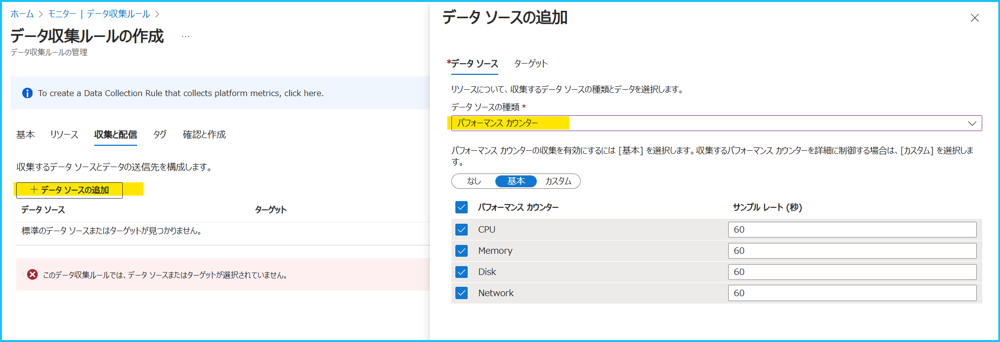
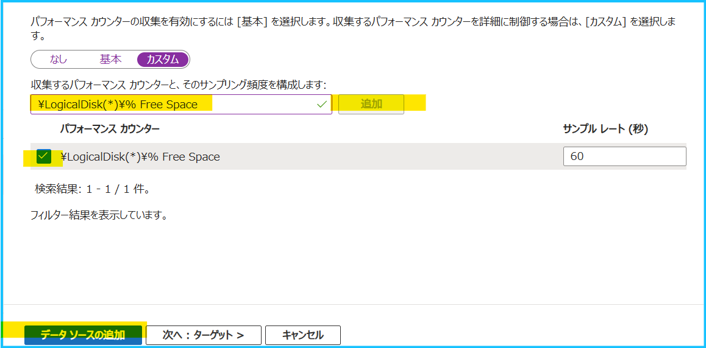
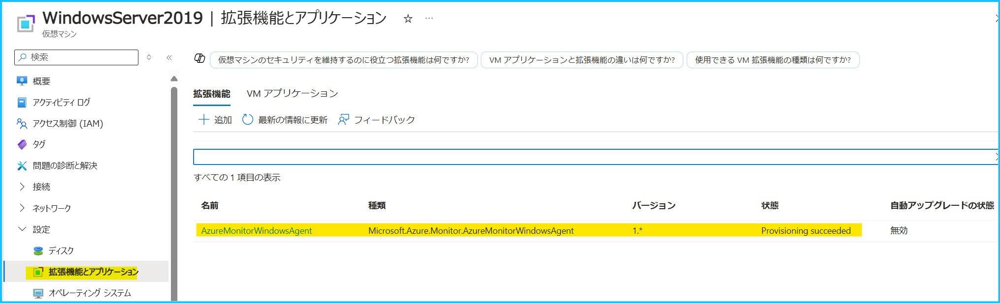
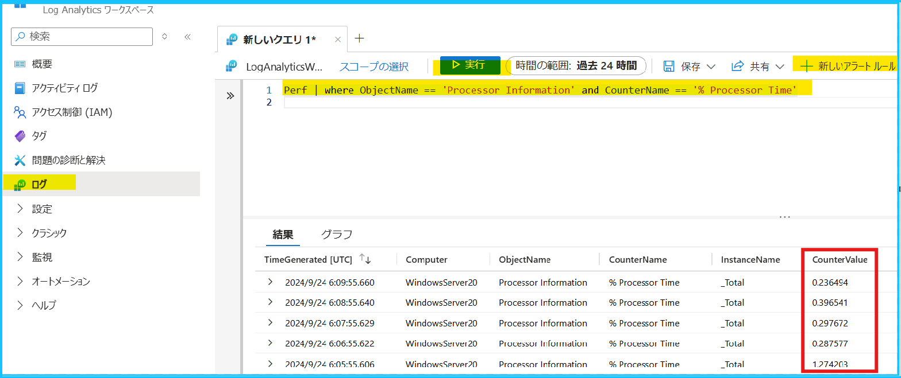
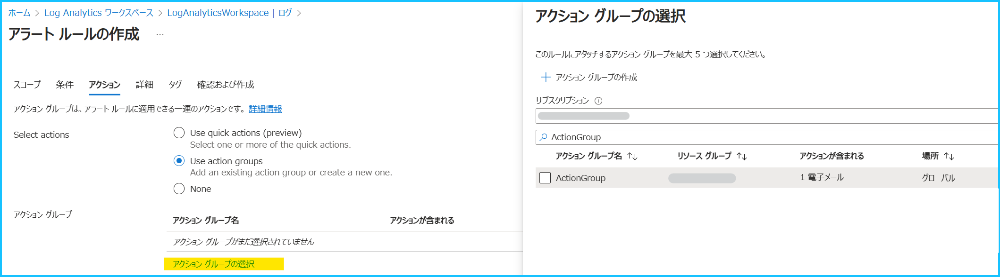
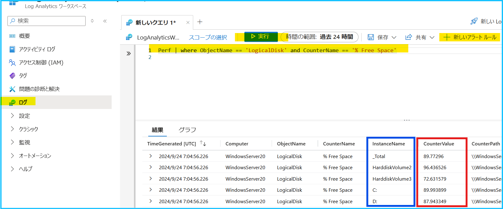

こんにちは、Azure Monitoring サポート チームの北村です。
Windows マシンにおける Azure Monitor エージェントを利用した性能監視（CPU、メモリ、ディスク） の設定手順の一例をご紹介します。

 

## 目次
- [1. はじめに](#1-はじめに)
  - [1-1. ログ アラート ルールとは](#1-1-ログ-アラート-ルールとは)
  - [1-2. Azure Monitor エージェントを利用した ログ アラート ルールの設定の流れ](#1-2-Azure-Monitor-エージェントを利用した-ログ-アラート-ルールの設定の流れ)
  - [1-3. 本ブログで紹介する内容の前提](#1-3-本ブログで紹介する内容の前提)
- [2. 性能監視（CPU、メモリ、ディスク） に関するパフォーマンス カウンター](2-性能監視（CPU、メモリ、ディスク）-に関するパフォーマンス-カウンター)
- [3. パフォーマンス カウンターのデータ収集ルール](#3-パフォーマンス-カウンターのデータ収集ルール)
  - [3-1. 既定で用意されているパフォーマンス カウンターについて](#3-1-既定で用意されているパフォーマンス-カウンターについて)
  - [3-2. パフォーマンス カウンターのデータ収集ルール設定手順](#3-2-パフォーマンス-カウンターのデータ収集ルール設定手順)
- [4. ログ アラート ルールの主な設定項目](#4-ログ-アラート-ルールの主な設定項目)
- [5. CPU 使用率を監視するログ アラート ルール](#5-CPU-使用率を監視するログ-アラート-ルール)
  - [5-1. CPU 使用率のログ アラート ルールの設定例](#5-1-CPU-使用率のログ-アラート-ルールの設定例)
  - [5-2. CPU 使用率のログ アラート ルールの設定手順](#5-2-CPU-使用率のログ-アラート-ルールの設定手順)
- [6. メモリ使用率を監視するログ アラート ルール](#6-メモリ使用率を監視するログ-アラート-ルール)
  - [6-1. メモリ使用率のログ アラート ルールの設定例](#6-1-メモリ使用率のログ-アラート-ルールの設定例)
  - [6-2. メモリ使用率のログ アラート ルールの設定手順](#6-2-メモリ使用率のログ-アラート-ルールの設定手順)
- [7. ディスク空き容量率を監視するログ アラート ルール](#7-ディスク空き容量率を監視するログ-アラート-ルール)
  - [7-1. ディスク空き容量率のログ アラート ルールの設定例](#7-1-ディスク空き容量率のログ-アラート-ルールの設定例)
  - [7-2. ディスク空き容量率のログ アラート ルールの設定手順](#7-2-ディスク空き容量率のログ-アラート-ルールの設定手順)

 

## 1. はじめに

### 1-1. ログ アラート ルールとは
本ブログでは Windows Server 2019 の Azure VM に Azure Monitor エージェントを導入し、当該 VM からパフォーマンス カウンターの情報を収集して CPU 使用率やメモリ使用率、ディスク空き容量率を監視する「ログ アラート ルール」の設定手順を紹介します。

[ログ アラート ルール](https://learn.microsoft.com/ja-jp/azure/azure-monitor/alerts/alerts-types#log-alerts)とは、Log Analytics ワークスペースに収集したデータを評価し、条件が満たされたときにアラートを発報します。監視要件に応じてログ クエリを設定し、アラートの条件を定義することで、しきい値を満たしたときに[電子メールや SMS 等に通知する](https://learn.microsoft.com/ja-jp/azure/azure-monitor/alerts/action-groups)ことができます。例えば、Azure VM からイベント ログを収集し、5 分単位でログの評価を行い、特定のイベント ログが出力されたときにアラートを発報する、といったことが可能です。

> [!NOTE]
> Azure Monitor エージェントではパフォーマンス カウンターを[メトリック](https://learn.microsoft.com/ja-jp/azure/azure-monitor/vm/tutorial-monitor-vm-guest#view-guest-metrics)として収集することも可能です。そのため、ログ アラート ルールではなく、[メトリック アラート ルール](https://learn.microsoft.com/ja-jp/azure/azure-monitor/essentials/tutorial-metrics)でも同様の内容を監視することができます。

 

### 1-2. Azure Monitor エージェントを利用した ログ アラート ルールの設定の流れ
ログ アラート ルールを作成するための基本的な流れを説明します。
本ブログでは 2. および 3. の手順を紹介します。

---------------------------------------
**1). Log Analytics ワークスペースの作成**
**2). データ収集ルールの作成と Azure Monitor エージェントのインストール**
**3). ログ アラート ルールの設定**
---------------------------------------

**1). Log Analytics ワークスペースの作成**
パフォーマンス カウンターを収集する Log Analytics ワークスペースを作成してください (既存の Log Analytics ワークスペースをご利用いただくことでも構いません)。新規にワークスペースを作成する場合には [弊社公開情報](https://learn.microsoft.com/ja-jp/azure/azure-monitor/logs/quick-create-workspace?tabs=azure-portal) をご参照ください。

**2). データ収集ルールの作成と Azure Monitor エージェントのインストール**
パフォーマンス カウンターを収集するために ["データ収集ルール"](https://learn.microsoft.com/ja-jp/azure/azure-monitor/agents/data-collection-performance) を作成します。
Azure Monitor エージェントでは、データ収集ルールでデータ ソースやデータの宛先 (Azure Monitor Metrics や Log Analytics ワークスペース) を指定します。このデータ収集ルールにマシンを紐づけることで、データ収集ルールの内容に従ってログやメトリックが収集されます。[Azure ポータルからデータ収集ルールをマシンに紐づけた場合は、対象マシンのシステム割り当てマネージド ID が有効化され、自動で Azure Monitor エージェントがインストールされます](https://learn.microsoft.com/ja-jp/azure/azure-monitor/agents/azure-monitor-agent-manage?tabs=azure-portal#installation-options)。

**3). ログ アラート ルールの設定**
Azure Monitor エージェントによってパフォーマンス カウンターが収集されていることを確認し、監視要件に応じたクエリを作成、しきい値やアラートの通知方法等を設定します。

> [!WARNING]
> データ収集ルールは、ログ収集先の Log Analytics ワークスペースと同じリージョンに作成する必要があります。例えば、東日本リージョンの Log Analytics ワークスペースにログを収集したい場合は、データ収集ルールのリージョンも東日本リージョンを指定する必要があります。

 

### 1-3. 本ブログで紹介する内容の前提
今回ご紹介するログ アラート ルールの設定は以下の通りです。
**以下の設定値は、あくまで一例です。ログ アラート ルールを設定する際には、お客様の監視要件に従って設定値をご検討ください。**

| 項目 | アラート ルールの内容                                              |
| ----------  | ------------------------------------------------------------------ |
| CPU       | 5 分毎にアラートを評価し、直近 10 分間の CPU 使用率の平均が 80 ％ を超えた場合に発報する      |
| メモリ    | 5 分毎にアラートを評価し、直近 10 分間のメモリ使用率の平均が 80 ％ を超えた場合に発報する   |
| ディスク  | 5 分毎にアラートを評価し、直近 10 分間のディスク空き容量率 (C ドライブと D ドライブ) が 30 % 以下となった場合に発報する |

Azure Monitor エージェントを導入するマシンは [Azure VM (Windows Server 2019)](https://learn.microsoft.com/ja-jp/azure/azure-monitor/agents/azure-monitor-agent-supported-operating-systems) であり、インターネットに接続可能な構成で、[Azure Monitor エージェントの前提条件](https://learn.microsoft.com/ja-jp/azure/azure-monitor/agents/azure-monitor-agent-requirements)と[通信要件](https://learn.microsoft.com/ja-jp/azure/azure-monitor/agents/azure-monitor-agent-network-configuration?tabs=PowerShellWindows)を満たしているものとします。また、監視対象のマシンは 1 台、各パフォーマンスカウンターは同一の Log Analytics ワークスペースに収集します。Azure Monitor エージェントを導入いただく際には、必ず前提要件や通信要件を満たしていることをご確認ください。

> [!WARNING]
> 今回ご紹介するデータ収集ルールの設定は [Azure Monitor Private Link Scope (AMPLS)](https://learn.microsoft.com/ja-jp/azure/azure-monitor/logs/private-link-security) の利用を想定しておりません。AMPLS を用いて閉域網でログを収集する場合、別途[データ収集エンドポイント (DCE)](https://learn.microsoft.com/ja-jp/azure/azure-monitor/essentials/data-collection-endpoint-overview?tabs=portal) の構築と設定が必要です。データ収集エンドポイントの詳細につきましては、[弊社サポート ブログ](https://jpazmon-integ.github.io/blog/LogAnalytics/DataCollectionEndpoint/)で紹介しております。AMPLS をご利用されている場合は、[ブログ](https://jpazmon-integ.github.io/blog/LogAnalytics/DataCollectionEndpoint/) や[公開情報](https://learn.microsoft.com/ja-jp/azure/azure-monitor/logs/private-link-configure)もご確認くださいませ。

 

## 2. 性能監視（CPU、メモリ、ディスク） に関するパフォーマンス カウンター
Windows では 以下のパフォーマンス カウンターを収集いただくことで、性能（CPU、メモリ、ディスク) を監視できます。
Azure Monitor エージェント for Windows では、Windows OS 上に存在するパフォーマンス カウンターであれば取得が可能であり、[Perf テーブル](https://learn.microsoft.com/ja-jp/azure/azure-monitor/reference/tables/perf) に格納されます。

| 項目 | パフォーマンス カウンター                | クエリ                                                                                        |
| -------- | ---------------------------------------- | --------------------------------------------------------------------------------------------- |
| CPU      | \Processor Information(_Total)\% Processor Time | Perf &#124; where ObjectName == \'Processor Information\' and CounterName == \'% Processor Time\' |
| メモリ   | \Memory\% Committed Bytes In Use         | Perf &#124; where ObjectName == \'Memory\' and CounterName == \'% Committed Bytes In Use\'        |
| ディスク | \LogicalDisk(*)\% Free Space             | Perf &#124; where ObjectName == \'LogicalDisk\' and CounterName == \'% Free Space\'               |

> [!NOTE]
> Windows ではディスク使用容量の割合に関するパフォーマンスが OS 自体に提供されておりませんので、今回は空き容量率を示す \LogicalDisk(\*)\% Free Space を監視する構成としております。\LogicalDisk(\*)\% Free Space では、個別のインスタンス毎の値が収集されますが、特定のドライブのみログを収集する場合には \LogicalDisk(C:)\% Free Space や \LogicalDisk(D:)\% Free Space 等とご指定ください。また、Processor 関連のパフォーマンス カウンターには Processor と Processor Information が存在しますが、違いにつきましては [弊社サポート ブログ](https://jpwinsup.github.io/blog/2022/07/15/Performance/SystemResource/PerformanceCounterProcessor/#1-%E3%82%B7%E3%82%B9%E3%83%86%E3%83%A0%E5%85%A8%E4%BD%93%E3%81%AE-CPU-%E4%BD%BF%E7%94%A8%E7%8A%B6%E6%B3%81)をご覧ください。

 

## 3. パフォーマンス カウンターのデータ収集ルール

### 3-1. 既定で用意されているパフォーマンス カウンターについて
パフォーマンス カウンターの種類は多数存在し、Azure ポータルで既定で用意されているものと、そうでないものがあります。
[既定で用意されていない場合は [カスタム] タブを選択し、収集するパフォーマンス カウンターを指定する必要があります](https://jpazmon-integ.github.io/blog/LogAnalytics/HowToCollectCustomPerfCounter/)。

データ収集ルールの設定画面の [データ ソース画面] を開くと、既定で用意されているカウンターを確認できます。
[基本] タブの項目 (CPU, Memory, Disk, Network) は既定で用意されているパフォーマンス カウンターに該当しますが、

既定のパフォーマンス カウンターは [カスタム] タブを選択すると確認できます。

 

今回、監視する 3 つのカウンターのうち、既定で用意されていないパフォーマンス カウンターは \LogicalDisk(\*)\% Free Space です。
このため、[基本] タブで指定されている既定のパフォーマンス カウンターに加え、[カスタム] タブから \LogicalDisk(\*)\% Free Space のパフォーマンス カウンターを指定します。

|                   |                 |
| ----------------- | ----------------------------------------------------- |
| CPU      | 既定で用意されています。  |
| メモリ   | 既定で用意されています。  |
| ディスク | 既定で用意されていません。[基本] タブの項目では InstanceName が _Total の情報しか収集されません。 |

 

### 3-2. パフォーマンス カウンターのデータ収集ルール設定手順
前置きが長くなりましたが、[パフォーマンス カウンターを収集するためにデータ収集ルールを作成](https://learn.microsoft.com/ja-jp/azure/azure-monitor/agents/data-collection-performance)しましょう！

-----------------
**以下手順を実施する前に、監視対象マシンが起動中であることを確認してください。** 
Azure ポータルからデータ収集ルールをマシンに紐づけた際、そのマシンが起動している場合は自動で Azure Monitor エージェントがインストールされますが、**マシンが起動していない場合はエージェントがインストールされません。**

1. Azure ポータルで [モニター] を検索し、[設定] > [データ収集ルール] を開き、 [+ 作成] をクリックします。

2. **基本画面**では、データ収集ルールの名前やリージョン、プラットフォームの種類を選択します。設定例は下図のとおりです。
データ収集ルールは、ログ収集先の Log Analytics ワークスペースと同じリージョンに作成する必要がありますのでご注意ください。

> [!IMPORTANT]
> [基本タブで設定するデータ収集エンドポイント (エンドポイント ID) ](https://jpazmon-integ.github.io/blog/LogAnalytics/DataCollectionEndpoint/#%E3%83%87%E3%83%BC%E3%82%BF%E5%8F%8E%E9%9B%86%E3%83%AB%E3%83%BC%E3%83%AB%E3%81%AE%E4%BD%9C%E6%88%90-%E5%9F%BA%E6%9C%AC-%E3%82%BF%E3%83%96)は Log Analytics ワークスペースにログを取り込む際に使用するエンドポイントで、カスタム ログや IIS ログを収集するときに必要になります。このため、パフォーマンス カウンターを収集する場合は指定する必要はございません。

 

3. **リソース画面**では、監視対象のマシンを追加します。[+ リソースの追加] をクリックし、監視対象マシンにチェックを入れ、適用ボタンをクリックしてください。これにより、自動で Azure Monitor エージェントがインストールされます。

> [!IMPORTANT]
> [リソース タブでもデータ収集エンドポイント](https://jpazmon-integ.github.io/blog/LogAnalytics/DataCollectionEndpoint/#%E3%83%87%E3%83%BC%E3%82%BF%E5%8F%8E%E9%9B%86%E3%83%AB%E3%83%BC%E3%83%AB%E3%81%AE%E4%BD%9C%E6%88%90-%E3%83%AA%E3%82%BD%E3%83%BC%E3%82%B9-%E3%82%BF%E3%83%96)を有効化するチェックボタンがありますが、これは Azure Monitor エージェントに関連付けられたデータ収集ルールの設定を取得するためのエンドポイントとなります。AMPLS を使用したプライベート リンク環境で必要な手順であり、プライベート リンク環境でなければ、設定する必要はございません（ここでは AMPLS を利用しない前提のため、有効化していません）。

 

4. **データ ソース画面** で、収集するパフォーマンス カウンターと、Log Analytics ワークスペースを指定します。
[基本] タブで指定されている既定のパフォーマンス カウンターに加え、[カスタム] タブで \LogicalDisk(*)% Free Space のパフォーマンス カウンターを指定します。

4-1. [+ データ ソースの追加] をクリックし、[データ ソースの種類] で "パフォーマンス カウンター" を選びます。

4-2. [ターゲット] 画面でログの収集先を指定します。今回はログ アラート ルールを構成するため、[ターゲットの種類] で「Azure Monitor Logs」を選択し、[Destination Details] で Log Analytics ワークスペースを選択してください。

4-3. [データ ソース] 画面に戻り、[カスタム] タブから \LogicalDisk(\*)\% Free Space のパフォーマンス カウンターを指定します。

下図の通り \LogicalDisk(\*)\% Free Space と入力して [追加] をクリックし、当該カウンターにチェックを入れて [データ ソースの追加] ボタンを押します。

> [!IMPORTANT]
> 既定で用意されているパフォーマンス カウンターで不要なものがある場合には [カスタム] タブからチェックを外してください。また、Windows では、インスタンスの指定があるパフォーマンス カウンターはデフォルトでは _Total のインスタンスの収集となっているものが多く、ドライブ単位でディスク空き容量を監視する場合、デフォルトで用意された (_Total) のインスタンスではなく、(*) のインスタンスで収集設定を追加いただく必要があります。

 

5. タグ画面では必要に応じてタグをご指定ください。
確認と作成画面で設定した内容を確認の上、[作成] ボタンを押します。データ収集ルールの作成手順は以上です。

 

6. データ収集ルールのデプロイが完了しましたら、監視対象のマシンに Azure Monitor エージェントがインストールされたことを確認します。Azure ポータルで対象マシンの [設定] > [拡張機能とアプリケーション] を開き、AzureMonitorWindowsAgent の状態が Provisioning succeeded であることを確認します。

-----------------

 

## 4. ログ アラート ルールの主な設定項目
ログ アラート ルールを作成する前に、今回作成するログ アラート ルールに関連する項目を簡単にご説明します。
[弊社公開情報](https://learn.microsoft.com/ja-jp/azure/azure-monitor/alerts/alerts-create-log-alert-rule) と共に、必要に応じてご確認ください。

<b>測定</b>

ログ検索を行う検索期間、実行結果の集計方法を指定します。
例えば、[集計の粒度] を 10 分、[集計の種類] を [平均] とした場合、10 分間の期間にあるデータを平均化し、その値をアラート検知に利用します。

|            |                                                                                     | 
| ---------- | ----------------------------------------------------------------------------------- | 
| メジャー   | 集計対象のテーブルの行または数値列を選択します。                                    | 
| 集計の種類 | [集計の粒度] で設定した期間において、データをまとめる方法を選択します。 | 
| 集計の粒度 | クエリで取得したログを一つのグループにまとめる単位を示します。                      | 

 

<b>ディメンション</b>

ディメンションごとに分割すると、数値列または文字列の組み合わせがグループ化され、複数の Azure リソースで同じ条件を監視できます。複数のディメンション値を選択した場合は、その組み合わせによって生成される時系列ごとに独自のアラートがトリガーされ、個別に処理されます。

|            |                                                                                     | 
| ---------- | ----------------------------------------------------------------------------------- | 
| リソース ID 列 | クエリ結果に リソース ID が含まれていると、自動的に検出され、選択状態となります。リソース ID を指定した場合、リソース ID 毎にアラートのターゲットとして分割され、リソース ID 別にアラートの検知、通知が行われます。                                    | 
| ディメンション名 | リソース ID 以外の特定列によって分割したい場合に利用します。 | 

 

<b>アラートロジック</b>

[測定] の設定によって集計された値と比較する際のしきい値と、評価の頻度を設定します。

|            |                                                                                     | 
| ---------- | ----------------------------------------------------------------------------------- | 
| 演算子 | [測定] の設定によって集計された値と比較する際に、どの様な比較を行うかを設定します。| 
| しきい値 | [測定] の設定によって集計された値と比較する際に、使用するしきい値を数値で設定します。 | 
| 評価の頻度 | [測定] の設定によって集計された値としきい値の比較を行う頻度です。[評価の頻度] は [集計の粒度] で設定した期間以下とする必要があります。 | 

 
 

## 5. CPU 使用率を監視するログ アラート ルール

| 項目 | アラート ルールの内容                                              |
| -------- | ------------------------------------------------------------------ |
| CPU      | 5 分毎にアラートを評価し、直近 10 分間の CPU 使用率の平均が 80 ％ を超えた場合に発報する      |

 

### 5-1. CPU 使用率のログ アラート ルールの設定例
パフォーマンス カウンターの値は、[Perf テーブル](https://learn.microsoft.com/en-us/azure/azure-monitor/reference/tables/perf)の CounterValue 列に格納されるため、[メジャー] で CounterValue を指定します。
今回は 5 分毎に直近 10 分間の CPU 使用率の平均値を監視するため、[評価の頻度] は 5 分、[集計の種類] は「平均」、[集計の粒度] は 10 分を指定します。

| 設定項目                         | 設定値            | 
| -------------------------------- | ----------------- | 
| シグナル名                       | カスタム ログ検索 | 
| 検索クエリ                       | Perf &#124; where ObjectName == \'Processor Information\' and CounterName == \'% Processor Time\' | 
| 測定 - メジャー                | CounterValue      | 
| 測定 - 集計の種類              | 平均              | 
| 測定 - 集計の粒度              | 10 分             | 
| ディメンションで分割する       | 分割しない        | 
| アラート ロジック - 演算子     | 次の値より大きい  | 
| アラート ロジック - しきい値   | 80                | 
| アラート ロジック - 評価の頻度 | 5 分              | 

> [!NOTE]
> 同一の Log Analytics ワークスペースに複数のマシンのログを収集している場合、[ディメンションで分割する] の項目で "リソース ID 列" もしくは "Computer" を指定することで、1 つのログ アラート ルールで複数のマシンを同じ条件で監視することが可能です。ログ アラート ルールのディメンション分割につきましては、[弊社公開情報](https://learn.microsoft.com/ja-jp/azure/azure-monitor/alerts/alerts-types#log-alerts) もご確認ください。

 

### 5-2. CPU 使用率のログ アラート ルールの設定手順
-----------------
**1. ログ収集先の Log Analytics ワークスペースを開きます。**
データ収集ルールで指定したログ収集先の Log Analytics ワークスペースを開きます。

**2. CPU 使用率を確認するクエリを実行します。**
[ログ] から Perf &#124; where ObjectName == \'Processor Information\' and CounterName == \'% Processor Time\' を入力します。
[実行] をクリックし、[+ 新しいアラート ルール] をクリックします。
※ ログの収集が開始されるまでに時間がかかる場合がございます。予めご留意ください。

**3. ログ アラート ルールの条件を指定します。** 
5-1. のとおり値を指定します。

**4. アラートが発報した際に通知する方法を指定します。** 
Azure Monitor のアラート機能では、[アクション グループ](https://learn.microsoft.com/ja-jp/azure/azure-monitor/alerts/action-groups) というリソースでアラートを通知する方法を定義します。新規で作成する場合は [+ アクション グループの作成]、既存のグループを指定する場合は [+ アクション グループの選択] をクリックします。

例えば、アラートをメールで通知する場合には、[通知のタイプ] で "電子メール/SMS メッセージ/プッシュ/音声" を選択し、通知するメール アドレスを指定します。アクション グループの概要や設定手順の詳細は、[弊社公開情報](https://learn.microsoft.com/ja-jp/azure/azure-monitor/alerts/action-groups#create-an-action-group-in-the-azure-portal)をご覧ください。

**5. アラート ルールの名前、アラートの重大度等を設定します。**
[アラート ルールの詳細] では、重大度、アラート ルール名、アラート ルールの説明を設定します。
[詳細設定オプション] は既定の状態 (作成時に有効化のみチェックが入っている状態) とします。また、今回は Log Analytics ワークスペースのログを対象にクエリを実行するため、[Identity](https://learn.microsoft.com/ja-jp/azure/azure-monitor/alerts/alerts-create-log-alert-rule#configure-alert-rule-details) でマネージド ID を有効化する必要はございません。

> [!NOTE]
> [詳細設定オプション](https://learn.microsoft.com/en-us/azure/azure-monitor/alerts/alerts-create-log-alert-rule#configure-alert-rule-details)の [アラートを自動的に解決する] と [アクションのミュート] につきましては、[弊社公開情報](https://learn.microsoft.com/ja-jp/azure/azure-monitor/alerts/alerts-overview#stateful-alerts)や[弊社サポート ブログ](https://jpazmon-integ.github.io/blog/AzureMonitorEssential/HowToAlertMuteAction) をご確認ください。

6. 最後に設定した内容を確認し、[作成] をクリックします。手順は以上です。
-----------------

 
 
 

## 6. メモリ使用率を監視するログ アラート ルール

| 項目 | アラート ルールの内容                                              |
| -------- | ------------------------------------------------------------------ |
| メモリ   | 5 分毎にアラートを評価し、直近 10 分間のメモリ使用率の平均が 80 ％ を超えた場合に発報する   |

 

### 6-1. メモリ使用率のログ アラート ルールの設定例

| 設定項目                         | 設定値            | 
| -------------------------------- | ----------------- | 
| シグナル名                       | カスタム ログ検索 | 
| 検索クエリ                       | Perf &#124; where ObjectName == \'Memory\' and CounterName == \'% Committed Bytes In Use\' | 
| 測定 - メジャー                | CounterValue      | 
| 測定 - 集計の種類              | 平均              | 
| 測定 - 集計の粒度              | 10 分             | 
| ディメンションで分割する       | 分割しない        | 
| アラート ロジック - 演算子     | 次の値より大きい  | 
| アラート ロジック - しきい値   | 80                | 
| アラート ロジック - 評価の頻度 | 5 分              | 

> [!NOTE]
> 同一の Log Analytics ワークスペースに複数のマシンのログを収集している場合、[ディメンションで分割する] の項目で "リソース ID 列" もしくは "Computer" を指定することで、1 つのログ アラート ルールで複数のマシンを同じ条件で監視することが可能です。ログ アラート ルールのディメンション分割につきましては、[弊社公開情報](https://learn.microsoft.com/ja-jp/azure/azure-monitor/alerts/alerts-types#log-alerts) もご確認ください。

 

### 6-2. メモリ使用率のログ アラート ルールの設定手順
-----------------
**1. ログ収集先の Log Analytics ワークスペースを開きます。**
データ収集ルールで指定したログ収集先の Log Analytics ワークスペースを開きます。

**2. メモリ使用率を確認するクエリを実行します。**
[ログ] から Perf &#124; where ObjectName == \'Memory\' and CounterName == \'% Committed Bytes In Use\'を入力します。
[実行] をクリックし、[+ 新しいアラート ルール] をクリックします。
※ ログの収集が開始されるまでに時間がかかる場合がございます。予めご留意ください。

**3. ログ アラート ルールの条件を指定します。** 
6-1. のとおり値を指定します。

**4. アラートが発報した際に通知する方法を指定します。** 
Azure Monitor のアラート機能では、[アクション グループ](https://learn.microsoft.com/ja-jp/azure/azure-monitor/alerts/action-groups) というリソースでアラートを通知する方法を定義します。新規で作成する場合は [+ アクション グループの作成]、既存のグループを指定する場合は [+ アクション グループの選択] をクリックします。

例えば、アラートをメールで通知する場合には、[通知のタイプ] で "電子メール/SMS メッセージ/プッシュ/音声" を選択し、通知するメール アドレスを指定します。アクション グループの概要や設定手順の詳細は、[弊社公開情報](https://learn.microsoft.com/ja-jp/azure/azure-monitor/alerts/action-groups#create-an-action-group-in-the-azure-portal)をご覧ください。

**5. アラート ルールの名前、アラートの重大度等を設定します。**
[アラート ルールの詳細] では、重大度、アラート ルール名、アラート ルールの説明を設定します。
[詳細設定オプション] は既定の状態 (作成時に有効化のみチェックが入っている状態) とします。また、今回は Log Analytics ワークスペースのログを対象にクエリを実行するため、[Identity](https://learn.microsoft.com/ja-jp/azure/azure-monitor/alerts/alerts-create-log-alert-rule#configure-alert-rule-details) でマネージド ID を有効化する必要はございません。

> [!NOTE]
> [詳細設定オプション](https://learn.microsoft.com/en-us/azure/azure-monitor/alerts/alerts-create-log-alert-rule#configure-alert-rule-details)の [アラートを自動的に解決する] と [アクションのミュート] につきましては、[弊社公開情報](https://learn.microsoft.com/ja-jp/azure/azure-monitor/alerts/alerts-overview#stateful-alerts)や[弊社サポート ブログ](https://jpazmon-integ.github.io/blog/AzureMonitorEssential/HowToAlertMuteAction) をご確認ください。

6. 最後に設定した内容を確認し、[作成] をクリックします。手順は以上です。
-----------------

 
 

## 7. ディスク空き容量率を監視するログ アラート ルール

| 項目 | アラート ルールの内容                                              |
| -------- | ------------------------------------------------------------------ |
| ディスク | 5 分毎にアラートを評価し、直近 10 分間のディスク空き容量率 (C ドライブと D ドライブ) が 30 % 以下となった場合に発報する |

 

### 7-1. ディスク空き容量率のログ アラート ルールの設定例
今回は C ドライブと D ドライブの空き容量率を監視します。
データ収集ルールでは \LogicalDisk(\*)\% Free Space を設定しているため、各ドライブの空き容量率と各ドライブの合計での空き容量率が収集されます。そのため、ディメンションで InstanceName を選択し、ディメンション値で C: と D: を選択します。
これにより、C ドライブと D ドライブの値を、1 つのアラート ルールで同じ条件で監視することができます。

| 設定項目                         | 設定値            | 
| -------------------------------- | ----------------- | 
| シグナル名                       | カスタム ログ検索 | 
| 検索クエリ                       | Perf &#124; where ObjectName == \'LogicalDisk\' and CounterName == \'% Free Space\' | 
| 測定 - メジャー                | CounterValue      | 
| 測定 - 集計の種類              | 平均              | 
| 測定 - 集計の粒度              | 10 分             | 
| ディメンションで分割する       | リソース ID 列 : 分割しない   ディメンション名 : InstanceName   ディメンション値 : C: および D:     | 
| アラート ロジック - 演算子     | 次の値以下  | 
| アラート ロジック - しきい値   | 30                | 
| アラート ロジック - 評価の頻度 | 5 分              | 

> [!NOTE]
> 同一の Log Analytics ワークスペースに複数のマシンのログを収集している場合、[ディメンションで分割する] の項目で "リソース ID 列" もしくは "Computer" を指定することで、1 つのログ アラート ルールで複数のマシンを同じ条件で監視することが可能です。ログ アラート ルールのディメンション分割につきましては、[弊社公開情報](https://learn.microsoft.com/ja-jp/azure/azure-monitor/alerts/alerts-types#log-alerts) もご確認ください。

 

### 7-2. ディスク空き容量率のログ アラート ルールの設定手順
-----------------
**1. ログ収集先の Log Analytics ワークスペースを開きます。**
データ収集ルールで指定したログ収集先の Log Analytics ワークスペースを開きます。

**2. ディスク空き容量率を確認するクエリを実行します。**
[ログ] から Perf &#124; where ObjectName == \'LogicalDisk\' and CounterName == \'% Free Space\'を入力します。
[実行] をクリックし、[+ 新しいアラート ルール] をクリックします。
※ ログの収集が開始されるまでに時間がかかる場合がございます。予めご留意ください。

**3. ログ アラート ルールの条件を指定します。** 
7-1. のとおり値を指定します。

**4. アラートが発報した際に通知する方法を指定します。** 
Azure Monitor のアラート機能では、[アクション グループ](https://learn.microsoft.com/ja-jp/azure/azure-monitor/alerts/action-groups) というリソースでアラートを通知する方法を定義します。新規で作成する場合は [+ アクション グループの作成]、既存のグループを指定する場合は [+ アクション グループの選択] をクリックします。

例えば、アラートをメールで通知する場合には、[通知のタイプ] で "電子メール/SMS メッセージ/プッシュ/音声" を選択し、通知するメール アドレスを指定します。アクション グループの概要や設定手順の詳細は、[弊社公開情報](https://learn.microsoft.com/ja-jp/azure/azure-monitor/alerts/action-groups#create-an-action-group-in-the-azure-portal)をご覧ください。

**5. アラート ルールの名前、アラートの重大度等を設定します。**
[アラート ルールの詳細] では、重大度、アラート ルール名、アラート ルールの説明を設定します。
[詳細設定オプション] は既定の状態 (作成時に有効化のみチェックが入っている状態) とします。また、今回は Log Analytics ワークスペースのログを対象にクエリを実行するため、[Identity](https://learn.microsoft.com/ja-jp/azure/azure-monitor/alerts/alerts-create-log-alert-rule#configure-alert-rule-details) でマネージド ID を有効化する必要はございません。

> [!NOTE]
> [詳細設定オプション](https://learn.microsoft.com/en-us/azure/azure-monitor/alerts/alerts-create-log-alert-rule#configure-alert-rule-details)の [アラートを自動的に解決する] と [アクションのミュート] につきましては、[弊社公開情報](https://learn.microsoft.com/ja-jp/azure/azure-monitor/alerts/alerts-overview#stateful-alerts)や[弊社サポート ブログ](https://jpazmon-integ.github.io/blog/AzureMonitorEssential/HowToAlertMuteAction) をご確認ください。

6. 最後に設定した内容を確認し、[作成] をクリックします。手順は以上です。
-----------------

 

今回は Windows VM 向けの性能監視におけるアラート ルールの設定手順をご紹介しました。いかがでしたでしょうか。
また、[公開情報](https://learn.microsoft.com/ja-jp/azure/azure-monitor/reference/queries/perf)に Perf のサンプル クエリも掲載されておりますので、こちらもご覧いただけますと幸いです。
上記の内容以外でご不明な点や疑問点などございましたら、弊社サポート サービスまでお問い合わせください。
最後までお読みいただきありがとうございました！
