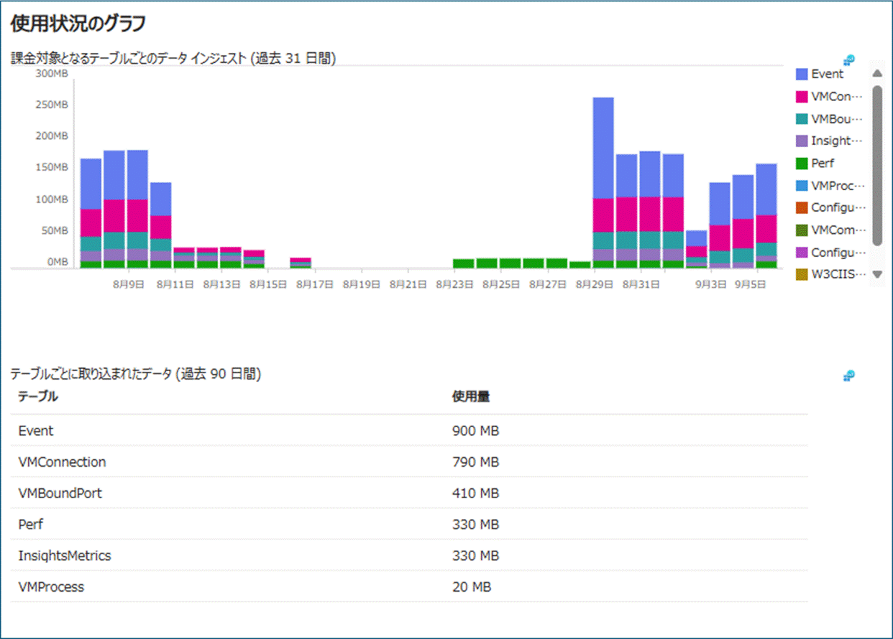

こんにちは、Azure Monitoring チームの徳田です。

本ブログでは、Log Analytics ワークスペースのコストの管理方法 (コスト増加原因の調査、コストを抑える方法) についてご説明します。  

  
なお、Azure Monitor のコスト最適化、および Log Analytics ワークスペースの使用量の分析については、以下弊社サイトもご参照ください。  
https://learn.microsoft.com/ja-jp/azure/azure-monitor/best-practices-cost
https://learn.microsoft.com/ja-jp/azure/azure-monitor/logs/analyze-usage
<!-- more -->

## 目次
- [はじめに](#はじめに)
- [1. コスト増加の原因を分析する](#1-コスト増加の原因を分析する)
- [1-1. データのインジェスト量の推移を確認する](#1-1-データのインジェスト量の推移を確認する)
    - [1-1-1. [使用量と推定コスト] から確認する](#1-1-1-使用量と推定コスト-から確認する)
    - [1-1-2. クエリを実行して確認する](#1-1-2-クエリを実行して確認する)
- [1-2. データの保有量の推移を確認する](#1-2-データの保有量の推移を確認する)
- [1-3. データの保有期間を確認する](#1-3-データの保有期間を確認する)
  - [1-3-1. Azure portal から確認する](#1-3-1-Azure-portal-から確認する)
  - [1-3-2. PowerShell または Azure CLI を使用して確認する](#1-3-2-PowerShell-または-Azure-CLI-を使用して確認する)
  - [1-3-3. API を使用して確認する](#1-3-3-API-を使用して確認する)
- [2. コストを抑える](#2-コストを抑える)
- [2-1. データのインジェストにかかるコストを抑える](#2-1-データのインジェストにかかるコストを抑える)
  - [2-1-1. 不要なログの収集を停止する](#2-1-1-不要なログの収集を停止する)
  - [2-1-2. 日次上限を設定しデータのインジェスト量を一定量までに抑える](#2-1-2-日次上限を設定しデータのインジェスト量を一定量までに抑える)
- [2-2. データの保持にかかるコストを抑える](#2-2-データの保持にかかるコストを抑える)
  - [2-2-1. データの保有期間を調整する](#2-2-1-データの保有期間を調整する)
  - [2-2-2. データの保有量を調整する](#2-2-2-データの保有量を調整する)
  - [2-2-3. Log Analytics ワークスペース内のデータを削除する](#2-2-3-Log-Analytics-ワークスペース内のデータを削除する)
- [まとめ](#まとめ)

## はじめに
Log Analytics ワークスペースは、データの収集と分析において非常に強力なツールです。  
しかし、そのコストは収集するデータの量によって大きく変動します。  
本ブログでは、Log Analyticsワークスペースのコスト管理方法について詳しく解説します。  
データインジェストのコストを最適化し、予期しない請求を避けるためのベストプラクティスを紹介します。

## 1. コスト増加の原因を分析する
Log Analytics ワークスペースのコストが増加している場合、まずはじめに行うことはコスト増加の原因を分析することです。
Log Analytics ワークスペースのコストは主に以下 3 点によって決まります。
- データのインジェスト量
- データの保有量と保有期間  
- Log Analytics ワークスペースが存在するリージョン  

このうち、コスト増加の原因となりうるのは、データのインジェスト量およびデータの保有量と保有期間です。  
したがって、コスト増加の主な原因を分析するためには、以下の情報を得る必要があります。
- データのインジェスト量の推移
- データの保有量の推移
- データの保有期間

それぞれの確認方法について、ご説明します。

### 1-1. データのインジェスト量の推移を確認する
Log Analytics ワークスペースごとのデータのインジェスト量の推移を確認する方法は、主に以下 2 つです。
- [使用量と推定コスト] から確認する方法
- クエリを実行して確認する方法

#### 1-1-1. [使用量と推定コスト] から確認する
- Azure portal で、コストを確認したい Log Analytics ワークスペースを開きます。
- 左ペインの [設定] > [使用量と推定コスト] を押下します。
- ページ右側に "使用状況のグラフ" として、過去 31 日間の、課金対象のテーブルごとのデータ インジェスト量が表示されます。  



#### 1-1-2. クエリを実行して確認する
1. Azure portal で、コストを確認したい Log Analytics ワークスペースを開きます。
2. 左ペインの [ログ] を押下し、以下いずれかのクエリを実行します。

(過去 31 日間のログのインジェスト量を日ごと、課金対象のテーブルごとに確認したい場合)
```
let days = 31d;
Usage
| where TimeGenerated >= startofday(ago(days))
| where StartTime >= startofday(ago(days)) and EndTime < startofday(now())
| where IsBillable == true
| make-series TotalIngestedData = sum(Quantity) / 1.0E3 default=0 on TimeGenerated from startofday(ago(days)) to startofday(now()) step 1d by DataType
| project TimeGenerated, DataType, TotalIngestedData
| render columnchart 
```

(過去 3 か月のログのインジェスト量を、31 日ごとに確認したい場合)
```
let days = 93d;
Usage
| where TimeGenerated >= startofday(ago(days))
| where StartTime >= startofday(ago(days))
| where IsBillable
| summarize IngestedGB=sum(Quantity) / 1.0E3 by DataType, bin(StartTime, 31d)
| project StartTime, DataType, IngestedGB
| render columnchart
```

(指定した期間のログのインジェスト量を、日ごと、課金対象のテーブルごとに確認したい場合)
```
let StartDate = datetime(YYYY-MM-DD);
let EndDate = datetime(YYYY-MM-DD);
Usage
| where TimeGenerated >= StartDate and TimeGenerated < EndDate
| where StartTime >= StartDate and EndTime < EndDate
| where IsBillable == true
| make-series TotalIngestedData = sum(Quantity) / 1.0E3 default=0 on TimeGenerated from StartDate to EndDate step 1d by DataType
| project TimeGenerated, DataType, TotalIngestedData
| render columnchart 
```

(指定した期間のログのインジェスト量を、月ごと、課金対象のテーブルごとに確認したい場合)
```
let StartDate = datetime(YYYY-MM-DD);
let EndDate = datetime(YYYY-MM-DD);
Usage
| where TimeGenerated >= StartDate and TimeGenerated < EndDate
| where StartTime >= StartDate and EndTime < EndDate
| where IsBillable == true
| make-series TotalIngestedData = sum(Quantity) / 1.0E3 default=0 on TimeGenerated from StartDate to EndDate step 31d by DataType
| project TimeGenerated, DataType, TotalIngestedData
| render columnchart 
```

3. 結果を確認します。特に以下の項目について確認します。
  - 特定のテーブルへのログのインジェスト量が多い場合 → [2-1-1. 不要なログの収集を停止する](#2-1-1-不要なログの収集を停止する) をご確認ください。
  - ログのインジェスト量が上昇していた場合 → [2-1-2. 日次上限を設定しデータのインジェスト量を一定量までに抑える](#2-1-2-日次上限を設定しデータのインジェスト量を一定量までに抑える) をご確認ください。

### 1-2. データの保有量の推移を確認する
以下では、データのインジェスト量を累積し、データの保有量の推移を可視化するためのクエリをご紹介します。
インジェスト量が増加傾向にあるわけではないものの、コストの増加が見られる場合は、保有量が増加している可能性が高いです。 

1. Azure portal で、コストを確認したい Log Analytics ワークスペースを開きます。
2. 左ペインの [ログ] を押下し、以下いずれかのクエリを実行します。

(過去 31 日間のデータの保有量の推移を日ごと、課金対象のテーブルごとに確認したい場合)
```
Usage
| where TimeGenerated >= startofday(ago(31d))
| where IsBillable
| summarize DailyIngestedGB=sum(Quantity) / 1.0E3 by DataType, bin(TimeGenerated, 1d)
| sort by TimeGenerated asc
| extend CumulativeIngestedGB = row_cumsum(DailyIngestedGB)
| project TimeGenerated, DataType, CumulativeIngestedGB
| render timechart
```

(指定した期間のデータの保有量の推移を日ごと、課金対象のテーブルごとに確認したい場合)
```
let StartDate = datetime(YYYY-MM-DD);
let EndDate = datetime(YYYY-MM-DD);
Usage
| where TimeGenerated >= StartDate and TimeGenerated < EndDate
| where StartTime >= StartDate and EndTime < EndDate
| where IsBillable == true
| summarize DailyIngestedGB=sum(Quantity) / 1.0E3 by DataType, bin(TimeGenerated, 1d)
| sort by TimeGenerated asc
| extend CumulativeIngestedGB = row_cumsum(DailyIngestedGB)
| project TimeGenerated, DataType, CumulativeIngestedGB
| render timechart
```

3. 結果を確認します。
  - インジェスト量が増加してるわけではないものの、保有量が増加傾向にある場合 → まずは後述の[1-3. データの保有期間を確認する](#1-3-データの保有期間を確認する)で、各テーブルの保有期間を確認します。

### 1-3. データの保有期間を確認する
データの保持期間は、テーブルごとに設定することが可能です。
- [1-1. データのインジェスト量の推移を確認する](#1-1-データのインジェスト量の推移を確認する)で他に比べてインジェスト量が多いテーブルは、保有されるログ量も多いため、保有期間の長さがコスト増加に寄与する可能性があります。
- [1-1. データのインジェスト量の推移を確認する](#1-1-データのインジェスト量の推移を確認する)で増加傾向にあったテーブルの保有期間を見直すことで、将来的なコスト増加を抑制できる可能性があります。

各テーブルの保持設定は、Azure portal, API, CLI, PowerShell を使用して確認することができます。

#### 1-3-1. Azure portal から確認する
1. Azure portal で任意の Log Analytics ワークスペースを開きます。
2. 左ペインの [設定] > [テーブル] を押下します。
3. Log Analytics ワークスペース内に存在するテーブルの一覧が表示されます。
   "対話型の保持" と "保有期間の合計" 列から保持期間の設定を確認することが可能です。
   (長期保持期間は "保有期間の合計" から "対話型の保持" を差し引いた値です。)

特定のテーブルについてのみ確認する場合は、以下の方法でも可能です。
#### 1-3-2. PowerShell または Azure CLI を使用して確認する
1. PowerShell を開きます。
2. 以下いずれかのコマンドを実行します。
   この際、<> の箇所は任意の値に変更します ("<>" は不要です)。  
   ■ PowerShell の場合
   ```
   Get-AzOperationalInsightsTable -ResourceGroupName <リソース グループ名> -WorkspaceName <ワークスペース名> -tableName <テーブル名>
   ```

   ■ Azure CLI の場合
   ```
   az monitor log-analytics workspace table show --resource-group <リソース グループ名> --workspace-name <ワークスペース名> --name <テーブル名>
   ```

3. 結果を確認します。  
   返ってきた結果のうち、`RetentionInDays` が対話型の保有期間を、`TotalRetentionInDays` が保有期間の合計を示します。  
   (Azure CLI の場合はそれぞれ `retentionInDays`, `totalRetentionInDays` です。)  
   保有期間が長く、再設定が必要なテーブルが見つかった場合 → [1-3. データの保有期間を確認する](#1-3-データの保有期間を確認する)をご確認ください。

#### 1-3-3. API を使用して確認する
以下の Get API を呼び出すことでも、上記と同様に、指定したテーブルの情報を取得することができます。  
なお、{} の箇所は任意の値に変更してください ("{}" は不要です)。
```
GET "https://management.azure.com/subscriptions/{サブスクリプション ID}/resourceGroups/{リソース グループ名}/providers/Microsoft.OperationalInsights/workspaces/{ワークスペース名}/Tables/{テーブル名}?api-version=2022-10-01"
```

なお、保有期間については、以下弊社サイトでもご案内しております。  
[Log Analytics ワークスペース内のデータ保持を管理する](https://learn.microsoft.com/ja-jp/azure/azure-monitor/logs/data-retention-configure?tabs=portal-3%2Cportal-1%2Cportal-2)


## 2. コストを抑える
[1. コスト増加の原因を分析する](#1-コスト増加の原因を分析する)により、コスト増加の原因が明らかになった場合は、その原因に応じて、コストを抑えるための対処法を実行します。

### 2-1. データのインジェストにかかるコストを抑える
データのインジェストにかかるコストは、データのインジェスト量によって決まります。  
そのため、データのインジェストにかかるコストを抑えるためには、インジェスト量を減らす必要があります。

#### 2-1-1. 不要なログの収集を停止する
インジェスト量を減らすためにまずはじめに検討できることは、不要なログの収集を停止することです。  

以下は、不要なログの収集を停止する主な例です。  

■ **データ収集ルールをカスタマイズして不要なデータの収集を減らす**  
Azure Monitor エージェントとデータ収集ルールを用いたデータ収集を行っている場合、以下のログについては設定を変えることで、収集・監視が必要なログのみを Log Analytics ワークスペース内に収集することができます。
- パフォーマンス カウンター
- Windows イベント ログ
- Linux Syslog

ログ収集設定をカスタマイズする方法については、以下弊社サイト、およびサポート チームのブログをご参照ください。

**パフォーマンス カウンター**
- [パフォーマンス カウンター データ ソースを構成する](https://learn.microsoft.com/ja-jp/azure/azure-monitor/agents/data-collection-performance#configure-performance-counters-data-source)
- [既定で用意されているもの以外のパフォーマンス カウンターを収集する方法](https://jpazmon-integ.github.io/blog/LogAnalytics/HowToCollectCustomPerfCounter/)

**Windows イベント ログ**
- [Windows イベント データ ソースを構成する](https://learn.microsoft.com/ja-jp/azure/azure-monitor/agents/data-collection-windows-events#configure-windows-event-data-source)
- [既定で用意されているもの以外のイベント ログを収集する方法](https://jpazmon-integ.github.io/blog/LogAnalytics/HowToCollectCustomEventlog/)

**Linux Syslog**
- [Syslog データの収集を構成する](https://learn.microsoft.com/ja-jp/azure/azure-monitor/agents/data-collection-syslog#configure-collection-of-syslog-data)  


■ **Application Insights のサンプリング機能を用いて収集ログを減らす**
  
Application Insights では、サンプリング機能が実装されております。  
このサンプリング機能では、アプリケーションから出力されるテレメトリ データの出力量を抑えることが出来ます。  
サンプリングを使用することで、APM に必要なデータをコストの観点で効率的に収集出来ます。  
もし Application Insights に紐づくデータのコストを抑えたい要望がある場合は、一度サンプリング機能をご検討ください。

- [Sampling in Application Insights](https://learn.microsoft.com/ja-jp/azure/azure-monitor/app/sampling-classic-api)

■ **Container Insights の収集設定をカスタマイズして不要なデータの収集を減らす**  
Container Insights を有効化していただくことで、AKS や Azure Arc enabled k8s から、コンテナに関するログやパフォーマンス情報を、Log Analytics ワークスペースに収集することが可能です。  
一方で Container Insights のログ収集設定によっては収集されるログが増え、コスト増加に繋がります。  
もし不要な Container Insights に関連するログが存在する場合は、Container Insights のログ収集設定の見直しをご検討ください。  

- [Configure log collection in Container insights](https://learn.microsoft.com/ja-jp/azure/azure-monitor/containers/container-insights-data-collection-configure?tabs=portal)

#### 2-1-2. 日次上限を設定しデータのインジェスト量を一定量までに抑える
Log Analytics ワークスペースに日次上限とは、1 日あたりのデータのインジェスト量の上限値を指します。  
一時的なインジェスト量の上昇がみられた場合、日次上限を設定することで予期しないインジェスト量の増加を防ぐことができます。  

1 日のデータのインジェスト量が日次上限に達すると、その日の残りの時間は、課金対象のデータの収集が自動的に停止します (*1)。

**重要**  
(*1) データ収集が停止すると、以下の影響が起こりうることをご確認の上、日次上限を設定してください。  
- リソースの正常性の状態を観察したり、アラートを受信したりする機能に影響が出る可能性  
- ワークスペースで利用できる最新のデータに機能が依存している他の Azure サービスやソリューションに影響を与える可能性  
  
  
日次上限については、以下弊社サイトでもご案内しております。  
[Log Analytics ワークスペースの日次上限を設定する](https://learn.microsoft.com/ja-jp/azure/azure-monitor/logs/daily-cap)  


### 2-2. データの保持にかかるコストを抑える
データの保持に対してかかるコストは、保有期間と保持するデータ量に基づいて決定します。
保持するデータ量は、データのインジェスト量とその保有期間によって決まるため、データ保持にかかるコストを抑えるためには、まずは前述の[データのインジェスト量の見直し](#2-1-データのインジェストにかかるコストを抑える)と、以下でご案内する、[保有期間の調整](#2-2-1-データの保有期間を調整する)が有効です。

#### 2-2-1. データの保有期間を調整する
Log Analytics ワークスペース内のデータは、対話型保持と長期保持のいずれかの状態で保持されます。
  - 対話型保持 : この状態では、データは監視、トラブルシューティング、ほぼリアルタイムの分析に利用できます。各種データには無料の対話型保持期間が設けられています (*2)。
  - 長期保持 (アーカイブ) : 対話型保持よりも低コストでデータを保持できます。ただし、データに対するアクセス方法に、制限があります (*3)。

そして、各テーブルに対して、対話型保持と長期保持の期間を設定することができ、対話型保持期間が終了したデータは、長期保持されます (対話型保持期間と長期保持期間の合計は最大 12 年に設定可能です)。

テーブル プランによって、設定できる最大の対話型保持期間が異なります。
分析プランでは、テーブルの対話型保持期間を最大 2 年間まで延長できます。 
基本プランと補助プランの対話型保持期間は 30 日間に固定されています。  


**インフォメーション**  
(*2) 各種データには、無料の対話型保持期間が設けられています。  
この無料期間を超えて Log Analytics ワークスペース内にデータを保有するためには、費用がかかります。  
  


**重要**  
(*3) 以下のことは、対話型保持されているデータに対してのみ実行でき、長期保持されているデータに対しては実行できません。  
- クエリを通したデータ取得  
- テーブル プランに基づいた視覚化、アラート、およびその他の機能やサービスでのデータ利用  
- 長期保持されているデータに対してアクセスするためには、検索ジョブの実行、またはログの復元が必要です。  
検索ジョブの実行、またはログの復元には別途費用がかかります。  
  - [Azure Monitor で検索ジョブを実行する](https://learn.microsoft.com/ja-jp/azure/azure-monitor/logs/search-jobs?tabs=portal-1%2Cportal-2)  
  - [Azure Monitor でログを復元する](https://learn.microsoft.com/ja-jp/azure/azure-monitor/logs/restore?tabs=api-1)
  - それぞれにかかる費用は、[Azure Monitor の価格](https://azure.microsoft.com/ja-jp/pricing/details/monitor/)の "ジョブの検索"、"復元" の項目をご確認ください。  


#### 2-2-2. データの保有量を調整する
データの保有量を削減するためにできるもう一つの方法は、現在保有しているワークスペース内のデータをストレージ アカウントにエクスポートし、ワークスペース内のデータを削除することです。

ストレージ アカウントの価格 (*4) は、[Log Analytics ワークスペースの保有料金](https://azure.microsoft.com/ja-jp/pricing/details/monitor/)よりも低価格なため、収集したデータに対して対話型クエリを実行する予定がない場合は、ストレージ アカウントにデータをエクスポート (移動) し、ワークスペース内のデータを削除することで、コストを抑えられます。 

以下に、ストレージ アカウントまたは Event Hubs にログを送信する 2 つの方法と、Log Analytics ワークスペース内のデータを削除する方法をご紹介します。

■ **データ エクスポート ルールを利用してエクスポートする**
- 選択したテーブルごとに、データをストレージ アカウント、または Event Hubs にエクスポート・保存できます。
- ストレージ アカウント、または Event Hubs にエクスポート・保存されるデータは、Log Analytics ワークスペースにも収集されます。  
  そのため、コストを抑えたい場合は、テーブルの保有期間を無料期間の範囲に収める、または[Log Analytics ワークスペース内のデータを削除する](#log-analytics-ワークスペース内のデータを削除する)で削除する必要があります。
- より詳細な情報は、以下弊社サイトをご参照ください。  
[Azure Monitor の Log Analytics ワークスペース データ エクスポート](https://learn.microsoft.com/ja-jp/azure/azure-monitor/logs/logs-data-export?tabs=portal)

■ **データ収集ルールを構成して直接アップロードする (プレビュー)**
- データ収集ルールを構成することで、Azure Monitor エージェントを使用して収集したデータを、直接ストレージ アカウント、または Event Hubs へアップロードすることができます。  
- この方法では、Log Analytics ワークスペースにはデータが収集されないため、ワークスペース内のデータを削除する必要はありません。
- 本機能がサポートされているデータ型には制限がございます (2024 年 9 月時点)。詳細は、以下弊社サイトをご確認ください。  
[サポートされている機能](https://learn.microsoft.com/ja-jp/azure/azure-monitor/agents/azure-monitor-agent-send-data-to-event-hubs-and-storage?tabs=windows%2Cwindows-1#whats-supported)
- 本機能は 2024 年 9 月時点では、パブリック プレビュー段階です。仕様が余儀なく変更される可能性があるため、使用の際はこちらの点にご留意ください。

(*4) ストレージ アカウントの価格は以下サイトからご確認ください。  
[Azure Blob Storage の価格](https://azure.microsoft.com/ja-jp/pricing/details/storage/blobs/)

#### 2-2-3. Log Analytics ワークスペース内のデータを削除する
Log Analytics ワークスペースに収集されたデータは、REST API で削除することができます。
この REST API を使用すると、テーブル名やカラム名を指定して特定のデータを削除することが可能です。  
クエリ実行による分析が不要になったデータや、[2-2-2. データの保有量を調整する](#2-2-2-データの保有量を調整する) で別の場所へ移動したデータを Log Analytics ワークスペースから削除することで、データの保有料金を抑えることができます。  
詳細は、以下のブログをご参照ください。
[Log Analytics ワークスペースのデータを削除する方法](https://jpazmon-integ.github.io/blog/LogAnalytics/LogAnalyticsWorkspacePurge/)  


**重要**   
上記、データの削除によって削除されたデータは Log Analytics ワークスペースへ再び戻すことはできません。  
そのため、削除を実行する際は細心の注意を払ってください。

## まとめ
本記事では、Log Analytics ワークスペースのコストを分析し、それぞれのコスト増加原因に対する対処法をご紹介しました。  
まずはデータのインジェスト量、保有量、および保有期間の設定を確認し、どこにコストがかかっているかを特定し、適切な対処法を取ることが、コストの削減およびコスト増加の抑制につながります。  