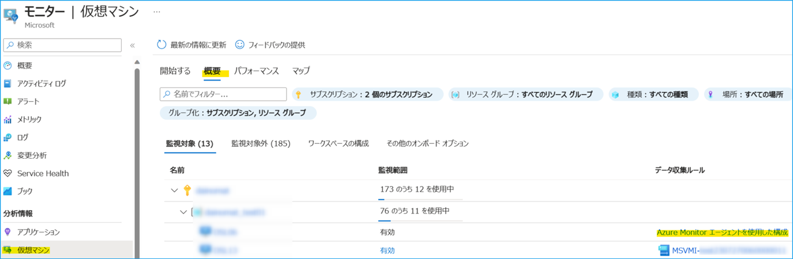
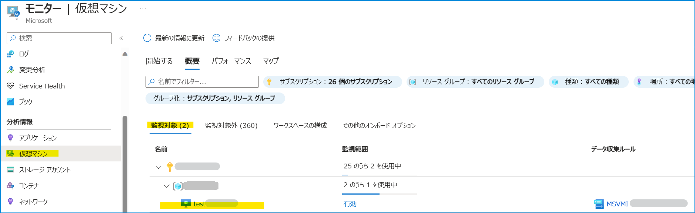
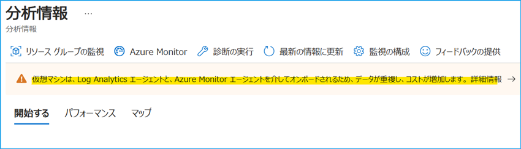
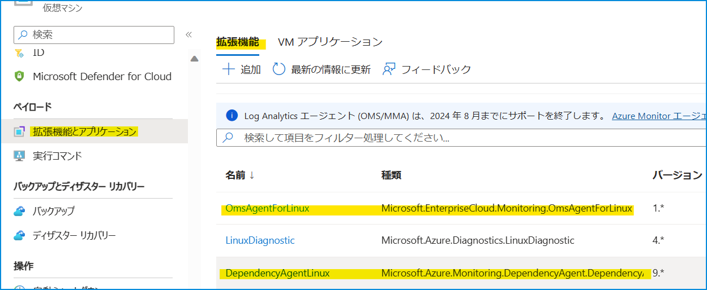
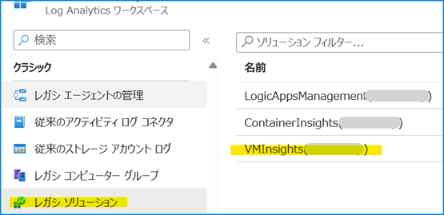
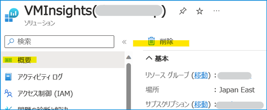
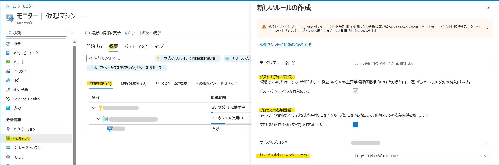
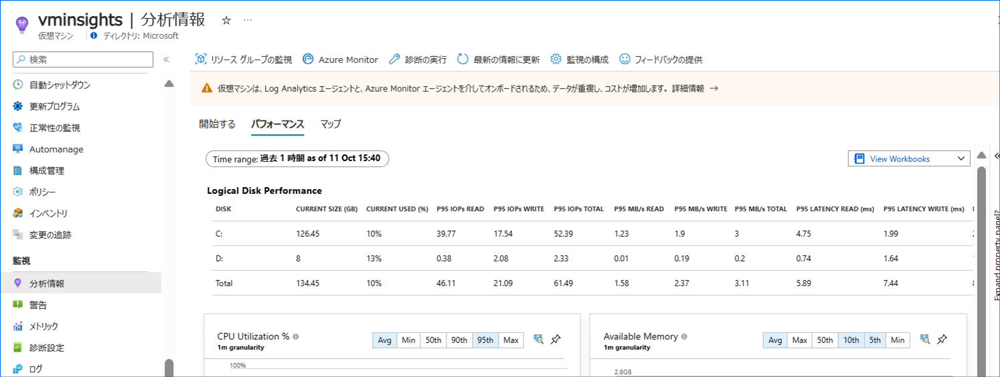
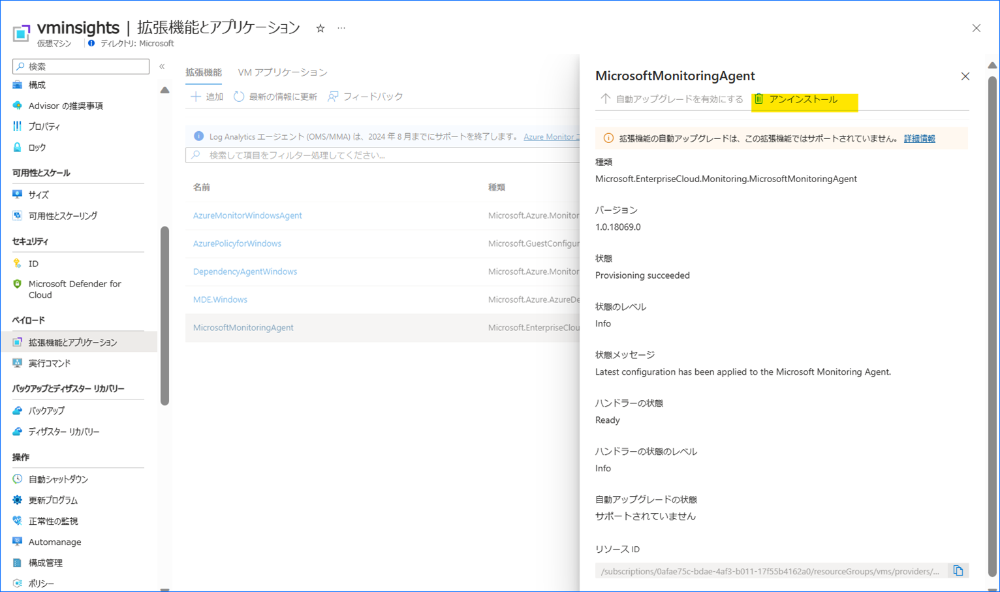
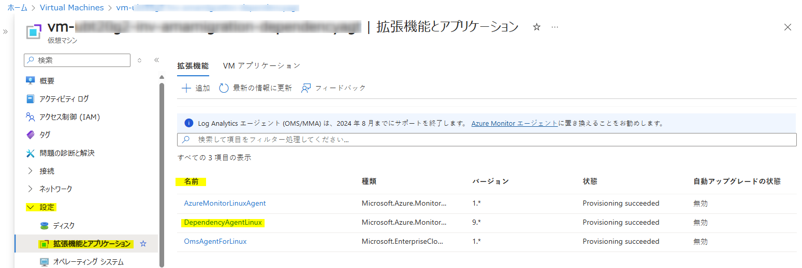

こんにちは、Azure Monitoring サポート チームの北村です。
今回の記事では、サービス正常性にて通知された「Migrate to Azure Monitor agent–based VM insights by 31 August 2024 」についてご説明します。

<br>

<!-- more -->
## 目次
- [1. 報告された正常性の勧告について](#1.-報告された正常性の勧告について)
  - [1-1.概要](#1-1-概要)
  - [1-2.内容](#1-2-内容)
  - [1-3.実施いただきたいアクション](#1-3-実施いただきたいアクション)
- [2. 移行対象のマシンを確認する方法と移行手順](#2-3移行対象のマシンを確認する方法と移行手順)
  - [2-1. 影響を受けるお客様](#2-1-影響を受けるお客様)
  - [2-2. 移行対象のマシンを確認する方法](#2-2-移行対象のマシンを確認する方法)
  - [2-3.移行手順](#2-3-移行手順)
- [3. 留意事項](#3-留意事項)

<br>

## 1. 報告された正常性の勧告について
### 1-1. 概要

| 項目名 | 項目値 |
|-------------|--------------------------------------------------------------------------------------|
| 題名                 | Action required: Migrate to Azure Monitor agent–based VM insights by 31 August 2024 |
| 追跡 ID              | 3MK1-NDG |
| 影響を受けるサービス   | Azure Monitor |
| 影響を受けるリージョン | Global |
| 正常性イベントの種類   | 正常性の勧告 |


### 1-2. 内容
You’re receiving this notice because you use Log Analytics agent–based VM insights.
On 31 August 2024, we’ll retire Log Analytics agent–based VM insights. Migrate to Azure Monitor agent–based VM insights, which offers improvements such as:
- Enhanced security and performance.
- Data collection rules to help cut costs.
- Simplified management experience, including efficient troubleshooting.


### 1-3. 実施いただきたいアクション
To ensure that you’re using a supported version of VM insights, [migrate](https://learn.microsoft.com/ja-jp/azure/azure-monitor/vm/vminsights-enable-overview#migrate-from-log-analytics-agent-to-azure-monitor-agent) to Azure Monitor agent–based VM insights by 31 August 2024.


<br>

## 2. 移行対象のマシンを確認する方法と移行手順
Log Analytics エージェント ベースの VM insights は 2024 年 8 月末にてサポート終了を予定しております。そのため、Log Analytics エージェント ベースの VM insights をご利用されている場合は、Azure Monitor エージェント ベースの VM insights への移行をお願いしております。
[VM insights](https://learn.microsoft.com/ja-jp/azure/azure-monitor/vm/vminsights-overview) は Azure VM や Azure Arc 対応サーバーなどの仮想マシンの監視を行う機能の一つです。仮想マシンのパフォーマンスや実行中のプロセス等のデータを収集します。VM insights では、Azure Monitor エージェントもしくは Log Analytics エージェントと、Dependency エージェントを仮想マシンにインストールし、ログを収集します。しかし、[2024 年 8 月末で Log Analytics エージェントが廃止される](https://learn.microsoft.com/ja-jp/azure/azure-monitor/agents/log-analytics-agent)ため、Azure Monitor エージェント ベースで VM insights をご利用いただく必要がございます。

<br>

### 2-1. 影響を受けるお客様
Log Analytics エージェント ベースの VM insights をご利用いただいているお客様に影響がございます。

<br>

### 2-2. 移行対象のマシンを確認する方法
Azure ポータルで [モニター] > [分析情報] > [仮想マシン] > [概要] タブ> [監視対象] タブの画面を開きます。
移行対象のマシンは「データ収集ルール」欄にて「Azure Monitor エージェントを使用した構成」と表示されるマシンです。
Azure Monitor エージェント ベースの VM insights をご利用されている場合は、「データ収集ルール」欄に構成に使用しているデータ収集ルールの名前が表示されます。一方で、Log Analytics エージェント ベースの VM insights の場合は「データ収集ルール」欄にて、データ収集ルール名は表示されません。ただし、該当のマシンが稼働していなければ、下記画面の情報は正しい評価が表示されない可能性がありますのでご留意ください。


<br>

***<補足 1.>***
2 つのエージェント (Azure Monitor エージェントおよび Log Analytics エージェント) によって VM insights が有効化されている場合は「データ収集ルール」欄にてデータ収集ルール名が表示されます。お客様の環境で 2 つのエージェントを併行稼働されている場合は、以下画面にて Log Analytics エージェントでも VM insights が有効化されていないかどうかをご確認ください。

1. Azure ポータルで [モニター] > [分析情報] > [仮想マシン] > [概要] タブ> [監視対象] タブの画面を開き、該当のマシンを選択します。


2. 以下のように表示された場合は Log Analytics エージェントでも VM insights が有効化されているため、Log Analytics エージェントのアンインストールが必要です。



<br>


***補足 2.***
稼働していないマシンがある場合は、Azure ポータルの [仮想マシン] > [拡張機能とアプリケーション] の画面より、インストールされているエージェントをご確認ください。Log Analytics エージェントと Dependency エージェントがインストールされている場合は、Log Analytics エージェント ベースの VM insights をご利用されている可能性がございます。

<Windows マシン>
MicrosoftMonitoringAgent (Windows 用の Log Analytics エージェント) と DependencyAgentWindows がインストールされているかどうかをご確認ください。


<Linux マシン>
OmsAgentForLinux (Linux 用の Log Analytics エージェント) および DependencyAgentLinux がインストールされているかどうかをご確認ください。


該当のマシンに Azure Monnitor エージェントもインストールされており、どちらのエージェントで VM insights が有効化されているかどうかが分からない場合は、ログ収集先の Log Analytics ワークスペースで以下のようなクエリを実行してください。

```CMD
// サンプル クエリ
Heartbeat
| where TimeGenerated > ago(90d)
| join kind=inner (
    InsightsMetrics
    | where TimeGenerated > ago(90d)
    | where Origin == 'vm.azm.ms'
) on $left.SourceComputerId == $right.AgentId
| distinct Category, Computer, SourceComputerId
```

[InsightsMetrics](https://learn.microsoft.com/ja-jp/azure/azure-monitor/reference/tables/insightsmetrics) テーブルは、VM insights を有効化すると収集されるログです。[Heartbeat](https://learn.microsoft.com/ja-jp/azure/azure-monitor/reference/tables/heartbeat) は Log Analytics エージェントや Azure Monitor エージェントによって既定で収集されます。Log Analytics エージェントや Azure Monitor エージェントには、クライアントを一意に識別可能なエージェント ID という識別子があります。このエージェント ID は Heartbeat テーブルの SourceComputerId 列、InsightsMetrics テーブルの AgentId 列で確認することができます。

Heartbeat の Category は、エージェントによって値が異なります。Log Analytics エージェントの場合は Category の値が Direct Agent、Azure Monitor エージェントでは Category の値が Azure Monitor Agent です。
そのため、両方のテーブルを SourceComputerId と AgentId で結合し、Heartbeat の Category の値を確認すれば、どちらのエージェントによって VM insights が有効化されているかどうかを確認できます。

以下は上記クエリの実行結果の例です。この例では Cateogry の値が Direct Agent のマシンは VM-B と VM-C です。VM-B は Azure Monitor エージェントが既にインストールされており、両方のエージェントで VM insights が有効化されています。
※ ログの保持期間を超過し上記クエリを実行してもログが存在しない場合は、マシンを起動してご確認ください。


<br>

### 2-3.移行手順
Log Analytics エージェントをアンインストールして、Azure Monitor エージェントでの VM insights の有効化が必要です。
Log Analytics エージェントと Azure Monitor エージェントは共存可能ですので、Azure Monitor エージェントによる VM insights を構成後に Log Analytics エージェントをアンインストールいただいても構いません。移行方法は 2 つございます。

- A. Log Analytics エージェントをアンインストールしてから Azure Monitor エージェントで VM insights を有効化する
- B. Azure Monitor エージェント で VM insights を有効化してから Log Analytics エージェントをアンインストールする

<br>

#### A. Log Analytics エージェントをアンインストールしてから Azure Monitor エージェントで VM insights を有効化する

1. Azure ポータルの [仮想マシン] > [拡張機能とアプリケーション] の画面より Log Analytics エージェントと Dependency エージェントをアンインストールします。Windows の場合は MicrosoftMonitoringAgent と DependencyAgentWindows、Linux の場合は OmsAgentForLinux および DependencyAgentLinux です。


2. [こちら](https://learn.microsoft.com/ja-JP/azure/azure-monitor/vm/vminsights-enable-portal#enable-vm-insights-for-azure-monitor-agent) の手順で Azure Monitor エージェント を使用して VM Insights を有効化します。

3. Log Analytics ワークスペースから VMInsights ソリューションを削除します。Azure ポータルの [Log Analytics ワークスペース] > [レガシー ソリューション] の画面より VMInsights ソリューションを選択します。


4. VMInsights ソリューションの [概要] を開き、[削除] を選択します。


> [!WARNING]
> 上記 A. の手順で移行した場合、作業中に Heartbeat や InsightsMetrics 等のデータが収集されません。
> そのため、例えば Heartbeat に対するアラート ルールを設定している場合は発報する可能性があります。

<br>


#### B. Azure Monitor エージェントで VM insights を有効化してから Log Analytics エージェントをアンインストールする

1. Log Analytics エージェントで VM insights を有効化している場合、[モニター] > [分析情報] の [仮想マシン] > [概要] タブ> [監視対象] タブで「Azure Monitor エージェントを使用した構成」リンクが表示されます。こちらをクリックすることで、Azure Monitor エージェントを利用した VM insights を有効化できます。


2. 既存の VM insights 用のデータ収集ルールを選択するか、データ収集ルールを新規作成します。ログを収集する Log Analytics ワークスペースと VM insights で収集するログの種類を選択します。詳細は[こちら](https://learn.microsoft.com/ja-jp/azure/azure-monitor/vm/vminsights-enable-portal#enable-vm-insights-for-azure-monitor-agent) の公開情報をご覧ください (以下はデータ収集ルールを新規作成する際に表示される画面です)。


3. しばらく待機しますと、Azure Monitor エージェントのインストールが完了し、Heartbeat や InsightsMetrics 等のログが二重に収集されることを確認できます。
```CMD
// サンプル クエリ
InsightsMetrics
| where TimeGenerated > ago(30m)
| where Computer contains "<コンピュータ名>"
| summarize count() by bin(TimeGenerated, 1m)
| sort by TimeGenerated asc
```


4. また、Azure ポータルの [仮想マシン] > [分析情報] 画面でもログが重複して収集されている旨のメッセージが表示されます。


5. Azure Monitor エージェントによるログ収集 (ログが二重に収集されていること) を確認してから、Azure ポータルの [仮想マシン] > [拡張機能とアプリケーション] の画面より Log Analytics エージェントをアンインストールします。Windows の場合は MicrosoftMonitoringAgent、Linux の場合は OmsAgentForLinux をアンインストールします。


6. Log Analytics ワークスペースから VMInsights ソリューションを削除します。Azure ポータルの [Log Analytics ワークスペース] > [レガシー ソリューション] の画面より VMInsights ソリューションを選択します。


7. VMInsights ソリューションの [概要] を開き、[削除] を選択します。


> [!WARNING]  
> 上記 B. の手順の場合は、作業中はログが二重に収集されることをご留意ください。
> 重複してログが収集されることにより、ログ アラート ルールが発報することがございます。

> [!WARNING]  
> B の方法は、既に VM にインストールされている Dependency エージェントの名前が "DependencyAgentWindows" (Windows OS 用) または "DependencyAgentLinux" (Linux OS 用) の場合に有効です。  
それ以外の名前の場合は、1 の作業の前に既存の Dependency エージェントをアンインストールしていただく必要があります。  
> <VM にインストールされているエージェントの名前の確認方法>  
Azure portal の VM リソース ページの 設定 > 拡張機能とアプリケーション のメニューで表示される、"名前" 列からご確認いただけます。
  
> <Dependency エージェントのアンインストール方法>  
Azure portal の VM リソース ページの 設定 > 拡張機能とアプリケーション のメニューで表示される拡張機能のうち、 "種類" に "DependencyAgent" が含まれるものを押下し、続いて"アンインストール" を押下します。

<br>

### 3. 留意事項
今回ご紹介した移行手順は、あくまで VM insights のための移行手順です。
VM insights 以外の監視データを収集するように Log Analytics エージェントを構成されている場合、
Log Analytics エージェントをアンインストールすれば、今まで Log Analytics エージェントによってログは収集されなくなります。
Log Analytics エージェントで VM insights 以外の収集設定もされている場合は、下記弊社公開情報をご参照いただき Azure Monitor エージェントによる収集設定をご実施いただくようお願いいたします。

また、Log Analytics エージェントと Azure Monitor エージェントの前提条件 (ネットワーク要件等) が異なります。
Azure Monitor エージェントの前提条件は下記弊社公開情報にまとめておりますので、移行手順を実施する前に必ずご確認いただきますようお願いいたします。

Azure Monitor エージェントの概要
https://learn.microsoft.com/ja-jp/azure/azure-monitor/agents/agents-overview

Azure Monitor エージェントを管理する
https://learn.microsoft.com/ja-JP/azure/azure-monitor/agents/azure-monitor-agent-manage?tabs=azure-portal#prerequisites

Azure Monitor エージェントのネットワーク設定を定義する
https://learn.microsoft.com/ja-jp/azure/azure-monitor/agents/azure-monitor-agent-data-collection-endpoint?tabs=PowerShellWindows

Azure Monitor エージェントを使用して仮想マシンからイベントとパフォーマンス カウンターを収集する
https://learn.microsoft.com/ja-jp/azure/azure-monitor/agents/data-collection-rule-azure-monitor-agent?tabs=portal

Azure Monitor エージェントを使用して Syslog イベントを収集する
https://learn.microsoft.com/ja-jp/azure/azure-monitor/agents/data-collection-syslog
