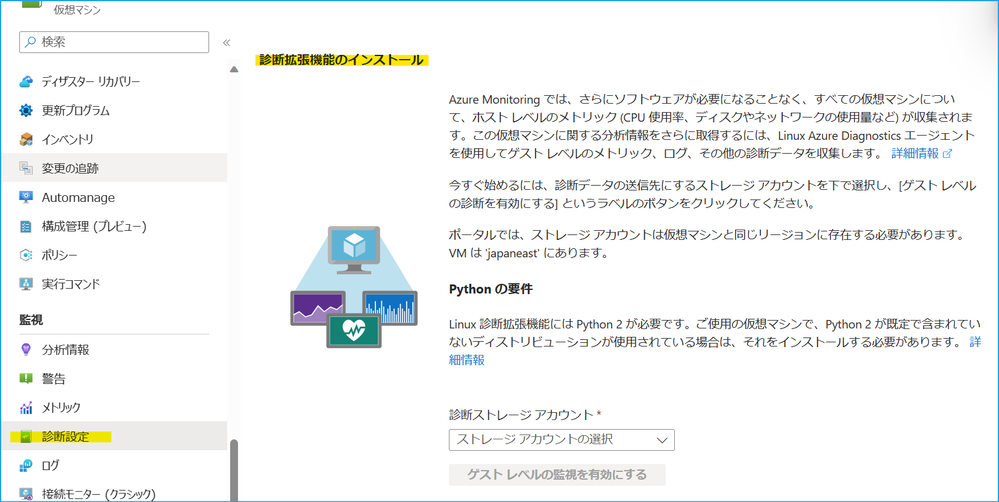

[更新履歴]
-2024/10/31 ブログ公開
-2026/01/21 最新の情報であることを確認

こんにちは、Azure Monitoring サポート チームの佐藤、北村です。
今回の記事では、サービス正常性にて通知された「Retirement notice: Migrate to Azure Monitor Agent before 31 March 2026 」についてご説明します。

<br>

<!-- more -->
## 目次
- [1. 報告された正常性の勧告について](#1-報告された正常性の勧告について)
  - [1-1.概要](#1-1-概要)
  - [1-2.内容](#1-2-内容)
  - [1-3.実施いただきたいアクション](#1-3-実施いただきたいアクション)
- [2. 移行が必要かどうかを確認する方法](#2-移行が必要かどうかを確認する方法)
  - [2-1. 影響を受けるお客様](#2-1-影響を受けるお客様)
  - [2-2. 移行対象のマシンを確認する手順](#2-2-移行対象のマシンを確認する手順)
- [3. 移行手順](#3-移行手順)
  - [3-1. Azure Diagnostics 拡張機能 (WAD/LAD) で収集しているデータの種類を確認する](#3-1-Azure-Diagnostics-拡張機能-WAD-LAD-で収集しているデータの種類を確認する)
  - [3-2. Azure Monitor エージェントでログをストレージ アカウントに送信する](#3-2-Azure-Monitor-エージェントでログをストレージ-アカウントに送信する)
  - [3-3. Azure Diagnostics 拡張機能 (WAD/LAD) をアンインストールする](#3-3-Azure-Diagnostics-拡張機能-WAD-LAD-をアンインストールする)


<br>


## 1. 報告された正常性の勧告について
### 1-1. 概要

| 項目名 | 項目値 |
|-------------|--------------------------------------------------------------------------------------|
| 題名                 | Retirement notice: Migrate to Azure Monitor Agent before 31 March 2026 |
| 追跡 ID              | GLSJ-LQ0 |
| 影響を受けるサービス   | Azure Monitor |
| 影響を受けるリージョン | Global |
| 正常性イベントの種類   | 正常性の勧告 |

<br>

### 1-2. 内容
You're receiving this notice because you use the Azure Diagnostics Agent to monitor your virtual machines (VMs) or servers.
On 31 March 2026, we'll retire the Azure Diagnostic Extensions for Windows and Linux (WAD/LAD) and it'll no longer be supported by Microsoft. You'll need to start using the Azure Monitor Agent to monitor your VMs and servers in Azure. The Azure Monitor Agent provides new features and capabilities, including:

- Centralized configuration for multiple VMs.
- Data limits and filters at the source.
- Multiple destinations for data from a single agent. (Log Analytics, Storage, Event Hubs, and Metrics).

**翻訳**
2026 年 3 月 31 日をもって、Windows および Linux 向けの Azure Diagnostics 拡張機能 (WAD / LAD) は廃止となり、Microsoft によるサポートが終了します。Azure の VM やサーバーを監視するために、Azure Monitor エージェントの使用を開始する必要があります。Azure Monitor エージェントには以下の新しい特徴や機能が含まれています。

- 複数の VM に対する集中管理可能な設定機能
- データ ソースに対する制限とフィルター機能
- 単一のエージェントから複数の送信先 (Log Analytics、Storage、Event Hubs、Metrics) へのデータ送信が可能


<br>

### 1-3. 実施いただきたいアクション
Follow the [set-up instructions](https://learn.microsoft.com/en-us/azure/azure-monitor/agents/azure-monitor-agent-send-data-to-event-hubs-and-storage?tabs=windows%2Cwindows-1) to start using the Azure Monitor Agent to monitor your VMs and servers before 31 March 2026.
To check which extensions are installed on your VM, select Extensions + applications under Settings on your VM.

**翻訳**
2026 年 3 月 31 日までに、Azure Monitor エージェントを使用して VM やサーバーを監視するためのセットアップ手順を実行して下さい。お使いの VM にインストールされている拡張機能を確認するには、Azure VM の [設定] から [拡張機能とアプリケーション] を選択して下さい。

<br>


## 2. 移行が必要かどうかを確認する方法
[Azure Diagnostics 拡張機能](https://learn.microsoft.com/ja-jp/azure/azure-monitor/agents/diagnostics-extension-overview) は 2026 年 3 月 31 日に廃止される予定のため、引き続きパフォーマンス カウンターやログ データの収集を行うためには、同等の機能を有する [Azure Monitor エージェント](https://learn.microsoft.com/ja-jp/azure/azure-monitor/agents/azure-monitor-agent-overview)への移行をお願いしております。
Azure Diagnostics 拡張機能は [Azure VM の診断設定](https://jpazmon-integ.github.io/blog/AzureMonitorEssential/HowToDiagnosticsSettings/#2-Azure-VM-%E3%81%AE%E8%A8%BA%E6%96%AD%E8%A8%AD%E5%AE%9A) を有効化することで、Azure VM にインストールされ、ゲスト OS のログやメトリックをストレージ アカウントに送信します。Windows 用の Azure Diagnostics 拡張機能 は Windows Azure Diagnostics extension (WAD)、Linux 用は Linux Azure Diagnostics extension (LAD) と呼ばれています。Azure Monitor エージェントは、基本的に Log Analytics ワークスペースへログ収集を行います。[ストレージ アカウントへのエクスポートを行いたい場合は別途設定が必要です](https://learn.microsoft.com/ja-jp/azure/azure-monitor/agents/azure-monitor-agent-send-data-to-event-hubs-and-storage?tabs=windows%2Cwindows-1)。


<br>


### 2-1. 影響を受けるお客様
Azure VM で [Azure VM の診断設定](https://jpazmon-integ.github.io/blog/AzureMonitorEssential/HowToDiagnosticsSettings/#2-Azure-VM-%E3%81%AE%E8%A8%BA%E6%96%AD%E8%A8%AD%E5%AE%9A) をご利用されている場合に影響がございます。
引き続きパフォーマンス カウンターやログ データを、ストレージ アカウントに収集する場合には Azure Monitor エージェントによる収集をご検討ください。なお、既に Azure Monitor エージェントを利用して必要なログ等を収集されている場合や、ストレージ アカウントにデータを収集する必要がない場合には、移行は不要です (Azure Diagnostics 拡張機能のアンインストールのみ実施してください)。

> [!WARNING]
> Azure Monitor には "診断設定" という名前の機能が 2 つ存在します。この 2 つの機能の違いについては、[こちら](https://jpazmon-integ.github.io/blog/AzureMonitorEssential/HowToDiagnosticsSettings/#2-Azure-VM-%E3%81%AE%E8%A8%BA%E6%96%AD%E8%A8%AD%E5%AE%9A) のブログでご案内しておりますので、必要に応じてご確認ください。


<br>


### 2-2. 移行対象のマシンを確認する手順
Azure ポータルで [Resource Graph エクスプローラー] ([Azure Resource Graph エクスプローラー](https://learn.microsoft.com/ja-jp/azure/governance/resource-graph/first-query-portal)) を開き、下記のようなクエリを実行することで、Azure Diagnostics 拡張機能が導入されたマシンとその接続先のストレージ アカウントを確認できます。
以下がサンプル クエリでございます。クエリ内、<> 部分についてはお客様環境に合わせてご変更いただく必要がございます。以下のクエリを実行いただき、該当するマシンがあるかどうかをご確認ください。
```
resources 
| where subscriptionId == "<サブスクリプション ID>"
| extend publisher = properties.publisher
| extend extensionType = properties.type
| extend connectedStorageAccount = properties.settings.StorageAccount
| where extensionType in ("IaaSDiagnostics","LinuxDiagnostic")
| parse id with * "/virtualMachines/" vmName "/extensions" *
| project vmName, extensionName = name, extensionType, publisher, location, resourceGroup, connectedStorageAccount
```

extentionType が IaaSDiagnostics の場合は、Windows 用の Azure Diagnostics 拡張機能、
extentionType が LinuxDiagnostic の場合は、Linux 用の Azure Diagnostics 拡張機能を表します。
上記のクエリでヒットするマシンがありましたら、そのマシンには Azure Diagnostics 拡張機能が導入されていることになります。


<br>

## 3. 移行手順
### 3-1. Azure Diagnostics 拡張機能 (WAD/LAD) で収集しているデータの種類を確認する
Azure VM の [監視] - [診断設定] より、現在のデータ収集設定をご確認ください。下図は Linux VM の設定画面です。



<br>

### 3-2. Azure Monitor エージェントでログをストレージ アカウントに送信する
Azure Monitor エージェントでログをストレージ アカウントに送信する場合は、[こちら](https://learn.microsoft.com/ja-jp/azure/azure-monitor/agents/azure-monitor-agent-send-data-to-event-hubs-and-storage?tabs=windows%2Cwindows-1) の公開情報を参考に設定してください。
なお、Azure Monitor エージェントを導入される前に必ず [Azure Monitor エージェントの前提条件](https://learn.microsoft.com/ja-jp/azure/azure-monitor/agents/azure-monitor-agent-requirements)や[通信要件](https://learn.microsoft.com/ja-jp/azure/azure-monitor/agents/azure-monitor-agent-network-configuration?tabs=PowerShellWindows)をご確認ください。

> [!WARNING]
> Azure Monitor エージェントでストレージ アカウントに送信できるログの種類は [公開情報](https://learn.microsoft.com/ja-jp/azure/azure-monitor/agents/azure-monitor-agent-send-data-to-event-hubs-and-storage?tabs=windows%2Cwindows-1#migration-from-azure-diagnostic-extensions-for-linux-and-windows-ladwad) に記載されております。移行前に必ずご確認ください。


<br>

### 3-3. Azure Diagnostics 拡張機能 (WAD/LAD) をアンインストールする
Azure ポータルから Azure Diagnostics 拡張機能 (WAD/LAD) をアンインストール方法は以下の通りです。

1. Azure ポータル上で VM を開き、画面左側の [設定] > [拡張機能とアプリケーション] を選択します。
2. 一覧から Azure Diagnostics 拡張機能をクリックします。Windows マシンの場合は [種類] が IaaSDiagnostics を含むもの、Linux マシンの場合は [種類] が LinuxDiagnostic を含むものが該当します。
3. 画面右上の [アンインストール] を選択します。


-----------------
上記の内容以外でご不明な点や疑問点などございましたら、弊社サポート サービスまでお問い合わせください。
最後までお読みいただきありがとうございました！