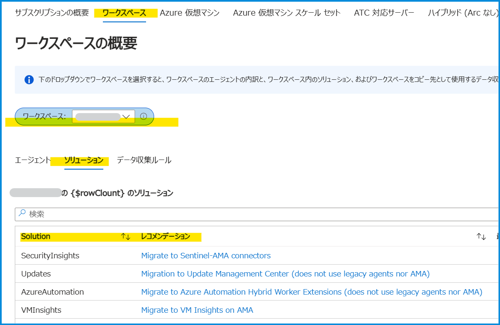
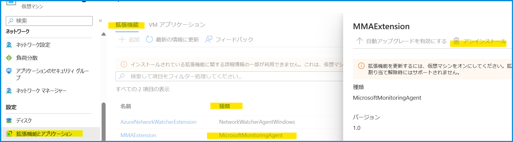

[更新履歴]
- 2024/04/30 FAQ 追加
- 2022/10/18 ブログ公開


こんにちは、Azure Monitoring サポート チームの北村です。
Log Analytics エージェントが 2024 年 8 月に廃止することに伴い、Azure Monitor エージェントへの移行に関するお問い合わせをよくいただいております。そこで、本記事では Azure Monitor エージェントへの移行に関するよくあるご質問を Q & A 形式でおまとめいたしました。これから Azure Monitor エージェントへ移行される方、Azure Monitor エージェントの導入をご検討されている方の一助となれば幸いです。

<br>

<!-- more -->

## Q & A タイトル
- [Q1. Log Analytics エージェントは 2024 年 8 月に廃止されますが、Log Analytics ワークスペースも廃止されますか。](#Q1-Log-Analytics-エージェントは-2024-年-8-月に廃止されますが、Log-Analytics-ワークスペースも廃止されますか。)
- [Q2. Azure Monitor エージェントへ移行した後も、既存のアラート ルールを利用することはできますか。](#Q2-Azure-Monitor-エージェントへ移行した後も、既存のアラート-ルールを利用することはできますか。)
- [Q3. 同一のマシン上で Log Analytics エージェントと Azure Monitor エージェントを稼働させることは可能ですか。](#Q3-同一のマシン上で-Log-Analytics-エージェントと-Azure-Monitor-エージェントを稼働させることは可能ですか。)
- [Q4. Azure Monitor エージェントでは、Log Analytics エージェントと同等の機能が提供されていますか。](#Q4-Azure-Monitor-エージェントでは、Log-Analytics-エージェントと同等の機能が提供されていますか。)
- [Q5. Log Analytics エージェントを利用した他製品のソリューションを利用しているかどうかを確認する方法を教えてください](#Q5-Log-Analytics-エージェントを利用した他製品のソリューションを利用しているかどうかを確認する方法を教えてください。)
- [Q6. Azure Montior エージェントを利用する上での前提条件とサポートしている OS を教えてください。](#Q6-Azure-Montior-エージェントを利用する上での前提条件とサポートしている-OS-を教えてください。)
- [Q7. Azure Monitor エージェントと Log Analytics エージェントの通信要件は同じですか。](#Q7-Azure-Monitor-エージェントと-Log-Analytics-エージェントの通信要件は同じですか。)
- [Q8. 閉じたネットワーク環境でコンピューターから Log Analytics ワークスペースへログを送信したいです。Azure Monitor エージェントでこのような事が実現可能ですか。](#Q8-閉じたネットワーク環境でコンピューターから-Log-Analytics-ワークスペースへログを送信したいです。Azure-Monitor-エージェントでこのような事が実現可能ですか。)
- [Q9. Log Analytics エージェントの廃止日までに Azure Monitor エージェントに移行しなかった場合は、どうなりますか。また、廃止日以降も Log Analytics エージェントのサポートを受けることはできますか。](#Q9-Log-Analytics-エージェントの廃止日までに-Azure-Monitor-エージェントに移行しなかった場合は、どうなりますか。また、廃止日以降も-Log-Analytics-エージェントのサポートを受けることはできますか。)
- [Q10. Azure VM に Log Analytics エージェントがインストールされているかどうかを確認する方法を教えてください。](#Q10-Azure-VM-に-Log-Analytics-エージェントがインストールされているかどうかを確認する方法を教えてください。)
- [Q11. 仮想マシンに Log Analytics エージェントがインストールされています。Azure Monitor エージェントへの移行手順を教えてください。](#Q11-仮想マシンに-Log-Analytics-エージェントがインストールされています。Azure-Monitor-エージェントへの移行手順を教えてください。)
- [Q12. Log Analytics エージェントと Azure Monitor エージェントを同時に稼働しています。Azure Monitor エージェントでログが収集されていることを確認する方法を教えてください。](#Q12-Log-Analytics-エージェントと-Azure-Monitor-エージェントを同時に稼働しています。Azure-Monitor-エージェントでログが収集されていることを確認する方法を教えてください。)
- [Q13. データ収集ルールを作成し、Azure Monitor エージェントがインストールされ、ログが収集されていることを確認しました。しかし、Log Analytics ワークスペースの左メニュー [仮想マシン (非推奨)] を見ると、”接続されていません” と表示されます。](#Q13-データ収集ルールを作成し、Azure-Monitor-エージェントがインストールされ、ログが収集されていることを確認しました。しかし、Log-Analytics-ワークスペースの左メニュー-仮想マシン-非推奨-を見ると、”接続されていません”-と表示されます。)
- [Q14. 仮想マシンを作成したとき、 Azure Monitor エージェントのインストール、および既存のデータ収集ルールとの関連付けを自動で実施する方法はありますか。](#Q14-仮想マシンを作成したとき、-Azure-Monitor-エージェントのインストール、および既存のデータ収集ルールとの関連付けを自動で実施する方法はありますか。)
- [Q15. Log Analytics エージェントの廃止に伴い、VM の診断設定も移行が必要ですか。](#Q15-Log-Analytics-エージェントの廃止に伴い、VM-の診断設定も移行が必要ですか。)

<br>


### Q1. Log Analytics エージェントは 2024 年 8 月に廃止されますが、Log Analytics ワークスペースも廃止されますか。
いいえ、Log Analytics エージェントは廃止されますが、Log Analytics ワークスペースは廃止されません。

<br>

### Q2. Azure Monitor エージェントへ移行した後も、既存のアラート ルールを利用することはできますか。
基本的に Azure Monitor エージェントへの移行後も既存のアラート ルールをご利用いただけますが、アラート ルールの設定と監視するログの種類によっては、動作しないものも存在する可能性もございます。念のため、移行する際にアラート ルールの動作もご確認いただけますと幸いです。特に、以下の場合は注意が必要です。


##### 1). Log Analytics エージェントと Azure Monitor エージェントで異なる Log Analytics ワークスペースを利用する場合
移行前後でログの収集先が変わりますため、アラート ルールのスコープが Log Analytics ワークスペースとなっている場合は、再設定が必要となります。


##### 2). Heartbeat の監視で Category 列の値を利用している場合
Azure Monitor エージェントに移行しますと、マシンの死活監視に用いられる Heartbeat ログの Category 列の値が変更されます。Log Analytics エージェントにより収集された Heartbeat ログは Category 列が "Direct Agent" ですが、Azure Monitor エージェントにより収集された Heartbeat ログは Category 列が "Azure Monitor Agent" となります。よって、Heartbeat テーブルを対象としたログ アラート ルールを構成しており、またそのクエリにて Category 列を何らかの形で利用している場合は、変更点に応じたクエリの検討が必要です。


##### 3). Event テーブルの監視で EventLevel と EventLevelName 列の値を利用している場合
Log Analytics エージェントと Azure Monitor エージェントで収集される Event (Windows イベント ログ) のデータで、 EventLevel と EventLevelName のマッピングに一部変更がございます。Event を監視するアラート ルールでこれらの値を使用している場合は、動作の確認が必要です。

<table class="tg">
<thead>
  <tr>
    <th class="tg-0lax" colspan="2">Windows イベント&nbsp;&nbsp;ビューアー</th>
    <th class="tg-0pky" colspan="2">Log Analytics エージェント</th>
    <th class="tg-0pky" colspan="2">Azure Monitor エージェント</th>
  </tr>
</thead>
<tbody>
  <tr>
    <td class="tg-0lax">EventLevel</td>
    <td class="tg-0lax">EventLevelName</td>
    <td class="tg-0pky">EventLevel</td>
    <td class="tg-0pky">EventLevelName</td>
    <td class="tg-0pky">EventLevel</td>
    <td class="tg-0pky">EventLevelName</td>
  </tr>
  <tr>
    <td class="tg-0lax">1</td>
    <td class="tg-0lax">Critical</td>
    <td class="tg-0pky">1</td>
    <td class="tg-0pky">Error</td>
    <td class="tg-0pky">1</td>
    <td class="tg-0pky">Critical</td>
  </tr>
  <tr>
    <td class="tg-0lax">2</td>
    <td class="tg-0lax">Error</td>
    <td class="tg-0pky">1</td>
    <td class="tg-0pky">Error</td>
    <td class="tg-0pky">2</td>
    <td class="tg-0pky">Error</td>
  </tr>
  <tr>
    <td class="tg-0lax">3</td>
    <td class="tg-0lax">Warning</td>
    <td class="tg-0lax">2</td>
    <td class="tg-0lax">Warning</td>
    <td class="tg-0lax">3</td>
    <td class="tg-0lax">Warning</td>
  </tr>
  <tr>
    <td class="tg-0lax">4</td>
    <td class="tg-0lax">Information</td>
    <td class="tg-0lax">4</td>
    <td class="tg-0lax">Information</td>
    <td class="tg-0lax">4</td>
    <td class="tg-0lax">Information</td>
  </tr>
  <tr>
    <td class="tg-0lax">5</td>
    <td class="tg-0lax">Verbose</td>
    <td class="tg-0lax">-</td>
    <td class="tg-0lax">-</td>
    <td class="tg-0lax">5</td>
    <td class="tg-0lax">Verbose</td>
  </tr>
</tbody>
</table>


※	Log Analytics エージェントは Verbose レベルのイベント ログは収集しない
※	Log Analytics エージェントは Critical レベルのイベント ログを Error として収集する


##### 4). Microsoft Defender for Cloud や Microsoft Sentinel を利用してセキュリティ イベント ログを収集している場合
Log Analytics エージェントと Microsoft Defender for Cloud や Microsoft Sentinel を利用してセキュリティ イベント ログを収集されている場合、収集されたログは SecurityEvent テーブルに格納されます。Azure Monitor エージェントを使用してセキュリティ イベント ログを収集した場合、収集されたログは Event テーブルに格納されます。よって、SecurityEvent テーブルを対象としたログ アラート ルールを構成している場合は、ログ アラート ルール内のクエリで利用しているテーブル名を Event テーブルへ変更する必要がございます。各エージェントによるセキュリティ イベント ログの収集先テーブルの違いについては、こちらの[ブログ](https://jpazmon-integ.github.io/blog/LogAnalytics/HowToCollectWindowsSecurityEvents/)でもご案内しておりますので、併せてご確認いただけますと幸いです。


##### 5). Syslog テーブルの監視で SeverityLevel 列の値を利用している場合
Log Analytics エージェントと Azure Monitor エージェントで収集される Syslog (Linux の Syslog) のデータで、 SeverityLevel の値に一部変更がございます。Syslog を監視するアラート ルールでこれらの値を使用している場合は、動作の確認が必要です。

<table class="tg">
<thead>
  <tr>
    <th class="tg-0pky">エージェント</th>
    <th class="tg-lboi" colspan="4">SeverityLevel</th>
  </tr>
</thead>
<tbody>
  <tr>
    <td class="tg-0pky"><span style="font-weight:bold">Log Analytics エージェント</span></td>
    <td class="tg-0pky">warn</td>
    <td class="tg-0lax">err</td>
    <td class="tg-0lax">crit</td>
    <td class="tg-0lax">emerg</td>
  </tr>
  <tr>
    <td class="tg-0pky"><span style="font-weight:bold">Azure Monitor エージェント</span></td>
    <td class="tg-0pky">warning</td>
    <td class="tg-0lax">error</td>
    <td class="tg-0lax">critical</td>
    <td class="tg-0lax">emergency</td>
  </tr>
</tbody>
</table>

##### 6). カスタム ログの監視で Computer 列の値を利用している場合
Log Analytics エージェントのカスタム ログでは、 Computer 列に対象 VM のホスト名が収集されていますが、
移行後の Azure Monitor エージェントのカスタム ログでは、 Computer 列の値は収集されなくなります。カスタム ログを監視するアラート ルールで Computer 列の値を利用している場合は、動作の確認が必要です。


<br>


### Q3. 同一のマシン上で Log Analytics エージェントと Azure Monitor エージェントを稼働させることは可能ですか。
はい、可能です。
ただし、データが重複して収集される可能性もございますので、その点ご留意ください。
詳細は [Log Analytics エージェントから Azure Monitor エージェントへの移行](https://learn.microsoft.com/ja-jp/azure/azure-monitor/agents/azure-monitor-agent-migration#migration-plan-considerations) の [移行ガイダンス] をご覧ください。

<br>


### Q4. Azure Monitor エージェントでは、Log Analytics エージェントと同等の機能が提供されていますか。
いいえ、現時点では Log Analytics エージェントの全ての機能を Azure Monitor エージェントで提供しておりません。
最終的には、Azure Monitor エージェントは Log Analytics エージェント、Azure Diagnostics 拡張機能、および Telegraf エージェントの機能を提供する予定でございます。Azure Monitor エージェントと Log Analytics エージェントにおける機能の違いにつきましては、[Azure Monitor エージェントの概要](https://learn.microsoft.com/ja-jp/azure/azure-monitor/agents/agents-overview#compare-to-legacy-agents) の [レガシ エージェントとの比較] をご覧ください。

また、Log Analytics エージェントを利用した他製品のソリューションをご利用いただいている場合も、該当するソリューション観点で移行いただく必要がございます。移行方法の詳細は[弊社公開情報](https://learn.microsoft.com/ja-jp/azure/azure-monitor/agents/azure-monitor-agent-migration#migrate-additional-services-and-features)をご確認いただけますと幸いです。なお、いくつかのサービスにつきましては、以下にご留意いただきたい点をお纏めしておりますので、こちらも併せてご確認いただけますと幸いです。


- ***VM insights***
Log Analytics エージェントの廃止に伴い、Log Analytics エージェント ベースの [VM insights](https://learn.microsoft.com/ja-jp/azure/azure-monitor/vm/vminsights-overview) は 2024 年 8 月末にてサポート終了を予定しております。そのため、Log Analytics エージェント ベースの VM insights をご利用されている場合は、Azure Monitor エージェント ベースの VM insights への移行が必要です。詳細につきましては、[弊社公開情報](https://learn.microsoft.com/ja-jp/azure/azure-monitor/vm/vminsights-enable-portal) や[弊社サポート ブログ](https://jpazmon-integ.github.io/blog/LogAnalytics/HowToMigrateToAmaBasedVMInsights/) をご覧ください。


- ***Microsoft Sentinel***
Microsoft Sentinel をご利用され、Log Analytics エージェントを利用したコネクタをご利用されている場合は、Azure Monitor エージェントを利用したコネクタ等に移行が必要でございます。[こちら](https://learn.microsoft.com/ja-jp/azure/sentinel/ama-migrate)の公開情報をご参照いただき、移行手順をご確認ください。


- ***Change Tracking とイベントリ***
Azure Automation の [Change Tracking とイベントリ機能](https://learn.microsoft.com/ja-jp/azure/automation/change-tracking/overview?tabs=python-2) V1 でも Log Analytics エージェントを利用しております。Log Analytics エージェントを利用した Change Tracking V1 をご利用されている場合は Azure Monitor エージェントを利用した Change Tracking V2 に移行をお願いいたします。移行手順は[弊社公開情報](https://learn.microsoft.com/JA-JP/azure/automation/change-tracking/guidance-migration-log-analytics-monitoring-agent?tabs=ct-single-vm%2Climit-single-vm)をご参照ください。


- ***Network Watcher***
Network Watcher の接続モニターを利用している環境において、オンプレミスのサーバーを監視のソースとしている場合は、Log Analytics エージェントを利用している可能性があります。Network Watcher の接続モニターで Log Analytics エージェントを利用しているかについては、[接続モニターのテスト グループ](https://learn.microsoft.com/ja-jp/azure/network-watcher/connection-monitor-create-using-portal#create-test-groups-in-a-connection-monitor)から、ソース/ターゲットにおいて、Azure 以外のエンドポイントでかつ、型が [ARC endpoints] を指定していれば、Log Analytics エージェントを利用していると判断できます。
もし NetworkWatcher でオンプレミス マシンを Log Analytics エージェントで監視している場合、まずは [Azure Connected Machine エージェント](https://learn.microsoft.com/ja-jp/azure/network-watcher/connection-monitor-connected-machine-agent?tabs=WindowsScript)を使用して Azure のリソースとしてください (これは Network Watcher に限らず、非 Azure マシンに Azure Monitor エージェントを使用する場合は必要な作業となります)。Azure Connected Machine エージェントを使用して Azure のリソースとして頂いた後、[Azure Monitor エージェントと Network Watcher 拡張機能のインストールをしていただく必要があります](https://learn.microsoft.com/ja-jp/azure/network-watcher/azure-monitor-agent-with-connection-monitor#install-monitoring-agents-for-azure-and-non-azure-resources)。Azure Connected Machine エージェントをインストールすることで、Azure Arc サーバーとして Azure 上で認識され、通常の Azure VM に拡張機能をインストールするのと同じ要領で Azure Monitor エージェントおよび Network Watcher エージェントのインストールすることが可能となります。Azure Arc 対応サーバーでの Azure Monitor エージェントのインストール手順等につきましては、[弊社公開情報](https://learn.microsoft.com/ja-jp/azure/network-watcher/connection-monitor-install-azure-monitor-agent?tabs=PowerShellWindowsArc%2CCLIWindowsArc) をご参照ください。


- ***Microsoft Defender for Cloud***
以前は Azure Monitor エージェントを使用する移行手順も存在しておりましたが、[Microsoft Defender for Cloud (以下、MDC)](https://learn.microsoft.com/ja-jp/azure/defender-for-cloud/defender-for-cloud-introduction) では エージェントを廃止する方向で進んでおりまして、MDC からは既に Azure Monitor エージェントのプロビジョニングをする設定ができないように変更されております。そのため、 MDC から自動プロビジョニングされている、 Log Analytics エージェントを、 Azure Monitor エージェントに置き換えることはできません。[こちら](https://learn.microsoft.com/ja-jp/azure/defender-for-cloud/prepare-deprecation-log-analytics-mma-agent#feature-functionality)の公開情報に、現時点の代替方法についてまとめられておりますので、ご参照ください。現在、一部の機能は提供されておりますが、  Log Analytics エージェントの代替となる方法が提供されていないものもあることをご容赦いただけますと幸いです。


- ***Update Management***
[Update Management](https://learn.microsoft.com/ja-jp/azure/automation/update-management/overview) では Log Analytics エージェントを利用しているため、継続して仮想マシン等の更新プログムの管理を行いたい場合は Log Analytics エージェントに依存しない [Azure Update Manager](https://learn.microsoft.com/ja-jp/azure/update-manager/overview?tabs=azure-vms) への移行が必要です。Azure Update Management の対象になっている仮想マシンは、Log Analytics ワークスペースに対して以下のクエリを実行することで確認可能です (検索範囲の時間はマシンの起動状況を加味して適宜ご設定ください)。Azure Update Management から Azure Update Manager への移行手順の詳細につきましては、[弊社公開情報](https://learn.microsoft.com/ja-jp/azure/update-manager/guidance-migration-automation-update-management-azure-update-manager) をご参照ください。
```
Heartbeat
| where Solutions contains "updates"
| summarize arg_max(TimeGenerated, *) by _ResourceId
```


- ***Hybrid Runbook Worker***
[Hybrid Runbook Worker](https://learn.microsoft.com/ja-jp/azure/automation/automation-hybrid-runbook-worker) には、エージェント ベースと拡張機能ベースの 2 種類のプラットフォームがございます。
[エージェントベースの Hybrid Runbook Worker](https://learn.microsoft.com/ja-jp/azure/automation/extension-based-hybrid-runbook-worker-install?tabs=linux%2Cbicep-template#migrate-an-existing-agent-based-to-extension-based-hybrid-workers) では Log Analytics エージェントを利用しておりますので、拡張機能ベースの Hybrid Runbook Worker に移行いただく必要がございます。エージェント ベースの Hybrid Runbook Worker をご利用いただいている場合は、[こちら](https://learn.microsoft.com/ja-jp/azure/automation/migrate-existing-agent-based-hybrid-worker-to-extension-based-workers?tabs=bicep-template%2Cwin-hrw)の公開情報の手順に従って拡張機能ベースの Hybrid Runbook Worker に移行をいただけましたら幸いです。


- ***HD Insight***
[Azure Monitor ログを有効にしている場合](https://learn.microsoft.com/ja-jp/azure/hdinsight/hdinsight-hadoop-oms-log-analytics-tutorial?tabs=new)は、移行が必要でございます。
HDInsight リソースにおいて、下記画像の赤枠部分の設定 「HDInsight クラスター (クラシック) の Azure Monitor への統合を構成します。」 より、ログ収集の設定を実施いただいている場合は、Log Analytics Agent 廃止後にログ収集が停止されます。下記画像の緑枠の設定が新しい設定となり、[公開情報](https://learn.microsoft.com/ja-jp/azure/hdinsight/hdinsight-hadoop-oms-log-analytics-tutorial?tabs=new)では [新しい Azure Monitor エクスペリエンス] と記載がある項目に該当します。こちらへ切り替えを実施いただければ、Log Analytics エージェントの廃止後も引き続き監視が可能となります。


<br>

### Q5. Log Analytics エージェントを利用した他製品のソリューションを利用しているかどうかを確認する方法を教えてください。
Log Analytics エージェントから Azure Monitor エージェントへ移行いただく際に、移行すべきサービスを検出および移行方法の提案や進行状況の追跡を行う [AMA Migration Helper](https://learn.microsoft.com/ja-jp/azure/azure-monitor/agents/azure-monitor-agent-migration-tools#using-ama-migration-helper) というツールがございます。AMA Migration Helper は、[モニター] > [ブック] > [パブリック テンプレート] > [Azure Monitor の要点] > [AMA Migration Helper] よりご利用いただけます。各ソリューションの移行に関する詳細は[こちら](https://learn.microsoft.com/ja-jp/azure/azure-monitor/agents/azure-monitor-agent-migration#migrate-additional-services-and-features)の公開情報にまとまっておりますので、ご確認いただけますと幸いです。
AMA Migration Helper を利用して他製品のソリューションのご利用状況を確認する手順は以下のとおりです。

1. すべてのサービスより、[モニター] を選択し、画面左側の [ブック] より、[パブリック テンプレート] タブを選択します。一覧より [AMA Migration Helper] を選択します。


2. [ワークスペース] タブを選択し、ご確認されたい Log Analytics ワークスペースをプルダウンより選択します。
3. [ソリューション] タブを選択しますと、当該 Log Analytics ワークスペースでご利用のソリューションのうち、Log Analytics エージェントから Azure Monitor エージェントへの移行が必要なソリューションが表示されます。Solution 列には、移行が必要な機能、レコメンデーション列には移行方法に関する公開情報のリンクが記載されております。


<br>


### Q6. Azure Montior エージェントを利用する上での前提条件とサポートしている OS を教えてください。
Azure Montior エージェントをご利用する上での前提条件は [Azure Monitor エージェントを管理する](https://learn.microsoft.com/ja-jp/azure/azure-monitor/agents/azure-monitor-agent-manage?tabs=ARMAgentPowerShell%2CPowerShellWindows%2CPowerShellWindowsArc%2CCLIWindows%2CCLIWindowsArc#prerequisites) の [前提条件] をご覧ください。
また、当該エージェントがサポートしている OS は [Azure Monitor エージェントの概要](https://learn.microsoft.com/ja-jp/azure/azure-monitor/agents/agents-overview#supported-operating-systems) の [サポートされるオペレーティング システム] の表に記載されている OS かつ、対象列に "✓" と記載されているものでございます。


<br>


### Q7. Azure Monitor エージェントと Log Analytics エージェントの通信要件は同じですか。
いいえ、Log Analytics エージェントの通信要件と Azure Monitor エージェントの通信要件は異なります。
Azure Monitor エージェントからワークスペースへデータを送信するには、下記 URL に対して TCP 443 ポートへのアクセスが確保されている必要がございます。

- global.handler.control.monitor.azure.com 
- &lt;virtual-machine-region-name&gt;.handler.control.monitor.azure.com (例: japaneast.handler.control.azure.com)
- &lt;log-analytics-workspace-id&gt;.ods.opinsights.azure.com (例: 12345a01-b1cd-1234-e1f2-1234567g8h99.ods.opsinsights.azure.com)


また、NSG を利用する場合には、AzureMonitor と AzureResourceManager のサービス タグに対して、送信方向にアクセスを許可していただく必要がございます。詳細は [Azure Monitor エージェントのネットワーク設定を定義する](https://learn.microsoft.com/ja-jp/azure/azure-monitor/agents/azure-monitor-agent-data-collection-endpoint?tabs=PowerShellWindows) をご覧ください。

一方で、カスタム ログを収集する場合や [Azure Monitor Private Link Scope (AMPLS)](https://learn.microsoft.com/ja-jp/azure/azure-monitor/logs/private-link-security) を用いて閉域網にてログを収集する場合、データ収集エンドポイント (DCE) を別途ご構築いただく必要がございます。
その場合、DCE をご利用いただくための通信要件を別途考慮いただく必要がございます。
DCE をご利用いただく場合は、下記 URL に対して TCP 443 ポートへのアクセスが確保されている必要がある点について、予めご留意ください。

- &lt;unique-dce-identifier&gt;.&lt;regionname&gt;.handler.control.monitor.azure.com
- &lt;unique-dce-identifier&gt;.&lt;regionname&gt;.ingest.monitor.azure.com

DCE に関する通信要件につきましては、[データ収集エンドポイントのコンポーネント](https://learn.microsoft.com/ja-jp/azure/azure-monitor/essentials/data-collection-endpoint-overview?tabs=portal#components-of-a-data-collection-endpoint) をご確認ください。


<br>


### Q8. 閉じたネットワーク環境でコンピューターから Log Analytics ワークスペースへログを送信したいです。Azure Monitor エージェントでこのような事が実現可能ですか。
はい、Log Analytics エージェントと同様に、[Azure Monitor Private Link Scope (AMPLS)](https://learn.microsoft.com/ja-jp/azure/azure-monitor/logs/private-link-security) をご利用いただくことで実現可能です。AMPLS 環境下で Azure Monitor エージェントを用いてログを Log Analytics ワークスペースへ送信するためには、別途データ収集エンドポイント (DCE) のご構築が必要となります。AMPLS を用いたログの収集方法につきましては、[Azure Monitor エージェントのネットワークの分離を有効にする](https://learn.microsoft.com/ja-jp/azure/azure-monitor/agents/azure-monitor-agent-data-collection-endpoint?tabs=PowerShellWindows#enable-network-isolation-for-the-azure-monitor-agent) の公開情報をご参考ください。

<br>


### Q9. Log Analytics エージェントの廃止日までに Azure Monitor エージェントに移行しなかった場合は、どうなりますか。また、廃止日以降も Log Analytics エージェントのサポートを受けることはできますか。
現時点では、2024 年 8 月 31 日以降すぐに Log Analytics エージェントのログ収集機能が停止する予定はございません。
Log Analytics エージェントの廃止日以降は、下記のような場合サポートを提供することが出来ない可能性がございます。
※ お客様自身でご判断いただけない場合があるため、その際は Azure サポートまでお問合せください。

- Log Analytics エージェントの設定方法が分からない。
- Log Analytics エージェントを使ってログを収集しているが、ログ取り込みに遅延が発生する、ログが欠損する。
- その他、Log Analytics エージェント自体の不具合や、Log Analytics エージェントを利用した機能の不具合など。

その他 Log Analytics エージェントの廃止に伴う影響につきましては、[弊社公開情報](https://learn.microsoft.com/ja-jp/azure/azure-monitor/agents/azure-monitor-agent-migration)もご覧いただけますと幸いです。


<br>


### Q10. Azure VM に Log Analytics エージェントがインストールされているかどうかを確認する方法を教えてください。
Azure ポータルで [Resource Graph エクスプローラー] (Azure Resource Graph エクスプローラー) を開き、下記のようなクエリを実行することで、Log Analytics エージェントが導入されたマシンとその接続先の Log Analytics ワークスペースを確認できます。
以下がサンプル クエリでございます。クエリ内、<> 部分についてはお客様環境に合わせてご変更いただく必要がございます。以下のクエリを実行いただき、該当するマシンがあるかどうかをご確認ください。

```
resources
| where subscriptionId == "<サブスクリプション ID>"
| where properties.type in ('OmsAgentForLinux','MicrosoftMonitoringAgent')
| extend workspaceId = tostring(properties.settings.workspaceId)
| parse id with * "/virtualMachines/" vmName "/extensions" *
| project vmResourceId=id, vmResourceGroup=resourceGroup, vmName, workspaceId
| join kind = leftouter (
resources
| where subscriptionId == "<サブスクリプション ID>"
| where id contains "operationalinsights/workspaces"
| extend workspaceId = tostring(properties.customerId)
| project workspaceResourceId=id, workspaceName=name, workspaceResourceGroup=resourceGroup, workspaceId
) on workspaceId
```
properties.type が MicrosoftMonitoringAgent の場合は、Windows 用の Log Analytics エージェントの拡張機能を表します。
properties.type が OmsAgentForLinux の場合は、Linux 用の Log Analytics エージェントの拡張機能を表します。
上記のクエリでヒットするマシンがありましたら、そのマシンには拡張機能ベースの Log Analytics エージェントが導入されていることになります。Azure Resource Graph エクスプローラーのご利用手順につきましては、[弊社公開情報](https://learn.microsoft.com/ja-jp/azure/governance/resource-graph/first-query-portal)をご参照いただけますと幸いです。

<br>


### Q11. 仮想マシンに Log Analytics エージェントがインストールされています。Azure Monitor エージェントへの移行手順を教えてください。
移行の一例を示します。

***1. Log Analytics エージェントが導入されている仮想マシンを確認する (Q10. 参照)***
***2. データ収集ルールを作成し、仮想マシンを紐づけることで Azure Monitor エージェントをインストールする***
***3. Log Analytics エージェントのアンインストール***

この例では、Azure Monitor エージェントを導入してから Log Analytics エージェントをアンインストールしています。
この場合は、エージェントが共存する時間帯が発生いたしますので、ログが重複して収集される可能性がございます。エージェントが共存すること自体は基本的に問題ありませんが、Log Analytics エージェントと Azure Monitor エージェントのログ収集設定に同一内容が含まれている場合 (例えば、どちらも CPU 情報を取得するよう設定している)、重複してログが収集され、コスト面に影響を与える可能性、設定されているアラートの誤発報につながる可能性がございますのでご注意ください。Azure Monitor エージェントを導入されましたら、必要に応じてログが適切に収集されているかどうかをご確認ください。移行手順につきましては、[弊社公開情報](https://learn.microsoft.com/ja-jp/azure/azure-monitor/agents/azure-monitor-agent-migration#migration-testing) にも掲載しておりますので、あわせてご覧ください。
※ Log Analytics エージェントをアンインストールしてから Azure Monitor エージェントを導入していただいても構いません。

<br>

各項目について補足いたします。

***1. Log Analytics エージェントが導入されている仮想マシンを確認する***
[Q10](#Q10-Azure-VM-に-Log-Analytics-エージェントがインストールされているかどうかを確認する方法を教えてください。). の Azure Resource Graph のクエリを利用した確認方法をご覧ください。


***2. データ収集ルールを作成し、仮想マシンを紐づけることで Azure Monitor エージェントをインストールする***
DCR Config Generator をご利用いただくことで、Log Analytics ワークスペースから Log Analytics エージェント構成を解析し、対応するデータ収集ルール (DCR) を自動的に生成/デプロイすることが可能でございます。DCR Config Generator の概要や利用手順につきましては、[弊社公開情報](https://learn.microsoft.com/ja-jp/azure/azure-monitor/agents/azure-monitor-agent-migration-tools#installing-and-using-dcr-config-generator) や[弊社サポートブログ](https://jpazmon-integ.github.io/blog/LogAnalytics/DCRConfigGenerator/) に掲載しておりますので、ご確認いただきますようお願いいたします。

また、DCR Config Generator を使用せず手動でデータ収集ルールを作成いただくことも可能でございます。
以下の公開情報にデータ収集ルールの作成手順を掲載しておりますので、データ収集ルールの作成および VM の紐づけ方法をご確認ください。お客様ご自身にて収集をされたいログ データの種類に合う公開情報をご参照いただけますと幸いです。
なお、Azure Monitor エージェントがインストールされるためには、マシンが実行中である必要がございますのでご注意ください。

- [イベント ログやパフォーマンス カウンターを収集する](https://learn.microsoft.com/ja-jp/azure/azure-monitor/agents/data-collection-rule-azure-monitor-agent?tabs=portal)
- [IIS ログを収集する](https://learn.microsoft.com/ja-jp/azure/azure-monitor/agents/data-collection-iis)
- [テキスト ログを収集する](https://learn.microsoft.com/ja-jp/azure/azure-monitor/agents/data-collection-text-log?tabs=portal)
- [Syslog を収集する](https://learn.microsoft.com/ja-jp/azure/azure-monitor/agents/data-collection-syslog)


***3. Log Analytics エージェントのアンインストール***
Azure ポータルから削除する方法と PowerShell から削除する方法をご案内いたします。

- ***Azure ポータルからアンインストールする方法***
1. Azure ポータル上で VM を開き、画面左側の [設定] > [拡張機能とアプリケーション] を選択します。
2. 一覧から Log Analytics エージェントをクリックします。Windows マシンの場合は [種類] が MicrosoftMonitoringAgent、Linux マシンの場合は [種類] が OmsAgentForLinux の拡張機能が該当します。
3. 画面右上にあります [アンインストール] を選択します。



- ***PowerShell からアンインストールする方法***
[Remove-AzVMExtension](https://learn.microsoft.com/ja-jp/powershell/module/az.compute/remove-azvmextension?view=azps-11.4.0) コマンドで拡張機能 (Log Analytics エージェント) をアンインストールできます。
以下のスクリプトは、同一リソース グループに所属する仮想マシンについて、一括で Log Analytics エージェントを削除するサンプルでございます。なお、このスクリプトはあくまでサンプルでございますので、お客様環境でも十分にご確認とご検証いただき、お客様のご要件に沿ってカスタマイズの上、ご利用いただきますようお願い申し上げます。
```
#下から 4行目に記載があります "-Force" については、拡張機能を削除して良いか VM ごとに許可をするプロセスを省くためオプションとして追加をしております。
#確認作業をスキップしないほうがよろしい場合には、"-Force" を削除して実行いただくようお願いいたします。

$RG =  "<VM の所属するリソース グループ名>"
$VMs = Get-AzVM -ResourceGroupName $RG
foreach($VM in $VMs){
  $Extensions = (Get-AzVMExtension -ResourceGroupName $RG -VMName $VM.Name | Select Name, Publisher, ExtensionType)
  foreach($Ext in $Extensions){
    if(($Ext.Publisher -eq "Microsoft.EnterpriseCloud.Monitoring") -and (($Ext.ExtensionType -eq "MicrosoftMonitoringAgent") -or ($Ext.ExtensionType -eq "OmsAgentForLinux"))){
      Write-Output("Removing {0} from {1}." -f $Ext.Name, $VM.Name)
      Remove-AzVMExtension -ResourceGroupName $RG -VMName $VM.Name -Name $Ext.Name -Force
    }
  }
}
```

<br>

> [!WARNING]
> 上記手順は、Log Analytics エージェント以外のエージェント (Dependency エージェント) や他製品で Log Analytics エージェントを使用していない場合の手順でございます。Microsoft Defender for Cloud や Microsoft Sentinel 等、他製品で Log Analytics エージェントを利用されている場合は、移行前に [Azure Monitor エージェントでサポートされているサービスと機能](https://learn.microsoft.com/ja-jp/azure/azure-monitor/agents/agents-overview#supported-services-and-features) で対象製品が Azure Monitor エージェントに対応していることをご確認ください。また、Dependency エージェントをご利用されている場合は、[VM insights の有効化の概要](https://learn.microsoft.com/ja-jp/azure/azure-monitor/vm/vminsights-enable-overview) や、[Azure portal で VM insights を有効にする](https://learn.microsoft.com/ja-jp/azure/azure-monitor/vm/vminsights-enable-portal) をご確認いただき、移行を実施してください。

<br>


### Q12. Log Analytics エージェントと Azure Monitor エージェントを同時に稼働しています。Azure Monitor エージェントでログが収集されていることを確認する方法を教えてください。
対象の Log Analytics ワークスペースで下記クエリを実行してください。
データ収集ルールを作成し、Azure Monitor エージェントがインストールされますと、Heartbeat が既定で収集されます。
Azure Monitor エージェントで収集される Heartbeat の Category は "Azure Monitor Agent" です。
```
Heartbeat
| where Computer == 'computer-name'
| where Category == 'Azure Monitor Agent'
```

<br>


### Q13. データ収集ルールを作成し、Azure Monitor エージェントがインストールされ、ログが収集されていることを確認しました。しかし、Log Analytics ワークスペースの左メニュー [仮想マシン (非推奨)] を見ると、"接続されていません" と表示されます。
Log Analytics ワークスペースの左メニュー [仮想マシン (非推奨)] に表示される "Log Analytics 接続状況" は、Log Analytics エージェントがワークスペースに接続されていることを意味します。Azure Monitor エージェントが対象のワークスペースと接続している状況であることを意味するものではございません。

<br>


### Q14. 仮想マシンを作成したとき、 Azure Monitor エージェントのインストール、および既存のデータ収集ルールとの関連付けを自動で実施する方法はありますか。
はい、Azure Policy の機能を利用することで実現できます。
設定手順につきましては、弊社サポート ブログ [仮想マシン作成時に Azure Monitor エージェントのインストールとデータ収集ルールへの関連付けを自動で行う方法](https://jpazmon-integ.github.io/blog/LogAnalytics/automatically_install_ama/) をご覧ください。

<br>


### Q15. Log Analytics エージェントの廃止に伴い、VM の診断設定も移行が必要ですか。
いいえ、Log Analytics エージェントの廃止に伴って [VM の診断設定](https://learn.microsoft.com/ja-jp/azure/azure-monitor/agents/diagnostics-extension-overview)の移行は必要ありません。
Log Analytics エージェントと、VM の診断設定は別機能でございます。VM の診断設定では、Azure VM に Azure Diagnostics 拡張機能をインストールし、ゲスト OS のログやメトリックをストレージ アカウントに送信する機能です。VM の診断設定では Log Analytics エージェントを利用しません。

<br>


上記の内容以外でご不明な点や疑問点などございましたら、弊社サポート サービスまでお問い合わせください。
最後までお読みいただきありがとうございました！
