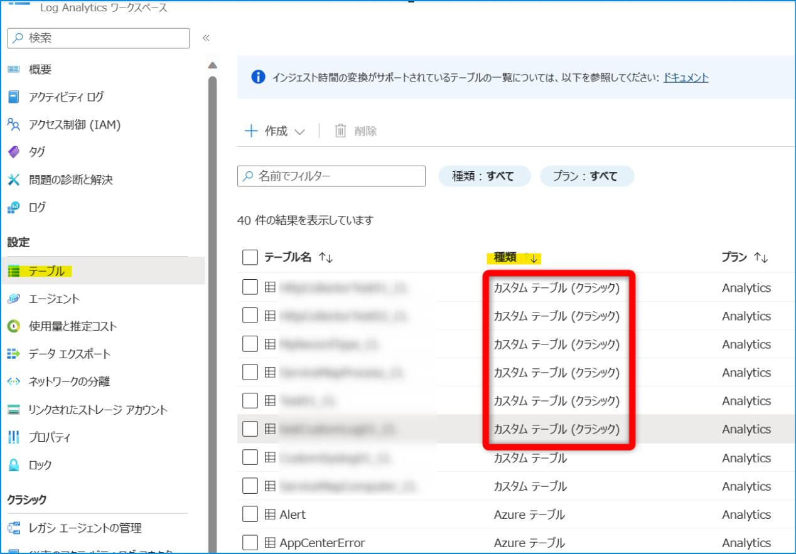
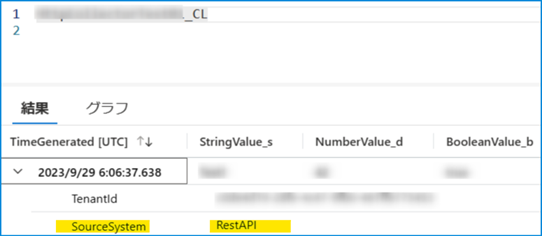
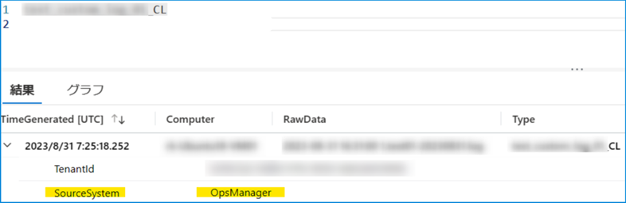

[更新履歴]
- 2023/11/29 ブログ公開
- 2026/01/13 最新の情報であることを確認済み

こんにちは、Azure Monitoring サポート チームの北村です。
今回の記事では、サービス正常性にて通知された「Retirement notice: Transition to DCR-based custom log ingestion by 14 September 2026」についてご説明します。

 

<!-- more -->
## 目次
- [1. 報告された正常性の勧告について](#1-報告された正常性の勧告について)
  - [1-1.概要](#1-1-概要)
  - [1-2.内容](#1-2-内容)
  - [1-3.実施いただきたいアクション](#1-3-実施いただきたいアクション)
- [2. 移行が必要かどうかを確認する方法](#2-移行が必要かどうかを確認する方法)
  - [2-1. 影響を受けるお客様](#2-1-影響を受けるお客様)
  - [2-2. 移行対象のテーブルを確認する手順](#2-2-移行対象のテーブルを確認する手順)
- [3. 移行手順](#3-移行手順)

 

## 1. 報告された正常性の勧告について
### 1-1. 概要

| 項目名 | 項目値 |
|-------------|--------------------------------------------------------------------------------------|
| 題名                 | Retirement notice: Transition to DCR-based custom log ingestion by 14 September 2026 |
| 追跡 ID              | 2V91-5TZ |
| 影響を受けるサービス   | Azure Monitor |
| 影響を受けるリージョン | Global |
| 正常性イベントの種類   | 正常性の勧告 |

 

### 1-2. 内容
You’re receiving this notice because you currently use the Data Collector API for ingestion of custom logs to Azure Monitor logs.
On 14 September 2026, we’ll retire Data Collector API for ingesting custom logs to Azure Monitor logs. Before that date, you’ll need to transition to the Data Collection Rules based log ingestion API that provides all the functionality of the Data Collector API, as well as new ones, including:

- Secure token-based authentication
- Full control over the shape of the destination table
- Ability to filter and transform data during ingestion

 

### 1-3. 実施いただきたいアクション
To avoid ingestion errors and data loss, [transition to the DCR-based Log Ingestion API](https://learn.microsoft.com/en-us/azure/azure-monitor/logs/custom-logs-migrate) before 14 September 2026. Data Collector API endpoints will become unavailable after that date.

 

## 2. 移行が必要かどうかを確認する方法
[データ コレクター API](https://learn.microsoft.com/ja-jp/azure/azure-monitor/logs/data-collector-api?tabs=powershell) は 2026 年 9 月 14 日に廃止される予定のため、当該 API をご利用されている場合は [ログ インジェスト API](https://learn.microsoft.com/ja-jp/azure/azure-monitor/logs/logs-ingestion-api-overview) への移行をお願いしております。

データ コレクター API は REST API を通じて、任意の端末および任意の方法にて HTTP アクセスしてログを送信する機能です。
お客様のアプリケーションなどで使用されるような機能でございますが、各種 Azure サービスの監視機能で内部的に使用されている場合もございます。

本通知では "お客様のアプリケーションなどで使用されている場合" にログ インジェスト API への移行をお願いするものです。
各種 Azure サービスの監視機能で内部的に使用されているテーブルにつきましては、移行の詳細が決まり次第 [サービス正常性](https://learn.microsoft.com/ja-jp/azure/service-health/overview)や弊社公開情報等で対応方法等が通知される予定ですので、弊社海外部門からの通知をお待ちいただけますと幸いです。

 

### 2-1. 影響を受けるお客様
お客様のアプリケーション等でデータ コレクター API をご利用いただいている場合に影響がございます。

 

### 2-2. 移行対象のテーブルを確認する手順
以下の条件を満たす場合は、データ コレクター API をご利用されている可能性がございます。

- テーブルの種類が "カスタム テーブル (クラシック)" であること
- テーブルの SourceSystem 列の値が "RestAPI" であること

テーブルの種類が "カスタム テーブル (クラシック)" は以下の用途で使用されますが、本通知は「B. データ コレクター API によるカスタム ログ収集」を行われている場合に該当します。

- A. [Log Analytics エージェントによるカスタム ログ収集](https://learn.microsoft.com/ja-jp/azure/azure-monitor/agents/data-sources-custom-logs)
- B. データ コレクター API によるカスタム ログ収集
- C. 各種 Azure サービスの監視機能によるカスタム ログ収集

「A. Log Analytics エージェントによるカスタム ログ収集」と「B. データ コレクター API によるカスタム ログ収集」は、テーブルの SourceSystem 列の値で識別することが可能です。一方で「B. データ コレクター API によるカスタム ログ収集」と「C. 各種 Azure サービスの監視機能によるカスタム ログ収集」の明確な判別方法はございません。

「B. データ コレクター API によるカスタム ログ収集」の場合は、お客様にてテーブルを作成いただくものであるため、テーブル名もお客様ご自身で指定されたものです。そのため、該当するテーブルがお客様にて作成されたテーブル名かどうかをご判断いただくしか方法がございません。

これから紹介する確認手順で「B. データ コレクター API によるカスタム ログ収集」と「C. 各種 Azure サービスの監視機能によるカスタム ログ収集」の判別が困難なテーブルがございましたら、弊社公開情報等をご確認いただくか、弊社サポートまでお問い合わせいただけますと幸いです。

 

それでは、テーブルの種類を確認する方法と、テーブルの SourceSystem 列の値を確認する方法をご紹介します。

#### 1. Azure ポータルからテーブルの種類を確認する
1-1. Azure ポータルで [Log Analytics ワークスペース] > [テーブル] を開きます。

1-2. [種類] が "カスタム テーブル (クラシック)" のテーブルがあるかどうかを確認します。
以下例ですと、赤枠線部分のテーブルがデータ コレクター API を利用している可能性があります。"カスタム テーブル (クラシック)" のテーブルが存在した場合は、SourceSystem 列の値を確認します。

 

#### 2. テーブルの SourceSystem 列の値を確認する
2-1. Azure ポータルで [Log Analytics ワークスペース] > [ログ] を開きます。

2-2. "カスタム テーブル (クラシック)" のテーブルに対してクエリを実行し、SourceSystem 列の値を確認します。SourceSystem 列の値が ***RestAPI*** の場合は、データ コレクター API でログが収集されています。テーブル名より「B. データ コレクター API によるカスタム ログ収集」もしくは「C. 各種 Azure サービスの監視機能によるカスタム ログ収集」に該当するかどうかをご確認ください。

SourceSystem 列の値が ***OpsManager*** の場合は、Log Analytics エージェントによってログが収集されています。
この場合は「A. Log Analytics エージェントによるカスタム ログ収集」に該当するテーブルであり、「B. データ コレクター API によるカスタム ログ収集」に該当しませんので、移行対象のテーブルではございません。

 

## 3. 移行手順
ログ インジェスト API への移行手順は、[こちら](https://learn.microsoft.com/ja-JP/azure/azure-monitor/logs/custom-logs-migrate) の公開情報をご覧ください。
移行を実施する際には、必ず前提条件を満たしているかどうかをご確認いただきますようお願いいたします。
また、ログ インジェスト API では 2 種類のリソース ([データ収集エンドポイント](https://learn.microsoft.com/ja-JP/azure/azure-monitor/essentials/data-collection-endpoint-overview?tabs=portal)および[データ収集ルール](https://learn.microsoft.com/ja-JP/azure/azure-monitor/essentials/data-collection-rule-overview?tabs=portal)) を作成する必要があります。このリソースの作成方法を含むログ インジェスト API の利用方法につきましては、弊社公開情報の[チュートリアル](https://learn.microsoft.com/ja-jp/azure/azure-monitor/logs/tutorial-logs-ingestion-portal) にも掲載されておりますので、併せてご確認いただけますと幸いです。

Azure Monitor のログ インジェスト API
https://learn.microsoft.com/ja-jp/azure/azure-monitor/logs/logs-ingestion-api-overview

チュートリアル: ログ インジェスト API を使用して Azure Monitor ログにデータを送信する (Azure portal)
https://learn.microsoft.com/ja-jp/azure/azure-monitor/logs/tutorial-logs-ingestion-portal

Logs ingestion API を使用して Azure Monitor にデータを送信するサンプル コード
https://learn.microsoft.com/ja-jp/azure/azure-monitor/logs/tutorial-logs-ingestion-code?tabs=powershell#sample-code
