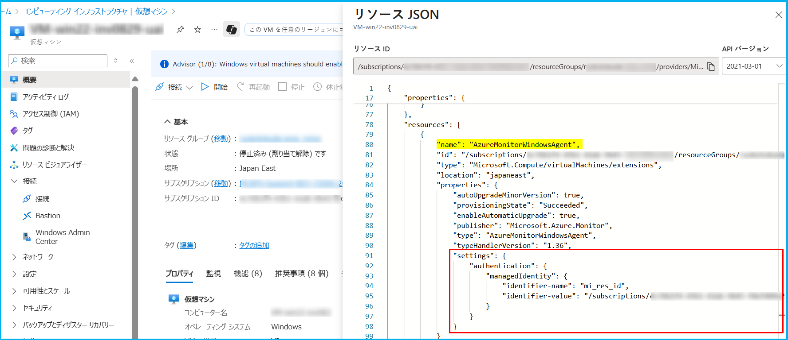
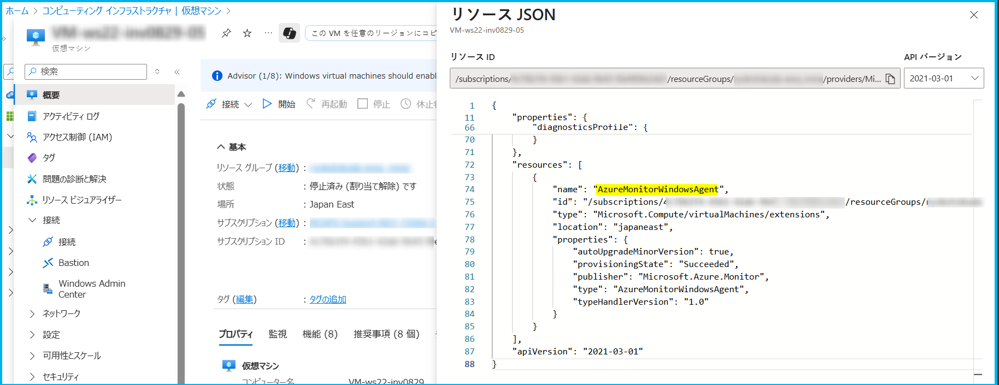
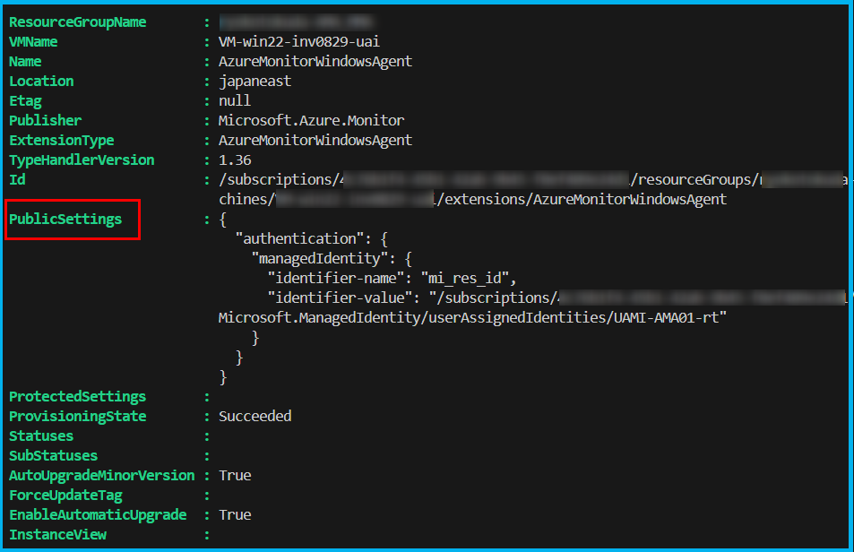
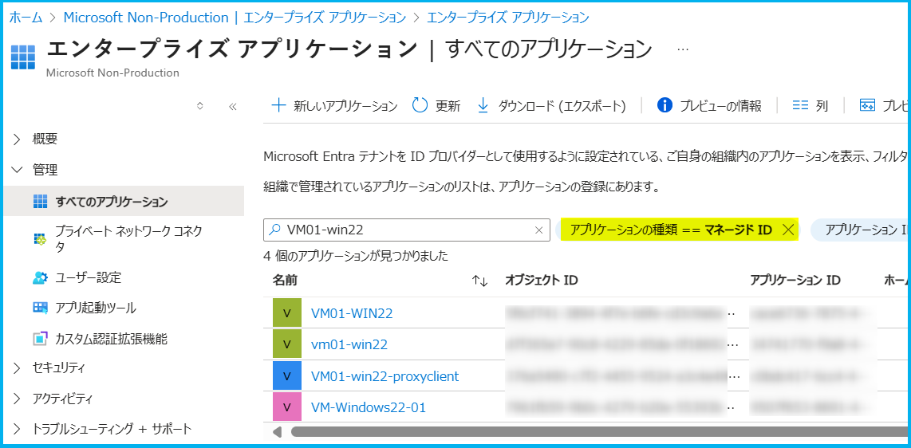
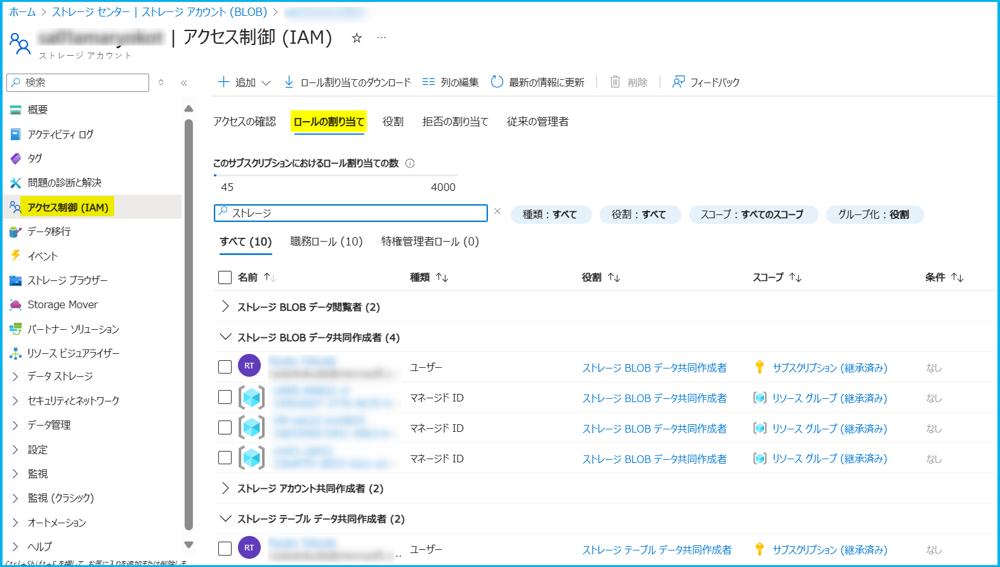

こんにちは、Azure Monitoring チームの徳田です。  
本記事では、Azure Monitor Agent (AMA) を使用することで、仮想マシン (VM) から収集したデータを Event Hub やストレージ アカウントに直接データを送信する方法についてご紹介します。

[仮想マシン クライアント データを Event Hubs と Storage に送信する (プレビュー)](https://learn.microsoft.com/ja-jp/azure/azure-monitor/vm/send-event-hubs-storage?tabs=windows%2Cwindows-1)

## 目次
- [概要](#概要)
- [前提条件](#前提条件)
- [手順](#手順)
  - [1. VM のマネージド ID への必要なロールの割り当て](#1-VM-のマネージド-ID-への必要なロールの割り当て)
    - [必要なロールの確認](#必要なロールの確認)
    - [ロールの割り当て手順](#ロールの割り当て手順)
  - [2. データ収集ルール (DCR) の作成](#2-データ収集ルール-DCR-の作成)
  - [3. VM と DCR の関連付け](#3-VM-と-DCR-の関連付け)
    - [3-1. AMA インストール済みの場合](#3-1-AMA-インストール済みの場合)
    - [3-2. AMA 未インストールの場合](#3-2-AMA-未インストールの場合)
- [トラブルシューティング](#トラブルシューティング)
- [まとめ](#まとめ)

## 概要

Azure Monitor Agent (AMA) を使用することで、仮想マシン (VM) から収集したデータを Event Hub やストレージ アカウントに直接データを送信できます。  
この機能により、Azure Monitor Logs (Log Analytics ワークスペース) 以外の外部システムにもデータを転送することが可能になります。
<br>
なお、この機能は従来の Windows Azure Diagnostics (WAD) や Linux Azure Diagnostics (LAD) の後継として提供されています。  

本ブログでは、以下弊社公開情報に記載の内容を含め、当該機能の利用手順およびログが収集できない場合の主なトラブルシューティング方法についてご紹介します。  

[仮想マシン クライアント データを Event Hubs と Storage に送信する (プレビュー)](https://learn.microsoft.com/ja-jp/azure/azure-monitor/vm/send-event-hubs-storage?tabs=windows%2Cwindows-1)

> [!NOTE]
> WAD/LAD からの移行に関しては、[こちらのブログ「Retirement notice ： Migrate to Azure Monitor Agent before 31 March 2026 について」](https://jpazmon-integ.github.io/blog/LogAnalytics/HowToMigrateToAmaFromAzureDiagnostics/) をご参照ください。  

※ 本機能は 2025 年 9 月時点でパブリック プレビュー段階となっております。  
そのため、今後、手順や機能の詳細が変更される可能性がございます。  
また、ごくまれに GA できずそのまま廃止される可能性もあること、予めご留意いただきますようお願いいたします。

## 前提条件

以降の手順を実行する前に、以下をご確認ください。

- 送信先となる Event Hub または Storage Account がある。
- ログ収集対象となる VM がある。
- ログ収集対象となる VM にマネージド ID (システム割り当てまたはユーザー割り当て) が割り当てられている。

## 手順
### 1. VM のマネージド ID への必要なロールの割り当て

#### 必要なロールの確認
AMA が Event Hub やストレージ アカウントにデータを送信するために、VM に割り当てられているマネージド ID に適切なロールを割り当てる必要があります。  

各宛先へのログ収集に必要なロールは以下の通りです。

<br>

| 宛先 | 必要な組み込みロール |
|--------|-------------|
| ストレージ テーブル | Storage Table Data Contributor (ストレージ テーブル データ共同作成者) |
| ストレージ BLOB | Storage Blob Data Contributor (ストレージ BLOB データ共同作成者) |
| Event Hub | Azure Event Hubs Data Sender (Azure Event Hubs のデータ送信者) |


#### ロールの割り当て手順
1-1. Azure portal でロールを割り当てる宛先またはその宛先を含むスコープ (リソース グループやサブスクリプション) を開きます。
<br>
1-2. 左ペインの [アクセス制御 (IAM)] を開き、[追加] > [ロールの割り当ての追加] を押下します。
<br>
1-3. [ロール] タブで、先ほど確認した必要なロールを検索し、押下します。
<br>
1-4. [メンバー] タブに移動し、"アクセスの割り当て先" に "マネージド ID" を選択し、その下の [メンバーの追加] を押下します。
<br>
1-5. 右ペインに "マネージド ID の選択" が表示されるため、ここで、ログ収集対象の VM に割り当てられているマネージド ID を選択し、[選択] を押下します。


※ 上記の通り、マネージド ID ごとにロールを付与する必要があるため、多数台の VM で当該機能を利用される場合は、ユーザー割り当てマネージド ID のご利用が効果的です。

<br>

1-6.  
必要に応じて [条件] および [割り当てのタイプ] タブを編集し、[レビューと割り当て] タブで問題がないことを確認したら、[レビューと割り当て] を押下し、割り当てが完了するまでお待ちください。

<br>
<br>

### 2. データ収集ルール (DCR) の作成

DCR で、どのデータをどこに送信するかを定義します。  
2025 年 9 月段階では、当該機能を使用するための DCR は ARM テンプレートからのみ作成可能です。

> [!IMPORTANT]
> 既存の DCR (Log Analytics ワークスペースや Azure Monitor Metrics に収集するための DCR) と、当該機能を利用するための DCR は分けてご用意ください。

以下弊社公開情報にて、Windows および Linux 用の ARM テンプレートのサンプルをご紹介しております。  
こちらをもとに、収集したいログの種類および宛先のご要件に合わせて修正し、ARM テンプレートをデプロイしてください。  

<br>

[仮想マシン クライアント データを Event Hubs と Storage に送信する (プレビュー) | データ収集ルールを作成する](https://learn.microsoft.com/ja-jp/azure/azure-monitor/vm/send-event-hubs-storage?tabs=windows%2Cwindows-1#create-a-data-collection-rule)

<br>

**参考**: ARM テンプレートの詳細な記述方法については、以下弊社公開情報も併せてご参照ください。  
[Microsoft.Insights dataCollectionRules](https://learn.microsoft.com/en-us/azure/templates/microsoft.insights/datacollectionrules?pivots=deployment-language-arm-template) 

<br>
<br>

### 3. VM と DCR の関連付け

作成した DCR と VM を関連付けます。  
以下の 2 つのパターンに分けて説明します。
Azure Monitor エージェントのインストール状況に合わせていずれかの手順をご確認ください。

- [3-1. AMA インストール済みの場合](#3-1-AMA-インストール済みの場合)
- [3-2. AMA 未インストールの場合](#3-2-AMA-未インストールの場合) 

#### 3-1. AMA インストール済みの場合
以下の順番で進めてください。
- Azure Monitor エージェントの認証設定
- データ収集ルール (DCR) と VM の関連付けのデプロイ

#### 3-1-1. Azure Monitor エージェントの認証設定

はじめに、Azure Monitor エージェントに認証情報が設定されている必要があります。  
現在の設定状況は、Azure portal でエージェントがインストールされている VM を開き、[概要] > [JSON ビュー] で確認することができます。

(ユーザー割り当てマネージド ID での認証設定が行われている場合の例)


(認証設定が追加されていない場合の例)



また、以下のコマンドでも確認が可能です。

```
Get-AzVMExtension `
-ResourceGroupName <リソース グループ名> `
-VMName <VM 名> `
-Name "<拡張機能名>" # AzureMonitorWindowsAgent や AzureMonitorLinuxAgent
```

(ユーザー割り当てマネージド ID での認証設定が行われている場合の例)


認証情報が追加されていない場合は、ログ収集元の VM が使用しているマネージド ID の種類に合わせ、認証情報を設定してください。  
例として、以下の Azure PowerShell コマンドのように SettingString パラメーターを指定し、認証情報を追加することができます。

**ユーザー割り当てマネージド ID を使用する場合 (Windows)**

```
Set-AzVMExtension `
-Name AzureMonitorWindowsAgent `
-ExtensionType AzureMonitorWindowsAgent `
-Publisher Microsoft.Azure.Monitor `
-ResourceGroupName <リソース グループ名> `
-VMName <VM 名> `
-Location <リージョン名> `
-TypeHandlerVersion <バージョン> `
-EnableAutomaticUpgrade $true `
-SettingString '{"authentication": {"managedIdentity": {"identifier-name": "mi_res_id", "identifier-value": "<ユーザー割り当てマネージド ID のリソース ID>"}}}'
```

**システム割り当てマネージド ID を使用する場合 (Windows)**
```
Set-AzVMExtension `
-Name AzureMonitorWindowsAgent `
-ExtensionType AzureMonitorWindowsAgent `
-Publisher Microsoft.Azure.Monitor `
-ResourceGroupName <リソース グループ名> `
-VMName <VM 名> `
-Location <リージョン名> `
-TypeHandlerVersion <バージョン> `
-EnableAutomaticUpgrade $true `
-SettingString '{"authentication": {"managedIdentity": {"identifier-name": "client_id", "identifier-value": "<アプリケーション ID>"}}}'
```

<br>

※ Linux の場合は、`-Name AzureMonitorLinuxAgent`, `-ExtensionType AzureMonitorLinuxAgent` とご変更ください。  
※ 上記コマンドの <ユーザー割り当てマネージド ID のリソース ID> は、Azure portal で対象のユーザー割り当てマネージド ID を開き、[概要] ページ右上の [JSON ビュー] の "リソース ID" よりご確認いただけます。  
こちらの点については以下弊社公開情報も併せてご参照ください。
[サブスクリプション ID とリソース ID の確認について](https://jpaztech.github.io/blog/information/Subscription-ID-verification/)

※ 上記コマンドの <アプリケーション ID> の箇所は、以下の方法で確認可能です。

1. Azure portal で "Entra ID" を検索し、[エンタープライズ アプリケーション] を開きます。
2. [管理] > [すべてのアプリケーション] を開き、"アプリケーションの種類" を "マネージド ID" でフィルタリングします。


3. 確認対象のマネージド ID が割り当てられている VM 名を検索し、押下してください。
4. "アプリケーション ID" に表示されている値をご確認ください。


<br>

#### 3-1-2. データ収集ルール (DCR) と VM の関連付けのデプロイ

Azure Monitor エージェントの認証情報の設定が完了したら、ARM テンプレートを使用して DCR と VM の関連付けをデプロイしてください。
以下は関連付けのためのサンプルのテンプレートとなるため、内容についてはご要件に合わせて適宜変更ください。

**サンプル ARM テンプレート**
```json
{
"$schema": "https://schema.management.azure.com/schemas/2015-01-01/deploymentTemplate.json#",
"contentVersion": "1.0.0.0",
"parameters": {
    "vmName": {
    "defaultValue": "[concat(resourceGroup().name, 'vm')]",
    "type": "String"
    },
    "dataCollectionRulesName": {
    "defaultValue": "[concat(resourceGroup().name, 'DCR')]",
    "type": "String",
    "metadata": {
        "description": "Data Collection Rule Name"
    }
    },
    "dcraName": {
    "type": "string",
    "defaultValue": "[concat(uniquestring(resourceGroup().id), 'DCRLink')]",
    "metadata": {
        "description": "Name of the association."
    }
    }
},
"resources": [
    {
    "type": "Microsoft.Compute/virtualMachines/providers/dataCollectionRuleAssociations",
    "name": "[concat(parameters('vmName'),'/microsoft.insights/', parameters('dcraName'))]",
    "apiVersion": "2021-04-01",
    "properties": {
        "description": "Association of data collection rule. Deleting this association will break the data collection for this virtual machine.",
        "dataCollectionRuleId": "[resourceID('Microsoft.Insights/dataCollectionRules',parameters('dataCollectionRulesName'))]"
    }
    }
]
}
```

<br>

### 3-2. AMA 未インストールの場合  

以下サンプルのような ARM テンプレートをデプロイすることで、DCR と VM の関連付けと、VM への Azure Monitor エージェントのインストールを両方行うことができます。  
サンプルのテンプレートとなるため、内容についてはご要件に合わせて適宜変更ください。

**ユーザー割り当てマネージド ID を使用する場合**  
**- Windows の場合**
```json
{
"$schema": "https://schema.management.azure.com/schemas/2015-01-01/deploymentTemplate.json#",
"contentVersion": "1.0.0.0",
"parameters": {
    "vmName": {
    "defaultValue": "[concat(resourceGroup().name, 'vm')]",
    "type": "String"
    },
    "location": {
    "type": "string",
    "defaultValue": "[resourceGroup().location]",
    "metadata": {
        "description": "Location for all resources."
    }
    },
    "dataCollectionRulesName": {
    "defaultValue": "[concat(resourceGroup().name, 'DCR')]",
    "type": "String",
    "metadata": {
        "description": "Data Collection Rule Name"
    }
    },
    "dcraName": {
    "type": "string",
    "defaultValue": "[concat(uniquestring(resourceGroup().id), 'DCRLink')]",
    "metadata": {
        "description": "Name of the association."
    }
    },
    "identityName": {
    "type": "string",
    "metadata": {
        "description": "Name of User-assigned Managed Identity"
    }
    }
},
"resources": [
    {
    "type": "Microsoft.Compute/virtualMachines/providers/dataCollectionRuleAssociations",
    "name": "[concat(parameters('vmName'),'/microsoft.insights/', parameters('dcraName'))]",
    "apiVersion": "2021-04-01",
    "properties": {
        "description": "Association of data collection rule. Deleting this association will break the data collection for this virtual machine.",
        "dataCollectionRuleId": "[resourceID('Microsoft.Insights/dataCollectionRules',parameters('dataCollectionRulesName'))]"
    }
    },
    {
    "type": "Microsoft.Compute/virtualMachines/extensions",
    "name": "[concat(parameters('vmName'), '/AzureMonitorWindowsAgent')]",
    "apiVersion": "2020-06-01",
    "location": "[parameters('location')]",
    "dependsOn": [
        "[resourceId('Microsoft.Compute/virtualMachines/providers/dataCollectionRuleAssociations', parameters('vmName'), 'Microsoft.Insights', parameters('dcraName'))]"
    ],
    "properties": {
        "publisher": "Microsoft.Azure.Monitor",
        "type": "AzureMonitorWindowsAgent",
        "typeHandlerVersion": "1.0",
        "autoUpgradeMinorVersion": true,
        "settings": {
        "authentication": {
            "managedIdentity": {
            "identifier-name": "mi_res_id",
            "identifier-value": "[resourceID('Microsoft.ManagedIdentity/userAssignedIdentities/',parameters('identityName'))]"
            }
        }
        }
    }
    }
]
}
```

**- Linux の場合**
```json
{
"$schema": "https://schema.management.azure.com/schemas/2015-01-01/deploymentTemplate.json#",
"contentVersion": "1.0.0.0",
"parameters": {
    "vmName": {
    "defaultValue": "[concat(resourceGroup().name, 'vm')]",
    "type": "String"
    },
    "location": {
    "type": "string",
    "defaultValue": "[resourceGroup().location]",
    "metadata": {
        "description": "Location for all resources."
    }
    },
    "dataCollectionRulesName": {
    "defaultValue": "[concat(resourceGroup().name, 'DCR')]",
    "type": "String",
    "metadata": {
        "description": "Data Collection Rule Name"
    }
    },
    "dcraName": {
    "type": "string",
    "defaultValue": "[concat(uniquestring(resourceGroup().id), 'DCRLink')]",
    "metadata": {
        "description": "Name of the association."
    }
    },
    "identityName": {
    "type": "string",
    "metadata": {
        "description": "Name of User-assigned Managed Identity"
    }
    }
},
"resources": [
    {
    "type": "Microsoft.Compute/virtualMachines/providers/dataCollectionRuleAssociations",
    "name": "[concat(parameters('vmName'),'/microsoft.insights/', parameters('dcraName'))]",
    "apiVersion": "2021-04-01",
    "properties": {
        "description": "Association of data collection rule. Deleting this association will break the data collection for this virtual machine.",
        "dataCollectionRuleId": "[resourceID('Microsoft.Insights/dataCollectionRules',parameters('dataCollectionRulesName'))]"
    }
    },
    {
    "type": "Microsoft.Compute/virtualMachines/extensions",
    "name": "[concat(parameters('vmName'), '/AzureMonitorLinuxAgent')]",
    "apiVersion": "2020-06-01",
    "location": "[parameters('location')]",
    "dependsOn": [
        "[resourceId('Microsoft.Compute/virtualMachines/providers/dataCollectionRuleAssociations', parameters('vmName'), 'Microsoft.Insights', parameters('dcraName'))]"
    ],
    "properties": {
        "publisher": "Microsoft.Azure.Monitor",
        "type": "AzureMonitorLinuxAgent",
        "typeHandlerVersion": "1.0",
        "autoUpgradeMinorVersion": true,
        "settings": {
        "authentication": {
            "managedIdentity": {
            "identifier-name": "mi_res_id",
            "identifier-value": "[resourceID('Microsoft.ManagedIdentity/userAssignedIdentities/',parameters('identityName'))]"
            }
        }
        }
    }
    }
]
}
```

**システム割り当てマネージド ID を使用する場合**  
**- Windows の場合**
```json
{
"$schema": "https://schema.management.azure.com/schemas/2015-01-01/deploymentTemplate.json#",
"contentVersion": "1.0.0.0",
"parameters": {
    "vmName": {
    "defaultValue": "[concat(resourceGroup().name, 'vm')]",
    "type": "String"
    },
    "location": {
    "type": "string",
    "defaultValue": "[resourceGroup().location]",
    "metadata": {
        "description": "Location for all resources."
    }
    },
    "dataCollectionRulesName": {
    "defaultValue": "[concat(resourceGroup().name, 'DCR')]",
    "type": "String",
    "metadata": {
        "description": "Data Collection Rule Name"
    }
    },
    "dcraName": {
    "type": "string",
    "defaultValue": "[concat(uniquestring(resourceGroup().id), 'DCRLink')]",
    "metadata": {
        "description": "Name of the association."
    }
    },
    "applicationId": {
    "type": "string",
    "metadata": {
        "description": "System Assigned Managed Identity"
    }
    }
},
"resources": [
    {
    "type": "Microsoft.Compute/virtualMachines/providers/dataCollectionRuleAssociations",
    "name": "[concat(parameters('vmName'),'/microsoft.insights/', parameters('dcraName'))]",
    "apiVersion": "2021-04-01",
    "properties": {
        "description": "Association of data collection rule. Deleting this association will break the data collection for this virtual machine.",
        "dataCollectionRuleId": "[resourceID('Microsoft.Insights/dataCollectionRules',parameters('dataCollectionRulesName'))]"
    }
    },
    {
    "type": "Microsoft.Compute/virtualMachines/extensions",
    "name": "[concat(parameters('vmName'), '/AzureMonitorWindowsAgent')]",
    "apiVersion": "2020-06-01",
    "location": "[parameters('location')]",
    "dependsOn": [
        "[resourceId('Microsoft.Compute/virtualMachines/providers/dataCollectionRuleAssociations', parameters('vmName'), 'Microsoft.Insights', parameters('dcraName'))]"
    ],
    "properties": {
        "publisher": "Microsoft.Azure.Monitor",
        "type": "AzureMonitorWindowsAgent",
        "typeHandlerVersion": "1.0",
        "autoUpgradeMinorVersion": true,
        "settings": {
        "authentication": {
            "managedIdentity": {
            "identifier-name": "client_id",
            "identifier-value": "parameters('applicationId')"
            }
        }
        }
    }
    }
]
}
```

**- Linux の場合**
```json
{
"$schema": "https://schema.management.azure.com/schemas/2015-01-01/deploymentTemplate.json#",
"contentVersion": "1.0.0.0",
"parameters": {
    "vmName": {
    "defaultValue": "[concat(resourceGroup().name, 'vm')]",
    "type": "String"
    },
    "location": {
    "type": "string",
    "defaultValue": "[resourceGroup().location]",
    "metadata": {
        "description": "Location for all resources."
    }
    },
    "dataCollectionRulesName": {
    "defaultValue": "[concat(resourceGroup().name, 'DCR')]",
    "type": "String",
    "metadata": {
        "description": "Data Collection Rule Name"
    }
    },
    "dcraName": {
    "type": "string",
    "defaultValue": "[concat(uniquestring(resourceGroup().id), 'DCRLink')]",
    "metadata": {
        "description": "Name of the association."
    }
    },
    "applicationId": {
    "type": "string",
    "metadata": {
        "description": "System Assigned Managed Identity"
    }
    }
},
"resources": [
    {
    "type": "Microsoft.Compute/virtualMachines/providers/dataCollectionRuleAssociations",
    "name": "[concat(parameters('vmName'),'/microsoft.insights/', parameters('dcraName'))]",
    "apiVersion": "2021-04-01",
    "properties": {
        "description": "Association of data collection rule. Deleting this association will break the data collection for this virtual machine.",
        "dataCollectionRuleId": "[resourceID('Microsoft.Insights/dataCollectionRules',parameters('dataCollectionRulesName'))]"
    }
    },
    {
    "type": "Microsoft.Compute/virtualMachines/extensions",
    "name": "[concat(parameters('vmName'), '/AzureMonitorLinuxAgent')]",
    "apiVersion": "2020-06-01",
    "location": "[parameters('location')]",
    "dependsOn": [
        "[resourceId('Microsoft.Compute/virtualMachines/providers/dataCollectionRuleAssociations', parameters('vmName'), 'Microsoft.Insights', parameters('dcraName'))]"
    ],
    "properties": {
        "publisher": "Microsoft.Azure.Monitor",
        "type": "AzureMonitorLinuxAgent",
        "typeHandlerVersion": "1.0",
        "autoUpgradeMinorVersion": true,
        "settings": {
        "authentication": {
            "managedIdentity": {
            "identifier-name": "client_id",
            "identifier-value": "parameters('applicationId')"
            }
        }
        }
    }
    }
]
}
```

## トラブルシューティング
当該機能によるログ収集が行われない場合のよくある要因は以下です。  
もしログ収集が行われない場合、まずは以下の状況に当てはまらないかをご確認ください。

**適切なロールがマネージド ID に付与されていない**  
[1. VM のマネージド ID への必要なロールの割り当て](#1-VM-のマネージド-ID-への必要なロールの割り当て) に記載の通り、VM のマネージド ID に、宛先に応じたロールを付与する必要があります。  
付与されているかどうかは、宛先リソースを Azure portal で開き、[アクセス制御 (IAM)] より、[ロールの割り当て] タブで確認することが可能です。

(ストレージ アカウントのロールの割り当て一覧の例)


必要なロールがマネージド ID に割り当てられていなかった場合は、[1. VM のマネージド ID への必要なロールの割り当て](#1-VM-のマネージド-ID-への必要なロールの割り当て) を参照の上、ロールの割り当てを行ってください。  

<br>

**Azure Monitor エージェントに認証設定が行われていない**  
Azure Monitor エージェントに認証設定が追加されていない場合、ログを送信することができません。  
[Azure Monitor エージェントの認証設定](#Azure-Monitor-エージェントの認証設定) を参照の上、認証設定されているかの確認、およびされていない場合は設定の追加を実施してください。

**ログの収集が開始していない/ログが出力されていない**  
必要な手順の実施が完了してから、実際にエージェントから各種宛先にログが収集されるまでに多少の時差が生じます。
念のため、手順から 30 分 ~ 1 時間ほどお待ちいただいた上でログの収集状況をご確認ください。
また、カスタム ログや Windows イベント ログなど、定期的に出力されないログについては、出力元で収集対象のログが出力されているかをご確認ください。

<br>

## まとめ
Azure Monitor Agent (AMA) を使用し、従来の WAD/LAD に代わって VM のデータをEvent Hub や Storage Account に送信する方法についてご紹介しました。  
本記事が WAD および LAD から AMA への移行を検討される方のお役に立てば幸いです。
