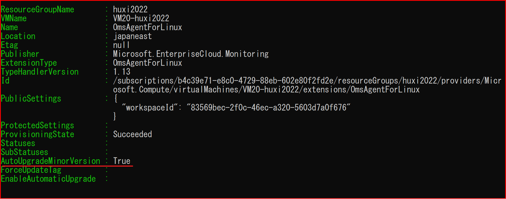

こんにちは、Azure Monitoring チームの 胡 です。

Log Analytics 仮想マシン拡張機能を利用してログの収集を行っている方がたくさんいらっしゃると思います。
より良いログ収集の体験ができるよう、弊社としましては常に最新バージョンの拡張機能を利用するよう、お客様にお願いしております。
この度、 Azure 仮想マシンで対応している拡張機能について、自動アップグレードの仕組みに大きな変更がございましたため、
Log Analytics 仮想マシン拡張機能のバージョン アップ方法について、ご案内させていただきます。

<!-- more -->

## 目次
- 対象製品
- 2021 年まで Log Analytics 仮想マシン拡張機能のバージョン アップについて
- 現在 Log Analytics 仮想マシン拡張機能のバージョン アップについて
- Log Analytics 仮想マシン拡張機能のバージョン アップ手順
- Windows 用の Log Analytics 仮想マシン拡張機能について
- 今後 Log Analytics 仮想マシン拡張機能の自動アップグレード対応について
- 2022 年 10 月 Linux 版 Log Analytics 仮想マシン拡張機能の変更について

## 対象製品
Windows 用の Log Analytics 仮想マシン拡張機能

https://docs.microsoft.com/ja-jp/azure/virtual-machines/extensions/oms-windows?toc=%2Fazure%2Fazure-monitor%2Ftoc.json
 
Linux 用の Log Analytics 仮想マシン拡張機能

https://docs.microsoft.com/ja-jp/azure/virtual-machines/extensions/oms-linux?toc=%2Fazure%2Fazure-monitor%2Ftoc.json

## 2021 年まで Log Analytics 仮想マシン拡張機能のバージョン アップについて
2021 年までは、新しいマイナー バージョンの Log Analytics 仮想マシン拡張機能がリリースされますと、自動的にアップデートされておりました。
それは、 Log Analytics エージェントを含めて、仮想マシンで対応している拡張機能に存在する AutoUpgradeMinorVersion というプロパティで実現しております。

Get-AzVMExtension コマンドを利用して、各プロパティの値をご確認いただけます。
以下のとおり、 Log Analytics 拡張機能の AutoUpgradeMinorVersion のプロパティは true となっております。

`Get-AzVMExtension -ResourceGroupName <リソースグループ名> -VMName <仮想マシン名> -Name <拡張機能名>`

2021 年まで、 AutoUpgradeMinorVersion が true と設定されている拡張機能について、新しいマイナー バージョンがリリースされると、その情報は仮想マシンまで連携されます。
仮想マシンが主体的に最新バージョンのものを取得して、バージョン アップを行っておりました。
ですが、このバージョン アップのタイミングはきちんとコントロールされておらず、任意のタイミングで発生する可能性がございます。
一部のお客様から拡張機能の自動バージョン アップで自分のアプリケーションが影響されましたとの報告を受けました。
また、仮想マシン スケール セットの場合、すべてのインスタンスにおいて同時にバージョン アップが発生することがあるため、その影響範囲がさらに大きくなる可能性がございます。
以上のように、従来より安全な拡張機能のバージョン アップ方式を実現するために、今回自動アップグレードの内部処理で実装を変更いたしました。
Log Analytics 仮想マシン拡張機能はその実装変更の影響で、バージョン アップの方式に変更がございました。

## 現在 Log Analytics 仮想マシン拡張機能のバージョン アップについて
現在の拡張機能の仕様では、enableAutomaticUpgrade プロパティに対応していない Log Analytics 仮想マシン拡張機能はマイナー バージョンの自動アップデートが出来ません。  
また、先程説明させていただいたとおり、AutoUpgradeMinorVersion プロパティを用いた自動的なアップデートも実施されなくなりました。  
そのため、Log Analytics 仮想マシン拡張機能をアップデートするためには、手動でのアップデートが必須となります。

一方で、enableAutomaticUpgrade プロパティに対応している拡張機能は、下記の公開情報に記載がございます。こちらご参考いただけますと幸いです。
- [Azure での VM とスケール セットの拡張機能の自動アップグレード](https://docs.microsoft.com/ja-jp/azure/virtual-machines/automatic-extension-upgrade#supported-extensions)

下記に、Log Analytics 仮想マシン拡張機能のメジャー、またはマイナー バージョンのアップデート方法について記載いたします。
 

## Log Analytics 仮想マシン拡張機能のバージョン アップ手順
Log Analytics 仮想マシン拡張機能の最新バージョンは、 Windows と Linux でそれぞれ以下のページからご確認いただけます。

**Windows 用の Log Analytics 仮想マシン拡張機能**

https://docs.microsoft.com/en-US/azure/virtual-machines/extensions/oms-windows?toc=%2Fazure%2Fazure-monitor%2Ftoc.json#agent-and-vm-extension-version

**Linux 用の Log Analytics 仮想マシン拡張機能**

https://github.com/microsoft/OMS-Agent-for-Linux/releases

次に、手動バージョン アップの方法について、仮想マシン及び仮想マシン スケール セットの観点で、それぞれ手順をまとめました。

**仮想マシン**

- Azure ポータルを使ったバージョン アップ

1. 拡張機能を削除する
    1. Azure ポータルにログインし、対象の VM の画面に遷移します。
    2. 中央に表示されているブレードから [拡張機能とアプリケーション] を選択し、Windows の場合は、"MicrosoftMonitoringAgent" をクリックします。
    3. Linux の場合は、 "OmsAgentForLinux" をクリックします。
    4. 画面上部の [アンインストール] をクリックします。

2. Log Analytics エージェントを拡張機能としてインストールする
    1. Azure ポータルにログインします。
    2. VM が接続中のワークスペースを選択します。
    3. [ワークスペースのデータ ソース] – [仮想マシン] をクリックします。
    4. 当該の VM を選択します。
    5. [接続] をクリックします。

- PowerShell/Azure CLI を使ったバージョン アップ

以下のコマンドを実行することで最新バージョンにアップデートすることが可能です (バージョンの指定は必要ございません)。

1. PowerShell

`Set-AzVMExtension -location <リージョン名> -ResourceGroupName <リソースグループ名> -VMName <仮想マシン名> -Name <拡張機能名> -Publisher "Microsoft.EnterpriseCloud.Monitoring" -ExtensionType <拡張機能タイプ>`

※ 拡張機能名は仮想マシンの [拡張機能とアプリケーション] 画面からご確認ください (デプロイ方法によってお客様が指定した名前になっている可能性がございます)。

※ 拡張機能タイプについて、Windows の場合は "MicrosoftMonitoringAgent" となります。

※ 拡張機能タイプについて、Linux の場合は "OmsAgentForLinux" となります。

2. Azure CLI

`az vm extension set -n <拡張機能名> --publisher "Microsoft.EnterpriseCloud.Monitoring" --vm-name <仮想マシン名> --resource-group <リソースグループ名>`

※ Azure CLI で設定する拡張機能名は以下指定のものにする必要がございます。

※ Windows の場合、拡張機能名は "MicrosoftMonitoringAgent" となります。

※ Linux の場合、拡張機能名は "OmsAgentForLinux" となります。

**仮想マシン スケール セット**

1. Log Analytics エージェントの拡張機能をアンインストールする
    1. Azure ポータルにログインし、当該の VMSS を選択します。
    2. [設定] – [拡張機能] を選択します。
    3. OmsAgentForLinux を選択し、アンインストールします。
2. VMSS インスタンスのアップグレードを実施する ※ VMSS のアップグレード ポリシーが手動と設定されている場合のみに実施します。
    1. Azure ポータルにアクセスし、対象の VMSS リソースを表示します。
    2. [設定] – [インスタンス] をクリックし、各インスタンスにチェックし、[アップグレード] をクリックします。[はい] をクリックします。完了するまで待機します。
3. VMSS の拡張機能をインストールする (Log Analytics エージェント)
    1. 以下の Azure CLI コマンドを実行してインストールします。
`az vmss extension set --name <拡張機能名> --publisher Microsoft.EnterpriseCloud.Monitoring --resource-group <VMSS のリソース グループ名> --vmss-name <VMSS 名> --settings "{'workspaceId':'<Log AnalyticsworkspaceId>'}" --protected-settings "{'workspaceKey':'<Log AnalyticsworkspaceKey>'}"`

※ Windows の場合、拡張機能名は "MicrosoftMonitoringAgent" となります。

※ Linux の場合、拡張機能名は "OmsAgentForLinux" となります。

4. VMSS インスタンスのアップグレードを実施する ※ VMSS のアップグレード ポリシーが手動と設定されている場合のみに実施します。
    1. Azure ポータルにアクセスし、対象の VMSS リソースを表示します。
    2. [設定] – [インスタンス] をクリックし、各インスタンスにチェックし、[アップグレード] をクリックします。[はい] をクリックします。完了するまで待機します。

## Windows 用の Log Analytics 仮想マシン拡張機能について
Log Analytics エージェントの廃止を考慮して、現在 Windows 用の Log Analytics 仮想マシン拡張機能は、基本的にビルド番号を上げて新しバージョンをリリースしております。
ビルド番号のアップグレードは、 enableAutomaticUpgrade または AutoUpgradeMinorVersion プロパティの値と関係なく、自動的に実施されます。
そのため、上記手順で手動でアップグレードする必要はないと考えられます。
例 : 1.0.18062 から 1.0.18064 のアップグレード
https://learn.microsoft.com/en-us/azure/virtual-machines/extensions/oms-windows?toc=%2Fazure%2Fazure-monitor%2Ftoc.json#agent-and-vm-extension-version

今後もし自動アップグレードが行われない、またはマイナー バージョンのアップグレードが発生した際に、上記手順に従ってアップグレードを実施していただけますと幸いです。

## 今後 Log Analytics 仮想マシン拡張機能の自動アップグレード対応について
Log Analytics 仮想マシン拡張機能で自動アップグレードに対応してほしいとのご要望が多数お客様から上がっており、開発側にもフィードバックさせていただきました。
現時点で今後の開発予定がまだ決まっておりませんので、決まり次第改めて本ブログにてお知らせいたします。

また、 Log Analytics 仮想マシン拡張機能の後継となる Azure Monitor エージェント拡張機能は、新しい自動アップグレードの仕組みに対応しておりますので、こちらの利用をご検討いただけますと幸いです。

<参考情報>

Azure Monitor Agent 拡張機能

https://docs.microsoft.com/ja-jp/azure/azure-monitor/agents/azure-monitor-agent-overview?tabs=PowerShellWindows

## 2022 年 10 月 Linux 版 Log Analytics 仮想マシン拡張機能の変更について
2022 年 10 月より、 Linux 版 Log Analytics 仮想マシン拡張機能は enableAutomaticUpgrade プロパティによる自動アップグレードに対応するようになりました。
現在 Azure ポータルより自動アップグレードの有効化は未対応ですが、 PowerShell または Azure CLI を用いて有効化することが可能となっております。

1. PowerShell

`Set-AzVMExtension -location <リージョン名> -ResourceGroupName <リソースグループ名> -VMName <仮想マシン名> -Name <拡張機能名> -Publisher "Microsoft.EnterpriseCloud.Monitoring" -ExtensionType OmsAgentForLinux -EnableAutomaticUpgrade $true`

※ 拡張機能名は仮想マシンの [拡張機能とアプリケーション] 画面からご確認ください (デプロイ方法によってお客様が指定した名前になっている可能性がございます)。

※ 自動アップブレードを無効化したい場合は、 -EnableAutomaticUpgrade の値を $false に設定します。

2. Azure CLI

`az vm extension set -n OmsAgentForLinux --publisher "Microsoft.EnterpriseCloud.Monitoring" --vm-name <仮想マシン名> --resource-group <リソースグループ名 --enable-auto-upgrade true`

※ 自動アップブレードを無効化したい場合は、 --enable-auto-upgrade の値を false に設定します。

<参考情報>

エージェントをアップグレードする

https://learn.microsoft.com/ja-JP/azure/azure-monitor/agents/agent-manage?tabs=PowerShellLinux#upgrade-the-agent

Linux エージェントの自動更新を有効にする

https://learn.microsoft.com/ja-JP/azure/azure-monitor/agents/agent-manage?tabs=CLILinux#enable-auto-update-for-the-linux-agent

以上、Log Analytics 仮想マシン拡張機能のバージョン アップの仕様についてご案内いたしました。
この度の仕様変更でお客様にご不便とご迷惑おかけしまして、申し訳ございません。
お客様によりよい製品、サービスの提供にこれまで以上に努めて参ります。

