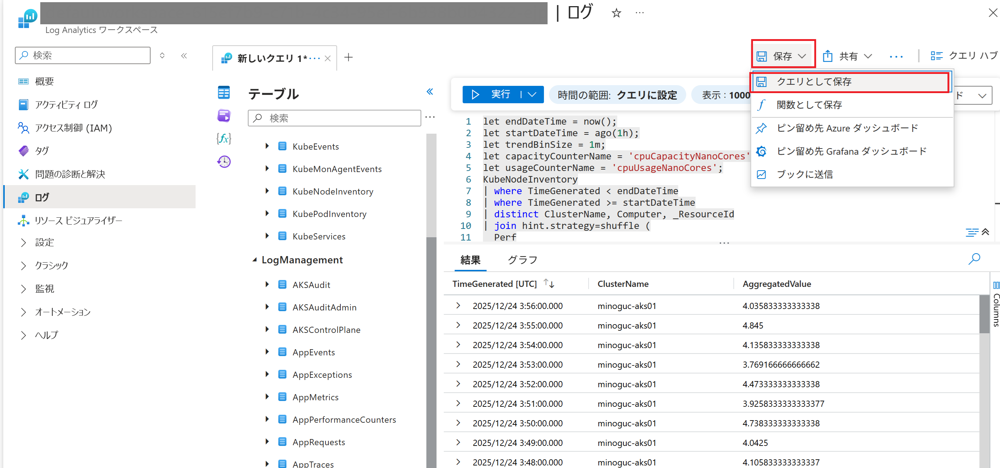
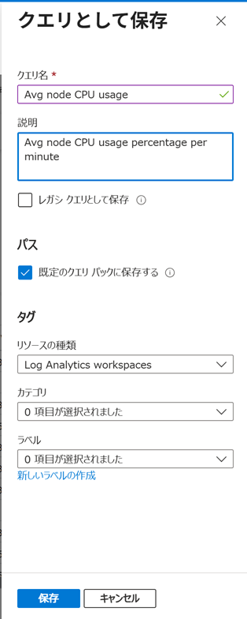
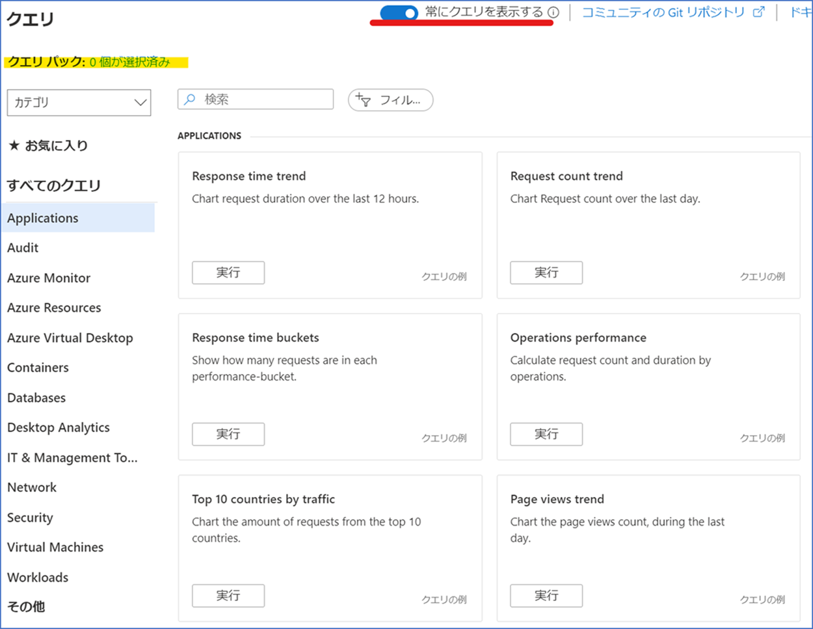
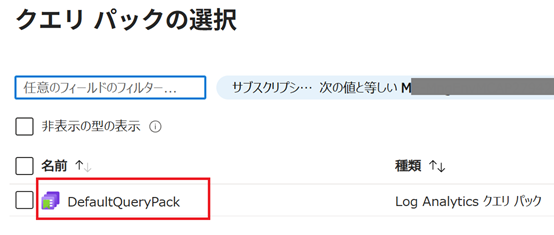
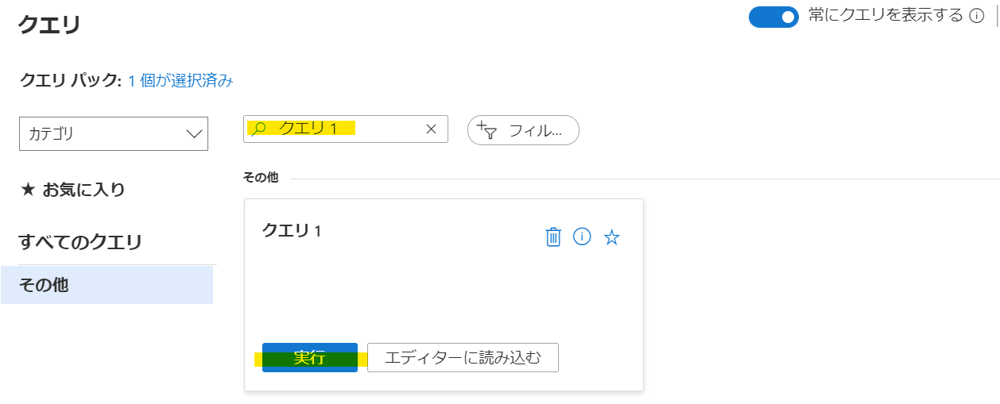
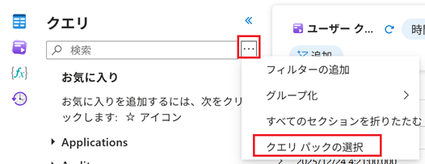
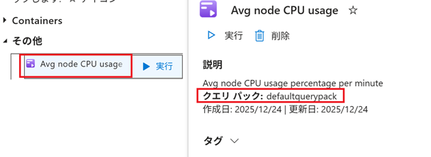
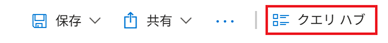
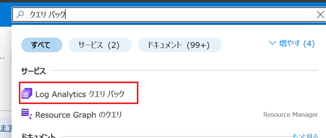
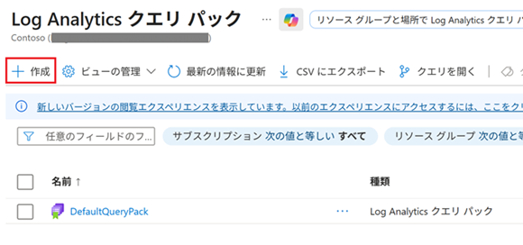

[更新履歴]
- 2022/9/28 ブログ公開
- 2025/12/26 最新情報に更新
  
こんにちは、Azure Monitoring サポート チームの北村です。

今回は Log Analytics の新機能 "Log Analytics クエリ パック" をご紹介いたします。
この機能は、クエリを効果的に保存、共有、管理するために設計されました。
よく使用するクエリを保存したい！チーム内で便利なクエリを共有したい！という方には、必見の機能です。
本記事では Log Analytics クエリ パックの概要とその設定方法をご案内します。

<!-- more -->

## 目次
- [目次](#目次)
- [1. Log Analytics クエリ パックとは](#1-log-analytics-クエリ-パックとは)
- [2. クエリを保存する](#2-クエリを保存する)
- [3. クエリを呼び出す](#3-クエリを呼び出す)
  - [クエリ ダイアログから実行する](#クエリ-ダイアログから実行する)
  - [クエリのサイドバーから実行する](#クエリのサイドバーから実行する)
- [4. クエリを管理する](#4-クエリを管理する)
- [5. まとめ](#5-まとめ)

## 1. Log Analytics クエリ パックとは
クエリ パックは、いわば クエリの "コンテナ" です。
Log Analytics のクエリをより簡単かつ効率的に作成、保存、管理することを目的に開発されました。
クエリ パックは、サブスクリプション レベルで存在するリソースです。
そのため、保存したクエリはサブスクリプション配下に存在する "すべての" ワークスペースから利用することができます。

<参考>
クエリ パックの概要は、下記弊社公開情報や英語版ブログ [Log Analytics Query packs](https://techcommunity.microsoft.com/t5/azure-observability-blog/log-analytics-query-packs/ba-p/2314721) でもご確認いただけます。
[Azure Monitor ログでのクエリ パック](https://learn.microsoft.com/ja-jp/azure/azure-monitor/logs/query-packs)

また、クエリ パックを利用するには、サブスクリプションをスコープとした以下の権限が必要です。
クエリを保存したり、既存のクエリを編集する場合は、共同作成者権限、
クエリを閲覧したり、クエリを実行する場合は、閲覧者権限が必要です。

- [共同作成者](https://learn.microsoft.com/ja-jp/azure/role-based-access-control/built-in-roles#contributor) - クエリの保存、クエリの編集、クエリの閲覧、クエリの実行
- [閲覧者](https://learn.microsoft.com/ja-jp/azure/role-based-access-control/built-in-roles#reader) - クエリの閲覧、クエリの実行

作業を開始する前に、適切な権限が付与されていることをご確認ください。
[Azure portal を使用して Azure ロールを割り当てる](https://learn.microsoft.com/ja-jp/azure/role-based-access-control/role-assignments-portal?tabs=current)

 

## 2. クエリを保存する
それでは、実際にクエリを保存してみましょう。
本記事では Azure portal からクエリを保存する手順をご紹介します。
クエリ パックは Azure リソースであり、保存上限数はございません。
また、1 つのクエリ パックにつき、100 個までクエリを保存することが可能です。

1. 任意の Log Analytics ワークスペースで、クエリを実行します。画面上部の [保存] - [クエリとして保存] をクリックします。

1. クエリの名前を入力します。必要に応じてクエリの説明やリソース タイプを指定し、[保存] をクリックします。

※ [既定のクエリ パックに保存する] を選択すると、"LogAnalyticsDefaultResources" リソース グループの
   "DefaultQueryPack" というクエリ パックにクエリが保存されます。
   デフォルトで作成されるクエリ パックに保存しない場合は [既定のクエリ パックに保存する] のチェックを外してください。

<参考>
クエリの保存手順は、弊社公開情報 [Azure Monitor Log Analytics にクエリを保存する](https://learn.microsoft.com/ja-jp/azure/azure-monitor/logs/save-query) にも掲載しております。
クエリを保存する際に設定するプロパティの詳細は、弊社公開情報 [クエリのプロパティ](https://learn.microsoft.com/ja-jp/azure/azure-monitor/logs/queries#query-properties) をご覧ください。

 

## 3. クエリを呼び出す
次に、保存したクエリを呼び出し、実行してみましょう。
クエリ ダイアログから実行する方法とクエリのサイドバーから実行する方法をご紹介します。

### クエリ ダイアログから実行する
1. Azure portal より [Log Analytics ワークスペース] – [ログ] を選択すると、以下のダイアログが表示されます。

画面左上に表示される [クエリ パックの選択] を選択します。

1. クエリを保存したクエリ パックを選択します。

1. 左ペインのカテゴリを選択、もしくは、保存したクエリ名やリソース タイプ等を指定してクエリを検索します。
下図はクエリ名で検索した例です。クエリを選択したら、[実行] もしくは [エディターに読み込む] をクリックします。

### クエリのサイドバーから実行する
1. Azure portal より [Log Analytics ワークスペース] – [ログ] を選択します。

2. クエリのサイドバーで [クエリ] を選択し、[クエリ パックの選択] をクリックします。

1. クエリ パックを選択します。

1. クエリのサイドバーにクエリ パックに保存されたクエリが表示されますので、クリックします。

<参考>
クエリ ダイアログは、クエリ実行画面の右上にある [クエリ ハブ] をクリックしてアクセスすることもできます。
弊社公開情報 [クエリ ダイアログへのアクセス手順](https://learn.microsoft.com/ja-jp/azure/azure-monitor/logs/queries#queries-dialog) にも手順を掲載しておりますので、ご覧ください。

クエリのサイドバーの詳細は、弊社公開情報 [クエリのサイドバー](https://learn.microsoft.com/ja-jp/azure/azure-monitor/logs/queries#query-sidebar) をご覧ください。

 

## 4. クエリを管理する
Azure portal から作成したクエリ パックを確認することができます。

既定では LogAnalyticsDefaultResources リソース グループに DefaultQueryPack という名前でクエリ パックが作成されますが、
クエリ パック名を指定したい、複数のクエリ パックに分けて保存したい、という場合は、
以下の [作成] よりクエリ パックを作成してください。

<参考>
クエリ パックの表示方法は、弊社公開情報 [クエリ パックの表示](https://learn.microsoft.com/ja-jp/azure/azure-monitor/logs/query-packs#view-query-packs) でもご確認いただけます。

 

## 5. まとめ
本記事では、以下についてご案内いたしましたが、いかがでしたでしょうか。

- [目次](#目次)
- [1. Log Analytics クエリ パックとは](#1-log-analytics-クエリ-パックとは)
- [2. クエリを保存する](#2-クエリを保存する)
- [3. クエリを呼び出す](#3-クエリを呼び出す)
  - [クエリ ダイアログから実行する](#クエリ-ダイアログから実行する)
  - [クエリのサイドバーから実行する](#クエリのサイドバーから実行する)
- [4. クエリを管理する](#4-クエリを管理する)
- [5. まとめ](#5-まとめ)

クエリ パックについてご意見やご要望などありましたら、以下ブログへのコメント、または Log Analytics のフィードバック機能より頂戴いただけますと幸いです。
[Log Analytics Query packs](https://techcommunity.microsoft.com/t5/azure-observability-blog/log-analytics-query-packs/ba-p/2314721)

最後までお読みいただきありがとうございました！
