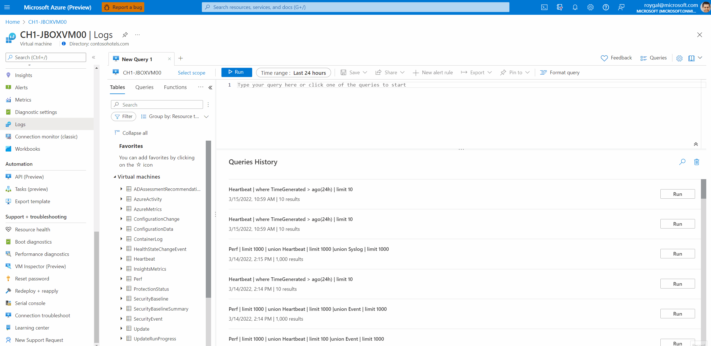
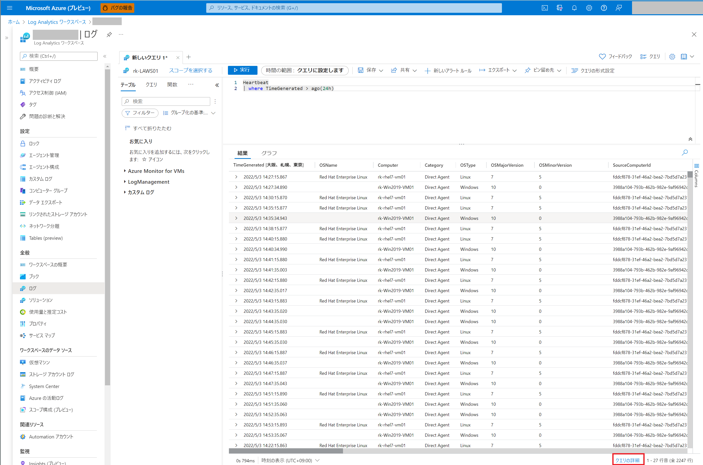
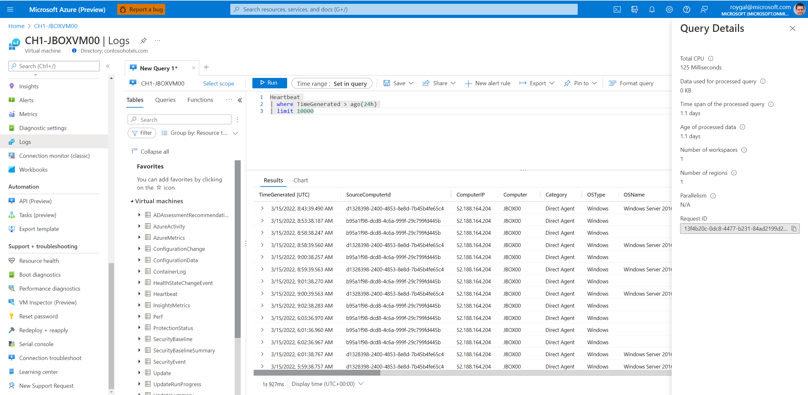
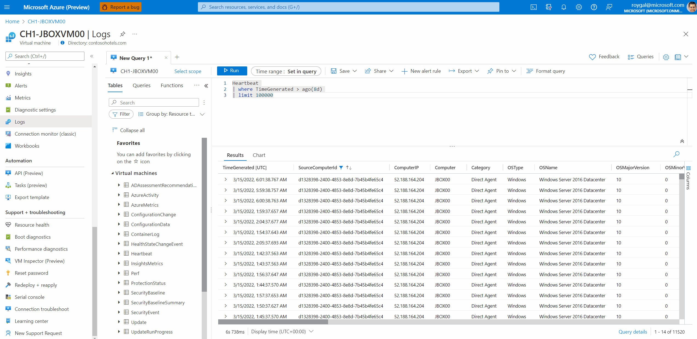
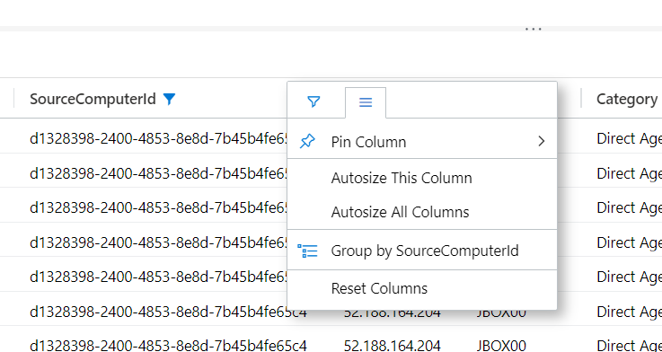
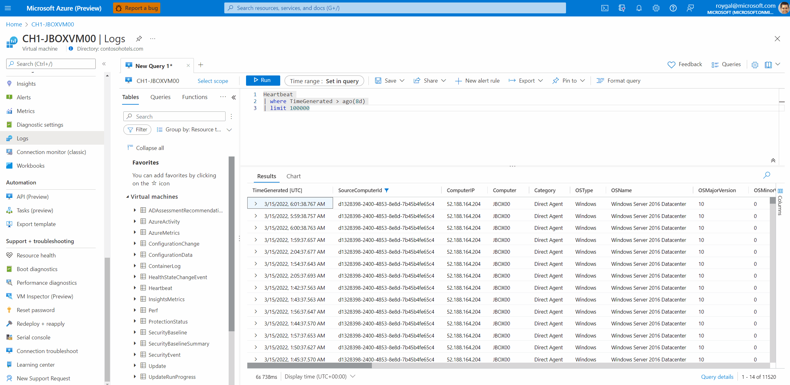
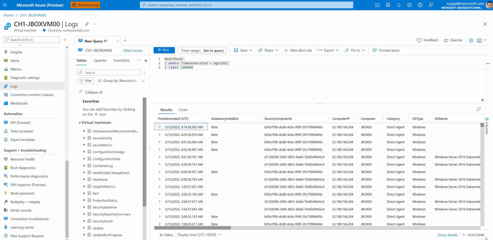
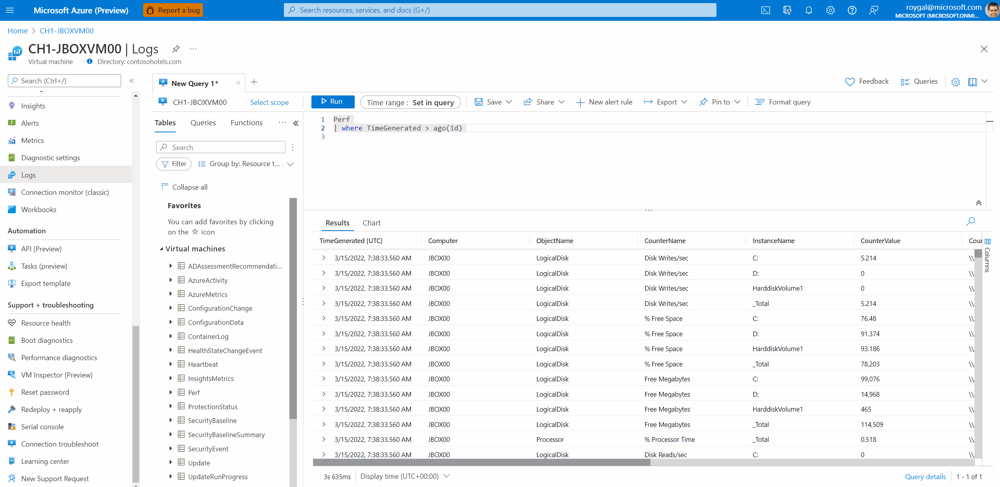

[更新履歴]
-2022/08/17 ブログ公開
-2026/01/20 最新の情報であることを確認

こんにちは、Azure Monitoring チームの 北村 です。

本記事は、2022 年 4 月 4 日に米国の Azure Monitor Blog で公開された [Log Analytics results upgrade](https://techcommunity.microsoft.com/t5/azure-observability-blog/log-analytics-results-upgrade/ba-p/3257229) を翻訳したものになります。Log Analytics ワークスペース上でログを検索する際に使用する機能について、大きなアップデートがありましたので、
最新情報をお届けいたします。

==========================================================================================

<!-- more -->
この記事では、Log Analytics の新しい機能の概要をご紹介いたます。

## 目次
- はじめに
- アップグレードされた機能の概要
- おわりに

## はじめに
今般の大きなアップグレードに伴い、Log Analytics ワークスペースに収集したログを
容易に有効活用いただける新しい機能が追加されました。
例えば、カラムをドラッグ & ドロップしてログをグループ化する機能や検索ボックスを使用したログの検索機能など、
Kusto クエリの知識がなくとも、より簡単にログを分析することができるようになりました。
また、ユーザー ビリティやパフォーマンスも改善されており、さらに進化した Log Analytics をご体感いただけるかと思います。

## アップグレードされた機能の概要
- [1. クエリの実行画面](#1-クエリの実行画面)
- [2. パフォーマンスとアクセシビリティ](#2-パフォーマンスとアクセシビリティ)
- [3. フィルタリング機能](#3-フィルタリング機能)
- [4. ソート機能](#4-ソート機能)
- [5. カスタマイズ機能](#5-カスタマイズ機能)
- [6. 行とセルのアクション](#6-行とセルのアクション)
- [7. カラムのグループ化](#7-カラムのグループ化)
- [8. ログの検索](#8-ログの検索)
- [9. ピボット モード](#9-ピボット-モード)

### 1. クエリの実行画面
Log Analytics ワークスペースに収集された機能をより有効にご利用いただくため、クエリの実行画面が新しくなりました。

 

カラム コントロール (後述 7. 参照) はサイドバーとして再設計され、クエリの実行結果によりフォーカスできるようになりました。

 

クエリの詳細は、サイド ブレードとして表示され、実行したクエリに関するパフォーマンス指標を確認することができます。

 

従来、クエリの実行結果が多い場合は、複数のページにわたってログを確認する必要がありました。
しかし、今般のアップデートでページは廃止され、スクロールですべての結果を確認できるようになりました。

 

### 2. パフォーマンスとアクセシビリティ
新しい結果セットのパフォーマンスが向上し、最大 3 万件、最大 280 カラムの結果に対して、スムーズなスクロールが可能になりました。また、アクセシビリティも向上し、より多くの方に Log Analytics を楽しんでいただけるようになりました。
 

### 3. フィルタリング機能
Excel のように実行結果をフィルタリングする機能が追加されました。
クエリを構成することなく、直感的に実行結果を絞り込むことができます。
以下のとおり、フィルタリングするカラムとフィルタリングする値を選択することで、ログを絞り込むことが可能です。

 

### 4. ソート機能
カラムの先頭部分をクリックするだけで、実行結果をソートできるようになりました。
従来のようにソートするカラムを Kusto クエリで指定する必要はありません。矢印が表示されているカラムがソートしているカラムを意味します。

 

### 5. カスタマイズ機能
実行結果をカスタマイズできるようになりました。
特定のカラムをピン止めしたり、カラムのサイズを自動調整したり、カラムをグループ化することができます。
Kusto クエリの知識がなくとも、お客様のニーズに合ったログの検索や分析ができるようになっています。

 

### 6. 行とセルのアクション
行とセルにおいて、右クリックのアクションがサポートされました。
例えば、以下のとおり値のコピーができるようになっています。

### 7. カラムのグループ化
カラム コントロールはサイドバーとして再設計されました。
以下のとおりカラムをドラッグ & ドロップすることで、ログの検索やカラムのグループ化ができるようになりました。

また、入力したスキーマが変更されない限り、カラムの順序やフィルタリング、ソートなど、様々な操作内容が記憶され、
お客様のニーズにあった検索結果をよりすばやく提供します。

 

### 8. ログの検索
クエリを構成するのではなく、UI でログを検索できるようになりました。
検索ボックスを使用すれば、クエリを編集することなく、必要なエントリをすばやく見つけることができます。

 

### 9. ピボット モード
ピボット モードでは、ピボット テーブルを作成することができます。
ピボット モードを有効にするには、カラム コントロールで「Pivot Mode」を選択します。

 

## おわりに
アップデートされた機能の概要をご紹介しましたが、いかがでしたでしょうか。
もし、Log Analytics やクエリ検索の機能についてご意見やご要望などありましたら、以下ブログへのコメント、
または Log Analytics のフィードバック機能より頂戴いただけますと幸いです。
 [Log Analytics results upgrade](https://techcommunity.microsoft.com/t5/azure-observability-blog/log-analytics-results-upgrade/ba-p/3257229) 