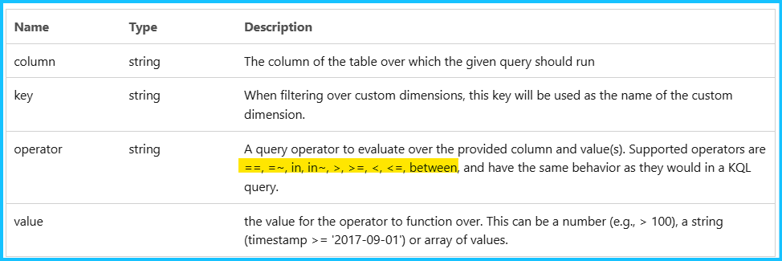
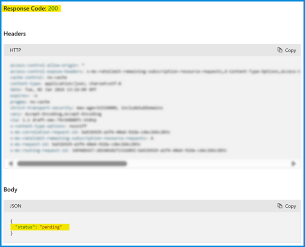
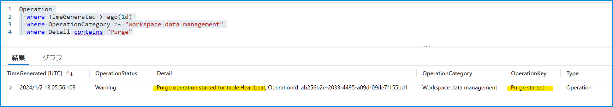

こんにちは、Azure Monitoring サポート チームの北村です。
今回は、Log Analytics ワークスペースのデータを削除する方法をご紹介します。
Log Analytics ワークスペースでは指定した[保持期間](https://learn.microsoft.com/ja-jp/azure/azure-monitor/logs/data-retention-archive?tabs=portal-1%2Cportal-2#configure-the-default-workspace-retention)を超えると、自動的にログが削除されます。
一方で、この保持期間を迎える前にログを削除したい、特定のログのみを削除したい、といった場合には、今回紹介する方法でデータを削除することをご検討いただけますと幸いです。
<br>

<!-- more -->
## 目次
- [1. Log Analytics ワークスペースのログは REST API で削除する](#1-Log-Analytics-ワークスペースのログは-REST-API-で削除する)
- [2. Purge の REST API をご利用いただく際の留意点](#2-Purge-の-REST-API-をご利用いただく際の留意点)
  - [2.1 必要なロール](#2-1-必要なロール)
  - [2.2 ご利用可能な演算子](#2-2-ご利用可能な演算子)
  - [2.3 データが削除されるまでにかかる時間](#2-3-データが削除されるまでにかかる時間)
  - [2.4 パージの操作は元に戻すことはできない](#2-4-パージの操作は元に戻すことはできない)
- [3. Purge の REST API で削除する手順](#3-Purge-の-REST-API-で削除する手順)
- [4. データが削除されたかどうかを確認する手順](#4-データが削除されたかどうかを確認する手順)
  - [4-1. Get Purge Status の REST API で確認する](#4-1-Get-Purge-Status-の-REST-API-で確認する)
  - [4-2. Operation テーブルで確認する](#4-2-Operation-テーブルで確認する)

<br>

## 1. Log Analytics ワークスペースのログは REST API で削除する
Log Analytics ワークスペースに収集されたログは REST API で削除することができます。
誠に恐縮ではございますが、Azure ポータルからログを削除することはできません。
この Purge の REST API では、ログのテーブル名やカラム名を指定して特定のログを削除することが可能です。
※ 当該 API は[弊社公開情報](https://learn.microsoft.com/en-us/rest/api/loganalytics/workspace-purge/purge?view=rest-loganalytics-2020-08-01&tabs=HTTP)の "Try It" より実行いただけます。


<br>
<br>

## 2. Purge の REST API をご利用いただく際の留意点
Purge の REST API を実行いただく上での留意点をご紹介します。REST API を実行する前に必ずご確認ください。

<br>

### 2.1 必要なロール
Purge の REST API を実行するには、明示的に [Data Purger (データ消去者)](https://learn.microsoft.com/ja-jp/azure/role-based-access-control/built-in-roles#data-purger) ロールが必要です。パージを実行されるユーザー様には、対象のワークスペースに [Data Purger のロールを付与](https://learn.microsoft.com/ja-jp/azure/role-based-access-control/role-assignments-portal?tabs=delegate-condition)いただきますようお願いいたします。

<br>

### 2.2 ご利用可能な演算子
この REST API では、カラム名とその値を指定して特定のログを削除することができます。
カラム名を指定する際にサポートされている演算子は以下のとおりです。
すべての演算子をサポートしているものではございませんので、API を実行する前に[弊社公開情報の "WorkspacePurgeBodyFilters"](https://learn.microsoft.com/en-us/rest/api/loganalytics/workspace-purge/purge?view=rest-loganalytics-2020-08-01&tabs=HTTP) の項目をご確認ください。


<br>

### 2.3 データが削除されるまでにかかる時間
Purge の REST API によるログの削除は[基本的に数分 ～ 数時間で反映されますが、最大 30 日かかる場合もございます](https://learn.microsoft.com/ja-jp/azure/azure-monitor/logs/personal-data-mgmt#exporting-and-deleting-personal-data)。
データが削除されたかどうかをご確認されたい場合は、後述の [4. データが削除されたかどうかを確認する手順](#4-データが削除されたかどうかを確認する手順) をご参照ください。

<br>

### 2.4 パージの操作は元に戻すことはできない
[パージの操作は元に戻すことはできません](https://learn.microsoft.com/ja-jp/azure/azure-monitor/logs/personal-data-mgmt#delete)。パージの操作を実行する際には細心の注意を払って実施してください。

<br>
<br>

## 3. Purge の REST API で削除する手順
[弊社サイト](https://learn.microsoft.com/en-us/rest/api/loganalytics/workspace-purge/purge?view=rest-loganalytics-2020-08-01&tabs=HTTP)の "Try It" より、Purge の REST API を実行した例を紹介します。
今回は Test という名前の Log Analytics ワークスペースに収集された Heartbeat のログを削除します。
このワークスペースには TimeGenerated が 2023/12/26 07:45 UTC ～ 2023/12/27 18:46 UTC の Heartbeat が存在します。
このうち TimeGenerated が 2023/12/26 07:50:00 UTC より前のログを削除します。削除する対象のログは以下のとおりです。
※ TimeGenerated の値は UTC 時刻であることに注意してください。


<br>

それでは API の実行手順をご紹介します。

1. [こちら](https://learn.microsoft.com/en-us/rest/api/loganalytics/workspace-purge/purge?view=rest-loganalytics-2020-08-01&tabs=HTTP)のサイトにアクセスし、"Try It" を選択します。


2. "Try It" をクリックすると、以下のような画面に遷移します。
Parameters (赤線で囲った部分) では、対象のワークスペースが存在するサブスクリプション、リソース グループ、ワークスペースの名前を指定します。Body (黄色線で囲った部分) では、削除するログのテーブル名と、カラム名とその値を指定します。


今回は TimeGenerated が 2023/12/26 7:50 UTC より前のログを削除したいので、Body 部分の table で Heartbeat、column で TimeGenerated を指定します。[こちら](https://learn.microsoft.com/en-us/rest/api/loganalytics/workspace-purge/purge?view=rest-loganalytics-2020-08-01&tabs=HTTP)のサイトにもサンプル リクエストが掲載されておりますので、併せてご確認ください。

```CMD
{
  "table": "Heartbeat",
  "filters": [
    {
      "column": "TimeGenerated",
      "operator": ">",
      "value": "2023-12-26T07:50:00"
    }
  ]
}
```

3. 画面下部の "Run" をクリックして、REST API を実行します。


4. 以下のように HTTP Response Code: 202 と表示されることを確認し、"operationId" をメモします。
後述しますが、"operationId" はデータの削除状況を確認する際に必要です。


<br>
<br>

## 4. データが削除されたかどうかを確認する手順
Purge の REST API によってデータが削除されたかどうかを確認したい場合は、以下の手順にてご確認ください。

<br>

### 4-1. Get Purge Status の REST API で確認する
[Get Purge Status](https://learn.microsoft.com/en-us/rest/api/loganalytics/workspace-purge/get-purge-status?view=rest-loganalytics-2020-08-01&tabs=HTTP) の REST API でパージ操作の状態を確認できます。この REST API を実行するためには、purgeId が必要です。
この purgeId とは、Purge の REST API を実行した際に表示された "operatonId" として表示された値です。
データの削除状態を確認されたい場合は、必ず "operatonId" をメモしていただきますようお願いいたします。

Purge の REST API と同様、[弊社サイト](https://learn.microsoft.com/en-us/rest/api/loganalytics/workspace-purge/get-purge-status?view=rest-loganalytics-2020-08-01&tabs=HTTP) の "Try It" から API を実行いただけます。
Parameters では、Purge の REST API を実行した際に表示された "operatonId" と、対象のワークスペースが存在するサブスクリプション、リソース グループ、ワークスペースの名前を指定します。


API を実行すると以下のとおり status が表示されます。
パージの操作が完了していない場合は pending が返されます。


パージの操作が完了した場合には completed が返されます。


<br>

### 4-2. Operation テーブルで確認する
[Operation テーブル](https://learn.microsoft.com/ja-jp/azure/azure-monitor/logs/monitor-workspace)は、Log Analytics ワークスペース上で発生した問題や警告等が記録されるテーブルです。こちらのテーブルにパージ操作の情報も記録されます。対象のワークスペースにて以下のようなクエリを実行しますと、パージ操作の状態を確認することができます。

```CMD
Operation
| where OperationCategory =~ "Workspace data management"
| where Detail contains "Purge"
```

以下は弊社検証環境にて上記クエリを実行した例です。Detail 列には "Purge operation started for table:Heartbeat" と記録されており、Heartbeat テーブルに対してパージの操作が開始されたことが分かります。


パージの操作が完了しますと Detail 列に "Purge operation completed for table:Heartbeat" と記録されます。


<br>

上記の内容以外でご不明な点や疑問点などございましたら、弊社サポート サービスまでお問い合わせください。
最後までお読みいただきありがとうございました！