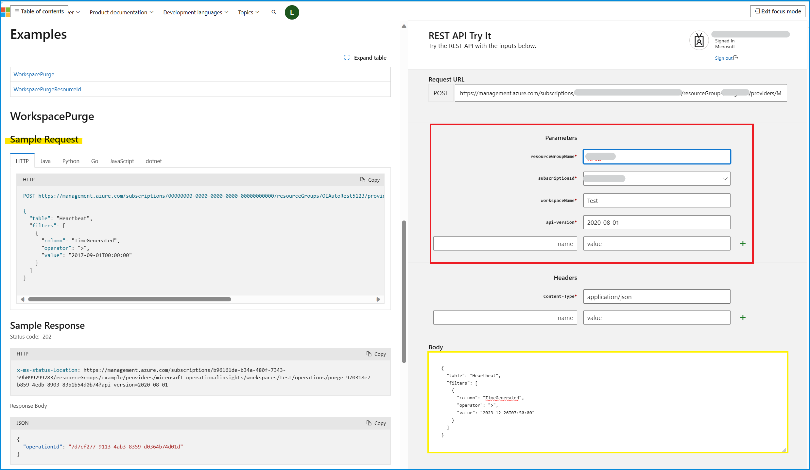
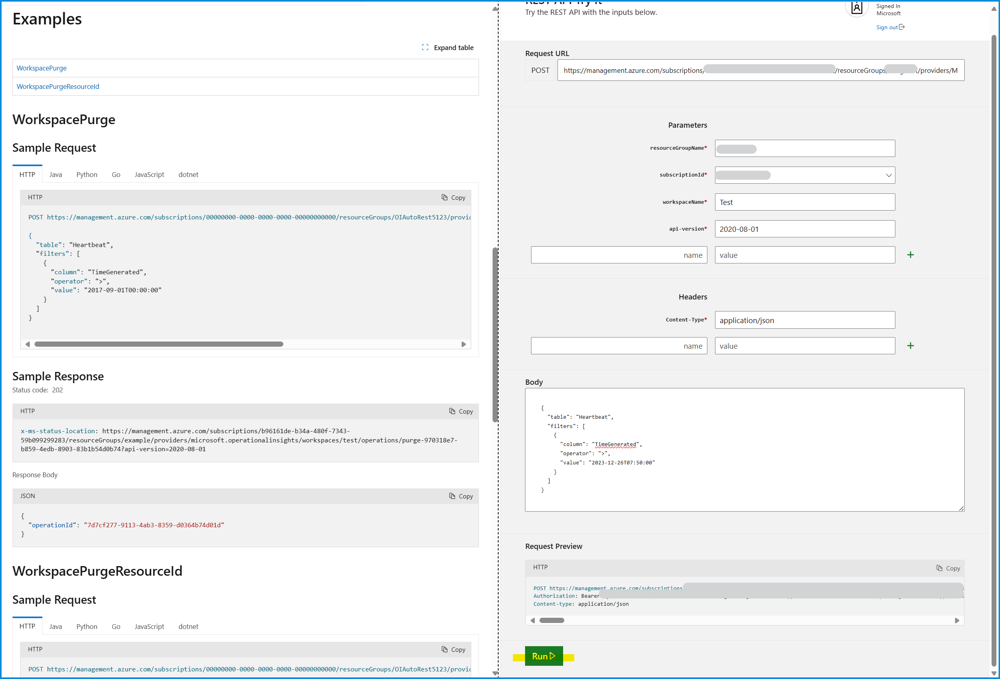

[更新履歴]
- 2024/01/06 : ブログ公開
- 2025/05/07 : Delete Data API の情報を追記


こんにちは、Azure Monitoring サポート チームの北村です。
今回は、Log Analytics ワークスペースのデータを削除する方法をご紹介します。
Log Analytics ワークスペースでは指定した[保持期間](https://learn.microsoft.com/ja-jp/azure/azure-monitor/logs/data-retention-archive?tabs=portal-1%2Cportal-2#configure-the-default-workspace-retention)を超えると、自動的にログが削除されます。
一方で、この保持期間を迎える前にログを削除したい、特定のログのみを削除したい、といった場合には、今回紹介する方法でデータを削除することをご検討いただけますと幸いです。
<br>


<!-- more -->
## 目次
- [1. Log Analytics ワークスペースのログを削除する方法は 2 つある](#1-Log-Analytics-ワークスペースのログを削除する方法は-2-つある)
  - [1-1. Purge API](#1-1-Purge-API)
  - [1-2. Delete Data API](#1-2-Delete-Data-API)
- [2. Delete Data API と Purge API の使い分けについて](#2-Delete-Data-API-と-Purge-API-の使い分けについて)
- [3. Delete Data API について](#3-Delete-Data-API-について)
  - [3-1. Delete Data API の主な留意点](#3-1-Delete-Data-API-の主な留意点)
  - [3-2. Delete Data API の実行例](#3-2-Delete-Data-API-の実行例)
    - [3-2-1. Delete Data API でログを削除する](#3-2-1-Delete-Data-API-でログを削除する)
    - [3-2-2. Delete Data API による削除ステータスを確認する](#3-2-2-Delete-Data-API-による削除ステータスを確認する)
    - [3-2-3. Delete Data API によってログが削除されたかどうかを確認する](#3-2-3-Delete-Data-API-によってログが削除されたかどうかを確認する)
- [4. Purge API について](#4-Purge-API-について)
  - [4-1. Purge API の主な留意点](#4-1-Purge-API-の主な留意点)
  - [4-2. Purge API の実行例](#4-2-Purge-API-の実行例)
    - [4-2-1. Purge API でログをパージする](#4-2-1-Purge-API-でログをパージする)
    - [4-2-2. Get Purge Status API でパージの受付状態を確認する](#4-2-2-Get-Purge-Status-API-でパージの受付状態を確認する)
    - [4-2-3. Purge API によってログがパージされたかどうかを確認する](#4-2-3-Purge-API-によってログがパージされたかどうかを確認する)


<br>
<br>


## 1. Log Analytics ワークスペースのログを削除する方法は 2 つある
Log Analytics ワークスペースのログは REST API で削除することができます (Azure ポータルからログを削除することはできません)。以前から提供されていた [Purge API](https://learn.microsoft.com/en-us/rest/api/loganalytics/workspace-purge/purge?view=rest-loganalytics-2020-08-01&tabs=HTTP) に加え、2025/3 に [Delete Data API](https://azure.microsoft.com/ja-jp/updates/?id=479041) が一般公開されました。この 2 つの API の違いについて説明します。


<br>


### 1-1. Purge API
[Purge API](https://learn.microsoft.com/ja-jp/rest/api/loganalytics/workspace-purge/purge?view=rest-loganalytics-2025-02-01&tabs=HTTP) は以前から提供されていた API であり、 **[GDPR（EU 一般データ保護規則）](https://learn.microsoft.com/ja-jp/compliance/regulatory/gdpr)に準拠しています。**
この API は Log Analyticsワークスペース内のデータを完全に削除（パージ）するための API であり、**物理的にストレージからデータを削除します**。
```CMD
POST https://management.azure.com/subscriptions/{subscriptionId}/resourceGroups/{resourceGroupName}/providers/Microsoft.OperationalInsights/workspaces/{workspaceName}/purge?api-version=2025-02-01

{
  "table": "Heartbeat",
  "filters": [
    {
      "column": "TimeGenerated",
      "operator": ">",
      "value": "2017-09-01T00:00:00"
    }
  ]
}
```

<br>
<br>


### 1-2. Delete Data API
[Delete Data API](https://learn.microsoft.com/en-us/azure/azure-monitor/logs/delete-log-data) は、2025/3 に一般公開された新しい API です。この API は **[GDPR（EU 一般データ保護規則）](https://learn.microsoft.com/ja-jp/compliance/regulatory/gdpr)に準拠していません。**
この API では、**物理的にストレージからデータを削除するのではなく、指定された条件を満たすデータを削除済みとしてマークします**。
```CMD
POST https://management.azure.com/subscriptions/{subscriptionId}/resourceGroups/{resourceGroupName}/providers/Microsoft.OperationalInsights/workspaces/{workspaceName}/tables/{tableName}/deleteData?api-version=2023-09-01

{
  "filters": [
    {
      "column": "TimeGenerated",
      "operator": "<",
      "value": "2024-09-23T00:00:00"
    },
    {
      "column": "Resource",
      "operator": "==",
      "value": "VM-1"
    }
  ]
}
```


<br>
<br>
<br>


## 2. Delete Data API と Purge API の使い分けについて
**GDPR（EU 一般データ保護規則）の要件に準拠する必要がある場合は [Purge API](https://learn.microsoft.com/en-us/azure/azure-monitor/logs/personal-data-mgmt#purge) をご利用ください。**
**それ以外の場合は、基本的に [Delete Data API](https://learn.microsoft.com/en-us/azure/azure-monitor/logs/personal-data-mgmt#delete) をご利用ください。**
どちらの API も[操作を元に戻すことはできません](https://learn.microsoft.com/ja-jp/azure/azure-monitor/logs/personal-data-mgmt#delete)。API を実行する際には細心の注意を払って実施してください。


<br>
<br>
<br>


## 3. Delete Data API について
<u>GDPR（EU 一般データ保護規則）の要件を満たす必要がない場合には、Delete Data API をご利用ください。</u>
このセクションでは、Delete Data API の実行例と主な留意点をご紹介します。

<br>

### 3-1. Delete Data API の主な留意点
Delete Data API を実行いただく上での主な留意点をご紹介します。API を実行する前に、[こちら](https://learn.microsoft.com/en-us/azure/azure-monitor/logs/delete-log-data)の公開情報もご一読いただきますようお願いいたします。


- **必要なロール** :
Delete Data API を実行するには Log Analytics ワークスペースに対して [Microsoft.OperationalInsights/workspaces/tables/deleteData/action](https://learn.microsoft.com/en-us/azure/azure-monitor/logs/delete-log-data#permissions-required) の権限が必要です。Log Analytics の組み込みロールでは [Log Analytics 共同作成者](https://learn.microsoft.com/ja-jp/azure/azure-monitor/logs/manage-access?tabs=portal#log-analytics-contributor) が該当します。


- **利用可能な演算子** :
カラム名とその値を指定して条件を指定します。[値を指定する際に利用できる演算子](https://learn.microsoft.com/en-us/azure/azure-monitor/logs/delete-log-data#filter-parameters)は以下のとおりです。
すべての演算子をサポートしておりませんので、API を実行する前にサポートしている演算子をご確認ください。


- **データが削除されるまでにかかる時間** :
Delete Data API のリクエストは非同期で行われ、[通常は数分以内に完了しますが、最大 5 日かかる場合がございます](https://learn.microsoft.com/en-us/azure/azure-monitor/logs/delete-log-data#how-the-delete-data-api-works)。
データの削除ステータスは、[REST API からご確認いただけます](https://learn.microsoft.com/en-us/azure/azure-monitor/logs/delete-log-data#check-delete-data-operations-and-status)。


- **削除操作は元に戻すことはできない** :
[削除操作は元に戻すことはできません](hhttps://learn.microsoft.com/en-us/azure/azure-monitor/logs/delete-log-data#how-the-delete-data-api-works)。API を実行する際には細心の注意を払って実施してください。


<br>
<br>


### 3-2. Delete Data API の実行例

#### 3-2-1. Delete Data API でログを削除する
Delete Data API で Heartbeat のログを削除した例を紹介します。
このワークスペースには TimeGenerated が 2025/04/13 03:55:52 UTC ～ 2025/04/13 04:16:52 UTC の Heartbeat が存在しますが、TimeGenerated が 2025/04/13 04:00:00 UTC より後のログを削除します。

以下は Heartbeat テーブルを検索した実行結果の一部抜粋です。2025/04/13 04:00:00 UTC より後のログを削除するため、赤線で囲んだ部分のログが削除され、緑線で囲んだ部分のログは削除されずに残ります。
※ ログの TimeGenerated の値は UTC 時刻であることに注意してください。


それでは API の実行例を示します。
今回は TimeGenerated が 2025/04/13 04:00:00 UTC より後の Heartbeat を削除したいので、以下のように指定します。

```CMD
POST https://management.azure.com/subscriptions/{subscriptionId}/resourceGroups/{resourceGroupName}/providers/Microsoft.OperationalInsights/workspaces/{workspaceName}/tables/Heartbeat/deleteData?api-version=2023-09-01

 {
   "filters": [
     {
       "column": "TimeGenerated",
       "operator": ">",
       "value": "2025-04-13T04:00:00"
     }
   ]
 }
```


<br>

API を実行した結果の一部抜粋です。HTTP Response Code: 202 と表示されることを確認します。赤線部分で囲んだ URL は、ステータスを確認するために必要となります。


<br>


#### 3-2-2. Delete Data API による削除ステータスを確認する
削除のステータスは、Delete Data API を実行したときのレスポンスヘッダーに含まれる Azure-AsyncOperation URL を使用します。

```CMD
Azure-AsyncOperation : https://management.azure.com/subscriptions/{subscriptionId}/providers/Microsoft.OperationalInsights/locations/{region}/operationstatuses/{responseOperation}?api-version=2023-09-01
```


<br>


Azure-AsyncOperation URL に GET リクエストを送信することで、削除のステータスや削除されたレコード数が表示されます。

```CMD
GET https://management.azure.com/subscriptions/{subscriptionId}/providers/Microsoft.OperationalInsights/locations/{region}/operationstatuses/{responseOperation}?api-version=2023-09-01
```

<br>


操作が完了している場合には、以下のような結果を取得できます。RecordCount が 17 となっており、17 件のレコードが削除されたことが分かります。

```CMD
{
  "id": "/subscriptions/{subscriptionId}/providers/Microsoft.OperationalInsights/locations/{region}/operationstatuses/{responseOperation}",
  "name": "{responseOperation}",
  "status": "Succeeded",
  "startTime": "2025-04-14T09:07:49.4052141Z",
  "endTime": "2025-04-14T09:12:52.0725274Z",
  "properties": {
    "RecordCount": 17,
    "Status": "Completed"
  }
}
```

<br>
<br>


#### 3-2-3. Delete Data API によってログが削除されたかどうかを確認する
ログが削除されているかどうかを確認します。下図は Delete Data API を実行する前に確認したクエリを改めて実行した結果です。
API を実行する前には TimeGenerated が 2025/04/13 03:55:52 UTC ～ 2025/04/13 04:16:52 UTC のレコードが存在していましたが、2025/04/13 04:00:00 UTC より後のログを削除したため、2025/04/13 04:00:52 UTC ～ 2025/04/13 04:16:52 UTC (17 件) が表示されないことが分かります。


<br>
<br>


## 4. Purge API について
<u>GDPR（EU 一般データ保護規則）の要件を満たす必要がある場合には、Purge API をご利用ください。</u>
このセクションでは、Purge API の実行例と主な留意点をご紹介します。

<br>


### 4-1. Purge API の主な留意点
Purge API を実行いただく上での主な留意点をご紹介します。API を実行する前に、[こちら](https://learn.microsoft.com/en-us/azure/azure-monitor/logs/personal-data-mgmt#purge)の公開情報もご一読いただきますようお願いいたします。


- **必要なロール** :
Purge の REST API を実行するには Log Analytics ワークスペースに対して [Microsoft.OperationalInsights/workspaces/purge/action](https://learn.microsoft.com/en-us/azure/azure-monitor/logs/personal-data-mgmt#permissions-required) の権限が必要です。Log Analytics の組み込みロールでは [Data Purger (データ消去者)](https://learn.microsoft.com/en-us/azure/role-based-access-control/built-in-roles/monitor#data-purger) が該当します。

- **利用可能な演算子** :
カラム名とその値を指定して条件を指定します。[値を指定する際に利用できる演算子](https://learn.microsoft.com/en-us/rest/api/loganalytics/workspace-purge/purge?view=rest-loganalytics-2020-08-01&tabs=HTTP#workspacepurgebodyfilters)は以下のとおりです。すべての演算子をサポートしておりませんので、API を実行する前にサポートしている演算子をご確認ください。


- **データがパージされるまでにかかる時間** :
Purge API のリクエストは[基本的に数分 ～ 数時間で反映されますが、最大 30 日かかる場合がございます](https://learn.microsoft.com/ja-jp/azure/azure-monitor/logs/personal-data-mgmt#exporting-and-deleting-personal-data)。
データがパージされたかどうかを確認する場合は、Log Analytics ワークスペース上でクエリを実行してください。

- **パージ操作は元に戻すことはできない** :
[パージの操作は元に戻すことはできません](https://learn.microsoft.com/en-us/azure/azure-monitor/logs/personal-data-mgmt#purge)。パージの操作を実行する際には細心の注意を払って実施してください。


<br>
<br>


### 4-2. Purge API の実行例
#### 4-2-1. Purge API でログをパージする
Purge API で Heartbeat のログを削除した例を紹介します。
このワークスペースには TimeGenerated が 2023/12/26 07:45:55 UTC ～ 2023/12/26 12:12:45 UTC の Heartbeat が存在しますが、TimeGenerated が 2023/12/26 07:50:00 UTC より後のログを削除します。

以下は Heartbeat テーブルを検索した実行結果の一部抜粋です。2023/12/26 07:50:00 UTC より後のログを削除するため、赤線で囲んだ部分のログが削除され、黄色でマーカーした部分のログは削除されずに残ります。
※ TimeGenerated の値は UTC 時刻であることに注意してください。


それでは API の実行手順をご紹介します。まず、[こちら](https://learn.microsoft.com/en-us/rest/api/loganalytics/workspace-purge/purge?view=rest-loganalytics-2020-08-01&tabs=HTTP)のサイトにアクセスし、"Try It" を選択します。


"Try It" をクリックすると、以下のような画面に遷移します。
Parameters (赤線で囲った部分) では、対象のワークスペースが存在するサブスクリプション、リソース グループ、ワークスペースの名前を指定します。Body (黄色線で囲った部分) では、削除するログのテーブル名と、カラム名とその値を指定します。



今回は TimeGenerated が 2023/12/26 07:50:00 UTC より後の Heartbeat を削除したいので、Body 部分の table で Heartbeat、column で TimeGenerated を指定します。[こちら](https://learn.microsoft.com/en-us/rest/api/loganalytics/workspace-purge/purge?view=rest-loganalytics-2020-08-01&tabs=HTTP)のサイトにもサンプル リクエストが掲載されておりますので、ご確認ください。

```CMD
{
  "table": "Heartbeat",
  "filters": [
    {
      "column": "TimeGenerated",
      "operator": ">",
      "value": "2023-12-26T07:50:00"
    }
  ]
}
```

<br>

画面下部の "Run" をクリックして、Purge API を実行します。



以下のように HTTP Response Code: 202 と表示されることを確認します。マーカー部分の "operationId" は、パージ操作の受付状態を確認する際に必要となります。


<br>
<br>


#### 4-2-2. Get Purge Status API でパージの受付状態を確認する
パージ操作の受付状態は [Get Purge Status](https://learn.microsoft.com/en-us/rest/api/loganalytics/workspace-purge/get-purge-status?view=rest-loganalytics-2020-08-01&tabs=HTTP) という REST API で確認することができます。
この API を実行するためには、purgeId が必要です。purgeId とは、Purge API を実行した際に表示された "operationId" の値が該当します。このため、パージ操作の受付状態を確認する場合は、必ず "operationId" をメモしていただきますようお願いいたします。
<u>また、Get Purge Status API で completed が返された場合には、パージ操作が受付されたことを意味しますが、パージ操作が受付されてからデータが削除されるまでに最大 30 日かかる場合がありますので、ご了承ください。</u>

```CMD
GET https://management.azure.com/subscriptions/{subscriptionId}/resourceGroups/{resourceGroupName}/providers/Microsoft.OperationalInsights/workspaces/{workspaceName}/operations/{purgeId}?api-version=2020-08-01
```

[こちら](https://learn.microsoft.com/en-us/rest/api/loganalytics/workspace-purge/get-purge-status?view=rest-loganalytics-2020-08-01&tabs=HTTP)のサイトにアクセスし、”Try It” を選択します。


Parameters では、Purge API を実行した際に表示された "operationId" と、対象のワークスペースが存在するサブスクリプション、リソース グループ、ワークスペースの名前を指定します。


API を実行すると status が表示されます。パージ操作の受付が完了していない場合は pending が返されます。


パージ操作が受付された場合は completed が返されます。


<br>
<br>


#### 4-2-3. Purge API によってログがパージされたかどうかを確認する
Purge API によってデータがパージされたかどうかを確認する場合は、Log Analytics ワークスペース上でクエリを実行いただく必要がございます。時間の範囲や列名等で条件句をご指定いただき、対象のログが削除されたかどうかをご確認ください。

下図は Purge API を実行する前に確認したクエリを改めて実行した結果です。
API を実行する前には TimeGenerated が 2023/12/26 07:45:55 UTC ～ 2023/12/27 12:12:45 UTC のレコードが存在していましたが、
2023/12/26 07:50:00 UTC より後のログを削除したため、2023/12/26 07:50:55 UTC ～ 2023/12/26 12:12:45 UTC が表示されないことが分かります。


<br>

上記の内容以外でご不明な点や疑問点などございましたら、弊社サポート サービスまでお問い合わせください。
最後までお読みいただきありがとうございました！
