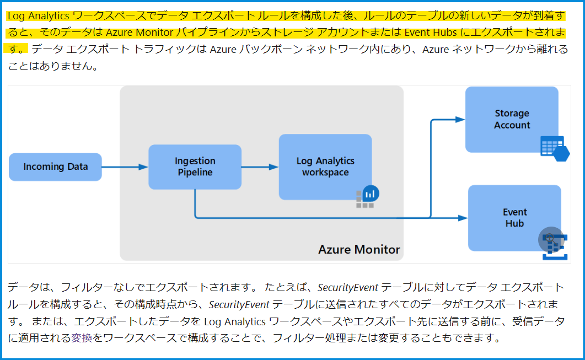
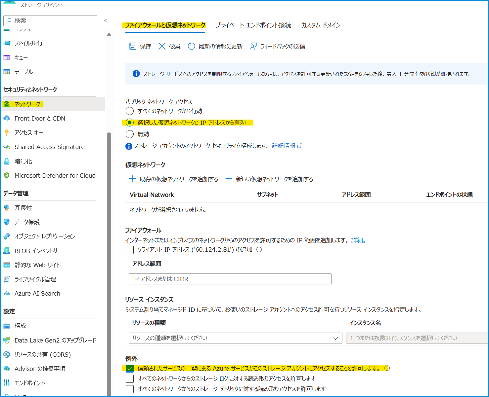
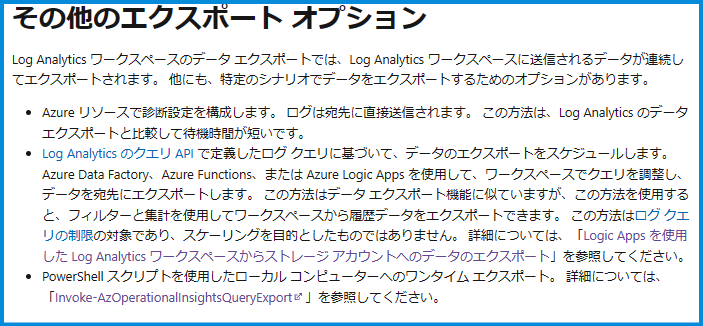
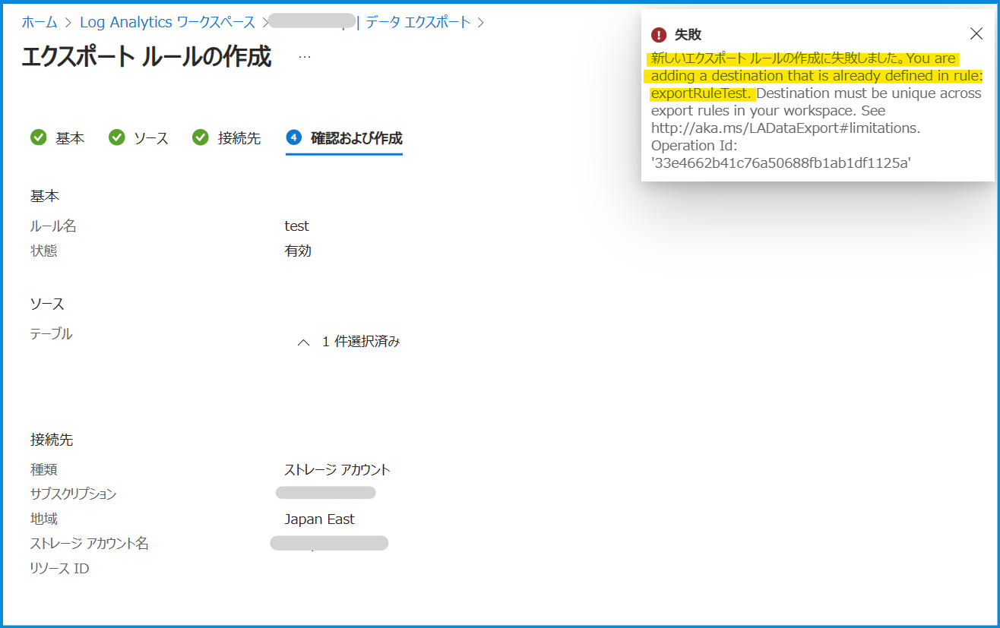

こんにちは、Azure Monitoring サポート チームの北村です。
皆さまは [Log Analytics ワークスペースのデータ エクスポート](https://learn.microsoft.com/ja-jp/azure/azure-monitor/logs/logs-data-export?tabs=portal) という機能をご存知でしょうか。
この機能では Log Analytics ワークスペースに収集されたログをストレージ アカウントやイベント ハブにエクスポートすることができます。今回はこのデータ エクスポート機能でよくお問い合わせをいただくご質問を紹介いたします。

 

<!-- more -->
## Q & A タイトル
- [Q1. データ エクスポート機能は全てのテーブルでサポートされていますか。](#Q1-データ-エクスポート機能は全てのテーブルでサポートされていますか。)
- [Q2. ストレージ アカウントやイベント ハブにデータがエクスポートされる契機を教えてください。](#Q2-ストレージ-アカウントやイベント-ハブにデータがエクスポートされる契機を教えてください。)
- [Q3. エクスポート ルールの作成前に Log Analytics ワークスペースに収集されたログは、ストレージ アカウントやイベント ハブにエクスポートされますか。](#Q3-エクスポート-ルールの作成前に-Log-Analytics-ワークスペースに収集されたログは、ストレージ-アカウントやイベント-ハブにエクスポートされますか。)
- [Q4. ログがストレージ アカウントに転送されていません。考えられる原因を教えてください。](#Q4-ログがストレージ-アカウントに転送されていません。考えられる原因を教えてください。)
- [Q5. ある一定期間経過したデータをストレージ アカウントに転送することはできますか。](#Q5-ある一定期間経過したデータをストレージ-アカウントに転送することはできますか。)
- [Q6. データ エクスポート機能でサポートしていないテーブルのログをストレージ アカウントに転送する方法はありますか。](#Q6-データ-エクスポート機能でサポートしていないテーブルのログをストレージ-アカウントに転送する方法はありますか。)
- [Q7. データ エクスポート機能でストレージ アカウントにログをエクスポートするように設定しました。エクスポートしたログを確認する方法を教えてください。](#Q7-データ-エクスポート機能でストレージ-アカウントにログをエクスポートするように設定しました。エクスポートしたログを確認する方法を教えてください。)
- [Q8. サポートされていないテーブルも含めてエクスポート ルールを設定してしまいました。エクスポート ルールを再作成した方が良いですか。](#Q8-サポートされていないテーブルも含めてデータ-エクスポート-ルールを設定してしまいました。エクスポート-ルールを再作成した方が良いですか。)
- [Q9. 既存のエクスポート ルールの宛先と同じストレージ アカウントを指定し、新規にエクスポート ルールを作成しようしましたが、エラーが発生しました。](#Q9-既存のエクスポート-ルールの宛先と同じストレージ-アカウントを指定し、新規にエクスポート-ルールを作成しようしましたが、エラーが発生しました。)
- [Q10. ストレージ アカウントにデータをエクスポートするように設定しています。データ エクスポート機能の利用料金を教えてください。](#Q10-ストレージ-アカウントにデータをエクスポートするように設定しています。データ-エクスポート機能の利用料金を教えてください。)

 

### Q1. データ エクスポート機能は全てのテーブルでサポートされていますか。
いいえ、全てのテーブルでサポートしておりません。
サポート対象のテーブルは、[こちら](https://learn.microsoft.com/ja-jp/azure/azure-monitor/logs/logs-data-export?tabs=portal#supported-tables)の弊社公開情報でご確認ください。

 

### Q2. ストレージ アカウントやイベント ハブにデータがエクスポートされる契機を教えてください。
データ エクスポート機能は Log Analytics ワークスペースに "データが取り込まれた時" に指定した宛先 (ストレージ アカウントとイベント ハブ) へデータをエクスポートします。Log Analytics ワークスペースのログをストレージ アカウントにエクスポートした場合は 5 分間のログが一つのファイルに記録されます。つまり 1 時間にファイルが 12 個作成され、レコードが生成される度にストレージ アカウントのファイルに追記されます。詳細は[弊社公開情報](https://learn.microsoft.com/ja-jp/azure/azure-monitor/logs/logs-data-export?tabs=portal#overview) もご覧いただけますと幸いです。

 

### Q3. エクスポート ルールの作成前に Log Analytics ワークスペースに収集されたログは、ストレージ アカウントやイベント ハブにエクスポートされますか。
いいえ、エクスポートされません。
データ エクスポート機能は Log Analytics ワークスペースに "データが取り込まれた時" に宛先 (ストレージ アカウントとイベント ハブ) へデータを転送する機能です。エクスポート ルールの設定前に既に取り込まれたログの転送は行われず、コンテナも作成されません。

 

### Q4. ログがストレージ アカウントに転送されていません。考えられる原因を教えてください。
考えられる原因は以下のとおりです。弊社公開情報の [制限事項](https://learn.microsoft.com/ja-jp/azure/azure-monitor/logs/logs-data-export?tabs=portal#limitations)と [ストレージ アカウント](https://learn.microsoft.com/ja-jp/azure/azure-monitor/logs/logs-data-export?tabs=portal#storage-account) の項目も併せてご確認ください。
以下に該当しない場合で指定した宛先にログがエクスポートされない場合は弊社サポート窓口までお問い合わせください。

***1. エクスポート ルールで指定したテーブルがサポートされていない***
対象のテーブルがデータ エクスポート機能でサポートされていない可能性がございます。
まずは、指定したテーブルが[サポート対象のテーブル](https://learn.microsoft.com/ja-jp/azure/azure-monitor/logs/logs-data-export?tabs=portal#supported-tables)かどうかをご確認ください。

***2. ストレージ アカウントのネットワーク設定で "信頼された Microsoft サービス" が許可されていない***
ストレージ アカウントのネットワーク設定により、ログがエクスポートされていない可能性がございます。
宛先のストレージ アカウントが選択したネットワークからのアクセスを許可する構成である場合、
[[信頼されたサービスの一覧にある Azure サービスがこのストレージ アカウントにアクセスすることを許可します。] が有効](https://learn.microsoft.com/ja-jp/azure/azure-monitor/logs/logs-data-export?tabs=portal#allow-trusted-microsoft-services)になっているかどうかをご確認ください。完全に外部からのアクセスを無効にすると、Azure Monitor サービスからの通信が遮断され、ログをエクスポートすることができません。また、選択したネットワークからのアクセスを許可する構成の場合、Azure Monitor サービスからの通信を許可するために [信頼されたサービスの一覧にある Azure サービスがこのストレージ アカウントにアクセスすることを許可します。] を有効にしていただく必要がございます。

***3. ストレージ アカウントのリージョンが Log Analytics ワークスペースと同じージョンでない***
[宛先のストレージ アカウントのリージョンは、Log Analytics ワークスペースと同じリージョンである必要がございます](https://learn.microsoft.com/ja-jp/azure/azure-monitor/logs/logs-data-export?tabs=portal#limitations)。対象のストレージ アカウントと Log Analytics ワークスペースのリージョンをご確認下さいますようお願いいたします。

***4. ストレージ アカウントの種類が Standard ではない***
[データ エクスポート機能では、Premium のストレージ アカウントはサポートされていません。](https://learn.microsoft.com/ja-jp/azure/azure-monitor/logs/logs-data-export?tabs=portal#limitations)
宛先のストレージ アカウントの種類が Standard であることをご確認ください。

***5. エクスポート ルールの作成後に Log Analytics ワークスペースにログが収集されていない***
データ エクスポート機能は Log Analytics ワークスペースに "データが取り込まれた時" に宛先へデータを転送する機能です。
エクスポート ルールの作成後に Log Analytics ワークスペースにログが収集されていない場合は、宛先のストレージ アカウントにはログが取り込まれません。Log Analytics ワークスペース上でクエリを実行いただき、エクスポート ルールの作成後に対象のログが Log Analytics ワークスペースに収集されているかどうかをご確認ください。

 

### Q5. ある一定期間経過したデータをストレージ アカウントに転送することはできますか。
大変恐縮ではございますが、データ エクスポート機能では、ある一定期間を経過したログを転送することはできません。
この機能では、過去に遡ってログをエクスポートすることや特定期間のログをエクスポートすることはできません。
過去のログや特定の期間におけるログをエクスポートされたい場合は、お客様にてストレージ アカウントにログをアップロードする仕組みのご構築をご検討ください。

 

### Q6. データ エクスポート機能でサポートしていないテーブルのログをストレージ アカウントに転送する方法はありますか。
エクスポートしたいログ データの種類によります。
例えば [Azure Monitor の診断設定](https://learn.microsoft.com/ja-jp/azure/azure-monitor/essentials/diagnostic-settings)に関するデータは、診断設定側でストレージ アカウントに転送することが可能です。エクスポートしたいデータが診断設定によるログに該当しない場合は、Azure Functions や Azure Logic Apps 等を使用して、データをストレージ アカウントにエクスポートする方法や、お客様ご自身にて Log Analytics ワークスペースからログを取得し、ストレージ アカウントに送信する仕組みのご構築をご検討ください。詳細は以下の[弊社公開情報](https://learn.microsoft.com/ja-JP/azure/azure-monitor/logs/logs-data-export?tabs=portal#other-export-options)をご参照ください。

 

### Q7. データ エクスポート機能でストレージ アカウントにログをエクスポートするように設定しました。エクスポートしたログを確認する方法を教えてください。
エクスポートされたデータは、Azure ポータルのストレージ アカウントの [ストレージ ブラウザー] の画面よりご確認いただけます。
ログがエクスポートされますと、am-<テーブル名> という名前でコンテナーが作成されます。
また、BLOB は WorkspaceResourceId=/subscriptions/<サブスクリプション ID>/resourcegroups/<リソース グループ>/providers/microsoft.operationalinsights/workspaces/<ワークスペース名>/y=<4 桁の数値年>/m=<2 桁の数値月>/d=<2 桁の数値日>/h=<2 桁の 24 時制の時間>/m=<2 桁の 60 分制の分>/PT05M.json というパス構造のフォルダーに格納されます。[弊社公開情報](https://learn.microsoft.com/ja-jp/azure/azure-monitor/logs/logs-data-export?tabs=portal#storage-account)も併せてご確認ください。

※ Heartbeat テーブルをエクスポートした例です。am-Heartbeat という名前でコンテナーが作成されます。

 

### Q8. サポートされていないテーブルも含めてデータ エクスポート ルールを設定してしまいました。エクスポート ルールを再作成した方が良いですか。
いいえ、現時点でサポートされていないテーブルをご指定いただいても構いません。
エクスポート ルール作成時に当該機能をサポートしていないテーブルについては、サポートされ次第、データのエクスポートが開始されます。[弊社公開情報](https://learn.microsoft.com/ja-JP/azure/azure-monitor/logs/logs-data-export?tabs=portal#create-or-update-a-data-export-rule)も併せてご確認ください。

 

### Q9. 既存のエクスポート ルールの宛先と同じストレージ アカウントを指定し、新規にエクスポート ルールを作成しようしましたが、エラーが発生しました。
1 つの Log Analytics ワークスペースで既存のエクスポート ルールと同じ宛先のストレージ アカウントを指定したエクスポート ルールを作成することはできません。既存のエクスポート ルールと同じストレージ アカウントを宛先に設定すると以下のエラーが発生します。[弊社公開情報](https://learn.microsoft.com/ja-jp/azure/azure-monitor/logs/logs-data-export?tabs=portal#create-or-update-a-data-export-rule)も併せてご確認ください。
You are adding a destination that is already defined in rule: ym-export-test. Destination must be unique across export rules in your workspace.

 

### Q10. ストレージ アカウントにデータをエクスポートするように設定しています。データ エクスポート機能の利用料金を教えてください。
データ エクスポート機能ではエクスポートされたデータに対して GB 単位でご利用料金が発生します。
また、ストレージ アカウントのご利用料金も発生いたします。詳細は[弊社公開情報](https://learn.microsoft.com/ja-jp/azure/azure-monitor/logs/logs-data-export?tabs=portal#pricing-model)や [Azure Monitor の価格サイトの "エクスポート"](https://azure.microsoft.com/ja-jp/pricing/details/monitor/) の項目をご覧ください。

 

上記の内容以外でご不明な点や疑問点などございましたら、弊社サポート サービスまでお問い合わせください。
最後までお読みいただきありがとうございました！
