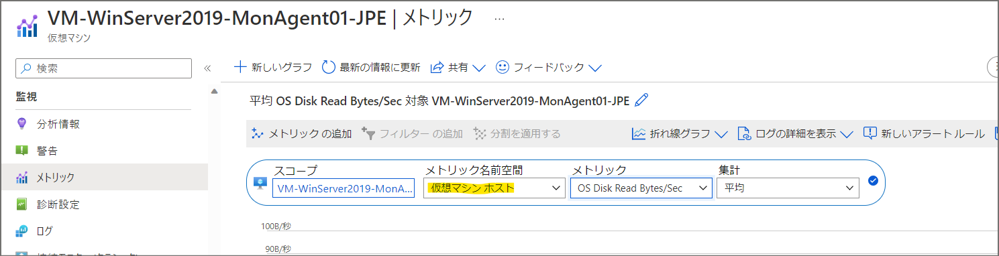
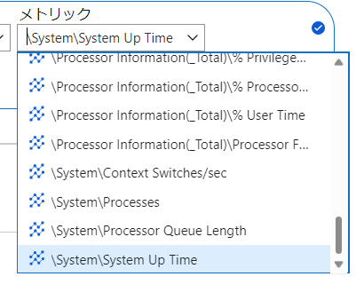
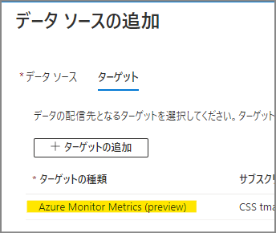
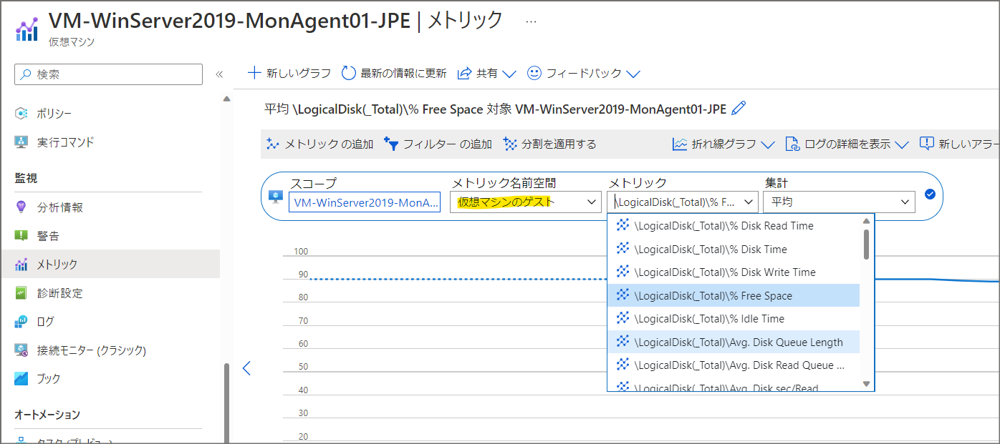
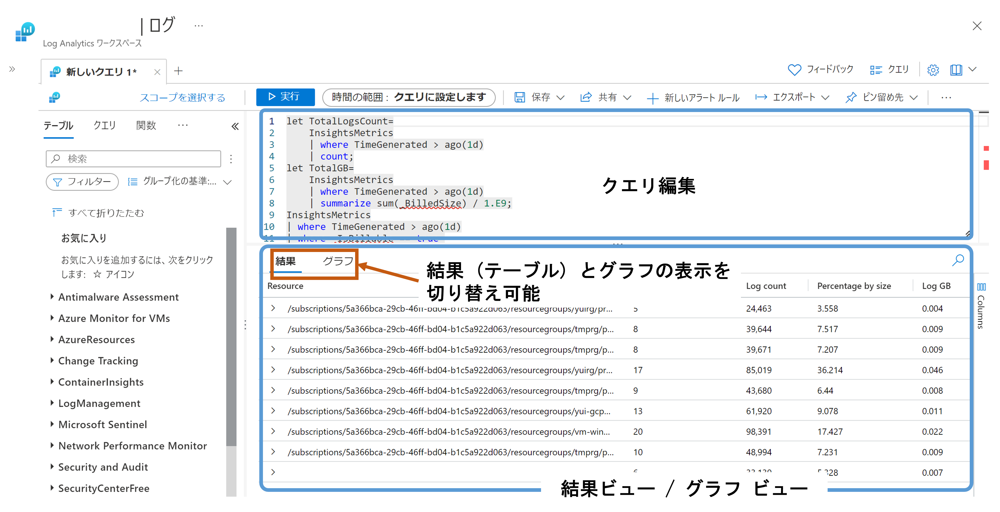
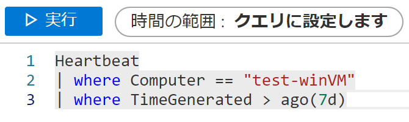

こんにちは、Azure Monitoring チームの増塩、徳田です。

今回は、Log Analytics を使って Azure VM の監視をする方法を紹介します。
VM を作成しただけではゲスト OS 上のログやメトリックなどは収集されませんが、Log Analytics の機能と組み合わせることで ゲスト OS の情報が収集できるようになります。
本記事では、Log Analytics を使って情報を収集する方法と、利用例についてご紹介します。

<!-- more -->

## 目次
* ホスト メトリックについて
* ゲスト メトリックについて
* OS 上のログ監視について


## はじめに
ユーザーが VM を作成すると、仮想マシンのホストで管理しているメトリック データが自動的に収集されます。例えばディスクに関するメトリックとして "OS ディスク読み取りバイト数/秒" (OS Disk Read Bytes/Sec) が自動的に収集されます。

しかし、"ディスクの空き容量" のような VM 上で稼働している OS で管理しているメトリックは自動的には収集されません。

ここで、Log Analytics のエージェントが登場します。
エージェントをゲスト OS にインストールして、ログやメトリックを Azure Monitor に送信することで、ゲスト OS が管理している情報も監視することができるようになります。

## 1. ホスト メトリックについて
ホスト メトリックは仮想マシンを作成すると自動的に収集されます。
仮想マシンから取得されるメトリックは ["Azure Monitor のサポートされるメトリック" の [Microsoft.Compute/virtualMachines] チャプター](https://docs.microsoft.com/ja-jp/azure/azure-monitor/essentials/metrics-supported#microsoftcomputevirtualmachines) に記載されています。

Azure ポータルでは VM の **[メトリック]** 画面で、 **[メトリック名前空間]** を **"仮想マシンホスト"** にすると確認できます。




## 2. ゲスト メトリックについて
### 概要、ホスト メトリックとの違い
ゲスト OS からメトリックを取得するので "System Up Time" といったゲスト OS で管理しているメトリックも取得できます。



これらのメトリックは、ゲスト OS にインストールした Azure Monitor エージェントにより収集され、Azure Monitor に送信されます。

### 監視方法
ゲスト メトリックを収集するには、まず初めにデータ収集ルールを作成します。
データ収集ルールの作成方法は [こちらのページの **[データ収集ルールと関連付けを作成する]** チャプター](https://docs.microsoft.com/ja-jp/azure/azure-monitor/agents/data-collection-rule-azure-monitor-agent?tabs=portal)  に記載されていますので、ここでは設定のポイントを説明します。

**[収集と配信]** タブの、 **[データ ソースの追加]** 画面では、以下のように **"パフォーマンス カウンター"** を選択します。
収集するメトリックをカスタマイズしない場合は、 **[パフォーマンス カウンターを構成する]** で **"基本"** を選択します。


収集するカウンターの設定が終了したら、 **[次へ: ターゲット >]** をクリックすると、 **[ターゲット]** が表示されます。
このタブで、以下のように **"Azure Monitor Metrics (preview)"** が **[ターゲットの種類]** に設定されていることを確認してください。



このように設定してデータ収集ルールを作成すると、監視対象の仮想マシンに Azure Monitor エージェントが自動的にインストールされ、ゲスト メトリックの収集が開始されます。

データ収集ルールを設定してから 10 分ほど待つと、仮想マシンの **[メトリック]** 画面でゲスト メトリックを確認できるようになります。
以下のように **[メトリック名前空間]** を **"仮想マシンのゲスト"** に設定すると、ゲスト OS から収集したメトリックの一覧が表示されます。




## 3. OS 上のログ監視について
### 概要
仮想マシンにインストールされたエージェントは Azure Monitor へ、そのマシンのメトリックとログを送信します。それぞれのデータは、Azure Monitor メトリック データおよび Azure Monitor ログ データとして別の場所に格納されます。このため、それぞれのデータに対して利用できる Azure Monitor の機能には違いがあります。ここでは Azure 仮想マシン のログ データを利用した監視について紹介します。

### エージェントの種類紹介

現在 Azure 仮想マシンの監視のために提供されているエージェントとして [Azure Monitor エージェント](https://docs.microsoft.com/ja-jp/azure/azure-monitor/agents/agents-overview)、 [Log Analytics エージェント](https://docs.microsoft.com/ja-jp/azure/azure-monitor/agents/log-analytics-agent)、 [Azure Diagnostics 拡張機能](https://docs.microsoft.com/ja-jp/azure/azure-monitor/agents/diagnostics-extension-overview)の 3 種類が存在します。今回は仮想マシンの監視の観点から、それぞれのエージェントの概要を説明します。
なお、それぞれのエージェント間にはサポートされる OS や環境、収集できるデータの種類の観点で差異があります。これに関しての詳細は[こちら](https://learn.microsoft.com/ja-jp/azure/azure-monitor/essentials/metrics-supported#microsoftcomputevirtualmachines)からご確認ください。

#### Azure Monitor エージェント (AMA)

Azure Monitor エージェントは、現在提供されているエージェントのうち最も新しく、他 2 種のレガシ監視エージェントを置き換えることができます。 Azure Monitor エージェントによって Azure とハイブリッド仮想マシンのゲスト OS の監視データが Azure Monitor へと配信されます。
Azure Monitor エージェントは [Azure VM 拡張機能](https://learn.microsoft.com/ja-jp/azure/virtual-machines/extensions/overview)として実装されます。


#### Log Analytics エージェント (MMA)
Log Analytics エージェントは Microsoft Monitoring Agent(MMA) とも呼ばれるレガシ エージェントの 1 種です。
主に Azure 仮想マシンまたはハイブリッド マシンからログとパフォーマンス データを収集します。 
Azure Monitor エージェントとの主な違いとして、 Azure Monitor メトリックへのデータが送信できないこと、エージェントごとに監視方法を設定することが困難であること、が挙げられます。

(注意) 従来の Log Analytics エージェントは**廃止予定**で、 **2024 年 8 月 31 日**を過ぎるとサポート対象外になります。


#### Azure Diagnostics 拡張機能 (WAD/LAD)
Azure Diagnostics 拡張機能も前述の Log Analytics エージェントと同様、レガシ エージェントの 1 種です。
Windows 用の Windows Azure diagnostics extension (WAD)と、Linux 用の Linux Azure diagnostics extension (LAD) があります。
Azure Diagnostics 拡張機能は Azure の仮想マシンに対してのみ適用でき、Azure Storage (Windows、Linux) や Azure Monitor メトリック (Windows のみ) にデータを送信します。 


### 死活監視 
先に紹介したエージェントによって収集された仮想マシンのデータを利用することで、仮想マシンの死活監視を行うことができます。
[こちらの記事](https://jpazmon-integ.github.io/blog/LogAnalytics/MonitorVM/)では Azure Monitor エージェントや Log Analytics エージェントによって Log Analytics ワークスペースに収集される Hearbeat を使用した主要な死活監視方法が紹介されています。

### ログ監視 
Azure Monitor メトリックでは特定の数値データのみを格納できる一方で、Azure Monitor ログにはテキスト ログを含む様々なデータ型を格納することができます。このような Azure Monitor ログ データに対してログ クエリを使用することで、より複雑な分析を行うことができます。

以下でログ監視のための Azure Monitor の主要機能について紹介します。

#### Log Analytics ワークスペースでのログ確認
Azure Monitor ログでは、収集データが [Log Analytics ワークスペース](https://docs.microsoft.com/ja-jp/azure/azure-monitor/logs/log-analytics-workspace-overview)に格納されます。そのため Azure Monitor ログを使用するためには 1 つ以上の [Log Analytics ワークスペースを作成](https://docs.microsoft.com/ja-jp/azure/azure-monitor/logs/quick-create-workspace?tabs=azure-portal)する必要があります。

Log Analytics は Azure Monitor 内のツールの 1 つであり、Azure Monitor ログに対して対話形式でのログ クエリの編集・実行が可能です。さらに、クエリ実行結果を視覚化することができます。この機能は、ログ クエリの結果を利用する Azure Monitor のその他のツール (アラート、ブックなど) 内でも利用されます。


Log Analytics は Azure Monitor メニューの [ログ] 、Log Analytics ワークスペース メニューの [ログ] から起動することができ、この場合はすべてのレコードにアクセス可能です。
特定の仮想マシンのログ データに絞り込んでクエリを実行したい場合、ログ クエリ内で [where 演算子](https://learn.microsoft.com/ja-jp/azure/data-explorer/kusto/query/whereoperator)を利用することで実現できます。以下のいずれかを記述した後に実行したいクエリを続けてください。
- ``` where Computer == "コンピュータ名" ```
- ``` where SubscriptionId == "仮想マシンのサブスクリプション ID" ```



#### ログ アラートを用いた監視

Azure Monitor ログ データに基づいてアラート ルールを作成し、仮想マシンを監視することができます。具体的には、各アラート ルールにおいてログ クエリの実行結果に対して条件を指定し、その条件を満たすときに通知やその他の自動化されたアクションを紐づけることができます。

ログ アラートは、仮想マシンの [警告] から作成を行うことができます。アラート ルール作成方法は[こちら](https://learn.microsoft.com/ja-jp/azure/azure-monitor/alerts/alerts-create-new-alert-rule?tabs=metric)に詳細が記載されています。

#### ログ アラートとメトリック アラートの違い

メトリック アラート ルールでは、収集されたメトリック データ (数値データ) に基づき条件を設定します。一方ログ アラート ルールでは、任意のログ クエリ実行によって返された結果に基づいた条件を設定することが可能です。
ログ アラートでは数値以外の情報も含めた条件設定ができるため、メトリック アラートに比べてよりそれぞれのシナリオに沿ったアラート ルールを設定することができます。


一方ログ アラートとメトリック アラートでは、ステートフルかステートレスかという違いがあります。これらの主な違いはアラートが発報されるタイミングです。
- ステートフル -- アラートの条件を満たしたときに発報されますが、そのアラートが解決されるまでは再度条件を満たしてもアラートは発報されません。
- ステートレス -- アラートの条件を満たす度に発報されます。またそのアラートの解決の有無に関わらず次のアラートが発報されます。

以下にそれぞれのアラートのステートフル / ステートレスのサポート状況をまとめました。デフォルトの設定がログ アラートとメトリックアラートで異なることにご注意ください。

||ステートフルのサポート|デフォルトの設定|
|----|----|----|
|メトリック アラート|正式にサポート|**ステートフル**動作|
|ログ アラート|プレビューでサポート|**ステートレス**動作|

(詳細は[こちら](https://learn.microsoft.com/ja-jp/azure/azure-monitor/alerts/alerts-overview#alerts-and-state)の [アラートと状態] をご参照ください。)

## まとめ
今回は Azure Monitor の機能の 1 つである Log Analytics を利用した VM 監視について紹介しました。
監視の主要な流れは、データの収集、データの分析、アラートの作成です。
仮想マシンにエージェントをインストールすることで、ゲスト OS のログやメトリックを収集します。そのうち、ログ データに対しては Log Analytics でログ クエリを実行し高度な分析を行うことができます。また、ログ アラートでは Log Analytics の機能を利用することができ、ログ クエリ実行結果に基づいたルールを作成とVM 監視が可能です。
