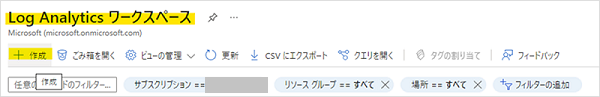
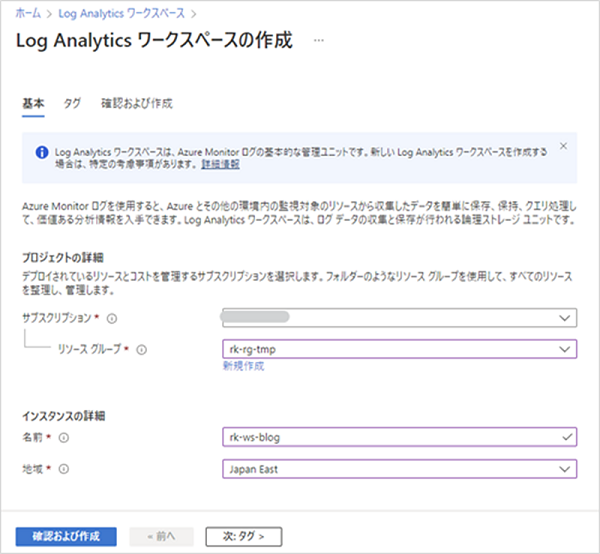
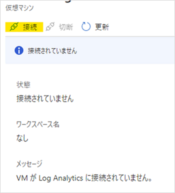
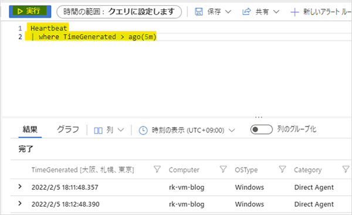
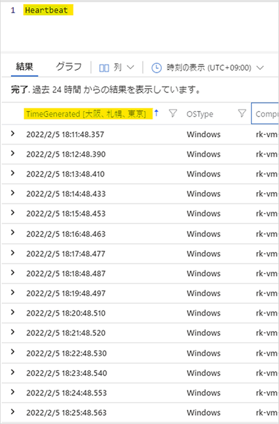
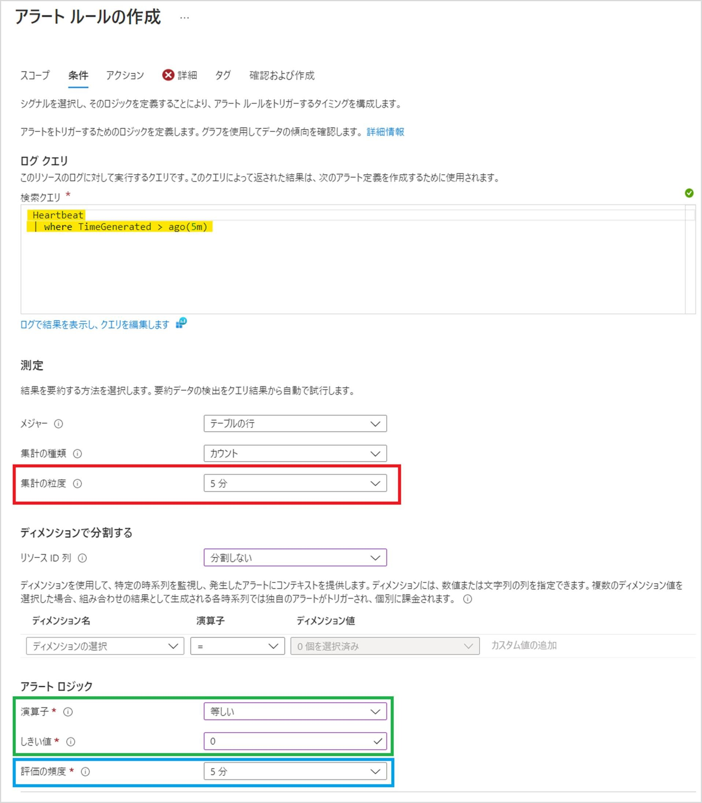
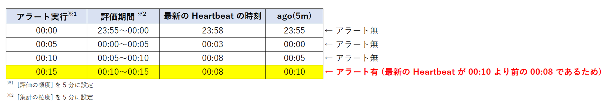
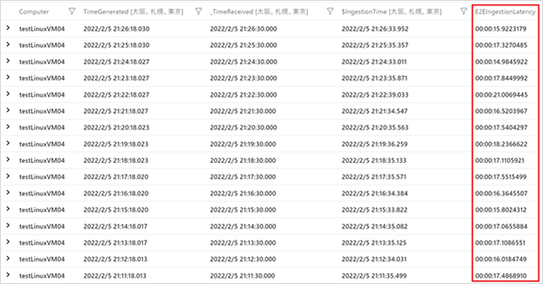

[更新履歴]
-2022/05/23 ブログ公開
-2026/01/27 Log Analytics エージェント廃止について追記。

==========================================================================================
※ 本ブログでご紹介しております Log Analytics エージェントを使用した Heartbeat 監視については、2024 年 8 月 31 日に廃止となりました。以下のブログを参考に Azure Monitor エージェントでの監視の構成、移行をご検討下さい。

Azure Monitor エージェントにより収集される Heartbeat ログを使用した死活監視方法
https://jpazmon-integ.github.io/blog/LogAnalytics/MonitorVM_AMA/

Log Analytics エージェントから Azure Monitor エージェントへの移行に関するよくあるご質問集
https://jpazmon-integ.github.io/blog/LogAnalytics/HowToMigrateToAmaFromLA/

==========================================================================================

こんにちは！ Azure Monitoring サポート チームの北村です。
今回は死活監視のクエリをご案内します。死活監視クエリは監視要件に応じて設定されているかと思いますが、
今回はお問い合わせの多い死活監視クエリを 3 つご紹介いたします。

==========================================================================================

<!-- more -->

## 目次
- Heartbeat を使用した死活監視を行うために
- Heartbeat を使用した死活監視
- Heartbeat の収集が遅延していることを確認する
- まとめ

## Heartbeat を使用した死活監視を行うために
死活監視のクエリをご紹介する前に、Azure VM における死活監視設定の基本的な流れを簡単にご説明します。
※ Log Analytics エージェントは 2024 年 8 月 31 日に廃止となりましたのでご留意ください。

1. Log Analytics ワークスペースの作成
2. Log Analytics エージェントの接続
3. アラート設定

**1. Log Analytics ワークスペースの作成**
Azure portal にログインし、以下のように Log Analytics ワークスペースを作成します。



-- Azure ポータルで Log Analytics ワークスペースを作成する
https://docs.microsoft.com/ja-jp/azure/azure-monitor/learn/quick-create-workspace


**2. Log Analytics エージェントの接続**
作成した Log Analytics ワークスペースのリソース メニューにある [仮想マシン] をクリックし、監視対象の VM を選択します。


画面上部の [接続] をクリックし、VM にエージェントをインストールします。


-- Log Analytics エージェントの概要 - インストール オプション
https://docs.microsoft.com/ja-jp/azure/azure-monitor/agents/log-analytics-agent#installation-options


**3. アラート設定**
作成した Log Analytics ワークスペース の [全般] - [ログ] をクリックします。
[ログ] 検索フィールドでクエリを実行し、アラートの設定を行います。アラートの評価期間や設定したクエリを実行する頻度、
アラートの通知方法等を設定します。詳細は下記弊社公開情報をご覧ください。


<ご参考>
-- Azure Monitor を使用してログ アラートを作成、表示、管理する
https://docs.microsoft.com/ja-jp/azure/azure-monitor/alerts/alerts-log
-- Azure Portal でのアクション グループの作成および管理
https://docs.microsoft.com/ja-jp/azure/azure-monitor/alerts/action-groups
<br>


## Heartbeat を使用した死活監視
Heartbeat は Log Analytics エージェントや Azure Monitor エージェントによって Log Analytics ワークスペースに
既定で収集されます。Log Analytics ワークスペースで Heartbeat のレコードを確認すると、
1 分間に 1 回レコードが生成されていることがわかります。この Heartbeat を使用した死活監視の例をご紹介します。


**例 1. 直近 5 分以内に Heartbeat が収集されていることを確認する**
下記クエリでは、過去 5 分間における 指定した VM の Heartbeat を返します。
下記クエリを実行して結果が返されなかった場合、アラートが実行された時点から 過去 5 分以内に Heartbeat が途絶えたことが
わかります。

```
Heartbeat
| where Computer == 'computer-name'
| where TimeGenerated > ago(5m)
```

上記クエリを利用したアラート ルールの設定例を示します。まず、アラート ルールの主な設定項目をご説明します。

- 集計の粒度 (赤枠線部分)
アラートの検索クエリが 1 回の評価を行う際に評価の対象とする期間です。
以下のように 5 分と設定した場合は 5 分間隔でグループ化され、検索クエリが実行されます。
 
- 演算子としきい値 (緑枠線部分)
上記クエリは、直近 5 分以内の Heartbeat を返しますので、当該クエリの実行結果が 0 件の場合は直近 5 分間 Heartbeat が
収集されていないことを意味します。そのため、演算子は 「等しい」、しきい値は 「0」 としています。
 
- 評価の頻度 (青枠線部分)
アラートの検索クエリが実行される間隔です。この例では、5 分ごとにクエリが実行されます。




上記のとおり、アラートの [集計の粒度] を 5 分、 [評価の頻度] を 5 分としたアラート ルールを設定したとします (下表参照)。 
[集計の粒度] は下表の「アラート実行」、[評価の頻度] は「評価期間」に依存します。
以下の例では、 00:00 ～ 00:10 の間は、アラートが実行されたタイミングにおいて、
最新の Heartbeat の時刻が 直近 5 分以内であるため、アラートは発報しません。
しかし、00:15 では、最新の Heartbeat の時刻 00:08 となっており、当該アラートの検索クエリの実行結果が 0 件となるため、
アラートが発報します。



<ご参考>
アラートの設定項目は下記弊社公開情報にも記載しております。
-- Azure Monitor でのログ アラート
https://docs.microsoft.com/ja-jp/azure/azure-monitor/alerts/alerts-unified-log
<br>


**例 2. 直近 15 分間に Heartbeat が途絶えた VM を確認する**
下記クエリでは、直近 15 分間、VM の Heartbeat が送信されなかった場合に検知します。
LastCall は 各コンピューターの Heartbeat が生成された最新の時刻です。
Heartbeat の最新時刻が 15 分より前の場合、実行結果が返されます。

```
Heartbeat
| summarize LastCall = max(TimeGenerated) by Computer 
| where LastCall < ago(15m)
```

> [!NOTE]
> アラートルールに設定する場合、アラートルール側では 15 分より長い粒度(期間) を指定する必要があります。
> 例えばこのクエリを利用する場合には、以下の様に設定する必要があります。
> メジャー: テーブルの行
> 集計の種類: カウント
> 集計の粒度: 30 分 (クエリで指定した期間より長い期間)
> 演算子: 次の値より大きい
> しきい値: 0
> 頻度: 15分
<br>


**例 3. 過去 24 時間以内に Heartbeat が収集された VM における最新の Heartbeat を確認する**
過去 24 時間以内に Heartbeat が収集された VM における 最新の Heartbeat を返します。
クエリの 2 行目で、Log Analytics ワークスペース上の Heartbeat ログを過去 24 時間以内に収集されたレコードに絞り込み、
3 行目で送信元の Computer ごとに最新の Heartbeat の時刻を検索します。
つまり、下記クエリでは、"過去 24 時間以内における Computer ごとの 最新の Heartbeat の時刻” を検索することが可能です。
 
```
Heartbeat
| where TimeGenerated > ago(24h)
| summarize LastCall = max(TimeGenerated) by Computer
```

<ご参考>
Heartbeat を使用したサンプル クエリにつきましては、
下記弊社公開情報にも掲載しておりますのでご確認いただけると幸いです。
-- Azure Monitor での Agent Health ソリューション - サンプル ログ
https://docs.microsoft.com/ja-jp/azure/azure-monitor/insights/solution-agenthealth#sample-log-searches 
<br>


## Heartbeat の収集が遅延していることを確認するとき
死活監視のアラートを検知したにもかかわらず、監視対象の VM は正常に動作している…
このようなときは、Heartbeat の収集遅延が発生している可能性がございます。
 
-- Azure Monitor でのログ データ インジェスト時間
https://docs.microsoft.com/ja-jp/azure/azure-monitor/logs/data-ingestion-time
※ ログ データを取り込むための一般的な待ち時間は 20 秒から 3 分です。ただしシステムの負荷状況によりさらに遅延が発生する
可能性がございます。
 
 
Heartbeat の収集遅延には、様々な理由が考えられますが、以下のクエリを実行していただきますと、
"Log Analytics エージェントがデータを生成してから Azure 側でデータを受信するまで" の間に遅延が発生していたことを
確認できます。
 
```
Heartbeat 
| where Computer == "Computer Name"
| extend E2EIngestionLatency = ingestion_time() - TimeGenerated
| project Computer, TimeGenerated, _TimeReceived, ingestion_time(), E2EIngestionLatency
| order by TimeGenerated desc
```
 
※ TimeGenerated : データ ソースが生成された時刻
※ _TimeReceived : Azure Monitor のインジェスト エンドポイントによって受信される時刻
※ $ingestion_time : Log Analytics ワークスペースに保存され、クエリ検索が可能となる時刻
※ E2EIngestionLatency : ログが生成されてから Log Analytics ワークスペースにログが送信されるまでに要した時間
 
下記画像は上記クエリを実行した例です。赤線で囲んだ部分が
「ログが生成されてから Log Analytics ワークスペースにログが送信されるまでに要した時間」です。


<ご参考>
下記弊社公開情報にも参考クエリを掲載しておりますのでご覧ください。
-- Azure Monitor でのログ データ インジェスト時間 - インジェスト時間のチェック
https://docs.microsoft.com/ja-jp/azure/azure-monitor/logs/data-ingestion-time#checking-ingestion-time
 
 
## まとめ
本記事では、以下についてご案内いたしましたが、ご理解いただけましたでしょうか。
 
- Heartbeat を使用した死活監視を行うために
- Heartbeat を使用した死活監視
- Heartbeat の収集が遅延していることを確認する
 
本記事がご理解の助けとして、お役立ていただければ幸いです。以上、死活監視に関する基本事項についてお伝えしました。
最後までお読みいただきありがとうございました！
