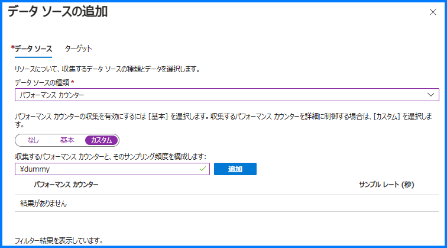
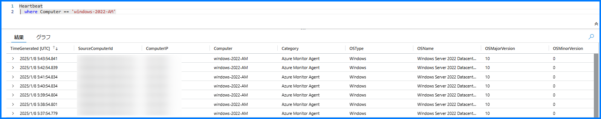
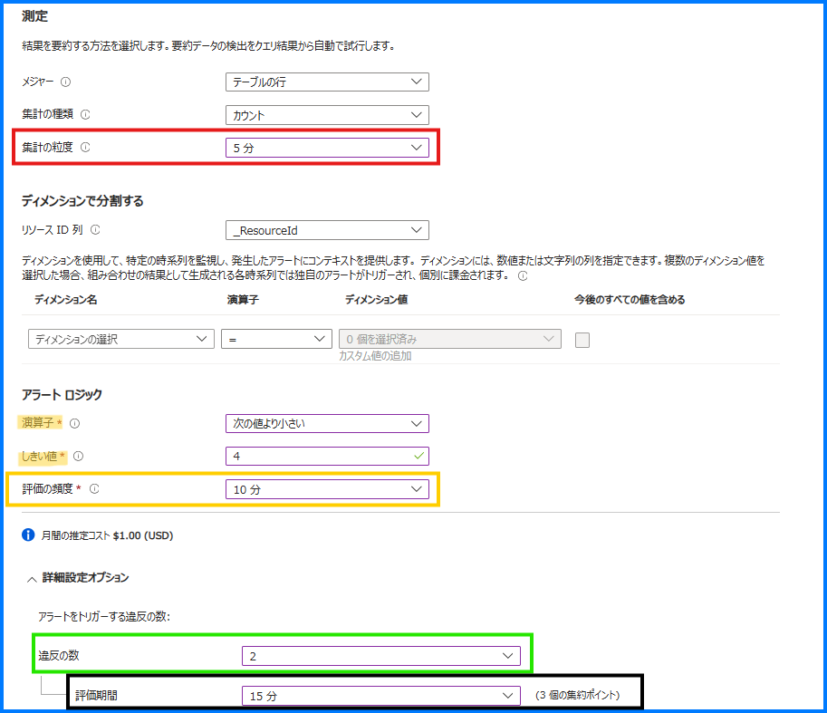
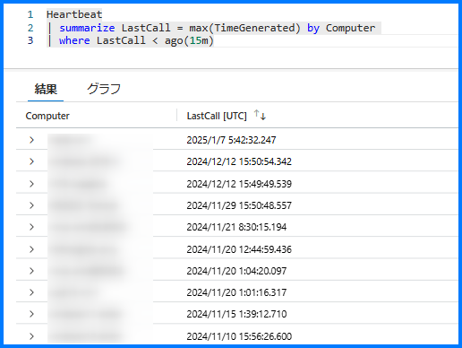
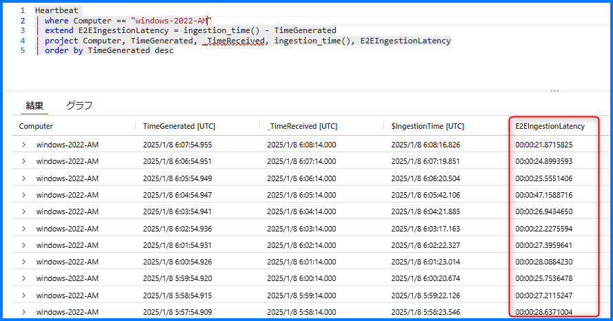

[更新履歴]
- 2025/02/14 ブログ公開
- 2026/01/28 最新情報への更新

こんにちは、Azure Monitoring サポート チームの北村、佐藤です。
Azure Monitor エージェントを使用した死活監視方法について本ブログで紹介します。
本ブログは、以下の過去の記事 (Log Analytics エージェントを使用した死活監視) を Azure Monitor エージェント版に更新したものとなります。
https://jpazmon-integ.github.io/blog/LogAnalytics/MonitorVM/


<br>


## 目次
- [Heartbeat を使用した死活監視を行うために](#Heartbeat-を使用した死活監視を行うために)
- [Heartbeat を使用した死活監視](#Heartbeat-を使用した死活監視)
- [Heartbeat の収集が遅延していることを確認する](#Heartbeat-の収集が遅延していることを確認する)
- [まとめ](#まとめ)


<br>


## Heartbeat を使用した死活監視を行うために
Azure Monitor エージェントを使用して死活監視をするためには、Heartbeat ログ (マシンが実行中の間、1 分間に 1 度収集されるログ) を収集する必要がございます。

まず、Azure Monitor エージェントがログを収集するよう構成する方法からご説明します。
Azure Monitor エージェントは、データ収集ルールと呼ばれるリソースに仮想マシンを関連付けることで、インストールおよび必要なデータ収集設定の連携が行われます。
データ収集ルールは、Azure Monitor エージェントを用いてどのようなログを収集するかを Azure Monitor エージェントに伝える指示書の役割を果たします。

データ収集ルールでデータ ソース (どのようなログを取得するか) として設定可能なログ種は以下の通りです。

■ Windows OS
- イベント ログ
- パフォーマンス
- テキスト ログ
- IIS ログ

■ Linux OS
- syslog
- パフォーマンス
- テキスト ログ

データ収集ルールは、上述のいずれかのデータ ソースを収集するよう指定する必要があります。マシンをデータ収集ルールと関連付け、上述のデータ ソースのログ収集を開始すると、Heartbeat ログも併せて収集されるようになります。
すなわち、Azure Monitor エージェントをご利用いただく場合、基本的に Heartbeat ログを単体で収集することはできかねます。

では、以下に Azure Monitor エージェントを使用したログ収集を行うための基本的な流れを簡単にご説明します。
1. Log Analytics ワークスペースの作成
2. データ収集ルールの作成とデータ収集ルールへの関連付け
3. アラート設定


<br>


### 1. Log Analytics ワークスペースの作成
ログの送信先となる Log Analytics ワークスペースを作成します。

-- Create a Log Analytics workspace
https://learn.microsoft.com/ja-jp/azure/azure-monitor/logs/quick-create-workspace?tabs=azure-portal


<br>


### 2. データ収集ルールの作成とデータ収集ルールへの関連付け
1 で作成した Log Analytics ワークスペースにログを収集するよう、データ収集ルールを構成します。

-- Collect data from virtual machine client with Azure Monitor
https://learn.microsoft.com/ja-jp/azure/azure-monitor/agents/azure-monitor-agent-data-collection
(["データ ソース"](https://learn.microsoft.com/ja-jp/azure/azure-monitor/vm/data-collection?tabs=current#add-data-sources) 項目にて、各データ ソースをクリックすることでデータ ソースごとの設定方法の公開情報に遷移します。)

データ収集ルールにマシンを関連づけると Azure Monitor エージェントがインストールされます。
(すでにインストール済みの場合には、マシン上に Azure Monitor エージェントが存在することが確認されたのち、インストールがスキップされます。)

<br>

### 3. アラート設定
作成した Log Analytics ワークスペースの画面左側にあるメニュー内 [ログ] をクリックします。
[ログ] 検索フィールドでクエリを実行し、アラートの設定を行います。アラートの評価期間や設定したクエリを実行する頻度、
アラートの通知方法等を設定します。詳細は以下の弊社公開情報をご覧ください。

-- Create or edit a log search alert rule
https://learn.microsoft.com/ja-jp/azure/azure-monitor/alerts/alerts-create-log-alert-rule

-- Action groups
https://learn.microsoft.com/ja-jp/azure/azure-monitor/alerts/action-groups

> [!NOTE]
> (補足)
> 前述の通り、Azure Monitor エージェントをご利用いただく場合、基本的に Heartbeat ログを単体で収集することはできません。
> どうしても、Heartbeat ログだけを収集する必要がある場合には、存在しないダミーの情報を収集するようデータ収集ルールを構成することで、実質 Heartbeat ログだけを収集すること自体は可能でございます。  
>  
> **<カスタム パス追加手順>**
> 以下すべて [データ ソースの追加] タブでの設定でございます。
> 1. [データ ソースの種類] にて [パフォーマンス カウンター] を選択します。
> 2. [パフォーマンス カウンターを構成する] という項目で [カスタム] タブを選択します。
> 3. [収集するパフォーマンス カウンターと、そのサンプリング頻度を構成します:] に "\dummy" と入力し、[追加] をクリックします。
>  
> 4. お手数ではございますが、3. で追加した "\dummy" 以外のパスの左側にあるチェックをすべて外します。
>
> なお、パフォーマンス カウンターについて、任意の収集設定を行う方法については以下のブログ記事に記載しております。
> 設定方法の詳細は以下をご確認ください。
> -- 既定で用意されているもの以外のパフォーマンス カウンターを収集する方法
> https://jpazmon-integ.github.io/blog/LogAnalytics/HowToCollectCustomPerfCounter/


<br>
<br>

## Heartbeat を使用した死活監視
Heartbeat は Azure Monitor エージェントによって Log Analytics ワークスペースに既定で収集されます。
Log Analytics ワークスペースで Heartbeat のレコードを確認すると、1 分間に 1 回レコードが生成されていることがわかります。
この Heartbeat を使用した死活監視の例をご紹介します。


<br>


### 例 1. あるマシンから Heartbeat が収集されていることを確認する
下記クエリでは、指定した VM の Heartbeat を抽出します。

```
Heartbeat
| where Computer == 'computer-name'
```


上記クエリを利用したアラート ルールの設定例を示します。まず、アラート ルールの主な設定項目をご説明します。


- 集計の粒度 (赤枠線部分)
クエリで取得したログを一つのグループにまとめる単位を示します。
以下のように 5 分と設定した場合は 5 分単位でグループ化されます。

- 演算子としきい値 (黄色ハイライト部分)
上記クエリは、直近 5 分以内の Heartbeat を返しますので、当該クエリの実行結果が 0 件の場合は直近 5 分間 Heartbeat が収集されていないことを意味します。そのため、演算子は 「等しい」、しきい値は 「0」 としています。

- 評価の頻度 (黄色枠線部分)
アラートの検索クエリが実行される間隔です。この例では、10 分ごとにクエリが実行されます。

- 評価期間 (黒枠線部分)
クエリの対象とするデータの時間範囲です。基本的には [集計の粒度] と同じ時間範囲になります。

- 違反の数 (緑枠線部分)
評価期間内にある集約ポイントのうち (集約ポイントの個数 = 評価期間 ÷ 集計の粒度) 、指定した回数以上発報条件を満たしたらアラートが発報します。
(連続で発報条件を満たした回数ではございません。)

例えば、以下の設定であったとします。
その場合、具体的には以下の挙動となります。
~~~~~~~~~~~~~~~~~~~~~~~~~~~~~~~~~~~~~~~~~~~~~~
集計の粒度 : 5 分
評価頻度 : 10 分
評価期間: 15 分
違反の数 : 2 (評価期間内に 2 回閾値を超えたら発報する構成の場合)
~~~~~~~~~~~~~~~~~~~~~~~~~~~~~~~~~~~~~~~~~~~~~~

以下、〇はしきい値を超えること、×はしきい値を超えないことを表します。
10:00 の評価
9:45 ~ 9:50 のログ :  ×
9:50 ~ 9:55 のログ : 〇
9:55 ~ 10:00 のログ : ×
---------> 発報しない
 
10:10 の評価
9:55 ~ 10:00 のログ : ×
10:00 ~ 10:05 のログ :  〇
10:05 ~ 10:10 のログ : 〇
---------> 発報する
 
10:20 の評価
10:05 ~ 10:10 のログ : 〇
10:10 ~ 10:15 のログ :  ×
10:15 ~ 10:20 のログ : 〇
---------> 発報する


<ご参考>
アラートの設定項目は下記弊社公開情報にも記載しております。
–- Create or edit a log search alert rule
https://learn.microsoft.com/ja-jp/azure/azure-monitor/alerts/alerts-create-log-alert-rule


<br>


### 例 2. 直近 15 分間に Heartbeat が途絶えた VM を確認する
下記クエリでは、直近 15 分間、VM の Heartbeat が送信されなかった場合に検知します。
LastCall は 各コンピューターの Heartbeat が生成された最新の時刻です。
Heartbeat の最新時刻が 15 分より前の場合、実行結果が返されます。

```
Heartbeat
| summarize LastCall = max(TimeGenerated) by Computer 
| where LastCall < ago(15m)
```


> [!NOTE]
> アラートルールで設定する場合、アラート ルール側では [集計の粒度] で 15 分より長い粒度 (期間) を指定する必要があります。
> 例えばこのクエリを利用する場合には、以下の様に設定する必要があります。
> メジャー: テーブルの行
> 集計の種類: カウント
> 集計の粒度: 30 分 (クエリで指定した期間より長い期間)
> 演算子: 次の値より大きい
> しきい値: 0
> 頻度: 15分

<br>


### 例 3. 直近 2 日間に Heartbeat が記録されたマシンのうち、直近 5 分間に Heartbeat が途絶えた VM を確認する
下記クエリでは、直近 2 日間に Heartbeat が記録されたマシンの中で、直近 5 分間に Heartbeat が途絶えた VM を検知します。
変数 ComputerListFor2days には、直近 2 日間に Heartbeat が記録されたマシンと、最新の TimeGenerated の情報が格納されます。
次に、直近 5 分間に収集された Heartbeat と、変数 ComputerListFor2days のデータを、Computer 列で [rightouter 結合](https://learn.microsoft.com/ja-jp/kusto/query/join-rightouter?view=microsoft-fabric)します。
最後に、直近 5 分間に Heartbeat が記録されていないマシン の AggregatedValue を 0 に設定します。
この AggregatedValue の値を監視することで Heartbeat が収集されなくなったマシンを検知することが可能です。

```
let ComputerListFor2days =
    (Heartbeat
    | where TimeGenerated > ago(2d)
    | summarize max(TimeGenerated) by Computer
    );
Heartbeat
| where TimeGenerated > ago(5m)
| summarize count() by Computer 
| join kind=rightouter ComputerListFor2days on $left.Computer == $right.Computer
| extend AggregatedValue = iif(isnull(count_), 0, count_)
| project ComputerName = Computer1, AggregatedValue
```

<br>


上記クエリの設定例をご紹介します。
下記の設定の場合、[評価の頻度] の 5 分毎に、直近 2 日間に Heartbeat が記録されたマシンのうち、直近 5 分間に Heartbeat が途絶えた VM を検知します。また、[ディメンション名](https://learn.microsoft.com/ja-jp/azure/azure-monitor/alerts/alerts-types#monitor-multiple-instances-of-a-resource-using-dimensions) で ComputerName を指定することで、VM 単位で Heartbeat が途絶えたことを監視できます。


<br>
<br>

## Heartbeat の収集が遅延していることを確認する
死活監視のアラートを検知したにもかかわらず、監視対象の VM は正常に動作している。
このようなときは、Heartbeat の収集遅延が発生している可能性がございます。

-- Azure Monitor でのログ データ インジェスト時間
https://docs.microsoft.com/ja-jp/azure/azure-monitor/logs/data-ingestion-time

※ ログ データを取り込むための一般的な待ち時間は 20 秒から 3 分です。ただしシステムの負荷状況によりさらに遅延が発生する可能性がございます。


Heartbeat の収集遅延には、様々な理由が考えられますが、以下のクエリを実行していただきますと、
"Azure Monitor エージェントがデータを生成してから Azure 側でデータを受信するまで" の間に遅延が発生していたことを確認できます。

```
Heartbeat
| where Computer == "Computer Name"
| extend E2EIngestionLatency = ingestion_time() - TimeGenerated
| project Computer, TimeGenerated, _TimeReceived, ingestion_time(), E2EIngestionLatency
| order by TimeGenerated desc
```

※ TimeGenerated : データ ソースが生成された時刻
※ _TimeReceived : Azure Monitor のインジェスト エンドポイントによって受信される時刻
※ $ingestion_time : Log Analytics ワークスペースに保存され、クエリ検索が可能となる時刻
※ E2EIngestionLatency : ログが生成されてから Log Analytics ワークスペースにログが送信されるまでに要した時間

下記画像は上記クエリを実行した例です。
赤線で囲んだ部分が「ログが生成されてから Log Analytics ワークスペースにログが送信されるまでに要した時間」です。



Heartbeat ログ アラートが期待されないタイミングで発報した場合の調査方法については、よろしければ以下のブログ記事もご参照ください。

-- マシンが起動中にも関わらず Heartbeat ログ アラートが発報された場合の調査方法
https://jpazmon-integ.github.io/blog/LogAnalytics/Unexpected_Heartbeat_logalert/


<br>


## まとめ
本記事では、Azure Monitor エージェントを使用して Heartbeat ログを収集する方法および、収集された Heartbeat ログを用いて死活監視を行う方法をご案内いたしました。

Heartbeat ログを含め、仮想マシンの死活監視全般については以下のブログ記事でもご案内しております。よろしければこちらもご参照いただけますと幸いです。

-- Azure VM における死活監視の考え方
https://jpazmon-integ.github.io/blog/LogAnalytics/MonitorVM02/

最後までお読みいただき、ありがとうございました！
