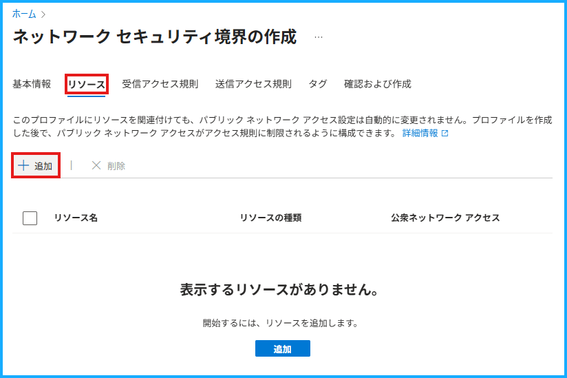
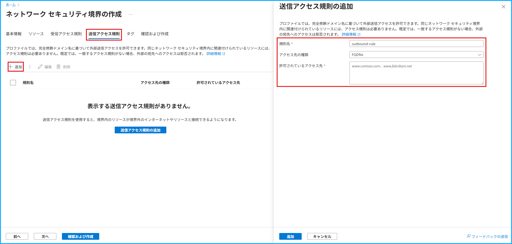
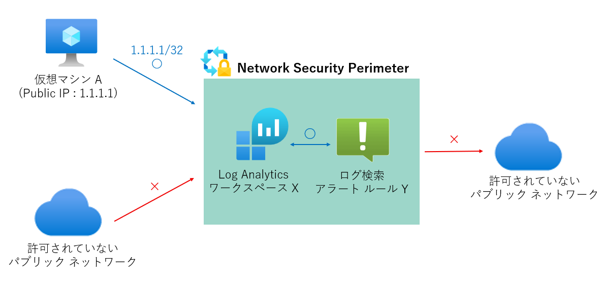

こんにちは、Azure Monitoring サポート チームの江口です。

今回は 2025 年 8 月に一般提供となった、ネットワーク セキュリティ境界 (Network Security Perimeter) について[こちらの記事](https://techcommunity.microsoft.com/blog/azureobservabilityblog/general-availability-of-azure-monitor-network-security-perimeter-features/4440307)を参考にご紹介します。

「ネットワーク セキュリティ境界とは何？どんなことができるの？」という方にぜひ読んでいただきたいです。

<!-- more -->
 

## 目次
* [ネットワーク セキュリティ境界とは](#ネットワーク-セキュリティ境界とは-1)
* [設定項目](#設定項目)
* [ネットワーク セキュリティ境界と Azure Monitor プライベート リンク スコープのできること/できないこと](#ネットワーク-セキュリティ境界と-azure-monitor-プライベート-リンク-スコープのできることできないこと)
* [まとめ](#まとめ)

 

## ネットワーク セキュリティ境界とは

ネットワーク セキュリティ境界とは、仮想ネットワークの外部にデプロイされる PaaS リソースの周囲に確立できる論理ネットワーク境界で、複数の PaaS リソースに対して統一したパブリック ネットワークからのアクセス制御が行えます。
    
ネットワーク セキュリティ境界を作成することで、境界の内部と外部がネットワーク レベルで明確に区別され、セキュリティ保護された境界を確立することができます。
    
境界内部のリソース同士のアクセスはネットワーク レベルでは制御されず、従来通り、マネージド ID やロールベースのアクセス制御 ([RBAC](https://learn.microsoft.com/ja-jp/azure/role-based-access-control/overview)) によるアクセス管理が必要となります。
    
ネットワーク セキュリティ境界でサポートされている Azure Monitor のリソースを以下の表に示します。
詳細は[こちら](https://learn.microsoft.com/ja-jp/azure/azure-monitor/fundamentals/network-security-perimeter#supported-components) から確認できます。

|  リソース | リソースの種類 |
| ---- | ---- |
|  データ収集エンドポイント (DCE)  |  Microsoft.Insights/dataCollectionEndpoints  |
|  Log Analytics ワークスペース  |  Microsoft.OperationalInsights/workspaces  |
|  ログ クエリ アラート          | Microsoft.Insights/ScheduledQueryRules           |
|  アクション グループ           | Microsoft.Insights/actionGroups                  |
|  診断設定                     | Microsoft.Insights/diagnosticSettings            |

  
> [!NOTE]
> ネットワーク セキュリティ境界に Application Insights を関連付ける場合、作成時の [リソース] の選択で Application Insights リソースを直接選択することはできません。
> 代わりに、Application Insights リソースに使用される Log Analytics ワークスペースのネットワーク セキュリティ境界を構成します。
> 詳細については、下記の弊社公開情報をご参照ください。
> [ネットワーク セキュリティ境界で Azure Monitor を構成する](https://learn.microsoft.com/ja-jp/azure/azure-monitor/fundamentals/network-security-perimeter#unsupported-components) 

 

Azure Monitor リソース以外でサポートされているコンポーネントは、[こちら](https://learn.microsoft.com/ja-jp/azure/private-link/network-security-perimeter-concepts#onboarded-private-link-resources) から確認できます。
    
 

## 設定項目
    
このセクションでは、ネットワーク セキュリティ境界を作成する際に設定する内容を Azure Portal の画面で説明します。
    
設定する主要項目は以下の 3 つです。
    
### 1. 関連付けるリソース
    
ネットワーク セキュリティ境界に関連付ける PaaS リソースを選択します。
    

    
### 2. 受信アクセス規則

ネットワーク セキュリティ境界の外部から内部リソースへのアクセスに関する規則を定めます。
    
IP アドレスに基づくアクセス規則と、サブスクリプションに基づくアクセス規則を作成することができます。
    
IP アドレスに基づくアクセス規則は、下記のように受信トラフィックを許可するパブリック IP アドレス範囲を CIDR 形式で入力します。
    
例 ) 198.168.99.0/24
 (IPv4 アドレス範囲で、198.168.99.0 から 198.168.99.255 までの 256 個の IP アドレスを含む)

    
### 3. 送信アクセス規則

ネットワーク セキュリティ境界の内部リソースから外部へのアクセスに関する規則を定めます。
    
下記のように FQDNs に基づくアクセス規則を作成します。
    
例 ) www.contoso.com
    

    
### 構成例 
#### 仮想マシン A から、ネットワーク セキュリティ境界に関連付けた Log Analytics ワークスペース X にログを送信し、そのログに基づいてログ検索アラート Y を発報する

[1. 関連付けるリソース](#1-関連付けるリソース)で Log Analytics ワークスペース X とログ検索アラート Y のアラート ルールを選択すると、それらのリソースがネットワーク セキュリティ境界に関連付けられ、境界内部のリソースとなります。

[2. 受信アクセス規則](#2-受信アクセス規則)で仮想マシン A のパブリック IP アドレスを入力することで、仮想マシン A からネットワーク セキュリティ境界へのアクセスがネットワーク レベルで許可されます。

仮想マシン A の Azure Monitor エージェントおよびロールベースのアクセス制限を従来通り正しく設定できていれば、以下が可能です。

1. 仮想マシン A から Log Analytics ワークスペース X にログを送信する。

2. ログ検索アラート Y が Log Analytics ワークスペース X を対象にクエリ検索し、条件に応じてアラートを発報する。

また、この場合、[3. 送信アクセス規則](#3-送信アクセス規則)を定めていないため、境界内部のリソースからパブリック ネットワークへのトラフィックはデフォルトでブロックされます。

ネットワーク セキュリティ境界を利用するその他のシナリオについては[こちら](https://learn.microsoft.com/ja-jp/azure/azure-monitor/fundamentals/network-security-perimeter-scenarios)をご覧ください。

 

## ネットワーク セキュリティ境界と Azure Monitor プライベート リンク スコープのできること/できないこと
    
[Azure Monitor プライベート リンク スコープ (AMPLS)](https://learn.microsoft.com/ja-jp/azure/azure-monitor/logs/private-link-security) は、Azure Monitor の複数のリソースをまとめて、仮想ネットワークからプライベート接続するためのスコープです。

ネットワーク セキュリティ境界と AMPLS はいずれも Azure Monitor のリソースに対するセキュリティを高めるサービスですが、それぞれの役割が異なります。

簡潔に言えば、ネットワーク セキュリティ境界はパブリック ネットワークからのアクセスを制限し、AMPLS はプライベート ネットワークを構築します。

このセクションでは、ネットワーク セキュリティ境界と AMPLS のそれぞれのサービスで、できること/できないことを整理します。
    
### ネットワーク セキュリティ境界

* できること

#### セキュリティの強化と詳細なアクセス制御

明示的に受信アクセスと送信アクセスの規則を定義することで、境界内のリソースに対するパブリック ネットワークからの不正なアクセスを防止することができます。

特に、受信アクセス制御を IP アドレス範囲で、送信アクセス制御を特定の FQDNs に指定できるので、柔軟で詳細な制御が可能です。

#### 一元的な管理

境界内のリソース同士の通信は制限されないため、境界内に複数の PaaS リソースをまとめて配置することで、明確で一元的なアクセス管理ができます。

#### ログの管理

ネットワーク セキュリティ境界によって許可または拒否されたすべての接続はログに記録されます。

これらのログは Log Analytics ワークスペースやストレージに送信でき、監査やコンプライアンス対応に有用です。

    
* できないこと

ネットワーク セキュリティ境界だけでは、仮想ネットワークから PaaS リソースへのパブリック ネットワークを介さないプライベートな接続を構成することはできません。
    
 

### AMPLS

* できること

#### プライベートな接続の構築

仮想ネットワークから複数の Azure Monitor リソースへのプライベートなアクセスをまとめて構成し、すべてのトラフィックを Azure のバックボーン ネットワーク内に完結することができます。
    
* できないこと

仮想ネットワークから Azure Monitor リソースへのアクセスは保護されるものの、Azure Monitor のサービス エンドポイント自体は依然としてパブリック ネットワーク経由でアクセス可能です。

また、AMPLS に紐づけることができるリソースは Log Analytics ワークスペース、Application Insights、データ収集エンドポイント (DCE) の Azure Monitor リソースに限られています。

AMPLS に接続するリソースについての詳細は、[こちら](https://learn.microsoft.com/ja-jp/azure/azure-monitor/logs/private-link-configure#connect-resources-to-the-ampls)をご参照ください。

 
    
上記のように、ネットワーク セキュリティ境界と AMPLS では役割や利用する目的が異なります。

両者を併用することで、防御の多層化を実現し、より安全なネットワークを構成することもできます。

## まとめ

この記事では、以下の 3 点についてまとめました。

* ネットワーク セキュリティ境界とは何か
* 作成する際に何を設定するのか
* ネットワーク セキュリティ境界と Azure Monitor プライベート リンク スコープはそれぞれ何ができるのか

本記事がご理解の助けとして、お役立ていただければ幸いです。

最後までお読みいただきありがとうございました。

